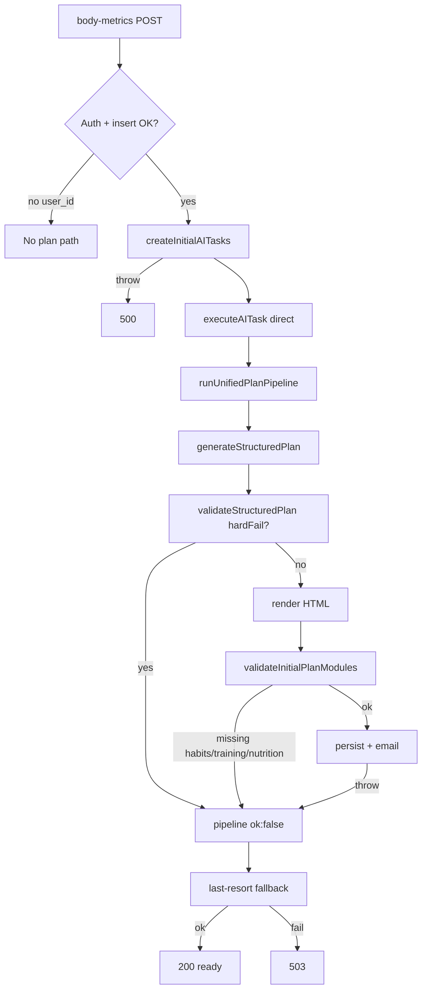

<!-- Generated by SpecStory, Markdown v2.1.0 -->

# 2026-06-18 19:39:50Z

<!-- Cursor IDE Session dbf95d45-2d45-494c-ad31-76035ee6c4c6 (2026-06-18 19:39:50Z) -->

_**User**_

In repo c:\Users\prikopa\Documents\GitHub\body-mind-on analyze failure points in: pages/api/body-metrics.js, pages/api/profile.js, lib/createInitialAITasks.js, lib/taskExecutors.js, lib/unifiedPlanPipeline.js, lib/services/planOrchestrator.js, lib/reconcileUserDataByEmail.js, lib/planGenerationGate.js, lib/supabaseServer.js, lib/supabaseUserClient.js. Find throw, 4xx/5xx returns, failed, dlq, guard, validation. Also find validateInitialPlanModules, structuredPlanValidators, nutrition/training/habits validation. Classify CRITICAL/HIGH/MEDIUM. Read-only.

---

_**Agent (composer-2.5-fast)**_

I'll scan the listed API routes and lib modules for throws, HTTP errors, guards, and validation paths.


_**Agent (composer-2.5-fast)**_

<tool-use data-tool-type="unknown" data-tool-name="update_current_step"><details>
<summary>Tool use: **update_current_step**</summary>
An unknown error occurred
</details></tool-use>

_**Agent (composer-2.5-fast)**_

<tool-use data-tool-type="read" data-tool-name="read_file_v2"><details>
<summary>Tool use: **read_file_v2** • Read file: c:\Users\prikopa\Documents\GitHub\body-mind-on\pages\api\body-metrics.js</summary>

</details></tool-use>

_**Agent (composer-2.5-fast)**_

<tool-use data-tool-type="read" data-tool-name="read_file_v2"><details>
<summary>Tool use: **read_file_v2** • Read file: c:\Users\prikopa\Documents\GitHub\body-mind-on\pages\api\profile.js</summary>

</details></tool-use>

_**Agent (composer-2.5-fast)**_

<tool-use data-tool-type="read" data-tool-name="read_file_v2"><details>
<summary>Tool use: **read_file_v2** • Read file: c:\Users\prikopa\Documents\GitHub\body-mind-on\lib\createInitialAITasks.js</summary>

</details></tool-use>

_**Agent (composer-2.5-fast)**_

<tool-use data-tool-type="read" data-tool-name="read_file_v2"><details>
<summary>Tool use: **read_file_v2** • Read file: c:\Users\prikopa\Documents\GitHub\body-mind-on\lib\taskExecutors.js</summary>

</details></tool-use>

_**Agent (composer-2.5-fast)**_

<tool-use data-tool-type="read" data-tool-name="read_file_v2"><details>
<summary>Tool use: **read_file_v2** • Read file: c:\Users\prikopa\Documents\GitHub\body-mind-on\lib\unifiedPlanPipeline.js</summary>

</details></tool-use>

_**Agent (composer-2.5-fast)**_

<tool-use data-tool-type="read" data-tool-name="read_file_v2"><details>
<summary>Tool use: **read_file_v2** • Read file: c:\Users\prikopa\Documents\GitHub\body-mind-on\lib\services\planOrchestrator.js</summary>

</details></tool-use>

_**Agent (composer-2.5-fast)**_

<tool-use data-tool-type="read" data-tool-name="read_file_v2"><details>
<summary>Tool use: **read_file_v2** • Read file: c:\Users\prikopa\Documents\GitHub\body-mind-on\lib\reconcileUserDataByEmail.js</summary>

</details></tool-use>

_**Agent (composer-2.5-fast)**_

<tool-use data-tool-type="read" data-tool-name="read_file_v2"><details>
<summary>Tool use: **read_file_v2** • Read file: c:\Users\prikopa\Documents\GitHub\body-mind-on\lib\planGenerationGate.js</summary>

</details></tool-use>

_**Agent (composer-2.5-fast)**_

<tool-use data-tool-type="read" data-tool-name="read_file_v2"><details>
<summary>Tool use: **read_file_v2** • Read file: c:\Users\prikopa\Documents\GitHub\body-mind-on\lib\supabaseServer.js</summary>

</details></tool-use>

_**Agent (composer-2.5-fast)**_

<tool-use data-tool-type="read" data-tool-name="read_file_v2"><details>
<summary>Tool use: **read_file_v2** • Read file: c:\Users\prikopa\Documents\GitHub\body-mind-on\lib\supabaseUserClient.js</summary>

</details></tool-use>

_**Agent (composer-2.5-fast)**_

<tool-use data-tool-type="unknown" data-tool-name="ripgrep_raw_search"><details>
<summary>Tool use: **ripgrep_raw_search**</summary>

Parameters:

```json
{
  "caseInsensitive": false,
  "path": "c:\\Users\\prikopa\\Documents\\GitHub\\body-mind-on",
  "pattern": "validateInitialPlanModules|structuredPlanValidators"
}
```
Additional data:

```json
{
  "isPruned": true,
  "outputMode": "content",
  "path": "c:\\Users\\prikopa\\Documents\\GitHub\\body-mind-on",
  "pattern": "validateInitialPlanModules|structuredPlanValidators",
  "topFiles": [
    {
      "matchCount": 1,
      "uri": "docs/REFACTOR_UNIFIED_PLAN_PIPELINE.md"
    },
    {
      "matchCount": 1,
      "uri": "lib\\validation\\structuredPlanValidators.js"
    },
    {
      "matchCount": 1,
      "uri": "lib\\unifiedPlanPipeline.js"
    },
    {
      "matchCount": 1,
      "uri": "lib/validation/mealTrainingCoherence.js"
    },
    {
      "matchCount": 3,
      "uri": "lib/taskExecutors.js"
    },
    {
      "matchCount": 1,
      "uri": "docs/RELEASE_AUDIT_UNIFIED_PLAN_PIPELINE.md"
    },
    {
      "matchCount": 3,
      "uri": "lib\\taskExecutors.js"
    },
    {
      "matchCount": 1,
      "uri": "lib/validation/structuredPlanValidators.js"
    },
    {
      "matchCount": 1,
      "uri": "lib/unifiedPlanPipeline.js"
    },
    {
      "matchCount": 3,
      "uri": "docs/ONBOARDING_PRODUCTION_SPEC.md"
    }
  ],
  "totalFiles": 10,
  "totalMatches": 16
}
```
Status: **completed**

</details></tool-use>

_**Agent (composer-2.5-fast)**_

<tool-use data-tool-type="read" data-tool-name="read_file_v2"><details>
<summary>Tool use: **read_file_v2** • Read file: c:\Users\prikopa\Documents\GitHub\body-mind-on\lib\validation\structuredPlanValidators.js</summary>

</details></tool-use>

_**Agent (composer-2.5-fast)**_

<tool-use data-tool-type="unknown" data-tool-name="ripgrep_raw_search"><details>
<summary>Tool use: **ripgrep_raw_search**</summary>

Parameters:

```json
{
  "caseInsensitive": false,
  "path": "c:\\Users\\prikopa\\Documents\\GitHub\\body-mind-on\\pages\\api\\body-metrics.js",
  "pattern": "throw |status\\(|\\.status\\(|failed|dlq|dead_letter|guard|validation|hardFail|4\\d\\d|5\\d\\d"
}
```
Additional data:

```json
{
  "isPruned": true,
  "outputMode": "content",
  "path": "c:\\Users\\prikopa\\Documents\\GitHub\\body-mind-on\\pages\\api\\body-metrics.js",
  "pattern": "throw |status\\(|\\.status\\(|failed|dlq|dead_letter|guard|validation|hardFail|4\\d\\d|5\\d\\d",
  "topFiles": [
    {
      "matchCount": 39,
      "uri": "pages\\api\\body-metrics.js"
    }
  ],
  "totalFiles": 1,
  "totalMatches": 39
}
```
Status: **completed**

</details></tool-use>

_**Agent (composer-2.5-fast)**_

<tool-use data-tool-type="unknown" data-tool-name="ripgrep_raw_search"><details>
<summary>Tool use: **ripgrep_raw_search**</summary>

Parameters:

```json
{
  "caseInsensitive": false,
  "path": "c:\\Users\\prikopa\\Documents\\GitHub\\body-mind-on\\pages\\api\\profile.js",
  "pattern": "throw |status\\(|failed|dlq|dead_letter|guard|validation|hardFail"
}
```
Additional data:

```json
{
  "isPruned": true,
  "outputMode": "content",
  "path": "c:\\Users\\prikopa\\Documents\\GitHub\\body-mind-on\\pages\\api\\profile.js",
  "pattern": "throw |status\\(|failed|dlq|dead_letter|guard|validation|hardFail",
  "topFiles": [
    {
      "matchCount": 16,
      "uri": "pages\\api\\profile.js"
    }
  ],
  "totalFiles": 1,
  "totalMatches": 16
}
```
Status: **completed**

</details></tool-use>

_**Agent (composer-2.5-fast)**_

<tool-use data-tool-type="unknown" data-tool-name="ripgrep_raw_search"><details>
<summary>Tool use: **ripgrep_raw_search**</summary>

Parameters:

```json
{
  "caseInsensitive": false,
  "path": "c:\\Users\\prikopa\\Documents\\GitHub\\body-mind-on",
  "pattern": "canRunPlanTask|planGenerationGate"
}
```
Additional data:

```json
{
  "isPruned": true,
  "outputMode": "content",
  "path": "c:\\Users\\prikopa\\Documents\\GitHub\\body-mind-on",
  "pattern": "canRunPlanTask|planGenerationGate",
  "topFiles": [
    {
      "matchCount": 1,
      "uri": "lib/planGenerationGate.js"
    },
    {
      "matchCount": 2,
      "uri": "lib/aiScheduler.js"
    },
    {
      "matchCount": 2,
      "uri": "lib/createAITasksFromDecisions.js"
    }
  ],
  "totalFiles": 3,
  "totalMatches": 5
}
```
Status: **completed**

</details></tool-use>

_**Agent (composer-2.5-fast)**_

<tool-use data-tool-type="unknown" data-tool-name="ripgrep_raw_search"><details>
<summary>Tool use: **ripgrep_raw_search**</summary>

Parameters:

```json
{
  "caseInsensitive": false,
  "path": "c:\\Users\\prikopa\\Documents\\GitHub\\body-mind-on\\lib\\taskExecutors.js",
  "pattern": "habits|dlq|dead_letter|guard|permanent"
}
```
Additional data:

```json
{
  "isPruned": true,
  "outputMode": "content",
  "path": "c:\\Users\\prikopa\\Documents\\GitHub\\body-mind-on\\lib\\taskExecutors.js",
  "pattern": "habits|dlq|dead_letter|guard|permanent",
  "topFiles": [
    {
      "matchCount": 10,
      "uri": "lib\\taskExecutors.js"
    }
  ],
  "totalFiles": 1,
  "totalMatches": 10
}
```
Status: **completed**

</details></tool-use>

_**Agent (composer-2.5-fast)**_

<tool-use data-tool-type="unknown" data-tool-name="ripgrep_raw_search"><details>
<summary>Tool use: **ripgrep_raw_search**</summary>

Parameters:

```json
{
  "caseInsensitive": false,
  "path": "c:\\Users\\prikopa\\Documents\\GitHub\\body-mind-on\\lib\\aiScheduler.js",
  "pattern": "dlq|dead_letter|failed|guard"
}
```
Additional data:

```json
{
  "isPruned": true,
  "outputMode": "content",
  "path": "c:\\Users\\prikopa\\Documents\\GitHub\\body-mind-on\\lib\\aiScheduler.js",
  "pattern": "dlq|dead_letter|failed|guard",
  "topFiles": [
    {
      "matchCount": 26,
      "uri": "lib\\aiScheduler.js"
    }
  ],
  "totalFiles": 1,
  "totalMatches": 26
}
```
Status: **completed**

</details></tool-use>

_**Agent (composer-2.5-fast)**_

<tool-use data-tool-type="unknown" data-tool-name="ripgrep_raw_search"><details>
<summary>Tool use: **ripgrep_raw_search**</summary>

Parameters:

```json
{
  "caseInsensitive": false,
  "path": "c:\\Users\\prikopa\\Documents\\GitHub\\body-mind-on\\lib\\services\\planOrchestrator.js",
  "pattern": "throw |return \\{|ok: false|failed|error"
}
```
Additional data:

```json
{
  "isPruned": true,
  "outputMode": "content",
  "path": "c:\\Users\\prikopa\\Documents\\GitHub\\body-mind-on\\lib\\services\\planOrchestrator.js",
  "pattern": "throw |return \\{|ok: false|failed|error",
  "topFiles": [
    {
      "matchCount": 8,
      "uri": "lib\\services\\planOrchestrator.js"
    }
  ],
  "totalFiles": 1,
  "totalMatches": 8
}
```
Status: **completed**

</details></tool-use>

_**Agent (composer-2.5-fast)**_

<think><details><summary>Thought Process</summary>
I am organizing the failure point analysis by file and severity classification.

Critical failures block core registration-to-plan flows and risk data loss. High failures cause significant degradation but allow partial recovery. Medium failures are non-blocking and logged.

pages/api/body-metrics.js shows several critical issues. A database insert throw returns 500. A createInitialAITasks throw returns 500. An execution failed status triggers a last-resort path. Auth failures continue without a user_id and generate no plan. Expected 400 validation errors and 405 method errors are classified as medium.
</details></think>

_**Agent (composer-2.5-fast)**_

<tool-use data-tool-type="unknown" data-tool-name="update_current_step"><details>
<summary>Tool use: **update_current_step**</summary>
An unknown error occurred
</details></tool-use>

_**Agent (composer-2.5-fast)**_

# Failure-Point Analysis (Read-Only)

Scope: the 10 requested files plus `lib/validation/structuredPlanValidators.js` (called from `unifiedPlanPipeline.js`). Severity reflects impact on **registration → initial plan → profile display**.

---

## Severity Legend

| Level | Meaning |
|-------|---------|
| **CRITICAL** | Core flow blocked: no plan, wrong HTTP outcome, or infra down |
| **HIGH** | Degraded path, silent partial failure, or recovery depends on fallback |
| **MEDIUM** | Expected client errors, non-blocking side effects, soft warnings |

---

## 1. `pages/api/body-metrics.js`

**Registration core flow** — sync wait ~55s, last-resort fallback, then 503 if still no plan.

### HTTP responses

| Status | Trigger | Severity |
|--------|---------|----------|
| **405** | Not POST | MEDIUM |
| **400** | Missing/invalid email, password, height, weight, age; duplicate account | MEDIUM |
| **200** | Plan ready (AI or last-resort) | — |
| **503** | Account created but `initialPlanTaskStatus !== 'completed'` and last-resort failed | **CRITICAL** |
| **500** | Uncaught exception (DB insert, `createInitialAITasks`, etc.) | **CRITICAL** |

### Throws / hard failures

- **CRITICAL** — `body_metrics` insert error → `throw new Error(dbErr.message)` → 500
- **CRITICAL** — `createInitialAITasks` catch re-throws → 500
- **HIGH** — Auth failure (`authResult.error`, non-duplicate): continues with `user_id: null` → **no plan path at all** (only metrics saved)

### Task / plan state machine

- **CRITICAL** — `runDirectExecute`: task marked `failed` if no `plan_id` when `outcome_type === 'plan_generated'`
- **CRITICAL** — Poll loop: `polled.status === 'failed'` → `plan_state = 'failed'`
- **HIGH** — Poll timeout with `pending` → `plan_state = 'processing'`, `onboarding_result = 'timeout'`; response still 200 unless last-resort fails
- **HIGH** — Direct execute + scheduler retries wrapped in catch (continues, may leave task pending/failed)

### Guards / validation

- **MEDIUM** — Input: `validateHeightCm`, `validateWeightKg`, `validateAge`, `validatePassword`, email regex
- **MEDIUM** — Habits: `isValidHabitId` filter only (invalid IDs silently dropped)
- **HIGH** — Last-resort: `persistPublishableFallbackPlanForUser` (2 attempts) → catalog pipeline or deterministic HTML

### Non-blocking failures (logged only)

- **MEDIUM** — `memberships` upsert warn
- **MEDIUM** — `user_habits` insert warn
- **MEDIUM** — `writeOnboardingEvent` catch
- **MEDIUM** — Last-resort email claim/send failures (plan still saved)

---

## 2. `pages/api/profile.js`

Read-only profile; plan state derived from DB + validators.

### HTTP responses

| Status | Trigger | Severity |
|--------|---------|----------|
| **405** | Not GET | MEDIUM |
| **401** | Missing/invalid Bearer token | MEDIUM |
| **200** | Always on success | — |
| **500** | Uncaught exception | **HIGH** |

### DLQ / failed detection

- **HIGH** — `initialPlanFailed = status === 'failed' \|\| status === 'dlq'` → `plan_state = 'failed'`, reason `task_failed_or_dlq`
- **HIGH** — Self-heal: task `completed` but no valid plan → UPDATE task to `failed` (`self_heal_reason: completed_without_valid_plan`)

### Validation

- **HIGH** — `validatePublishedPlanHtml` drives `hasValidPlan`, `plan_state` (`ready` / `invalid` / `failed` / `processing` / `missing`)
- **MEDIUM** — Fallback plans filtered: `generated_by` containing `'fallback'` excluded from `plansData`
- **MEDIUM** — Plan HTML self-heal from `structured_plan_json` (warn on DB update fail)

### Guards / recovery

- **HIGH** — `ensureInitialPlanTask` when no task but body_metrics exist and no valid plan
- **HIGH** — `reconcileUserDataByEmail` on every profile load (failure non-fatal to response)
- **MEDIUM** — `Promise.allSettled` — partial query failures degrade data (empty arrays)

---

## 3. `lib/createInitialAITasks.js`

### Throws

| Failure | Severity |
|---------|----------|
| Missing `userId` → throw | **CRITICAL** |
| `ai_tasks` insert error (non-duplicate, non-idempotency fallback) → throw | **CRITICAL** |
| Fallback insert fails → throw | **CRITICAL** |

### Soft handling

- **MEDIUM** — Duplicate idempotency key → `{ ok: true, tasksCreated: false }` (no new task)
- **MEDIUM** — Missing `idempotency_key` column → fallback insert without key

Payload sets `required_modules: ['nutrition','training','habits']` for `initial_plan`.

---

## 4. `lib/taskExecutors.js`

Central executor; most plan failure logic lives here.

### Throws (propagate to scheduler / body-metrics)

| Stage | Condition | Severity |
|-------|-----------|----------|
| Data load | No `body_metrics` / DB error | **CRITICAL** |
| Pipeline | `runUnifiedPlanPipeline` `!ok` | **CRITICAL** |
| Module gate | `validateInitialPlanModules` fails | **CRITICAL** |
| Publish gate | `generation_source` not in `AI_PUBLISHABLE_SOURCES` | **CRITICAL** |
| HTML gate | `validateTrainerPlanHtml` fails | **CRITICAL** |
| Persist | Empty HTML, invalid HTML, upsert error, no `plan_id` for `initial_plan` | **CRITICAL** |
| Coach | `ai_messages` insert error | **HIGH** |
| Dispatcher | Missing task spec / executor in production | **CRITICAL** |

### DLQ / permanent failure

- **CRITICAL** — Pipeline failure matching `/CATALOG_EMPTY|Spoonacular live HTTP blocked|SPOONACULAR_(QUOTA|PERMANENT|4XX|BLOCKED)/i`:
  - Task → `status: 'failed'`, `attempts: 5`, `dead_lettered_at` set
  - `err.permanent = true` (scheduler may promote to `dlq`)

### `validateInitialPlanModules` (nutrition / training / habits)

Defined at lines 119–140 in `lib/taskExecutors.js`:

| Module | Rule | Failure effect |
|--------|------|----------------|
| **nutrition** | 7 days, each with meals (`dayHasMeals`) | **CRITICAL** — task `failed`, throw `initial_plan_missing_required_modules` |
| **training** | `planHasTrainingModule`: every day has workout part; ≥1 day with non-`rest` exercise | **CRITICAL** |
| **habits** | JSON fields (`habits`, `mindset_week`, etc.) OR HTML regex `/návyk|navyk|habit|mindset|Návyky/i` | **CRITICAL** |

Note: unified pipeline / catalog output may pass HTML validation but **fail habits** if structured JSON lacks habits and HTML has no habit keywords.

### Other validation layers

- **`validateTrainerPlanHtml`** — if 7+ structured days: only checks HTML non-empty; else `validatePublishedPlanHtml`
- **Email guard** — plan saved but email skipped if post-persist HTML validation fails → `validation_warning` (HIGH, non-blocking)
- **Skip paths** — existing valid plan → `skipped_existing_valid_plan` (MEDIUM — can block regen)

### Fallback paths

- **`persistPublishableFallbackPlanForUser`** — returns `{ plan_id: null, error }` (no throw); used by body-metrics last-resort
- **`persistFallbackPlanForUser`** — internal-only, `is_active: false` (not user-visible)

---

## 5. `lib/unifiedPlanPipeline.js`

Single orchestrator entry for plan generation.

### Failure returns (`ok: false`, no throw)

| Condition | Severity |
|-----------|----------|
| Missing `bm` | **HIGH** |
| `generateStructuredPlan` no days | **CRITICAL** |
| `validateStructuredPlan` → `hardFail` | **CRITICAL** |
| Catch block (any exception) | **CRITICAL** |

### Validation integration

```101:108:c:\Users\prikopa\Documents\GitHub\body-mind-on\lib\unifiedPlanPipeline.js
    const validation = await validateStructuredPlan(planResult, bm);

    if (validation && !validation.ok && validation.hardFail) {
      return {
        ok: false,
        error: validation.reason ?? 'Plan validation failed',
        validation,
      };
    }
```

Soft validation warnings do **not** stop the pipeline.

### Persist / email wrapper

- **`persistPlanFromUnified`** — returns `{ error }` on upsert fail (HIGH)
- **`generatePlanForEmailViaUnified`** — `{ ok: false, message }` for missing metrics, pipeline, persist, email (HIGH)

---

## 6. `lib/services/planOrchestrator.js`

Structured plan generation (OpenAI → catalog → Spoonacular/wger).

### Failure modes (mostly soft → fallback)

| Stage | Behavior | Severity |
|-------|----------|----------|
| OpenAI | Up to `OPENAI_RETRY_COUNT` attempts; JSON parse / `parseStructuredPlan` invalid → retry; all fail → `null` | **HIGH** (falls back to catalog) |
| No `meal_plan` | `buildCatalogSkeletonPlan` | MEDIUM (expected fallback) |
| No `workout_plan` | `getDeterministicWorkoutPlan` or empty | MEDIUM |
| `resolveMeals` / `resolveWorkouts` | Errors bubble via pipeline catch | **CRITICAL** |
| v6 format | Delegates to `enrichAgentPlanV6` | (not in file body — external) |

Does **not** call `validateStructuredPlan` or `validateInitialPlanModules` — those run downstream.

---

## 7. `lib/reconcileUserDataByEmail.js`

### Failure returns (never throws)

| Return | Severity |
|--------|----------|
| `missing_user_or_email` | MEDIUM |
| `body_metrics_lookup_failed` | **HIGH** (orphan metrics may stay unlinked) |
| `nothing_to_reconcile` | — |
| Per-table `safeUpdate` fail | **HIGH** (warn only; partial move) |

Used by profile GET; failures do not change HTTP status.

---

## 8. `lib/planGenerationGate.js`

`canRunPlanTask` — **not called from body-metrics direct execute**; used by `aiScheduler` / `createAITasksFromDecisions`.

### Blocks (`allowed: false`)

| Reason | Severity |
|--------|----------|
| `missing_user_id` | MEDIUM |
| `missing_membership_for_plan_task` (non-initial) | HIGH |
| `initial_plan_already_exists_without_membership` | HIGH |
| `start_trial_expired_upgrade_required` | HIGH |
| `start_trial_allows_initial_plan_only` | HIGH |
| `start_trial_initial_plan_already_exists` | HIGH |
| `paid_membership_inactive` | HIGH |

**Gap:** body-metrics bypasses this gate via direct `executeAITask` — gate only affects scheduler-driven retries.

---

## 9. `lib/supabaseServer.js`

### Throws (lazy, first use)

| Condition | Severity |
|-----------|----------|
| Missing `SUPABASE_SERVICE_ROLE_KEY` | **CRITICAL** |
| Key equals anon/publishable key | **CRITICAL** |
| Key is `sb_publishable_*` | **CRITICAL** |
| Missing `SUPABASE_URL` | **CRITICAL** |

Affects every DB/auth operation in the listed files.

---

## 10. `lib/supabaseUserClient.js`

### Throws

| Condition | Severity |
|-----------|----------|
| Missing URL/key | MEDIUM |
| Missing access token | MEDIUM |

**Not used** by `body-metrics.js` or `profile.js` (they use `supabaseServer` + Bearer via `getUser`).

---

## Validation Modules Summary

### `validateInitialPlanModules` — `lib/taskExecutors.js`

- **Scope:** initial_plan only, after pipeline success
- **Modules:** nutrition (7× meals), training (real workouts), habits (structured or HTML heuristic)
- **Not in:** `structuredPlanValidators`, `planOrchestrator`, `unifiedPlanPipeline` pre-render step

### `validateStructuredPlan` — `lib/validation/structuredPlanValidators.js`

**Nutrition validation (hard errors → pipeline stop):**

- 7 days required
- Meals per day vs profile `meals_per_day`
- No recipe calories on any meal in a day
- Day calorie sum &lt; 50% of target
- Vegetarian/vegan forbidden terms in meal text
- Gluten avoidance keyword hits

**Training validation (hard errors):**

- Empty exercise list on workout day
- Workout day count vs `workouts_per_week` (± tolerance 2)
- 0 workouts in profile but plan has training days

**Habits:** **not validated** here.

**Soft warnings only:** unverified meals/exercises, equipment heuristics, calorie bands 72–120%, macro ranges.

---

## End-to-End Critical Chain



---

## Highest-Risk Gaps (for debugging)

1. **CRITICAL** — Habits module check in `taskExecutors` can fail catalog/unified plans that lack habit HTML/JSON even when nutrition+training are fine.
2. **CRITICAL** — Auth soft-fail in body-metrics saves metrics without `user_id` → no plan, no 503 last-resort path.
3. **HIGH** — `planGenerationGate` not applied to synchronous registration execute → trial/membership rules only affect scheduler retries.
4. **HIGH** — `reconcileUserDataByEmail` partial failures leave split user data silently.
5. **HIGH** — Spoonacular permanent errors → DLQ via `dead_lettered_at`; profile surfaces `dlq` as `plan_state: failed`.
6. **MEDIUM** — Email can fail while plan persists (`validation_warning`, `email_error` in diagnostics).

---

## File Path Index

All paths absolute under `c:\Users\prikopa\Documents\GitHub\body-mind-on\`:

- `pages\api\body-metrics.js`
- `pages\api\profile.js`
- `lib\createInitialAITasks.js`
- `lib\taskExecutors.js`
- `lib\unifiedPlanPipeline.js`
- `lib\services\planOrchestrator.js`
- `lib\reconcileUserDataByEmail.js`
- `lib\planGenerationGate.js`
- `lib\supabaseServer.js`
- `lib\supabaseUserClient.js`
- `lib\validation\structuredPlanValidators.js` (downstream of unified pipeline)
