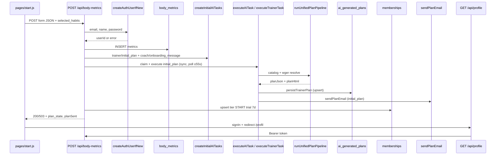

<!-- Generated by SpecStory, Markdown v2.1.0 -->

# 2026-06-18 19:39:50Z

<!-- Cursor IDE Session 67e81dec-1da4-408b-8c8b-d2d7906da38b (2026-06-18 19:39:50Z) -->

_**User**_

Analyze Body & Mind ON repo at c:\Users\prikopa\Documents\GitHub\body-mind-on for START registration flow. Find: frontend registration form, API routes, body metrics save, membership creation, AI task creation, plan generation, plan save, profile load, email send. For each: file path, function name, inputs, outputs, error handling. Search pages/start, register, onboarding, body-metrics, createInitialAITasks, taskExecutors, unifiedPlanPipeline. Return structured bullet list with file:line citations where possible. Read-only, no code changes.

---

_**Agent (composer-2.5-fast)**_

Searching the repo for the START registration flow and the areas you named.


_**Agent (composer-2.5-fast)**_

<tool-use data-tool-type="unknown" data-tool-name="update_current_step"><details>
<summary>Tool use: **update_current_step**</summary>
An unknown error occurred
</details></tool-use>

_**Agent (composer-2.5-fast)**_

<tool-use data-tool-type="search" data-tool-name="glob_file_search"><details>
<summary>Tool use: **glob_file_search** • Searched codebase "" • **0** results in **1** directory</summary>

Directory: **`c:\Users\prikopa\Documents\GitHub\body-mind-on`** (0 files)
</details></tool-use>

_**Agent (composer-2.5-fast)**_

<tool-use data-tool-type="search" data-tool-name="glob_file_search"><details>
<summary>Tool use: **glob_file_search** • Searched codebase "" • **1** result in **1** directory</summary>

Directory: **`c:\Users\prikopa\Documents\GitHub\body-mind-on`** (1 file)

| File |
|------|
| `../pages/register.js` |
</details></tool-use>

_**Agent (composer-2.5-fast)**_

<tool-use data-tool-type="search" data-tool-name="glob_file_search"><details>
<summary>Tool use: **glob_file_search** • Searched codebase "" • **12** results in **1** directory</summary>

Directory: **`c:\Users\prikopa\Documents\GitHub\body-mind-on`** (12 files)

| File |
|------|
| `../docs/ONBOARDING_PRODUCTION_SPEC.md` |
| `../pages/api/onboarding/generate-plan.js` |
| `../pages/api/onboarding/replace-meal.js` |
| `../pages/onboarding.js` |
| `../docs/ONBOARDING_API_FLOW_DESIGN.md` |
| `../pages/api/onboarding/replace-workout.js` |
| `../scripts/query-onboarding-metrics.mjs` |
| `../lib/validation/onboardingSchema.js` |
| `../lib/onboardingMetrics.js` |
| `../supabase/migrations/20260325_onboarding_metrics_index.sql` |
| `../scripts/run-onboarding-metrics-migration.mjs` |
| `../lib\validation\onboardingSchema.js` |
</details></tool-use>

_**Agent (composer-2.5-fast)**_

<tool-use data-tool-type="unknown" data-tool-name="ripgrep_raw_search"><details>
<summary>Tool use: **ripgrep_raw_search**</summary>

Parameters:

```json
{
  "caseInsensitive": false,
  "outputMode": "files_with_matches",
  "path": "c:\\Users\\prikopa\\Documents\\GitHub\\body-mind-on",
  "pattern": "createInitialAITasks|unifiedPlanPipeline|taskExecutors"
}
```
Additional data:

```json
{
  "isPruned": true,
  "outputMode": "files_with_matches",
  "path": "c:\\Users\\prikopa\\Documents\\GitHub\\body-mind-on",
  "pattern": "createInitialAITasks|unifiedPlanPipeline|taskExecutors",
  "topFiles": [
    {
      "matchCount": 1,
      "uri": "lib/generateAITasks.js"
    },
    {
      "matchCount": 1,
      "uri": "lib/validatePlanHtml.js"
    },
    {
      "matchCount": 1,
      "uri": "docs/RELEASE_AUDIT_UNIFIED_PLAN_PIPELINE.md"
    },
    {
      "matchCount": 1,
      "uri": "docs/ANALYZA_JIDELNICEK_A_REGISTRACE.md"
    },
    {
      "matchCount": 1,
      "uri": "docs/ONBOARDING_PRODUCTION_SPEC.md"
    },
    {
      "matchCount": 1,
      "uri": "lib/unifiedPlanPipeline.js"
    },
    {
      "matchCount": 1,
      "uri": "pages/api/body-metrics.js"
    },
    {
      "matchCount": 1,
      "uri": "lib/aiTaskExecutors.js"
    },
    {
      "matchCount": 1,
      "uri": "pages/api/admin/regenerate-user-plan.js"
    },
    {
      "matchCount": 1,
      "uri": "lib/createInitialAITasks.js"
    },
    {
      "matchCount": 1,
      "uri": "scripts/execute-ai-task-local.mjs"
    },
    {
      "matchCount": 1,
      "uri": "scripts\\generateRecipeImages.mjs"
    },
    {
      "matchCount": 1,
      "uri": "lib/aiOrchestrator.js"
    },
    {
      "matchCount": 1,
      "uri": "lib\\unifiedPlanPipeline.js"
    },
    {
      "matchCount": 1,
      "uri": "lib/registrationRules.js"
    },
    {
      "matchCount": 1,
      "uri": "pages/api/retry-initial-plan.js"
    },
    {
      "matchCount": 1,
      "uri": "docs/REFACTOR_UNIFIED_PLAN_PIPELINE.md"
    },
    {
      "matchCount": 1,
      "uri": "lib\\taskExecutors.js"
    },
    {
      "matchCount": 1,
      "uri": "pages/api/onboarding/generate-plan.js"
    },
    {
      "matchCount": 1,
      "uri": "pages/api/generate-plan.js"
    }
  ],
  "totalFiles": 28,
  "totalMatches": 28
}
```
Status: **completed**

</details></tool-use>

_**Agent (composer-2.5-fast)**_

<tool-use data-tool-type="unknown" data-tool-name="ripgrep_raw_search"><details>
<summary>Tool use: **ripgrep_raw_search**</summary>

Parameters:

```json
{
  "caseInsensitive": false,
  "outputMode": "files_with_matches",
  "path": "c:\\Users\\prikopa\\Documents\\GitHub\\body-mind-on",
  "pattern": "body-metrics|bodyMetrics"
}
```
Additional data:

```json
{
  "isPruned": true,
  "outputMode": "files_with_matches",
  "path": "c:\\Users\\prikopa\\Documents\\GitHub\\body-mind-on",
  "pattern": "body-metrics|bodyMetrics",
  "topFiles": [
    {
      "matchCount": 1,
      "uri": "lib/emailTemplates.js"
    },
    {
      "matchCount": 1,
      "uri": "lib\\services\\planOrchestrator_newFormat.js"
    },
    {
      "matchCount": 1,
      "uri": "pages/api/admin/send-test-plan-email.js"
    },
    {
      "matchCount": 1,
      "uri": "lib\\weeklyPlanEmailV2.js"
    },
    {
      "matchCount": 1,
      "uri": "scripts/render-weekly-email-v4-preview.mjs"
    },
    {
      "matchCount": 1,
      "uri": "scripts/smoke-test-critical-path.mjs"
    },
    {
      "matchCount": 1,
      "uri": "lib/_archive/weeklyPlanEmailV6_pre_v7.js"
    },
    {
      "matchCount": 1,
      "uri": "lib/validation/parseStructuredPlan.js"
    },
    {
      "matchCount": 1,
      "uri": "scripts/render-weekly-email-v6-preview.mjs"
    },
    {
      "matchCount": 1,
      "uri": "lib/_archive/weeklyPlanEmailV5_pre_fixes.js"
    },
    {
      "matchCount": 1,
      "uri": "pages/api/body-metrics.js"
    },
    {
      "matchCount": 1,
      "uri": "lib/compactPlanPrompt.js"
    },
    {
      "matchCount": 1,
      "uri": "pages/api/onboarding/replace-meal.js"
    },
    {
      "matchCount": 1,
      "uri": "supabase/migrations/20260308_memberships_stripe.sql"
    },
    {
      "matchCount": 1,
      "uri": "lib\\weeklyPlanEmailV4.js"
    },
    {
      "matchCount": 1,
      "uri": "lib/onboardingMetrics.js"
    },
    {
      "matchCount": 1,
      "uri": "lib\\weeklyPlanEmailV7.js"
    },
    {
      "matchCount": 1,
      "uri": "STRUKTURA_A_NAVRHY.md"
    },
    {
      "matchCount": 1,
      "uri": "lib/weeklyPlanEmailV6.js"
    },
    {
      "matchCount": 1,
      "uri": "lib\\weeklyPlanEmailV6.js"
    }
  ],
  "totalFiles": 95,
  "totalMatches": 95
}
```
Status: **completed**

</details></tool-use>

_**Agent (composer-2.5-fast)**_

<tool-use data-tool-type="read" data-tool-name="read_file_v2"><details>
<summary>Tool use: **read_file_v2** • Read file: c:\Users\prikopa\Documents\GitHub\body-mind-on\pages\start.js</summary>

</details></tool-use>

_**Agent (composer-2.5-fast)**_

<tool-use data-tool-type="read" data-tool-name="read_file_v2"><details>
<summary>Tool use: **read_file_v2** • Read file: c:\Users\prikopa\Documents\GitHub\body-mind-on\pages\register.js</summary>

</details></tool-use>

_**Agent (composer-2.5-fast)**_

<tool-use data-tool-type="read" data-tool-name="read_file_v2"><details>
<summary>Tool use: **read_file_v2** • Read file: c:\Users\prikopa\Documents\GitHub\body-mind-on\FLOW_START_DOTAZNIK.md</summary>

</details></tool-use>

_**Agent (composer-2.5-fast)**_

<tool-use data-tool-type="unknown" data-tool-name="ripgrep_raw_search"><details>
<summary>Tool use: **ripgrep_raw_search**</summary>

Parameters:

```json
{
  "caseInsensitive": false,
  "outputMode": "files_with_matches",
  "path": "c:\\Users\\prikopa\\Documents\\GitHub\\body-mind-on\\pages\\api",
  "pattern": "start|register|onboarding|body-metrics|createInitialAITasks"
}
```
Additional data:

```json
{
  "isPruned": true,
  "outputMode": "files_with_matches",
  "path": "c:\\Users\\prikopa\\Documents\\GitHub\\body-mind-on\\pages\\api",
  "pattern": "start|register|onboarding|body-metrics|createInitialAITasks",
  "topFiles": [
    {
      "matchCount": 1,
      "uri": "pages/api/workouts.js"
    },
    {
      "matchCount": 1,
      "uri": "pages/api/my-metrics.js"
    },
    {
      "matchCount": 1,
      "uri": "pages/api/user-habits.js"
    },
    {
      "matchCount": 1,
      "uri": "pages/api/debug/latest-plan-status.js"
    },
    {
      "matchCount": 1,
      "uri": "pages/api/body-metrics.js"
    },
    {
      "matchCount": 1,
      "uri": "pages/api/habits.js"
    },
    {
      "matchCount": 1,
      "uri": "pages/api/send-shopping-list.js"
    },
    {
      "matchCount": 1,
      "uri": "pages/api/onboarding/replace-workout.js"
    },
    {
      "matchCount": 1,
      "uri": "pages/api/profile-settings.js"
    },
    {
      "matchCount": 1,
      "uri": "pages/api/webhooks/stripe.js"
    },
    {
      "matchCount": 1,
      "uri": "pages/api/admin/backfill-exercise-name-cs.js"
    },
    {
      "matchCount": 1,
      "uri": "pages/api/admin/send-test-plan-email.js"
    },
    {
      "matchCount": 1,
      "uri": "pages/api/meal-pins.js"
    },
    {
      "matchCount": 1,
      "uri": "pages/api/cron/daily-digest.js"
    },
    {
      "matchCount": 1,
      "uri": "pages/api/plan-enrichment.js"
    },
    {
      "matchCount": 1,
      "uri": "pages/api/calendar/create.js"
    },
    {
      "matchCount": 1,
      "uri": "pages/api/profile-preferences.js"
    },
    {
      "matchCount": 1,
      "uri": "pages/api/sessions.js"
    },
    {
      "matchCount": 1,
      "uri": "pages/api/send-plan-again.js"
    },
    {
      "matchCount": 1,
      "uri": "pages/api/admin/backfill-plan-html-from-structured.js"
    }
  ],
  "totalFiles": 30,
  "totalMatches": 30
}
```
Status: **completed**

</details></tool-use>

_**Agent (composer-2.5-fast)**_

<tool-use data-tool-type="read" data-tool-name="read_file_v2"><details>
<summary>Tool use: **read_file_v2** • Read file: c:\Users\prikopa\Documents\GitHub\body-mind-on\pages\api\body-metrics.js</summary>

</details></tool-use>

_**Agent (composer-2.5-fast)**_

<tool-use data-tool-type="read" data-tool-name="read_file_v2"><details>
<summary>Tool use: **read_file_v2** • Read file: c:\Users\prikopa\Documents\GitHub\body-mind-on\lib\createInitialAITasks.js</summary>

</details></tool-use>

_**Agent (composer-2.5-fast)**_

<tool-use data-tool-type="read" data-tool-name="read_file_v2"><details>
<summary>Tool use: **read_file_v2** • Read file: c:\Users\prikopa\Documents\GitHub\body-mind-on\lib\taskExecutors.js</summary>

</details></tool-use>

_**Agent (composer-2.5-fast)**_

<tool-use data-tool-type="read" data-tool-name="read_file_v2"><details>
<summary>Tool use: **read_file_v2** • Read file: c:\Users\prikopa\Documents\GitHub\body-mind-on\lib\unifiedPlanPipeline.js</summary>

</details></tool-use>

_**Agent (composer-2.5-fast)**_

<tool-use data-tool-type="unknown" data-tool-name="ripgrep_raw_search"><details>
<summary>Tool use: **ripgrep_raw_search**</summary>

Parameters:

```json
{
  "caseInsensitive": false,
  "outputMode": "content",
  "path": "c:\\Users\\prikopa\\Documents\\GitHub\\body-mind-on\\lib\\taskExecutors.js",
  "pattern": "export async function executeAITask|async function executeTrainer|initial_plan|persistPublishableFallbackPlanForUser|sendPlanEmail"
}
```
Additional data:

```json
{
  "isPruned": true,
  "outputMode": "content",
  "path": "c:\\Users\\prikopa\\Documents\\GitHub\\body-mind-on\\lib\\taskExecutors.js",
  "pattern": "export async function executeAITask|async function executeTrainer|initial_plan|persistPublishableFallbackPlanForUser|sendPlanEmail",
  "topFiles": [
    {
      "matchCount": 44,
      "uri": "lib\\taskExecutors.js"
    }
  ],
  "totalFiles": 1,
  "totalMatches": 44
}
```
Status: **completed**

</details></tool-use>

_**Agent (composer-2.5-fast)**_

<tool-use data-tool-type="read" data-tool-name="read_file_v2"><details>
<summary>Tool use: **read_file_v2** • Read file: c:\Users\prikopa\Documents\GitHub\body-mind-on\lib\unifiedPlanPipeline.js</summary>

</details></tool-use>

_**Agent (composer-2.5-fast)**_

<tool-use data-tool-type="read" data-tool-name="read_file_v2"><details>
<summary>Tool use: **read_file_v2** • Read file: c:\Users\prikopa\Documents\GitHub\body-mind-on\pages\api\profile.js</summary>

</details></tool-use>

_**Agent (composer-2.5-fast)**_

<tool-use data-tool-type="unknown" data-tool-name="ripgrep_raw_search"><details>
<summary>Tool use: **ripgrep_raw_search**</summary>

Parameters:

```json
{
  "caseInsensitive": false,
  "outputMode": "content",
  "path": "c:\\Users\\prikopa\\Documents\\GitHub\\body-mind-on\\pages\\profil.js",
  "pattern": "fetch\\(|/api/profile|loadProfile|getSession"
}
```
Additional data:

```json
{
  "isPruned": true,
  "outputMode": "content",
  "path": "c:\\Users\\prikopa\\Documents\\GitHub\\body-mind-on\\pages\\profil.js",
  "pattern": "fetch\\(|/api/profile|loadProfile|getSession",
  "topFiles": [
    {
      "matchCount": 26,
      "uri": "pages\\profil.js"
    }
  ],
  "totalFiles": 1,
  "totalMatches": 26
}
```
Status: **completed**

</details></tool-use>

_**Agent (composer-2.5-fast)**_

<tool-use data-tool-type="read" data-tool-name="read_file_v2"><details>
<summary>Tool use: **read_file_v2** • Read file: c:\Users\prikopa\Documents\GitHub\body-mind-on\lib\taskExecutors.js</summary>

</details></tool-use>

_**Agent (composer-2.5-fast)**_

<tool-use data-tool-type="read" data-tool-name="read_file_v2"><details>
<summary>Tool use: **read_file_v2** • Read file: c:\Users\prikopa\Documents\GitHub\body-mind-on\lib\taskExecutors.js</summary>

</details></tool-use>

_**Agent (composer-2.5-fast)**_

<tool-use data-tool-type="unknown" data-tool-name="ripgrep_raw_search"><details>
<summary>Tool use: **ripgrep_raw_search**</summary>

Parameters:

```json
{
  "caseInsensitive": false,
  "contextAfter": 80,
  "outputMode": "content",
  "path": "c:\\Users\\prikopa\\Documents\\GitHub\\body-mind-on\\lib\\mail.js",
  "pattern": "export async function sendPlanEmail"
}
```
Additional data:

```json
{
  "isPruned": true,
  "outputMode": "content",
  "path": "c:\\Users\\prikopa\\Documents\\GitHub\\body-mind-on\\lib\\mail.js",
  "pattern": "export async function sendPlanEmail",
  "topFiles": [
    {
      "matchCount": 81,
      "uri": "lib\\mail.js"
    }
  ],
  "totalFiles": 1,
  "totalMatches": 1
}
```
Status: **completed**

</details></tool-use>

_**Agent (composer-2.5-fast)**_

<tool-use data-tool-type="unknown" data-tool-name="ripgrep_raw_search"><details>
<summary>Tool use: **ripgrep_raw_search**</summary>

Parameters:

```json
{
  "caseInsensitive": false,
  "outputMode": "content",
  "path": "c:\\Users\\prikopa\\Documents\\GitHub\\body-mind-on\\pages\\profil.js",
  "pattern": "refetch|/api/profile"
}
```
Additional data:

```json
{
  "isPruned": true,
  "outputMode": "content",
  "path": "c:\\Users\\prikopa\\Documents\\GitHub\\body-mind-on\\pages\\profil.js",
  "pattern": "refetch|/api/profile",
  "topFiles": [
    {
      "matchCount": 18,
      "uri": "pages\\profil.js"
    }
  ],
  "totalFiles": 1,
  "totalMatches": 18
}
```
Status: **completed**

</details></tool-use>

_**Agent (composer-2.5-fast)**_

<tool-use data-tool-type="unknown" data-tool-name="ripgrep_raw_search"><details>
<summary>Tool use: **ripgrep_raw_search**</summary>

Parameters:

```json
{
  "caseInsensitive": false,
  "contextAfter": 60,
  "outputMode": "content",
  "path": "c:\\Users\\prikopa\\Documents\\GitHub\\body-mind-on\\lib\\authHelpers.js",
  "pattern": "createAuthUserIfNew"
}
```
Additional data:

```json
{
  "isPruned": true,
  "outputMode": "content",
  "path": "c:\\Users\\prikopa\\Documents\\GitHub\\body-mind-on\\lib\\authHelpers.js",
  "pattern": "createAuthUserIfNew",
  "topFiles": [
    {
      "matchCount": 39,
      "uri": "lib\\authHelpers.js"
    }
  ],
  "totalFiles": 1,
  "totalMatches": 1
}
```
Status: **completed**

</details></tool-use>

_**Agent (composer-2.5-fast)**_

<tool-use data-tool-type="read" data-tool-name="read_file_v2"><details>
<summary>Tool use: **read_file_v2** • Read file: c:\Users\prikopa\Documents\GitHub\body-mind-on\pages\profil.js</summary>

</details></tool-use>

_**Agent (composer-2.5-fast)**_

<tool-use data-tool-type="read" data-tool-name="read_file_v2"><details>
<summary>Tool use: **read_file_v2** • Read file: c:\Users\prikopa\Documents\GitHub\body-mind-on\pages\api\profile.js</summary>

</details></tool-use>

_**Agent (composer-2.5-fast)**_

<tool-use data-tool-type="unknown" data-tool-name="ripgrep_raw_search"><details>
<summary>Tool use: **ripgrep_raw_search**</summary>

Parameters:

```json
{
  "caseInsensitive": false,
  "contextAfter": 80,
  "outputMode": "content",
  "path": "c:\\Users\\prikopa\\Documents\\GitHub\\body-mind-on\\lib\\taskExecutors.js",
  "pattern": "async function persistTrainerPlan"
}
```
Additional data:

```json
{
  "isPruned": true,
  "outputMode": "content",
  "path": "c:\\Users\\prikopa\\Documents\\GitHub\\body-mind-on\\lib\\taskExecutors.js",
  "pattern": "async function persistTrainerPlan",
  "topFiles": [
    {
      "matchCount": 81,
      "uri": "lib\\taskExecutors.js"
    }
  ],
  "totalFiles": 1,
  "totalMatches": 1
}
```
Status: **completed**

</details></tool-use>

_**Agent (composer-2.5-fast)**_

<tool-use data-tool-type="read" data-tool-name="read_file_v2"><details>
<summary>Tool use: **read_file_v2** • Read file: c:\Users\prikopa\Documents\GitHub\body-mind-on\lib\registrationRules.js</summary>

</details></tool-use>

_**Agent (composer-2.5-fast)**_

<tool-use data-tool-type="read" data-tool-name="read_file_v2"><details>
<summary>Tool use: **read_file_v2** • Read file: c:\Users\prikopa\Documents\GitHub\body-mind-on\pages\onboarding.js</summary>

</details></tool-use>

_**Agent (composer-2.5-fast)**_

<tool-use data-tool-type="search" data-tool-name="glob_file_search"><details>
<summary>Tool use: **glob_file_search** • Searched codebase "" • **1** result in **1** directory</summary>

Directory: **`c:\Users\prikopa\Documents\GitHub\body-mind-on`** (1 file)

| File |
|------|
| `../hooks/useProfileData.js` |
</details></tool-use>

_**Agent (composer-2.5-fast)**_

<tool-use data-tool-type="read" data-tool-name="read_file_v2"><details>
<summary>Tool use: **read_file_v2** • Read file: c:\Users\prikopa\Documents\GitHub\body-mind-on\lib\mail.js</summary>

</details></tool-use>

_**Agent (composer-2.5-fast)**_

<tool-use data-tool-type="read" data-tool-name="read_file_v2"><details>
<summary>Tool use: **read_file_v2** • Read file: c:\Users\prikopa\Documents\GitHub\body-mind-on\lib\taskExecutors.js</summary>

</details></tool-use>

_**Agent (composer-2.5-fast)**_

<tool-use data-tool-type="read" data-tool-name="read_file_v2"><details>
<summary>Tool use: **read_file_v2** • Read file: c:\Users\prikopa\Documents\GitHub\body-mind-on\lib\taskExecutors.js</summary>

</details></tool-use>

_**Agent (composer-2.5-fast)**_

<tool-use data-tool-type="read" data-tool-name="read_file_v2"><details>
<summary>Tool use: **read_file_v2** • Read file: c:\Users\prikopa\Documents\GitHub\body-mind-on\hooks\useProfileData.js</summary>

</details></tool-use>

_**Agent (composer-2.5-fast)**_

<tool-use data-tool-type="unknown" data-tool-name="ripgrep_raw_search"><details>
<summary>Tool use: **ripgrep_raw_search**</summary>

Parameters:

```json
{
  "caseInsensitive": false,
  "contextAfter": 30,
  "outputMode": "content",
  "path": "c:\\Users\\prikopa\\Documents\\GitHub\\body-mind-on\\lib\\mail.js",
  "pattern": "return \\{ ok: true|return \\{ ok: false"
}
```
Additional data:

```json
{
  "isPruned": true,
  "outputMode": "content",
  "path": "c:\\Users\\prikopa\\Documents\\GitHub\\body-mind-on\\lib\\mail.js",
  "pattern": "return \\{ ok: true|return \\{ ok: false",
  "topFiles": [
    {
      "matchCount": 131,
      "uri": "lib\\mail.js"
    }
  ],
  "totalFiles": 1,
  "totalMatches": 10
}
```
Status: **completed**

</details></tool-use>

_**Agent (composer-2.5-fast)**_

<tool-use data-tool-type="read" data-tool-name="read_file_v2"><details>
<summary>Tool use: **read_file_v2** • Read file: c:\Users\prikopa\Documents\GitHub\body-mind-on\pages\api\retry-initial-plan.js</summary>

</details></tool-use>

_**Agent (composer-2.5-fast)**_

<tool-use data-tool-type="read" data-tool-name="read_file_v2"><details>
<summary>Tool use: **read_file_v2** • Read file: c:\Users\prikopa\Documents\GitHub\body-mind-on\pages\api\send-plan-again.js</summary>

</details></tool-use>

_**Agent (composer-2.5-fast)**_

<tool-use data-tool-type="read" data-tool-name="read_file_v2"><details>
<summary>Tool use: **read_file_v2** • Read file: c:\Users\prikopa\Documents\GitHub\body-mind-on\lib\profileApi.js</summary>

</details></tool-use>

_**Agent (composer-2.5-fast)**_

<tool-use data-tool-type="unknown" data-tool-name="ripgrep_raw_search"><details>
<summary>Tool use: **ripgrep_raw_search**</summary>

Parameters:

```json
{
  "caseInsensitive": false,
  "contextAfter": 15,
  "contextBefore": 5,
  "outputMode": "content",
  "path": "c:\\Users\\prikopa\\Documents\\GitHub\\body-mind-on\\lib\\mail.js",
  "pattern": "logPlanEmailEvent.*sent|ok: true.*template_used"
}
```
Additional data:

```json
{
  "isPruned": true,
  "outputMode": "content",
  "path": "c:\\Users\\prikopa\\Documents\\GitHub\\body-mind-on\\lib\\mail.js",
  "pattern": "logPlanEmailEvent.*sent|ok: true.*template_used",
  "topFiles": [],
  "totalFiles": 0,
  "totalMatches": 0
}
```
Status: **completed**

</details></tool-use>

_**Agent (composer-2.5-fast)**_

<tool-use data-tool-type="read" data-tool-name="read_file_v2"><details>
<summary>Tool use: **read_file_v2** • Read file: c:\Users\prikopa\Documents\GitHub\body-mind-on\pages\profil.js</summary>

</details></tool-use>

_**Agent (composer-2.5-fast)**_

<tool-use data-tool-type="read" data-tool-name="read_file_v2"><details>
<summary>Tool use: **read_file_v2** • Read file: c:\Users\prikopa\Documents\GitHub\body-mind-on\lib\mail.js</summary>

</details></tool-use>

_**Agent (composer-2.5-fast)**_

<tool-use data-tool-type="read" data-tool-name="read_file_v2"><details>
<summary>Tool use: **read_file_v2** • Read file: c:\Users\prikopa\Documents\GitHub\body-mind-on\pages\api\onboarding\generate-plan.js</summary>

</details></tool-use>

_**Agent (composer-2.5-fast)**_

<tool-use data-tool-type="read" data-tool-name="read_file_v2"><details>
<summary>Tool use: **read_file_v2** • Read file: c:\Users\prikopa\Documents\GitHub\body-mind-on\lib\mail.js</summary>

</details></tool-use>

_**Agent (composer-2.5-fast)**_

<tool-use data-tool-type="read" data-tool-name="read_file_v2"><details>
<summary>Tool use: **read_file_v2** • Read file: c:\Users\prikopa\Documents\GitHub\body-mind-on\pages\api\profile.js</summary>

</details></tool-use>

_**Agent (composer-2.5-fast)**_

<tool-use data-tool-type="unknown" data-tool-name="ripgrep_raw_search"><details>
<summary>Tool use: **ripgrep_raw_search**</summary>

Parameters:

```json
{
  "caseInsensitive": false,
  "outputMode": "content",
  "path": "c:\\Users\\prikopa\\Documents\\GitHub\\body-mind-on\\lib\\mail.js",
  "pattern": "sendPlanEmail"
}
```
Additional data:

```json
{
  "isPruned": true,
  "outputMode": "content",
  "path": "c:\\Users\\prikopa\\Documents\\GitHub\\body-mind-on\\lib\\mail.js",
  "pattern": "sendPlanEmail",
  "topFiles": [
    {
      "matchCount": 3,
      "uri": "lib\\mail.js"
    }
  ],
  "totalFiles": 1,
  "totalMatches": 3
}
```
Status: **completed**

</details></tool-use>

_**Agent (composer-2.5-fast)**_

<tool-use data-tool-type="read" data-tool-name="read_file_v2"><details>
<summary>Tool use: **read_file_v2** • Read file: c:\Users\prikopa\Documents\GitHub\body-mind-on\lib\mail.js</summary>

</details></tool-use>

_**Agent (composer-2.5-fast)**_

<tool-use data-tool-type="read" data-tool-name="read_file_v2"><details>
<summary>Tool use: **read_file_v2** • Read file: c:\Users\prikopa\Documents\GitHub\body-mind-on\lib\mail.js</summary>

</details></tool-use>

_**Agent (composer-2.5-fast)**_

<think><details><summary>Thought Process</summary>
The full registration flow picture is now clear.

I am now mapping the nine requested steps to specific files and functions. The frontend form lives in pages/start.js. API routes are in pages/api/body-metrics.js and redirect handlers. I will also check generateStructuredPlan in planOrchestrator and note secondary routes like retry-initial-plan and send-plan-again.
</details></think>

_**Agent (composer-2.5-fast)**_

Compiling the structured flow map from the files we've read.


_**Agent (composer-2.5-fast)**_

<tool-use data-tool-type="unknown" data-tool-name="update_current_step"><details>
<summary>Tool use: **update_current_step**</summary>
An unknown error occurred
</details></tool-use>

_**Agent (composer-2.5-fast)**_

## START registration flow — end-to-end map

**Entry:** `c:\Users\prikopa\Documents\GitHub\body-mind-on\pages\start.js` (program hardcoded `START`).  
**Redirects:** `pages/register.js` and `pages/onboarding.js` → `/start` only (no separate flow).  
**Single backend entry:** `POST /api/body-metrics` (`pages/api/body-metrics.js`).  
**Note:** `FLOW_START_DOTAZNIK.md` is outdated (describes old `generatePlanForEmail` path); live code uses `createInitialAITasks` → `executeAITask` → `unifiedPlanPipeline`.

---

### Flow diagram



---

### 1. Frontend registration form

- **File:** `c:\Users\prikopa\Documents\GitHub\body-mind-on\pages\start.js`
- **Component:** `Start` (default export), lines 15–723
- **Submit handler:** `handleSubmit`, lines 123–208
- **Inputs (state `formData`):** `name`, `email`, `password`, `passwordConfirm`, `gender`, `age`, `height`, `weight`, `activity`, `stress`, `worktype`, `goal`, `frequency`, `workout_days[]`, `diet_type`, `dietary_restrictions`, `foods_to_avoid`, `notes`, `program: "START"` (lines 18–38)
- **Also sent:** `selected_habits` from step 5 (line 150)
- **Normalization:** `normalizeData()` — dash in `frequency`, lowercase `activity`/`stress`/`goal` (lines 47–54)
- **Client validation:** step gates (`canProceedStep1`–`5`), `getStep2Errors()` height 100–250 cm (lines 68–87)
- **API call:** `POST /api/body-metrics` with cleaned JSON (lines 147–151)
- **Outputs (UI):** `status` messages; on success `planSent` / `planPending` / `plan_state === 'ready'` → `supabase.auth.signInWithPassword` → `router.replace('/profil')` (lines 161–179); partial failure shows login/retry CTAs (lines 486–516)
- **Error handling:**
  - Parse failures → generic server error (lines 154–158)
  - `res.ok` false → show `result.error`; 504 → “account may exist” (lines 184–198)
  - Height API error → jump to step 2 + field error (lines 191–194)
  - `hasUserId === true` → `planFailedCanRetry` (lines 197, 493–516)
  - Network/timeout in `catch` (lines 200–207)

**Aliases (no form):**
- `pages/register.js` — `Register`, `useEffect` → `/start` (lines 5–18)
- `pages/onboarding.js` — same redirect (lines 5–14)

**Rules source:** `lib/registrationRules.js` — `REGISTRATION_STEPS = 5`, validation constants (lines 14–73)

---

### 2. API routes (registration core)

#### Primary: `POST /api/body-metrics`

- **File:** `c:\Users\prikopa\Documents\GitHub\body-mind-on\pages\api\body-metrics.js`
- **Handler:** default export `handler`, lines 34–585
- **Method guard:** non-POST → 405 (lines 36–38)
- **Inputs:** `req.body` — maps to `payload` (email, name, gender, age, height_cm, weight_kg, activity, stress_level, occupation, goal, freq_choice, weekly_sessions_user, workout_days, diet fields, notes, program, user_id, created_at) (lines 41–88)
- **Outputs:**
  - Success 200: `{ ok, planSent, planPending, plan_state, loginUnavailable, message, hasUserId, initialPlanTaskStatus, _diagnostics, ... }` (lines 419–577)
  - Last-resort fallback success 200 (lines 552)
  - Plan failed 503 with `hasUserId: true` (lines 567–575)
  - Validation 400 (email, password, height, weight, age, duplicate account) (lines 90–145)
  - Uncaught 500 (lines 579–584)
- **Error handling:** try/catch top-level; auth failure continues without `user_id` (lines 118–136); DB insert throws (lines 152–155); `createInitialAITasks` throws (lines 183–186); execute/scheduler retries + poll up to `PLAN_WAIT_TIMEOUT_MS` 55s (lines 200–287); last-resort `persistPublishableFallbackPlanForUser` + email (lines 466–576)

#### Secondary (post-registration, authenticated)

| Route | File | Role |
|-------|------|------|
| `GET /api/profile` | `pages/api/profile.js` | Load profile + plan state |
| `POST /api/retry-initial-plan` | `pages/api/retry-initial-plan.js` | Re-run `initial_plan` from profile |
| `POST /api/send-plan-again` | `pages/api/send-plan-again.js` | Resend existing plan email |

**Not used by START form:** `pages/api/onboarding/generate-plan.js` (standalone pipeline test API), `pages/api/generate-plan.js`.

---

### 3. Body metrics save

- **File:** `pages/api/body-metrics.js`
- **Auth first:** `createAuthUserIfNew(payload.email, payload.name, password)` from `lib/authHelpers.js` (lines 113–136)
  - **Function:** `createAuthUserIfNew`, lines 27–53
  - **Inputs:** email, name, optional password (≥6 chars)
  - **Outputs:** `{ userId, password?, userChosePassword }` or `{ userId, existing: true }` or `{ error }`
  - **Errors:** existing account → no password reset; returns `existing: true` (lines 43–48)
- **Insert:** `supabaseServer.from('body_metrics').insert([payload]).select('id')` (lines 147–157)
- **Inputs to DB:** normalized payload + `user_id` from auth
- **Outputs:** `bodyMetricsId`; throws on `dbErr`
- **Also:** `writeOnboardingEvent(...)` metrics via `lib/onboardingMetrics.js` (lines 397–416, 532–551)

---

### 4. Membership creation

- **File:** `pages/api/body-metrics.js`, lines 290–314
- **Function:** inline upsert in `handler` (no named export)
- **Inputs:** `user_id`, `program` (START), `created_at`
- **Logic:** START → `tier: 'START'`, `status: 'trial'`, `trial_ends_at` = +7 days (lines 294–307)
- **Table:** `memberships` upsert `onConflict: 'user_id'`
- **Outputs:** log only; `memErr` → `console.warn` (non-fatal, lines 309–310)
- **Also saved:** `user_habits` from `selected_habits` (lines 316–328)

---

### 5. AI task creation

- **File:** `c:\Users\prikopa\Documents\GitHub\body-mind-on\lib\createInitialAITasks.js`
- **Function:** `createInitialAITasks(userId, emailOptions, opts)`, lines 22–91
- **Called from:** `body-metrics.js` lines 179–181 with `{ spoonacularRegistrationOnly: true }`
- **Inputs:**
  - `userId` (required)
  - `emailOptions`: `{ loginPassword, loginUrl, existingAccount, loginUnavailable, userChosePassword }`
  - `opts.spoonacularRegistrationOnly` → sets Spoonacular registration flag in task payload
- **Inserts into `ai_tasks`:**
  1. `trainer` / `initial_plan` — 7-day trial, modules nutrition+training+habits (lines 29–52)
  2. `coach` / `onboarding_message` (lines 53–60)
- **Outputs:** `{ ok: true, tasksCreated: boolean }`
- **Error handling:**
  - Missing `userId` → throw (lines 23–26)
  - Duplicate idempotency key → return existing (lines 65–67)
  - Missing column → fallback insert without `idempotency_key` (lines 69–83)
  - Other DB errors → throw (lines 85–86)

**Execution trigger (same request):** `body-metrics.js` lines 190–287 — claim task, `executeAITask`, scheduler retries, poll until completed/failed/timeout.

**Events:** `enqueueAIEvent('user_registered')`, `triggerImmediateDecision` (lines 187–188)

---

### 6. Plan generation

#### Dispatcher

- **File:** `c:\Users\prikopa\Documents\GitHub\body-mind-on\lib\taskExecutors.js`
- **Function:** `executeAITask(task)`, lines 1397–1418
- **Routes:** `trainer_plan` → `executeTrainerTask(task)` (line 1412)

#### Trainer executor (initial_plan path)

- **Function:** `executeTrainerTask`, lines 438–887+
- **Inputs:** `ai_tasks` row (`user_id`, `task_type: 'initial_plan'`, `payload` with `emailOptions`, Spoonacular flag)
- **Loads:** `loadLatestBodyMetrics`, `loadLatestPlan` (lines 439–440)
- **Skips:** usable existing plan or same week range (lines 443–563)
- **Plan range:** `initialPlanWeekRangeFromRegistration(bm)` — 7 days from registration date Prague TZ (lines 514–515, 170–173)
- **Generation call:** `runUnifiedPlanPipeline({ bm, validFrom, validUntil, useOpenAI: false by default, allowLiveSpoonacular })` (lines 571–575)

#### Unified pipeline

- **File:** `c:\Users\prikopa\Documents\GitHub\body-mind-on\lib\unifiedPlanPipeline.js`
- **Function:** `runUnifiedPlanPipeline(input)`, lines 37–151
- **Inputs:** `{ bm, useOpenAI?, validFrom?, validUntil?, mealsOnly?, allowLiveSpoonacular? }`
- **Steps:** `bodyMetricsToPlanInput` → `generateStructuredPlan` (`lib/services/planOrchestrator`) → post-process → `validateStructuredPlan` → `renderPlanHtmlFromStructured`
- **Outputs:** `{ ok, planJson, planHtml, valid_from, valid_until, targets, generation_source, validation, _diagnostics }` or `{ ok: false, error }`
- **Error handling:** validation hardFail → fail; catch → logged + `{ ok: false, error }` (lines 103–149)

**Module gate (initial_plan only):** `validateInitialPlanModules` — nutrition, training, habits required (taskExecutors.js lines 614–651)

**Publishability:** `isPublishableFromAI(generation_source)` — non-publishable → task failed (lines 672–698)

**HTML validation:** `validateTrainerPlanHtml` — missing sections → fail (lines 719–730)

---

### 7. Plan save

#### Primary path (trainer task)

- **File:** `lib/taskExecutors.js`
- **Function:** `persistTrainerPlan({ userId, bm, generated, taskType, latestPlan, planRange })`, lines 312–432
- **Inputs:** generated `{ html, planJson, generation_source }`, `bm`, range, `taskType: 'initial_plan'`
- **Actions:** deactivate old active plans → upsert `ai_generated_plans` (`onConflict: 'user_id,valid_from'`) with `structured_plan_json`, macros, `generated_by: 'ai-task:initial_plan'` (lines 376–415)
- **Outputs:** `{ action, plan_id, valid_from, valid_until }`
- **Errors:** invalid HTML → throw; DB error → throw; `initial_plan` without `plan_id` → throw (lines 421–423)

#### Alternate path (last-resort in body-metrics)

- **Function:** `persistPublishableFallbackPlanForUser(userId)`, taskExecutors.js lines 1250–1357
- **Uses:** `runUnifiedPlanPipeline` + `persistPlanFromUnified`, or deterministic HTML template
- **Called from:** body-metrics.js lines 472–552 when `initialPlanTaskStatus !== 'completed'`

#### Unified persist helper

- **File:** `lib/unifiedPlanPipeline.js`
- **Function:** `persistPlanFromUnified(pipelineResult, bm, opts)`, lines 166–232
- **Outputs:** `{ plan_id, valid_from, valid_until }` or `{ error }`
- **Fallback:** retry without `structured_plan_json` if column missing (lines 218–228)

---

### 8. Profile load

#### Frontend

- **Page:** `c:\Users\prikopa\Documents\GitHub\body-mind-on\pages\profil.js`
- **Auth:** `supabase.auth.getSession()` + `refreshSession` (lines 471–486)
- **Data hook:** `useProfileData({ accessToken, enabled, refreshSession, onAuthFailure })` (lines 321–340)
- **Hook file:** `hooks/useProfileData.js`
  - **Function:** `useProfileData`, lines 39–162
  - **`refetch`:** calls `fetchProfile(token)` (lines 55–72)
  - **Polling:** when `plan_state === 'processing'`, every 3s up to 2 min (lines 126–148)
  - **Errors:** 15s load timeout; auth errors → refresh or `onAuthFailure` (lines 83–104)

#### API client

- **File:** `lib/profileApi.js`
- **Function:** `fetchProfile(accessToken)`, lines 55–68
- **Request:** `GET /api/profile?t=...` with `Authorization: Bearer`
- **Outputs:** `{ ok, profile }` via `normalizeProfilePayload(data)`

#### API handler

- **File:** `pages/api/profile.js`
- **Handler:** default export, lines 11–441+
- **Auth:** Bearer token → `supabaseServer.auth.getUser(token)` (lines 17–22)
- **Pre-step:** `reconcileUserDataByEmail({ userId, email })` (lines 27–34)
- **Parallel fetch:** `body_metrics`, `ai_generated_plans`, `workouts`, `user_habits`, `memberships`, `habit_logs`, `profiles`, coach messages, `initial_plan` task (lines 39–93)
- **Plan filtering:** excludes `generated_by` containing `'fallback'` (lines 97–99)
- **Plan state:** derives `plan_state` ∈ `ready|processing|failed|invalid|missing` (lines 198–224)
- **Recovery:** `ensureInitialPlanTask` if metrics exist but no task (lines 144–172)
- **Outputs (200 JSON):** `user`, `body_metrics`, `plans`, `program`, `membershipStatus`, `trialEndsAt`, `workouts`, `user_habits`, `coach_messages`, `_diagnostics` (lines 318–389+)
- **Errors:** 401 no/invalid token; 405 wrong method; catch → 500

**Post-registration redirect:** start.js signs in and goes to `/profil` (lines 165–178); profile then loads plan created during registration.

---

### 9. Email send

#### During registration (primary)

- **File:** `lib/taskExecutors.js`, `executeTrainerTask`, lines 747–815
- **When:** `task.task_type === 'initial_plan'` && `bm.email` && valid HTML
- **Dedup:** `isPlanEmailAlreadySent`, `tryClaimPlanEmailSend` / `releasePlanEmailSendClaim` (lines 752–789)
- **Call:** `sendPlanEmail(bm.email, planHtml, { loginPassword, loginUrl, existingAccount, loginUnavailable, userChosePassword, firstName, bodyMetrics, structuredPlanJson, validFrom, planId })`
- **On success:** `ai_generated_plans.email_sent = true` (lines 792–802)
- **On validation fail:** plan saved, email skipped, `validation_warning` (lines 762–764)
- **Result in task:** `email_sent`, `email_error` in return payload (lines 858–860)

#### Last-resort (body-metrics)

- **File:** `pages/api/body-metrics.js`, lines 488–514
- **Same:** `sendPlanEmail` with fallback plan HTML

#### Mail implementation

- **File:** `c:\Users\prikopa\Documents\GitHub\body-mind-on\lib\mail.js`
- **Function:** `sendPlanEmail(email, planHtml, options)`, lines 47–510
- **Inputs:** recipient email, plan HTML fragment, options (login block, `structuredPlanJson`, `bodyMetrics`, `planId`, `validFrom`, template version, etc.)
- **Providers:** Gmail (Nodemailer) first, Resend fallback (lines 62–75, 425–460)
- **Template chain:** v8 → v7 → v6 → … → legacy `buildPlanEmailDocument` (lines 139–318)
- **Outputs success:** `{ ok: true, provider, message_id, template_used, ... }` (lines 399–407, 452–460)
- **Outputs failure:** `{ ok: false, message }` (lines 54–60, 490–495, 504–509)
- **Errors:** missing recipient; missing env keys; provider failures logged via `logPlanEmailEvent`

#### Resend from profile (not registration)

- **Route:** `POST /api/send-plan-again` — loads latest plan, calls `sendPlanEmail` for logged-in user

---

### Quick reference — function → file:line

| Step | Function | File:line |
|------|----------|-----------|
| Form submit | `handleSubmit` | `pages/start.js:123` |
| API handler | `handler` | `pages/api/body-metrics.js:34` |
| Auth user | `createAuthUserIfNew` | `lib/authHelpers.js:27` |
| Save metrics | `handler` (insert) | `pages/api/body-metrics.js:147` |
| Create tasks | `createInitialAITasks` | `lib/createInitialAITasks.js:22` |
| Execute task | `executeAITask` | `lib/taskExecutors.js:1397` |
| Trainer logic | `executeTrainerTask` | `lib/taskExecutors.js:438` |
| Generate plan | `runUnifiedPlanPipeline` | `lib/unifiedPlanPipeline.js:37` |
| Save plan | `persistTrainerPlan` | `lib/taskExecutors.js:312` |
| Membership | `handler` (upsert) | `pages/api/body-metrics.js:298` |
| Send email | `sendPlanEmail` | `lib/mail.js:47` |
| Load profile (FE) | `fetchProfile` / `useProfileData` | `lib/profileApi.js:55`, `hooks/useProfileData.js:39` |
| Load profile (API) | `handler` | `pages/api/profile.js:11` |

---

### Response contract (frontend expectations)

From `start.js` lines 161–198, success redirect when:
- `res.ok` and (`result.planSent` OR `result.planPending` OR `result.plan_state === 'ready'`)

`body-metrics` sets `plan_state`: `ready` | `processing` | `failed` (lines 336–341). HTTP 503 when plan generation fails and last-resort also fails (lines 567–575).
