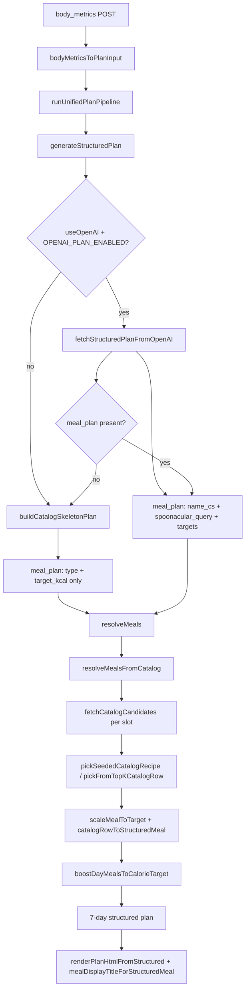

<!-- Generated by SpecStory, Markdown v2.1.0 -->

# 2026-06-18 20:58:51Z

<!-- Cursor IDE Session 81741f45-5c11-4384-aabd-08af3fbc1080 (2026-06-18 20:58:51Z) -->

_**User**_

Explore the Body & Mind ON codebase at c:\Users\prikopa\Documents\GitHub\body-mind-on to map the complete meal selection flow.

Find and report:
1. Where meals are selected (recipes_catalog, Spoonacular, AI, fallback)
2. Scoring/ranking functions for recipes
3. Meal planning prompts (openaiPlanConfig, prompts)
4. Where meal names are displayed/simplified
5. deterministicFallback, planOrchestrator, unifiedPlanPipeline, recipesCatalog roles

Search these files and related imports:
- lib/services/planOrchestrator.js
- lib/unifiedPlanPipeline.js
- lib/recipesCatalog.js
- lib/services/deterministicFallback.js
- lib/openaiPlanConfig.js
- lib/bodyMetricsToPlanInput.js
- lib/taskExecutors.js
- lib/recipeDetailFromCatalog.js
- pages/api/body-metrics.js

Return a table: File | Function | Role in meal flow | What to modify for "simple meals"
Also return exact file paths and function names for scoring integration points.
Be thorough - check generateStructuredPlan, resolveMeals, catalog lookup, meal selection loops.

---

_**Agent (composer-2.5-fast)**_

Mapping the meal selection flow across the listed files and related imports.


_**Agent (composer-2.5-fast)**_

<tool-use data-tool-type="unknown" data-tool-name="update_current_step"><details>
<summary>Tool use: **update_current_step**</summary>
An unknown error occurred
</details></tool-use>

_**Agent (composer-2.5-fast)**_

<tool-use data-tool-type="search" data-tool-name="glob_file_search"><details>
<summary>Tool use: **glob_file_search** • Searched codebase "" • **145** results in **1** directory</summary>

Directory: **`c:\Users\prikopa\Documents\GitHub\body-mind-on`** (145 files)

| File |
|------|
| `../lib/ingredientNamesCs.js` |
| `../lib/validation/mealTrainingCoherence.js` |
| `../lib/planHtmlStructuredBackfill.js` |
| `../lib/spoonacularClient.js` |
| `../lib/openai.js` |
| `../lib/siteUrls.js` |
| `../lib/services/planMemoryCompact.js` |
| `../lib/aiTaskRegistry.js` |
| `../lib/membershipHelpers.js` |
| `../lib/weeklyPlanEmailV4.js` |
| `../lib/utils/czechVocative.js` |
| `../lib/planPdf.js` |
| `../lib/supabaseUserClient.js` |
| `../lib/planOutputMode.js` |
| `../lib/shoppingListBuilder.js` |
| `../lib/exerciseCanonicalMap.js` |
| `../lib/getAgentConfig.js` |
| `../lib/planExerciseNameCsBackfill.js` |
| `../lib/generatePlan.js` |
| `../lib\recipeDetailHtml.js` |
| `../lib/compactPlanPrompt.js` |
| `../lib/spoonacularShopping.js` |
| `../lib\services\planEnhancementAsync.js` |
| `../lib/onboardingMetrics.js` |
| `../lib\weeklyPlanEmailV8.js` |
| `../lib\weeklyPlanEmailV5.js` |
| `../lib/services/wgerService.js` |
| `../lib\recipesCatalog.js` |
| `../lib/_archive/weeklyPlanEmailV4_pre_v5.js` |
| `../lib/weeklyPlanEmailV8.js` |
| `../lib/planDataIntegrity.js` |
| `../lib\weeklyPlanEmailV4.js` |
| `../lib\recipeDetailFromCatalog.js` |
| `../lib/workoutPlanScaler.js` |
| `../lib/_archive/weeklyPlanEmailV2_backup.js` |
| `../lib/agentPromptsForSync.js` |
| `../lib/progress.js` |
| `../lib/weeklyPlanEmailV6.js` |
| `../lib/enrichPlanContent.js` |
| `../lib\unifiedPlanPipeline.js` |
| `../lib/supabaseClient.js` |
| `../lib/unifiedPlanPipeline.js` |
| `../lib/exerciseMediaHelpers.js` |
| `../lib/loadAgentDocumentsContext.js` |
| `../lib/validatePlanTruth.js` |
| `../lib/recipeLocalization.js` |
| `../lib/recipeTitleTranslator.js` |
| `../lib/taskExecutors.js` |
| `../lib\nutrition\portionScaling.js` |
| `../lib/createInitialAITasks.js` |
| `../lib\weeklyPlanEmailV6.js` |
| `../lib/aiOps.js` |
| `../lib/weeklyPlanEmailV7.js` |
| `../lib/createAITasksFromDecisions.js` |
| `../lib/mealRecipeLink.js` |
| `../lib\planRenderer.js` |
| `../lib/mealPortionIngredients.js` |
| `../lib\openaiPlanConfig.js` |
| `../lib/runAIDecisionEngine.js` |
| `../lib/supabaseServer.js` |
| `../lib\mail.js` |
| `../lib/services/exerciseProviderRegistry.js` |
| `../lib\services\deterministicFallback.js` |
| `../lib\weeklyPlanEmailV2.js` |
| `../lib/recipesCatalog.js` |
| `../lib/analyzeUserProgress.js` |
| `../lib/bodyMetricsToPlanInput.js` |
| `../lib/validation/structuredPlanValidators.js` |
| `../lib\validation\structuredPlanValidators.js` |
| `../lib/agentRouter.js` |
| `../lib/mealOrder.js` |
| `../lib/aiOrchestrator.js` |
| `../lib/nutrition/portionScaling.js` |
| `../lib/exerciseRegistryMedia.js` |
| `../lib/planSelection.js` |
| `../lib/profileApi.js` |
| `../lib/services/planOrchestrator.js` |
| `../lib/validation/onboardingSchema.js` |
| `../lib/authHelpers.js` |
| `../lib/spoonacularQuotaGate.js` |
| `../lib/planLabels.js` |
| `../lib/czechShoppingIntro.js` |
| `../lib\weeklyPlanEmailV7.js` |
| `../lib/services/priorPlanWorkouts.js` |
| `../lib/czechCalendar.js` |
| `../lib/assistantInstructions.js` |
| `../lib/planRenderer.js` |
| `../lib/spoonacularComplexSearch.js` |
| `../lib/services/planOrchestrator_newFormat.js` |
| `../lib/rateLimit.js` |
| `../lib/habits.js` |
| `../lib\validation\onboardingSchema.js` |
| `../lib/buildAgentContext.js` |
| `../lib/mealQueryShorten.js` |
| `../lib\emailTemplates.js` |
| `../lib/aiRuntimeCapabilities.js` |
| `../lib/mealStaticRecipeIds.js` |
| `../lib/services/planMemoryContext.js` |
| `../lib/safeLog.js` |
| `../lib/aiTaskExecutors.js` |
| `../lib/preferenceConstants.js` |
| `../lib\services\planOrchestrator_newFormat.js` |
| `../lib/weeklyPlanEmailV5.js` |
| `../lib\taskExecutors.js` |
| `../lib/aiSharedMemory.js` |
| `../lib/parsePlanHtml.js` |
| `../lib/runAgent.js` |
| `../lib\services\planOrchestrator.js` |
| `../lib/aiDecisionEngine.js` |
| `../lib/validatePlanHtml.js` |
| `../lib/utils/czechDateWords.js` |
| `../lib/generateAITasks.js` |
| `../lib/planGenerationUiCopy.js` |
| `../lib/reconcileUserDataByEmail.js` |
| `../lib/_archive/weeklyPlanEmailV6_pre_v7.js` |
| `../lib/mealEnrichment.js` |
| `../lib\workoutPlanScaler.js` |
| `../lib/profileWeekRange.js` |
| `../lib/services/deterministicFallback.js` |
| `../lib/exerciseEnrichment.js` |
| `../lib/validation/parseStructuredPlan.js` |
| `../lib\services\planOrchestratorResolve.js` |
| `../lib/aiScheduler.js` |
| `../lib/registrationRules.js` |
| `../lib/wgerApiConstants.js` |
| `../lib/spoonacularHttp.js` |
| `../lib/ensureInitialPlanTask.js` |
| `../lib/planDayHeadingFormat.js` |
| `../lib/planGenerationGate.js` |
| `../lib/googleCalendar.js` |
| `../lib/mealNormalization.js` |
| `../lib/aiEvents.js` |
| `../lib/openaiModels.js` |
| `../lib/services/planOrchestratorResolve.js` |
| `../lib\recipeDetailUrl.js` |
| `../lib/_archive/weeklyPlanEmailV5_pre_fixes.js` |
| `../lib/weeklyPlanEmailV2.js` |
| `../lib/mail.js` |
| `../lib/mealDisplayNameHelpers.js` |
| `../lib/emailTemplates.js` |
| `../lib/dailyDigest.js` |
| `../lib/planValidators.js` |
| `../lib/emailV8Palette.js` |
| `../lib/progressModel.js` |
| `../lib/wgerClient.js` |
</details></tool-use>

_**Agent (composer-2.5-fast)**_

<tool-use data-tool-type="unknown" data-tool-name="ripgrep_raw_search"><details>
<summary>Tool use: **ripgrep_raw_search**</summary>

Parameters:

```json
{
  "caseInsensitive": false,
  "glob": "*.{js,mjs,ts,tsx}",
  "path": "c:\\Users\\prikopa\\Documents\\GitHub\\body-mind-on",
  "pattern": "resolveMeals|generateStructuredPlan|recipesCatalog|recipes_catalog|scoreRecipe|rankRecipe|simpleMeal|simplifyMeal"
}
```
Additional data:

```json
{
  "isPruned": true,
  "outputMode": "content",
  "path": "c:\\Users\\prikopa\\Documents\\GitHub\\body-mind-on",
  "pattern": "resolveMeals|generateStructuredPlan|recipesCatalog|recipes_catalog|scoreRecipe|rankRecipe|simpleMeal|simplifyMeal",
  "topFiles": [
    {
      "matchCount": 1,
      "uri": "lib/planRenderer.js"
    },
    {
      "matchCount": 1,
      "uri": "lib/spoonacularQuotaGate.js"
    },
    {
      "matchCount": 1,
      "uri": "lib/validation/structuredPlanValidators.js"
    },
    {
      "matchCount": 1,
      "uri": "components/PlanViewer.js"
    },
    {
      "matchCount": 6,
      "uri": "scripts/enrichRecipeIngredients.mjs"
    },
    {
      "matchCount": 3,
      "uri": "scripts/seedRecipes.js"
    },
    {
      "matchCount": 4,
      "uri": "scripts/recategorizeMeals.mjs"
    },
    {
      "matchCount": 2,
      "uri": "scripts/importRecipesFromMealCache.mjs"
    },
    {
      "matchCount": 1,
      "uri": "pages\\api\\spoonacular-recipe.js"
    },
    {
      "matchCount": 1,
      "uri": "components\\PlanViewer.js"
    },
    {
      "matchCount": 3,
      "uri": "lib\\services\\planOrchestrator_newFormat.js"
    },
    {
      "matchCount": 1,
      "uri": "lib/validation/mealTrainingCoherence.js"
    },
    {
      "matchCount": 5,
      "uri": "scripts\\translateInstructions.mjs"
    },
    {
      "matchCount": 1,
      "uri": "lib/bodyMetricsToPlanInput.js"
    },
    {
      "matchCount": 9,
      "uri": "lib/recipesCatalog.js"
    },
    {
      "matchCount": 2,
      "uri": "scripts/verify-plan-meals-against-catalog.mjs"
    },
    {
      "matchCount": 1,
      "uri": "lib/services/deterministicFallback.js"
    },
    {
      "matchCount": 1,
      "uri": "lib/spoonacularHttp.js"
    },
    {
      "matchCount": 3,
      "uri": "lib/services/planOrchestrator_newFormat.js"
    },
    {
      "matchCount": 6,
      "uri": "lib\\recipeDetailFromCatalog.js"
    }
  ],
  "totalFiles": 37,
  "totalMatches": 124
}
```
Status: **completed**

</details></tool-use>

_**Agent (composer-2.5-fast)**_

<tool-use data-tool-type="unknown" data-tool-name="ripgrep_raw_search"><details>
<summary>Tool use: **ripgrep_raw_search**</summary>

Parameters:

```json
{
  "caseInsensitive": false,
  "glob": "*.{js,mjs}",
  "path": "c:\\Users\\prikopa\\Documents\\GitHub\\body-mind-on",
  "pattern": "openaiPlanConfig|deterministicFallback|planOrchestrator|unifiedPlanPipeline"
}
```
Additional data:

```json
{
  "isPruned": true,
  "outputMode": "content",
  "path": "c:\\Users\\prikopa\\Documents\\GitHub\\body-mind-on",
  "pattern": "openaiPlanConfig|deterministicFallback|planOrchestrator|unifiedPlanPipeline",
  "topFiles": [
    {
      "matchCount": 1,
      "uri": "lib/spoonacularClient.js"
    },
    {
      "matchCount": 2,
      "uri": "lib/bodyMetricsToPlanInput.js"
    },
    {
      "matchCount": 2,
      "uri": "lib/aiOrchestrator.js"
    },
    {
      "matchCount": 1,
      "uri": "lib/services/deterministicFallback.js"
    },
    {
      "matchCount": 1,
      "uri": "lib/validation/mealTrainingCoherence.js"
    },
    {
      "matchCount": 1,
      "uri": "pages/api/onboarding/generate-plan.js"
    },
    {
      "matchCount": 2,
      "uri": "lib\\services\\planOrchestrator_newFormat.js"
    },
    {
      "matchCount": 4,
      "uri": "lib\\unifiedPlanPipeline.js"
    },
    {
      "matchCount": 2,
      "uri": "lib/mealEnrichment.js"
    },
    {
      "matchCount": 1,
      "uri": "pages/api/generate-plan.js"
    },
    {
      "matchCount": 1,
      "uri": "lib/validation/parseStructuredPlan.js"
    },
    {
      "matchCount": 1,
      "uri": "lib\\planRenderer.js"
    },
    {
      "matchCount": 2,
      "uri": "lib/agentRouter.js"
    },
    {
      "matchCount": 1,
      "uri": "scripts\\generateRecipeImages.mjs"
    },
    {
      "matchCount": 1,
      "uri": "lib\\services\\planEnhancementAsync.js"
    },
    {
      "matchCount": 1,
      "uri": "lib/taskExecutors.js"
    },
    {
      "matchCount": 2,
      "uri": "lib/services/planOrchestrator_newFormat.js"
    },
    {
      "matchCount": 6,
      "uri": "lib/services/planOrchestrator.js"
    },
    {
      "matchCount": 1,
      "uri": "pages/api/admin/regenerate-user-plan.js"
    },
    {
      "matchCount": 2,
      "uri": "lib/generatePlan.js"
    }
  ],
  "totalFiles": 28,
  "totalMatches": 51
}
```
Status: **completed**

</details></tool-use>

_**Agent (composer-2.5-fast)**_

<tool-use data-tool-type="unknown" data-tool-name="ripgrep_raw_search"><details>
<summary>Tool use: **ripgrep_raw_search**</summary>

Parameters:

```json
{
  "caseInsensitive": false,
  "glob": "**/lib/**/*.js",
  "path": "c:\\Users\\prikopa\\Documents\\GitHub\\body-mind-on",
  "pattern": "score|rank|pick|select|simplif|displayName|mealName|name_cs|catalogPick"
}
```
Additional data:

```json
{
  "isPruned": true,
  "outputMode": "content",
  "path": "c:\\Users\\prikopa\\Documents\\GitHub\\body-mind-on",
  "pattern": "score|rank|pick|select|simplif|displayName|mealName|name_cs|catalogPick",
  "topFiles": [
    {
      "matchCount": 2,
      "uri": "lib\\nutrition\\portionScaling.js"
    },
    {
      "matchCount": 4,
      "uri": "lib/aiEvents.js"
    },
    {
      "matchCount": 17,
      "uri": "lib/services/planOrchestratorResolve.js"
    },
    {
      "matchCount": 1,
      "uri": "lib/assistantInstructions.js"
    },
    {
      "matchCount": 2,
      "uri": "lib/generateAITasks.js"
    },
    {
      "matchCount": 5,
      "uri": "lib/exerciseEnrichment.js"
    },
    {
      "matchCount": 7,
      "uri": "lib/mealDisplayNameHelpers.js"
    },
    {
      "matchCount": 5,
      "uri": "lib/aiScheduler.js"
    },
    {
      "matchCount": 4,
      "uri": "lib/planPdf.js"
    },
    {
      "matchCount": 2,
      "uri": "lib/planGenerationGate.js"
    },
    {
      "matchCount": 1,
      "uri": "lib/agentRouter.js"
    },
    {
      "matchCount": 35,
      "uri": "lib\\recipesCatalog.js"
    },
    {
      "matchCount": 1,
      "uri": "lib/getAgentConfig.js"
    },
    {
      "matchCount": 1,
      "uri": "lib/ensureInitialPlanTask.js"
    },
    {
      "matchCount": 13,
      "uri": "lib/services/exerciseProviderRegistry.js"
    },
    {
      "matchCount": 3,
      "uri": "lib\\services\\deterministicFallback.js"
    },
    {
      "matchCount": 1,
      "uri": "lib/mealStaticRecipeIds.js"
    },
    {
      "matchCount": 1,
      "uri": "lib/membershipHelpers.js"
    },
    {
      "matchCount": 15,
      "uri": "lib/recipeLocalization.js"
    }
  ],
  "totalFiles": 19,
  "totalMatches": 532
}
```
Status: **completed**

</details></tool-use>

_**Agent (composer-2.5-fast)**_

<tool-use data-tool-type="read" data-tool-name="read_file_v2"><details>
<summary>Tool use: **read_file_v2** • Read file: c:\Users\prikopa\Documents\GitHub\body-mind-on\lib\recipesCatalog.js</summary>

</details></tool-use>

_**Agent (composer-2.5-fast)**_

<tool-use data-tool-type="read" data-tool-name="read_file_v2"><details>
<summary>Tool use: **read_file_v2** • Read file: c:\Users\prikopa\Documents\GitHub\body-mind-on\lib\services\planOrchestratorResolve.js</summary>

</details></tool-use>

_**Agent (composer-2.5-fast)**_

<tool-use data-tool-type="read" data-tool-name="read_file_v2"><details>
<summary>Tool use: **read_file_v2** • Read file: c:\Users\prikopa\Documents\GitHub\body-mind-on\lib\openaiPlanConfig.js</summary>

</details></tool-use>

_**Agent (composer-2.5-fast)**_

<tool-use data-tool-type="read" data-tool-name="read_file_v2"><details>
<summary>Tool use: **read_file_v2** • Read file: c:\Users\prikopa\Documents\GitHub\body-mind-on\lib\services\planOrchestrator.js</summary>

</details></tool-use>

_**Agent (composer-2.5-fast)**_

<tool-use data-tool-type="read" data-tool-name="read_file_v2"><details>
<summary>Tool use: **read_file_v2** • Read file: c:\Users\prikopa\Documents\GitHub\body-mind-on\lib\services\deterministicFallback.js</summary>

</details></tool-use>

_**Agent (composer-2.5-fast)**_

<tool-use data-tool-type="read" data-tool-name="read_file_v2"><details>
<summary>Tool use: **read_file_v2** • Read file: c:\Users\prikopa\Documents\GitHub\body-mind-on\lib\unifiedPlanPipeline.js</summary>

</details></tool-use>

_**Agent (composer-2.5-fast)**_

<tool-use data-tool-type="read" data-tool-name="read_file_v2"><details>
<summary>Tool use: **read_file_v2** • Read file: c:\Users\prikopa\Documents\GitHub\body-mind-on\lib\nutrition\portionScaling.js</summary>

</details></tool-use>

_**Agent (composer-2.5-fast)**_

<tool-use data-tool-type="read" data-tool-name="read_file_v2"><details>
<summary>Tool use: **read_file_v2** • Read file: c:\Users\prikopa\Documents\GitHub\body-mind-on\lib\bodyMetricsToPlanInput.js</summary>

</details></tool-use>

_**Agent (composer-2.5-fast)**_

<tool-use data-tool-type="read" data-tool-name="read_file_v2"><details>
<summary>Tool use: **read_file_v2** • Read file: c:\Users\prikopa\Documents\GitHub\body-mind-on\lib\taskExecutors.js</summary>

</details></tool-use>

_**Agent (composer-2.5-fast)**_

<tool-use data-tool-type="read" data-tool-name="read_file_v2"><details>
<summary>Tool use: **read_file_v2** • Read file: c:\Users\prikopa\Documents\GitHub\body-mind-on\lib\recipeDetailFromCatalog.js</summary>

</details></tool-use>

_**Agent (composer-2.5-fast)**_

<tool-use data-tool-type="read" data-tool-name="read_file_v2"><details>
<summary>Tool use: **read_file_v2** • Read file: c:\Users\prikopa\Documents\GitHub\body-mind-on\lib\mealDisplayNameHelpers.js</summary>

</details></tool-use>

_**Agent (composer-2.5-fast)**_

<tool-use data-tool-type="unknown" data-tool-name="ripgrep_raw_search"><details>
<summary>Tool use: **ripgrep_raw_search**</summary>

Parameters:

```json
{
  "caseInsensitive": false,
  "glob": "**/lib/**/*.js",
  "path": "c:\\Users\\prikopa\\Documents\\GitHub\\body-mind-on",
  "pattern": "score|rank|confidence|replaceMeal|replace-meal|simple"
}
```
Additional data:

```json
{
  "isPruned": true,
  "outputMode": "content",
  "path": "c:\\Users\\prikopa\\Documents\\GitHub\\body-mind-on",
  "pattern": "score|rank|confidence|replaceMeal|replace-meal|simple",
  "topFiles": [
    {
      "matchCount": 2,
      "uri": "lib\\services\\planOrchestrator.js"
    },
    {
      "matchCount": 2,
      "uri": "lib/services/planOrchestrator.js"
    },
    {
      "matchCount": 1,
      "uri": "lib\\planRenderer.js"
    },
    {
      "matchCount": 2,
      "uri": "lib/buildAgentContext.js"
    },
    {
      "matchCount": 11,
      "uri": "lib/mealNormalization.js"
    },
    {
      "matchCount": 37,
      "uri": "lib/mealEnrichment.js"
    },
    {
      "matchCount": 1,
      "uri": "lib/generateAITasks.js"
    },
    {
      "matchCount": 1,
      "uri": "lib/mealQueryShorten.js"
    },
    {
      "matchCount": 2,
      "uri": "lib/aiDecisionEngine.js"
    },
    {
      "matchCount": 9,
      "uri": "lib\\emailTemplates.js"
    },
    {
      "matchCount": 9,
      "uri": "lib/emailTemplates.js"
    },
    {
      "matchCount": 3,
      "uri": "lib/enrichPlanContent.js"
    }
  ],
  "totalFiles": 12,
  "totalMatches": 96
}
```
Status: **completed**

</details></tool-use>

_**Agent (composer-2.5-fast)**_

<tool-use data-tool-type="unknown" data-tool-name="ripgrep_raw_search"><details>
<summary>Tool use: **ripgrep_raw_search**</summary>
Glob pattern "**/*" matches every file and is not allowed. Use a more specific glob or no glob.
</details></tool-use>

_**Agent (composer-2.5-fast)**_

<tool-use data-tool-type="read" data-tool-name="read_file_v2"><details>
<summary>Tool use: **read_file_v2** • Read file: c:\Users\prikopa\Documents\GitHub\body-mind-on\pages\api\body-metrics.js</summary>

</details></tool-use>

_**Agent (composer-2.5-fast)**_

<tool-use data-tool-type="read" data-tool-name="read_file_v2"><details>
<summary>Tool use: **read_file_v2** • Read file: c:\Users\prikopa\Documents\GitHub\body-mind-on\lib\mealNormalization.js</summary>

</details></tool-use>

_**Agent (composer-2.5-fast)**_

<tool-use data-tool-type="read" data-tool-name="read_file_v2"><details>
<summary>Tool use: **read_file_v2** • Read file: c:\Users\prikopa\Documents\GitHub\body-mind-on\lib\mealEnrichment.js</summary>

</details></tool-use>

_**Agent (composer-2.5-fast)**_

<tool-use data-tool-type="read" data-tool-name="read_file_v2"><details>
<summary>Tool use: **read_file_v2** • Read file: c:\Users\prikopa\Documents\GitHub\body-mind-on\lib\mealEnrichment.js</summary>

</details></tool-use>

_**Agent (composer-2.5-fast)**_

<tool-use data-tool-type="read" data-tool-name="read_file_v2"><details>
<summary>Tool use: **read_file_v2** • Read file: c:\Users\prikopa\Documents\GitHub\body-mind-on\lib\compactPlanPrompt.js</summary>

</details></tool-use>

_**Agent (composer-2.5-fast)**_

<tool-use data-tool-type="unknown" data-tool-name="ripgrep_raw_search"><details>
<summary>Tool use: **ripgrep_raw_search**</summary>

Parameters:

```json
{
  "caseInsensitive": false,
  "glob": "*.{js,mjs}",
  "path": "c:\\Users\\prikopa\\Documents\\GitHub\\body-mind-on",
  "pattern": "enrichMeal|resolveMeal|replace-meal|replaceMeal"
}
```
Additional data:

```json
{
  "isPruned": true,
  "outputMode": "content",
  "path": "c:\\Users\\prikopa\\Documents\\GitHub\\body-mind-on",
  "pattern": "enrichMeal|resolveMeal|replace-meal|replaceMeal",
  "topFiles": [
    {
      "matchCount": 3,
      "uri": "lib\\services\\planOrchestrator_newFormat.js"
    },
    {
      "matchCount": 1,
      "uri": "lib\\services\\deterministicFallback.js"
    },
    {
      "matchCount": 9,
      "uri": "lib\\emailTemplates.js"
    },
    {
      "matchCount": 2,
      "uri": "lib\\recipesCatalog.js"
    },
    {
      "matchCount": 2,
      "uri": "lib/planPdf.js"
    },
    {
      "matchCount": 9,
      "uri": "lib/emailTemplates.js"
    },
    {
      "matchCount": 1,
      "uri": "lib/services/deterministicFallback.js"
    },
    {
      "matchCount": 3,
      "uri": "scripts\\generateRecipeImages.mjs"
    },
    {
      "matchCount": 2,
      "uri": "lib/mealEnrichment.js"
    },
    {
      "matchCount": 3,
      "uri": "lib\\services\\planOrchestrator.js"
    },
    {
      "matchCount": 3,
      "uri": "lib\\services\\planOrchestratorResolve.js"
    },
    {
      "matchCount": 2,
      "uri": "components/PlanViewer.js"
    },
    {
      "matchCount": 3,
      "uri": "lib/services/planOrchestrator.js"
    },
    {
      "matchCount": 2,
      "uri": "components\\PlanViewer.js"
    },
    {
      "matchCount": 3,
      "uri": "lib/services/planOrchestratorResolve.js"
    },
    {
      "matchCount": 3,
      "uri": "lib/services/planOrchestrator_newFormat.js"
    },
    {
      "matchCount": 2,
      "uri": "lib/recipesCatalog.js"
    },
    {
      "matchCount": 1,
      "uri": "lib/validation/mealTrainingCoherence.js"
    },
    {
      "matchCount": 2,
      "uri": "pages/api/onboarding/replace-meal.js"
    }
  ],
  "totalFiles": 19,
  "totalMatches": 56
}
```
Status: **completed**

</details></tool-use>

_**Agent (composer-2.5-fast)**_

<tool-use data-tool-type="read" data-tool-name="read_file_v2"><details>
<summary>Tool use: **read_file_v2** • Read file: c:\Users\prikopa\Documents\GitHub\body-mind-on\lib\planRenderer.js</summary>

</details></tool-use>

_**Agent (composer-2.5-fast)**_

<tool-use data-tool-type="unknown" data-tool-name="ripgrep_raw_search"><details>
<summary>Tool use: **ripgrep_raw_search**</summary>

Parameters:

```json
{
  "caseInsensitive": false,
  "path": "c:\\Users\\prikopa\\Documents\\GitHub\\body-mind-on\\lib\\taskExecutors.js",
  "pattern": "runUnifiedPlanPipeline|initial_plan|executeTrainer"
}
```
Additional data:

```json
{
  "isPruned": true,
  "outputMode": "content",
  "path": "c:\\Users\\prikopa\\Documents\\GitHub\\body-mind-on\\lib\\taskExecutors.js",
  "pattern": "runUnifiedPlanPipeline|initial_plan|executeTrainer",
  "topFiles": [
    {
      "matchCount": 41,
      "uri": "lib\\taskExecutors.js"
    }
  ],
  "totalFiles": 1,
  "totalMatches": 41
}
```
Status: **completed**

</details></tool-use>

_**Agent (composer-2.5-fast)**_

<tool-use data-tool-type="read" data-tool-name="read_file_v2"><details>
<summary>Tool use: **read_file_v2** • Read file: c:\Users\prikopa\Documents\GitHub\body-mind-on\lib\services\planOrchestrator_newFormat.js</summary>

</details></tool-use>

_**Agent (composer-2.5-fast)**_

<tool-use data-tool-type="search" data-tool-name="glob_file_search"><details>
<summary>Tool use: **glob_file_search** • Searched codebase "" • **1** result in **1** directory</summary>

Directory: **`c:\Users\prikopa\Documents\GitHub\body-mind-on`** (1 file)

| File |
|------|
| `../pages/api/onboarding/replace-meal.js` |
</details></tool-use>

_**Agent (composer-2.5-fast)**_

<tool-use data-tool-type="read" data-tool-name="read_file_v2"><details>
<summary>Tool use: **read_file_v2** • Read file: c:\Users\prikopa\Documents\GitHub\body-mind-on\pages\api\onboarding\replace-meal.js</summary>

</details></tool-use>

_**Agent (composer-2.5-fast)**_

<tool-use data-tool-type="unknown" data-tool-name="ripgrep_raw_search"><details>
<summary>Tool use: **ripgrep_raw_search**</summary>

Parameters:

```json
{
  "caseInsensitive": false,
  "glob": "**/lib/**/*.js",
  "path": "c:\\Users\\prikopa\\Documents\\GitHub\\body-mind-on",
  "pattern": "mealDisplayTitle|recipeTitle|shortenMeal|simplif"
}
```
Additional data:

```json
{
  "isPruned": true,
  "outputMode": "content",
  "path": "c:\\Users\\prikopa\\Documents\\GitHub\\body-mind-on",
  "pattern": "mealDisplayTitle|recipeTitle|shortenMeal|simplif",
  "topFiles": [
    {
      "matchCount": 2,
      "uri": "lib/weeklyPlanEmailV5.js"
    },
    {
      "matchCount": 1,
      "uri": "lib/aiSharedMemory.js"
    },
    {
      "matchCount": 2,
      "uri": "lib/weeklyPlanEmailV4.js"
    },
    {
      "matchCount": 2,
      "uri": "lib\\planRenderer.js"
    },
    {
      "matchCount": 2,
      "uri": "lib/planRenderer.js"
    },
    {
      "matchCount": 2,
      "uri": "lib/taskExecutors.js"
    },
    {
      "matchCount": 2,
      "uri": "lib/weeklyPlanEmailV6.js"
    },
    {
      "matchCount": 2,
      "uri": "lib/weeklyPlanEmailV2.js"
    },
    {
      "matchCount": 2,
      "uri": "lib/_archive/weeklyPlanEmailV4_pre_v5.js"
    },
    {
      "matchCount": 2,
      "uri": "lib\\weeklyPlanEmailV4.js"
    },
    {
      "matchCount": 2,
      "uri": "lib\\taskExecutors.js"
    },
    {
      "matchCount": 1,
      "uri": "lib/mealDisplayNameHelpers.js"
    },
    {
      "matchCount": 2,
      "uri": "lib\\weeklyPlanEmailV5.js"
    },
    {
      "matchCount": 2,
      "uri": "lib\\weeklyPlanEmailV2.js"
    },
    {
      "matchCount": 2,
      "uri": "lib/_archive/weeklyPlanEmailV6_pre_v7.js"
    },
    {
      "matchCount": 3,
      "uri": "lib/weeklyPlanEmailV8.js"
    },
    {
      "matchCount": 2,
      "uri": "lib/planPdf.js"
    },
    {
      "matchCount": 2,
      "uri": "lib/_archive/weeklyPlanEmailV5_pre_fixes.js"
    },
    {
      "matchCount": 2,
      "uri": "lib/_archive/weeklyPlanEmailV2_backup.js"
    },
    {
      "matchCount": 3,
      "uri": "lib\\weeklyPlanEmailV7.js"
    }
  ],
  "totalFiles": 26,
  "totalMatches": 57
}
```
Status: **completed**

</details></tool-use>

_**Agent (composer-2.5-fast)**_

<tool-use data-tool-type="read" data-tool-name="read_file_v2"><details>
<summary>Tool use: **read_file_v2** • Read file: c:\Users\prikopa\Documents\GitHub\body-mind-on\lib\mealQueryShorten.js</summary>

</details></tool-use>

_**Agent (composer-2.5-fast)**_

<tool-use data-tool-type="unknown" data-tool-name="ripgrep_raw_search"><details>
<summary>Tool use: **ripgrep_raw_search**</summary>

Parameters:

```json
{
  "caseInsensitive": false,
  "glob": "**/lib/planDataIntegrity.js",
  "path": "c:\\Users\\prikopa\\Documents\\GitHub\\body-mind-on",
  "pattern": "meal|recipe|name"
}
```
Additional data:

```json
{
  "isPruned": true,
  "outputMode": "content",
  "path": "c:\\Users\\prikopa\\Documents\\GitHub\\body-mind-on",
  "pattern": "meal|recipe|name",
  "topFiles": [
    {
      "matchCount": 32,
      "uri": "lib/planDataIntegrity.js"
    }
  ],
  "totalFiles": 1,
  "totalMatches": 32
}
```
Status: **completed**

</details></tool-use>

_**Agent (composer-2.5-fast)**_

<tool-use data-tool-type="unknown" data-tool-name="ripgrep_raw_search"><details>
<summary>Tool use: **ripgrep_raw_search**</summary>
Glob pattern "**/*" matches every file and is not allowed. Use a more specific glob or no glob.
</details></tool-use>

_**Agent (composer-2.5-fast)**_

<tool-use data-tool-type="read" data-tool-name="read_file_v2"><details>
<summary>Tool use: **read_file_v2** • Read file: c:\Users\prikopa\Documents\GitHub\body-mind-on\lib\mealEnrichment.js</summary>

</details></tool-use>

_**Agent (composer-2.5-fast)**_

<tool-use data-tool-type="read" data-tool-name="read_file_v2"><details>
<summary>Tool use: **read_file_v2** • Read file: c:\Users\prikopa\Documents\GitHub\body-mind-on\pages\api\body-metrics.js</summary>

</details></tool-use>

_**Agent (composer-2.5-fast)**_

<tool-use data-tool-type="unknown" data-tool-name="ripgrep_raw_search"><details>
<summary>Tool use: **ripgrep_raw_search**</summary>

Parameters:

```json
{
  "caseInsensitive": false,
  "glob": "**/lib/mealEnrichment.js",
  "path": "c:\\Users\\prikopa\\Documents\\GitHub\\body-mind-on",
  "pattern": "^export "
}
```
Additional data:

```json
{
  "isPruned": true,
  "outputMode": "content",
  "path": "c:\\Users\\prikopa\\Documents\\GitHub\\body-mind-on",
  "pattern": "^export ",
  "topFiles": [
    {
      "matchCount": 6,
      "uri": "lib/mealEnrichment.js"
    }
  ],
  "totalFiles": 1,
  "totalMatches": 6
}
```
Status: **completed**

</details></tool-use>

_**Agent (composer-2.5-fast)**_

<tool-use data-tool-type="unknown" data-tool-name="ripgrep_raw_search"><details>
<summary>Tool use: **ripgrep_raw_search**</summary>

Parameters:

```json
{
  "caseInsensitive": false,
  "glob": "**/*.sql",
  "path": "c:\\Users\\prikopa\\Documents\\GitHub\\body-mind-on",
  "pattern": "recipes_catalog"
}
```
Additional data:

```json
{
  "isPruned": true,
  "outputMode": "content",
  "path": "c:\\Users\\prikopa\\Documents\\GitHub\\body-mind-on",
  "pattern": "recipes_catalog",
  "topFiles": [
    {
      "matchCount": 4,
      "uri": "scripts/rollback_p0_gdpr_rls_hardening.sql"
    },
    {
      "matchCount": 7,
      "uri": "scripts/test_p0_rls.sql"
    },
    {
      "matchCount": 5,
      "uri": "scripts/test_p0_rls_dev.sql"
    },
    {
      "matchCount": 6,
      "uri": "supabase/migrations/20260520120000_recipes_catalog.sql"
    },
    {
      "matchCount": 7,
      "uri": "supabase/migrations/20260606230000_p0_gdpr_rls_hardening.sql"
    },
    {
      "matchCount": 1,
      "uri": "scripts/test_p0_seed.sql"
    },
    {
      "matchCount": 2,
      "uri": "supabase\\migrations\\20260617120000_recipes_catalog_instructions_cs.sql"
    },
    {
      "matchCount": 2,
      "uri": "scripts/test_p0_dev_bootstrap.sql"
    }
  ],
  "totalFiles": 8,
  "totalMatches": 34
}
```
Status: **completed**

</details></tool-use>

_**Agent (composer-2.5-fast)**_

<tool-use data-tool-type="read" data-tool-name="read_file_v2"><details>
<summary>Tool use: **read_file_v2** • Read file: c:\Users\prikopa\Documents\GitHub\body-mind-on\lib\spoonacularClient.js</summary>

</details></tool-use>

_**Agent (composer-2.5-fast)**_

<tool-use data-tool-type="read" data-tool-name="read_file_v2"><details>
<summary>Tool use: **read_file_v2** • Read file: c:\Users\prikopa\Documents\GitHub\body-mind-on\lib\taskExecutors.js</summary>

</details></tool-use>

_**Agent (composer-2.5-fast)**_

<tool-use data-tool-type="read" data-tool-name="read_file_v2"><details>
<summary>Tool use: **read_file_v2** • Read file: c:\Users\prikopa\Documents\GitHub\body-mind-on\supabase\migrations\20260520120000_recipes_catalog.sql</summary>

</details></tool-use>

_**Agent (composer-2.5-fast)**_

<tool-use data-tool-type="unknown" data-tool-name="ripgrep_raw_search"><details>
<summary>Tool use: **ripgrep_raw_search**</summary>

Parameters:

```json
{
  "caseInsensitive": false,
  "glob": "**/lib/mealEnrichment.js",
  "path": "c:\\Users\\prikopa\\Documents\\GitHub\\body-mind-on",
  "pattern": "^export async function getMealData|function getMealData"
}
```
Additional data:

```json
{
  "isPruned": true,
  "outputMode": "content",
  "path": "c:\\Users\\prikopa\\Documents\\GitHub\\body-mind-on",
  "pattern": "^export async function getMealData|function getMealData",
  "topFiles": [],
  "totalFiles": 0,
  "totalMatches": 0
}
```
Status: **completed**

</details></tool-use>

_**Agent (composer-2.5-fast)**_

<tool-use data-tool-type="read" data-tool-name="read_file_v2"><details>
<summary>Tool use: **read_file_v2** • Read file: c:\Users\prikopa\Documents\GitHub\body-mind-on\lib\mealEnrichment.js</summary>

</details></tool-use>

_**Agent (composer-2.5-fast)**_

<tool-use data-tool-type="read" data-tool-name="read_file_v2"><details>
<summary>Tool use: **read_file_v2** • Read file: c:\Users\prikopa\Documents\GitHub\body-mind-on\lib\spoonacularClient.js</summary>

</details></tool-use>

_**Agent (composer-2.5-fast)**_

<tool-use data-tool-type="unknown" data-tool-name="ripgrep_raw_search"><details>
<summary>Tool use: **ripgrep_raw_search**</summary>

Parameters:

```json
{
  "caseInsensitive": false,
  "glob": "**/lib/mealPortionIngredients.js",
  "path": "c:\\Users\\prikopa\\Documents\\GitHub\\body-mind-on",
  "pattern": "."
}
```
Additional data:

```json
{
  "isPruned": true,
  "outputMode": "content",
  "path": "c:\\Users\\prikopa\\Documents\\GitHub\\body-mind-on",
  "pattern": ".",
  "topFiles": [
    {
      "matchCount": 30,
      "uri": ".\\lib\\mealPortionIngredients.js"
    }
  ],
  "totalFiles": 1,
  "totalMatches": 37
}
```
Status: **completed**

</details></tool-use>

_**Agent (composer-2.5-fast)**_

<think><details><summary>Thought Process</summary>
The full meal selection pipeline is now mapped. I am structuring the report tables and end-to-end flow diagram.

Entry points include `pages/api/body-metrics.js`, `pages/api/generate-plan.js`, `pages/api/onboarding/generate-plan.js`, `lib/agentRouter.js`, `lib/taskExecutors.js`, and `lib/generatePlan.js`. `unifiedPlanPipeline.js` maps body metrics via `bodyMetricsToPlanInput`, loads coach memory, and calls `generateStructuredPlan` in `planOrchestrator.js`.

`generateStructuredPlan` runs through seven stages. It optionally queries OpenAI. Then it falls back to `buildCatalogSkeletonPlan` from `deterministicFallback` for skeleton slots. It merges registration targets. It applies workout fallback if needed. It branches to `enrichAgentPlanV6` or the main path. Then it calls `resolveMeals` and `resolveMealsFromCatalog` against `recipes_catalog`. Finally it builds the 7-day structure with sorted meals.

`buildCatalogSkeletonPlan` generates skeleton slots containing only `type` and `target_kcal`. `resolveMealsFromCatalog` then fills each slot from the database.

`fetchCatalogCandidates` queries the catalog by `meal_type`, `kcal` band, `diet_tags`, and excluded IDs. `pickSeededCatalogRecipe` selects from the top-K rows by sorting on kcal distance and applying seeded randomness. If no recipe matches, the fallback widens the search by relaxing diet constraints, expanding the kcal band, and clearing excluded IDs.

`scaleMealToTarget` and `catalogRowToStructuredMeal` convert the chosen catalog row into a structured meal. The display name comes from `name_cs`. `boostDayMealsToCalorieTarget` then adjusts calories to hit daily targets.

When enabled, the AI path produces a skeleton `meal_plan` that includes `name_cs`, `spoonacular_query`, and `target_kcal`.

The AI skeleton’s `name_cs` is discarded during final resolution; the catalog’s `name_cs` is used instead. The AI’s `spoonacular_query` is ignored in the catalog path.

Spoonacular is disabled for main plan generation (`MAX_SPOONACULAR_REQUESTS_PER_PLAN = 0`). Legacy scoring remains in `mealEnrichment.js` for paused replace-meal logic and seed scripts. `getFallbackMealQueries` in `deterministicFallback` is documented as called by `resolveMeals` but is never invoked by `resolveMealsFromCatalog`.

`deterministicFallback` computes calorie and macro targets via `computeTargetsForPlan`, and builds the minimal skeleton slots via `buildCatalogSkeletonPlan`.
</details></think>

_**Agent (composer-2.5-fast)**_

<tool-use data-tool-type="unknown" data-tool-name="update_current_step"><details>
<summary>Tool use: **update_current_step**</summary>
An unknown error occurred
</details></tool-use>

_**Agent (composer-2.5-fast)**_

# Meal Selection Flow — Body & Mind ON

## End-to-end flow (production)



**Important:** Runtime plan generation does **not** call live Spoonacular. `resolveMeals` is a thin wrapper that always delegates to `recipes_catalog`:

```112:114:c:\Users\prikopa\Documents\GitHub\body-mind-on\lib\services\planOrchestratorResolve.js
export async function resolveMeals(mealPlan, diet, opts = {}) {
  return resolveMealsFromCatalog(mealPlan, diet, opts);
}
```

`MAX_SPOONACULAR_REQUESTS_PER_PLAN = 0` in the same file.

---

## 1. Where meals are selected

| Source | When used | What it contributes | Final recipe? |
|--------|-----------|---------------------|---------------|
| **`recipes_catalog` (primary)** | Every plan via `resolveMealsFromCatalog` | Real recipe row (name, kcal, macros, ingredients, image) | **Yes** — `recipe_verified: true` |
| **AI / OpenAI (optional skeleton)** | Only if `useOpenAI:true` **and** `OPENAI_PLAN_ENABLED=true` | 7-day `meal_plan` with `name_cs`, `spoonacular_query`, `target_kcal` | **No** — catalog overwrites names; queries are **not** used in catalog resolve |
| **`buildCatalogSkeletonPlan` (default)** | When GPT off or returns no `meal_plan` | Slots: `{ type, target_kcal }` only | Resolved by catalog |
| **`deterministicFallback` tables** | `getDeterministicMealPlan`, `buildProfileTemplateMealPlan`, `getFallbackMealQueries` | Preset EN queries + CS names | **Not** on main path today; catalog resolve ignores `getFallbackMealQueries` |
| **Spoonacular (legacy)** | `mealEnrichment.js`, `replace-meal` API (paused), seed scripts | Search + confidence scoring | **Not** in unified pipeline |

### Selection loop (catalog)

Per day × meal slot in `resolveMealsFromCatalog`:

1. `kcalBandForMealSlot` → min/max kcal for DB query  
2. `fetchCatalogCandidates` → filter `active`, `meal_type`, kcal band, `diet_tags`, exclude already-used IDs  
3. `pickSeededCatalogRecipe` → sort by kcal distance, pick from TOP-K with `catalogPickSeed` + slot salt  
4. Widen search (drop diet, widen kcal, clear exclusions) if empty  
5. `scaleMealToTarget` → portion multiplier  
6. `catalogRowToStructuredMeal` → **`name_cs` = catalog `name_cs`** (AI name only as `planner_suggestion_cs`)  
7. `boostDayMealsToCalorieTarget` → bump portions to ≥85% daily target  

---

## 2. Scoring / ranking functions

### Active (catalog path — kcal-only ranking)

| File | Function | Role |
|------|----------|------|
| `c:\Users\prikopa\Documents\GitHub\body-mind-on\lib\nutrition\portionScaling.js` | `pickClosestCatalogRow` | Pick row with smallest \|nominal kcal − slot target\| |
| same | `pickFromTopKCatalogRow` | Sort by kcal distance; seeded random among top K (env `CATALOG_PICK_TOP_K`, default 5) |
| same | `seededPickIndex` | Deterministic index from user/week/slot seed |
| `c:\Users\prikopa\Documents\GitHub\body-mind-on\lib\openaiPlanConfig.js` | `catalogPickSeed` | Hash `userId:weekMonday` for reproducible variety |
| `c:\Users\prikopa\Documents\GitHub\body-mind-on\lib\recipesCatalog.js` | `fetchCatalogCandidates` | DB pre-filter (meal_type, kcal, diet); optional shuffle when not seeded |
| same | `pickSeededCatalogRecipe` | Orchestrates fetch + TOP-K pick |
| same | `resolveScaledCatalogSlot` | Retry ladder with widened bands |

**No semantic, ingredient-count, or “simplicity” score exists in the catalog path today.**

### Legacy (Spoonacular path — not used in main plan gen)

| File | Function | Role |
|------|----------|------|
| `c:\Users\prikopa\Documents\GitHub\body-mind-on\lib\mealNormalization.js` | `scoreMealMatch` | Word overlap + mismatch penalties (0–1) |
| `c:\Users\prikopa\Documents\GitHub\body-mind-on\lib\mealEnrichment.js` | `evaluateRecipeAgainstQuery` | Dual score: max(CS name, EN candidate) |
| same | `chooseBestMealRecipe` | Sort by score → kcal → image → nutrition → shorter title |
| same | `pickBestMealRecipeAvoiding` | Same + dedupe recipe IDs |
| same | `searchMealMetadata` / `enrichMeal` | Full Spoonacular search loop |
| `c:\Users\prikopa\Documents\GitHub\body-mind-on\lib\spoonacularClient.js` | `getMealData` | Wrapper → `searchMealMetadata` |
| `c:\Users\prikopa\Documents\GitHub\body-mind-on\pages\api\onboarding\replace-meal.js` | handler | **Paused** (`SPOONACULAR_REPLACE_MEAL_LIVE = false`) |

---

## 3. Meal planning prompts

| Location | Function / artifact | Content |
|----------|---------------------|---------|
| `c:\Users\prikopa\Documents\GitHub\body-mind-on\lib\openaiPlanConfig.js` | `isOpenAiPlanEnabled`, `resolveSyncOpenAiForPipeline` | Killswitch; default GPT **off** |
| `c:\Users\prikopa\Documents\GitHub\body-mind-on\lib\compactPlanPrompt.js` | `compactBodyMetricsForPlanPrompt`, `buildPlanPromptProfileJson` | Profile JSON for GPT (goal, diet, meals/day, allergies, coach memory) |
| `c:\Users\prikopa\Documents\GitHub\body-mind-on\lib\services\planOrchestrator.js` | `fetchStructuredPlanFromOpenAI` | Main prompt: fixed Spoonacular query tables, calorie rules, 7×N unique meals |
| same | `buildCompactStructuredPlanPrompt` | Shorter retry prompt |
| same | `buildRepairStructuredPlanUserMessage` | JSON repair on validation failure |
| same | `planPromptCriticalCaloriesBlock` | Daily kcal band + meal distribution rules |
| `bodyMetrics._plan_prompt_extra` | injected in orchestrator | Optional strict override string |

GPT output fields per meal: `type`, `name_cs`, `spoonacular_query`, optional `target_kcal` / macros. **Catalog resolve only uses `type` (+ `target_kcal` if present) for picking.**

---

## 4. Where meal names are displayed / simplified

| File | Function | Behavior |
|------|----------|----------|
| `c:\Users\prikopa\Documents\GitHub\body-mind-on\lib\recipesCatalog.js` | `catalogRowToStructuredMeal` | **Authoritative name**: `name_cs` / `display_name_cs` from catalog row |
| `c:\Users\prikopa\Documents\GitHub\body-mind-on\lib\mealDisplayNameHelpers.js` | `mealDisplayTitleForStructuredMeal` | Verified: `name_cs` → `planner_suggestion_cs` → `ai_name`; fallback HTML parse |
| same | `resolveTrainerMealDisplayLabel`, `isGenericUserMealLabel` | Filters generic “Jídlo” |
| `c:\Users\prikopa\Documents\GitHub\body-mind-on\lib\planRenderer.js` | meal loop in `renderPlanHtmlFromStructured` | Calls `mealDisplayTitleForStructuredMeal` for HTML/email |
| `c:\Users\prikopa\Documents\GitHub\body-mind-on\lib\weeklyPlanEmailV*.js` | email builders | Same helper |
| `c:\Users\prikopa\Documents\GitHub\body-mind-on\lib\recipeDetailFromCatalog.js` | `catalogRowToRecipeHtml`, `handleRecipeFromCatalogRequest` | Modal/detail title = `name_cs` |
| `c:\Users\prikopa\Documents\GitHub\body-mind-on\lib\mealQueryShorten.js` | `shortenMealSearchQuery` | Shortens EN Spoonacular queries (legacy search only) |
| `c:\Users\prikopa\Documents\GitHub\body-mind-on\lib\recipeLocalization.js` | `translateRecipeTitleToCzech` | EN→CS for Spoonacular titles (replace-meal) |
| `c:\Users\prikopa\Documents\GitHub\body-mind-on\lib\planDataIntegrity.js` | `sanitizeRecipeMealMismatchesInPlan` | Strips mismatched Spoonacular links (skips `catalog_id`) |

---

## 5. Core module roles

| Module | Role in meal flow |
|--------|-------------------|
| **`unifiedPlanPipeline.js`** | Single entry: `body_metrics` → `generateStructuredPlan` → validate → HTML → persist/email |
| **`planOrchestrator.js`** | GPT skeleton (optional) → catalog skeleton fallback → **`resolveMeals`** → assemble 7 days |
| **`deterministicFallback.js`** | `computeTargetsForPlan`; `buildCatalogSkeletonPlan` (default slots); preset `MEAL_QUERIES` / `MEAL_DISPLAY_CS` for legacy full fallback; `getFallbackMealQueries` (Spoonacular rescue, unused by catalog) |
| **`recipesCatalog.js`** | DB query, pick, scale, map to structured meal — **actual meal selection** |
| **`planOrchestratorResolve.js`** | `resolveMeals` → catalog; workout resolve via wger; legacy Spoonacular context helpers unused for meals |
| **`bodyMetricsToPlanInput.js`** | Normalizes profile → `meals_per_day`, diet, workouts (≥2600 kcal → 4 meals) |
| **`taskExecutors.js`** | `executeTrainerTask` → `runUnifiedPlanPipeline({ useOpenAI: false by default })` |
| **`recipeDetailFromCatalog.js`** | Read-only catalog lookup for recipe modal (no selection) |
| **`pages/api/body-metrics.js`** | Registration → `initial_plan` task → `executeAITask` → unified pipeline |

---

## Table: File | Function | Role | What to modify for “simple meals”

| File | Function | Role in meal flow | What to modify for “simple meals” |
|------|----------|-------------------|-----------------------------------|
| `c:\Users\prikopa\Documents\GitHub\body-mind-on\lib\unifiedPlanPipeline.js` | `runUnifiedPlanPipeline` | Orchestrates full pipeline | Pass `simple_meals` flag into `genOpts` / `orchestratorBody` |
| `c:\Users\prikopa\Documents\GitHub\body-mind-on\lib\services\planOrchestrator.js` | `generateStructuredPlan` | Skeleton + resolve + day assembly | Thread flag into `spoonacularResolveOpts`; optional GPT prompt branch |
| same | `fetchStructuredPlanFromOpenAI` | AI meal skeleton + names | Prompt rules: fewer ingredients, basic dishes, no gourmet names |
| same | `buildCompactStructuredPlanPrompt` | Retry prompt | Same simplicity rules |
| `c:\Users\prikopa\Documents\GitHub\body-mind-on\lib\services\deterministicFallback.js` | `buildCatalogSkeletonPlan` | Default slot skeleton | Unchanged unless slot count/type rules change |
| same | `MEAL_QUERIES` / `MEAL_DISPLAY_CS` | Legacy preset meals | Replace with simpler dish lists if re-enabling full deterministic path |
| same | `computeTargetsForPlan` | Calorie targets | Usually unchanged |
| `c:\Users\prikopa\Documents\GitHub\body-mind-on\lib\recipesCatalog.js` | `fetchCatalogCandidates` | DB filter | Add filter: max ingredients, `simple=true` tag, or name pattern |
| same | `pickSeededCatalogRecipe` | TOP-K fetch wrapper | Pass simplicity opts |
| same | `resolveScaledCatalogSlot` | Per-slot pick + scale | Prefer simple candidates in retry ladder |
| same | `resolveMealsFromCatalog` | Main 7×N loop | Pass `opts.simpleMeals` into slot context |
| same | `catalogRowToStructuredMeal` | Output shape + display name | Optional shorter display alias from catalog |
| `c:\Users\prikopa\Documents\GitHub\body-mind-on\lib\nutrition\portionScaling.js` | `pickFromTopKCatalogRow` | **Primary ranking hook** | Add secondary sort: ingredient count, name length, simplicity score |
| same | `pickClosestCatalogRow` | Legacy closest-kcal pick | Same secondary scoring |
| `c:\Users\prikopa\Documents\GitHub\body-mind-on\lib\openaiPlanConfig.js` | `catalogPickSeed` | Variety seed | Unchanged |
| `c:\Users\prikopa\Documents\GitHub\body-mind-on\lib\services\planOrchestratorResolve.js` | `resolveMeals` | Delegates to catalog | Extension point if adding non-catalog resolver |
| `c:\Users\prikopa\Documents\GitHub\body-mind-on\lib\bodyMetricsToPlanInput.js` | `bodyMetricsToPlanInput` | Profile normalization | Map user preference `simple_meals` from `body_metrics` |
| `c:\Users\prikopa\Documents\GitHub\body-mind-on\lib\compactPlanPrompt.js` | `buildPlanPromptProfileJson` | GPT profile JSON | Include `simple_meals: true` |
| `c:\Users\prikopa\Documents\GitHub\body-mind-on\lib\mealDisplayNameHelpers.js` | `mealDisplayTitleForStructuredMeal` | UI/email titles | Optional simplification pass on long names |
| `c:\Users\prikopa\Documents\GitHub\body-mind-on\lib\planRenderer.js` | `renderPlanHtmlFromStructured` | HTML output | Uses display helper; usually no change |
| `c:\Users\prikopa\Documents\GitHub\body-mind-on\lib\taskExecutors.js` | `executeTrainerTask` | Runs pipeline on `initial_plan` | Pass preference from task payload |
| `c:\Users\prikopa\Documents\GitHub\body-mind-on\pages\api\body-metrics.js` | `handler` | Registration trigger | Accept/store `simple_meals` on `body_metrics` |
| `c:\Users\prikopa\Documents\GitHub\body-mind-on\lib\recipeDetailFromCatalog.js` | `findCatalogRowByRecipeRef` | Detail view only | Show simplified instructions if catalog tagged |
| `c:\Users\prikopa\Documents\GitHub\body-mind-on\supabase\migrations\20260520120000_recipes_catalog.sql` | schema | Catalog columns | Add `simple`, `ingredient_count`, or `complexity` column + index |
| `c:\Users\prikopa\Documents\GitHub\body-mind-on\lib\mealEnrichment.js` | `scoreMealMatch`, `chooseBestMealRecipe` | Legacy Spoonacular scoring | Only if re-enabling live Spoonacular / replace-meal |
| `c:\Users\prikopa\Documents\GitHub\body-mind-on\lib\mealNormalization.js` | `scoreMealMatch` | Core similarity function | Extend with simplicity penalty/bonus if Spoonacular returns |

---

## Scoring integration points (exact paths + function names)

**Primary (catalog — where new “simple meal” scoring should go):**

1. `c:\Users\prikopa\Documents\GitHub\body-mind-on\lib\nutrition\portionScaling.js` → **`pickFromTopKCatalogRow`** — after kcal sort, re-rank pool by simplicity before `seededPickIndex`
2. `c:\Users\prikopa\Documents\GitHub\body-mind-on\lib\nutrition\portionScaling.js` → **`pickClosestCatalogRow`** — same secondary criterion
3. `c:\Users\prikopa\Documents\GitHub\body-mind-on\lib\recipesCatalog.js` → **`fetchCatalogCandidates`** — pre-filter rows (ingredient count, `diet_tags`, new `simple` flag)
4. `c:\Users\prikopa\Documents\GitHub\body-mind-on\lib\recipesCatalog.js` → **`resolveScaledCatalogSlot`** — pass opts into pick function
5. `c:\Users\prikopa\Documents\GitHub\body-mind-on\lib\recipesCatalog.js` → **`resolveMealsFromCatalog`** — read `opts.simpleMeals` / profile flag into `slotCtx`
6. `c:\Users\prikopa\Documents\GitHub\body-mind-on\lib\recipesCatalog.js` → **`pickSeededCatalogRecipe`** — increase fetch limit / adjust TOP-K when filtering for simple meals

**Secondary (GPT skeleton — influences slot targets/names before catalog, but names overwritten):**

7. `c:\Users\prikopa\Documents\GitHub\body-mind-on\lib\services\planOrchestrator.js` → **`fetchStructuredPlanFromOpenAI`**
8. `c:\Users\prikopa\Documents\GitHub\body-mind-on\lib\compactPlanPrompt.js` → **`buildPlanPromptProfileJson`**

**Legacy Spoonacular (only if live API path returns):**

9. `c:\Users\prikopa\Documents\GitHub\body-mind-on\lib\mealNormalization.js` → **`scoreMealMatch`**
10. `c:\Users\prikopa\Documents\GitHub\body-mind-on\lib\mealEnrichment.js` → **`evaluateRecipeAgainstQuery`**, **`chooseBestMealRecipe`**, **`pickBestMealRecipeAvoiding`**, **`searchMealMetadata`**

**Data layer (enables scoring):**

11. `recipes_catalog` table — today has no complexity column; ingredient count must be derived from `ingredients` JSONB in `ingredientLinesFromCatalogRow` or stored at seed time

---

## Notable gaps for “simple meals” work

- Catalog selection is **kcal + meal_type + diet + dedup seed** only; AI `spoonacular_query` / `name_cs` do not influence which catalog row is picked.
- Display names always come from **`recipes_catalog.name_cs`**, not GPT.
- `getFallbackMealQueries` comment references `resolveMeals`, but catalog resolve never calls it.
- `replace-meal` Spoonacular path is **paused**; scoring there is dormant.
- No existing `simple` / `complexity` field in `recipes_catalog` schema — simplicity logic would need a computed score from `ingredients` length or a migration + seed tagging.
