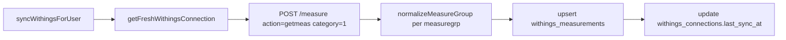

<!-- Generated by SpecStory, Markdown v2.1.0 -->

# 2026-07-01 00:55:51Z

<!-- Cursor IDE Session d0f0d242-41af-4453-b5f0-96092f648d6d (2026-07-01 00:55:51Z) -->

_**User**_

Explore the body-mind-on codebase for Withings integration. Find and summarize:

1. Current withings_measurements DB schema (migrations in supabase/migrations)
2. lib/withingsServer.js - sync flow, how measurements are stored
3. pages/api/withings/latest.js, history.js, sync.js
4. components/profile/WithingsProfileCard.js - current UI
5. Any existing normalizeWithingsMeasures or similar
6. Withings API measure type mappings

Return file paths, key functions, current fields stored, and gaps vs required fields:
weight_kg, fat_percent, fat_mass_kg, muscle_mass_kg, bone_mass_kg, hydration_kg, hydration_percent, bmi, basal_metabolic_rate, visceral_fat, pulse, measured_at, source, raw_payload

Workspace: c:\Users\prikopa\Documents\GitHub\body-mind-on

---

_**Agent (default)**_

<think><details><summary>Thought Process</summary>
Beginning a comprehensive review of the Withings integration across the codebase.
</details></think>

_**Agent (default)**_

Prohledám kódovou základnu a související migrace pro integraci Withings.


_**Agent (default)**_

<tool-use data-tool-type="unknown" data-tool-name="update_current_step"><details>
<summary>Tool use: **update_current_step**</summary>
An unknown error occurred
</details></tool-use>

_**Agent (default)**_

<tool-use data-tool-type="unknown" data-tool-name="ripgrep_raw_search"><details>
<summary>Tool use: **ripgrep_raw_search**</summary>

Parameters:

```json
{
  "caseInsensitive": true,
  "outputMode": "files_with_matches",
  "path": "c:\\Users\\prikopa\\Documents\\GitHub\\body-mind-on",
  "pattern": "withings"
}
```
Additional data:

```json
{
  "isPruned": true,
  "outputMode": "files_with_matches",
  "path": "c:\\Users\\prikopa\\Documents\\GitHub\\body-mind-on",
  "pattern": "withings",
  "topFiles": [
    {
      "matchCount": 1,
      "uri": "lib\\withingsServer.js"
    },
    {
      "matchCount": 1,
      "uri": "package.json"
    },
    {
      "matchCount": 1,
      "uri": "pages\\api\\withings\\sync.js"
    },
    {
      "matchCount": 1,
      "uri": "pages/_app.js"
    },
    {
      "matchCount": 1,
      "uri": ".env.vercel-withings-check"
    },
    {
      "matchCount": 1,
      "uri": "pages\\api\\withings\\callback.js"
    },
    {
      "matchCount": 1,
      "uri": "scripts\\verify-withings-widget-ux.mjs"
    },
    {
      "matchCount": 1,
      "uri": "scripts\\e2e-profile-mobile.mjs"
    },
    {
      "matchCount": 1,
      "uri": "components\\profile\\WithingsProfileCard.js"
    },
    {
      "matchCount": 1,
      "uri": "scripts\\verify-withings-integration.mjs"
    },
    {
      "matchCount": 1,
      "uri": "pages\\api\\withings\\history.js"
    },
    {
      "matchCount": 1,
      "uri": "pages/withings-connect.js"
    },
    {
      "matchCount": 1,
      "uri": "pages\\api\\withings\\connect.js"
    },
    {
      "matchCount": 1,
      "uri": "pages/api/withings/status.js"
    },
    {
      "matchCount": 1,
      "uri": "supabase/migrations/20260630213000_withings_oauth_measurements.sql"
    },
    {
      "matchCount": 1,
      "uri": "docs/WITHINGS_PRODUKCE.md"
    },
    {
      "matchCount": 1,
      "uri": "components/profile/WithingsProfileCard.js"
    },
    {
      "matchCount": 1,
      "uri": "pages/api/withings/auth.js"
    },
    {
      "matchCount": 1,
      "uri": "pages/api/withings/sync.js"
    },
    {
      "matchCount": 1,
      "uri": "pages\\api\\withings\\latest.js"
    }
  ],
  "totalFiles": 27,
  "totalMatches": 27
}
```
Status: **completed**

</details></tool-use>

_**Agent (default)**_

<tool-use data-tool-type="search" data-tool-name="glob_file_search"><details>
<summary>Tool use: **glob_file_search** • Searched codebase "" • **1** result in **1** directory</summary>

Directory: **`c:\Users\prikopa\Documents\GitHub\body-mind-on`** (1 file)

| File |
|------|
| `../supabase/migrations/20260630213000_withings_oauth_measurements.sql` |
</details></tool-use>

_**Agent (default)**_

<tool-use data-tool-type="unknown" data-tool-name="ripgrep_raw_search"><details>
<summary>Tool use: **ripgrep_raw_search**</summary>

Parameters:

```json
{
  "caseInsensitive": true,
  "outputMode": "content",
  "path": "c:\\Users\\prikopa\\Documents\\GitHub\\body-mind-on",
  "pattern": "normalizeWithings|withings.*measure|measure.*type"
}
```
Additional data:

```json
{
  "isPruned": true,
  "outputMode": "content",
  "path": "c:\\Users\\prikopa\\Documents\\GitHub\\body-mind-on",
  "pattern": "normalizeWithings|withings.*measure|measure.*type",
  "topFiles": [
    {
      "matchCount": 1,
      "uri": "components/profile/WithingsProfileCard.js"
    },
    {
      "matchCount": 2,
      "uri": "docs/WITHINGS_PRODUKCE.md"
    },
    {
      "matchCount": 5,
      "uri": "lib\\withingsProfileImport.js"
    },
    {
      "matchCount": 2,
      "uri": "pages\\api\\withings\\latest.js"
    },
    {
      "matchCount": 1,
      "uri": "components\\profile\\WithingsProfileCard.js"
    },
    {
      "matchCount": 18,
      "uri": "lib/withingsServer.js"
    },
    {
      "matchCount": 18,
      "uri": "supabase/migrations/20260630213000_withings_oauth_measurements.sql"
    },
    {
      "matchCount": 2,
      "uri": "pages\\api\\withings\\history.js"
    },
    {
      "matchCount": 18,
      "uri": "lib\\withingsServer.js"
    },
    {
      "matchCount": 2,
      "uri": "pages/api/withings/latest.js"
    }
  ],
  "totalFiles": 10,
  "totalMatches": 69
}
```
Status: **completed**

</details></tool-use>

_**Agent (default)**_

<think><details><summary>Thought Process</summary>
Starting detailed file analysis for the Withings integration.
</details></think>

_**Agent (default)**_

<tool-use data-tool-type="read" data-tool-name="read_file_v2"><details>
<summary>Tool use: **read_file_v2** • Read file: c:\Users\prikopa\Documents\GitHub\body-mind-on\supabase\migrations\20260630213000_withings_oauth_measurements.sql</summary>

</details></tool-use>

_**Agent (default)**_

<tool-use data-tool-type="read" data-tool-name="read_file_v2"><details>
<summary>Tool use: **read_file_v2** • Read file: c:\Users\prikopa\Documents\GitHub\body-mind-on\lib\withingsServer.js</summary>

</details></tool-use>

_**Agent (default)**_

<tool-use data-tool-type="read" data-tool-name="read_file_v2"><details>
<summary>Tool use: **read_file_v2** • Read file: c:\Users\prikopa\Documents\GitHub\body-mind-on\pages\api\withings\latest.js</summary>

</details></tool-use>

_**Agent (default)**_

<tool-use data-tool-type="read" data-tool-name="read_file_v2"><details>
<summary>Tool use: **read_file_v2** • Read file: c:\Users\prikopa\Documents\GitHub\body-mind-on\pages\api\withings\history.js</summary>

</details></tool-use>

_**Agent (default)**_

<tool-use data-tool-type="read" data-tool-name="read_file_v2"><details>
<summary>Tool use: **read_file_v2** • Read file: c:\Users\prikopa\Documents\GitHub\body-mind-on\pages\api\withings\sync.js</summary>

</details></tool-use>

_**Agent (default)**_

<tool-use data-tool-type="read" data-tool-name="read_file_v2"><details>
<summary>Tool use: **read_file_v2** • Read file: c:\Users\prikopa\Documents\GitHub\body-mind-on\components\profile\WithingsProfileCard.js</summary>

</details></tool-use>

_**Agent (default)**_

<tool-use data-tool-type="read" data-tool-name="read_file_v2"><details>
<summary>Tool use: **read_file_v2** • Read file: c:\Users\prikopa\Documents\GitHub\body-mind-on\lib\withingsProfileImport.js</summary>

</details></tool-use>

_**Agent (default)**_

<tool-use data-tool-type="unknown" data-tool-name="ripgrep_raw_search"><details>
<summary>Tool use: **ripgrep_raw_search**</summary>

Parameters:

```json
{
  "caseInsensitive": false,
  "glob": "**/*withings*",
  "path": "c:\\Users\\prikopa\\Documents\\GitHub\\body-mind-on",
  "pattern": "normalizeMeasure|MEASURE_LABELS|measure_type|fat_ratio|hydration_percent|basal_metabolic|visceral|pulse|bmi"
}
```
Additional data:

```json
{
  "isPruned": true,
  "outputMode": "content",
  "path": "c:\\Users\\prikopa\\Documents\\GitHub\\body-mind-on",
  "pattern": "normalizeMeasure|MEASURE_LABELS|measure_type|fat_ratio|hydration_percent|basal_metabolic|visceral|pulse|bmi",
  "topFiles": [
    {
      "matchCount": 4,
      "uri": "supabase/migrations/20260630213000_withings_oauth_measurements.sql"
    },
    {
      "matchCount": 14,
      "uri": "lib/withingsServer.js"
    },
    {
      "matchCount": 2,
      "uri": "components\\profile\\WithingsProfileCard.js"
    },
    {
      "matchCount": 2,
      "uri": "components/profile/WithingsProfileCard.js"
    },
    {
      "matchCount": 4,
      "uri": "lib\\withingsProfileImport.js"
    },
    {
      "matchCount": 1,
      "uri": "scripts\\verify-withings-integration.mjs"
    },
    {
      "matchCount": 14,
      "uri": "lib\\withingsServer.js"
    },
    {
      "matchCount": 2,
      "uri": "scripts\\verify-withings-widget-ux.mjs"
    }
  ],
  "totalFiles": 8,
  "totalMatches": 43
}
```
Status: **completed**

</details></tool-use>

_**Agent (default)**_

<tool-use data-tool-type="read" data-tool-name="read_file_v2"><details>
<summary>Tool use: **read_file_v2** • Read file: c:\Users\prikopa\Documents\GitHub\body-mind-on\docs\WITHINGS_PRODUKCE.md</summary>

</details></tool-use>

_**Agent (default)**_

<tool-use data-tool-type="unknown" data-tool-name="ripgrep_raw_search"><details>
<summary>Tool use: **ripgrep_raw_search**</summary>

Parameters:

```json
{
  "caseInsensitive": false,
  "path": "c:\\Users\\prikopa\\Documents\\GitHub\\body-mind-on",
  "pattern": "withings_measurements|measure_\\d+"
}
```
Additional data:

```json
{
  "isPruned": true,
  "outputMode": "content",
  "path": "c:\\Users\\prikopa\\Documents\\GitHub\\body-mind-on",
  "pattern": "withings_measurements|measure_\\d+",
  "topFiles": [
    {
      "matchCount": 3,
      "uri": "lib/withingsServer.js"
    },
    {
      "matchCount": 3,
      "uri": "lib\\withingsServer.js"
    },
    {
      "matchCount": 13,
      "uri": "supabase/migrations/20260630213000_withings_oauth_measurements.sql"
    },
    {
      "matchCount": 1,
      "uri": "lib\\withingsProfileImport.js"
    },
    {
      "matchCount": 2,
      "uri": "docs/WITHINGS_PRODUKCE.md"
    }
  ],
  "totalFiles": 5,
  "totalMatches": 22
}
```
Status: **completed**

</details></tool-use>

_**Agent (default)**_

<think><details><summary>Thought Process</summary>
Checking the verify script for expected measure types and searching the codebase for Withings API documentation references.

No `normalizeWithingsMeasures` function exists; `normalizeMeasureGroup` is the relevant utility instead. Mapping Withings API measure types to internal fields: type 1 is weight, type 4 is height, type 8 is fat mass weight, type 11 is heart pulse, type 76 is muscle mass, type 77 is hydration, and type 88 is bone mass.
</details></think>

_**Agent (default)**_

<tool-use data-tool-type="read" data-tool-name="read_file_v2"><details>
<summary>Tool use: **read_file_v2** • Read file: c:\Users\prikopa\Documents\GitHub\body-mind-on\scripts\verify-withings-integration.mjs</summary>

</details></tool-use>

_**Agent (default)**_

<tool-use data-tool-type="unknown" data-tool-name="ripgrep_raw_search"><details>
<summary>Tool use: **ripgrep_raw_search**</summary>

Parameters:

```json
{
  "caseInsensitive": false,
  "glob": "**/*withings*",
  "path": "c:\\Users\\prikopa\\Documents\\GitHub\\body-mind-on",
  "pattern": "123|170|226|11:|pulse|visceral|basal|hydration_percent|bmi"
}
```
Additional data:

```json
{
  "isPruned": true,
  "outputMode": "content",
  "path": "c:\\Users\\prikopa\\Documents\\GitHub\\body-mind-on",
  "pattern": "123|170|226|11:|pulse|visceral|basal|hydration_percent|bmi",
  "topFiles": [
    {
      "matchCount": 2,
      "uri": "lib\\withingsServer.js"
    },
    {
      "matchCount": 3,
      "uri": "lib\\withingsProfileImport.js"
    },
    {
      "matchCount": 2,
      "uri": "scripts\\verify-withings-widget-ux.mjs"
    },
    {
      "matchCount": 1,
      "uri": "scripts\\verify-withings-integration.mjs"
    }
  ],
  "totalFiles": 4,
  "totalMatches": 8
}
```
Status: **completed**

</details></tool-use>

_**Agent (default)**_

<think><details><summary>Thought Process</summary>
Enough information has been gathered. A comprehensive summary is being compiled.

The withings_measurements table stores id, user_id, withings_userid, withings_measure_group_id, measure_type, measure_type_label, unit, value, measured_at, category, attrib, raw jsonb, and timestamps. A unique constraint exists on user_id, withings_measure_group_id, and measure_type.

The storage model uses one row per measure type within each measure group, not a wide format with all fields as columns. The sync flow in lib/withingsServer.js starts with `syncWithingsForUser`, which refreshes the Withings access token via `getFreshWithingsConnection`. It then fetches measurement groups using the Withings API `getmeas` endpoint with category=1. Key helpers include `normalizeMeasureGroup` to transform API responses into database rows, `measurementValue` to scale values by their unit exponent, and `getLatestWithingsMeasurements` plus `getWithingsMeasurementHistory` to retrieve recent and historical data.

The incremental sync window is last_sync_at minus 300 seconds, falling back to full history from a startdate. Groups are flattened and normalized into rows, upserted to the table, and the connection last_sync_at timestamp is updated.

API routes include:
- latest.js: GET returning the latest measurements
- history.js: GET with limit and date range filters
- sync.js: GET/POST triggering the full sync and profile import

The WithingsProfileCard component is a floating widget on the /profile page. It displays weight, fat percentage, muscle mass, and measurement time. It provides connect, sync, and history actions.

No `normalizeWithingsMeasures` function exists. The closest equivalents are `normalizeMeasureGroup` in `withingsServer.js`, the `measurementValue` helper, `HISTORY_FIELD_MAP` for history output names, and `calculateBmi` in `withingsProfileImport` which derives BMI from weight and profile height rather than from Withings data.

The `MEASURE_LABELS` mapping in `withingsServer.js` translates Withings API type codes to local field names. Code 1 maps to `weight_kg`, 4 to `height_m`, 5 to `fat_free_mass_kg`, 6 to `fat_ratio_percent`, 8 to `fat_mass_kg`, 76 to `muscle_mass_kg`, 77 to `hydration_kg`, and 88 to `bone_mass_kg`. Any unmapped Withings measure types are stored as `measure_{type}` with a null unit.

Gaps remain against the required fields. `fat_percent` is only partially covered because Withings returns `fat_ratio_percent` and the UI maps it to `fat_percent`. `hydration_percent` is missing entirely; Withings does not expose it as a separate type, and hydration is stored as kilograms. `bmi` is absent from the Withings sync payload and is only computed during profile import, leaving a null placeholder in history.
</details></think>

_**Agent (default)**_

<tool-use data-tool-type="unknown" data-tool-name="update_current_step"><details>
<summary>Tool use: **update_current_step**</summary>
An unknown error occurred
</details></tool-use>

_**Agent (default)**_

# Withings Integration — Codebase Summary

## 1. `withings_measurements` DB schema

**Migration:** `c:\Users\prikopa\Documents\GitHub\body-mind-on\supabase\migrations\20260630213000_withings_oauth_measurements.sql`

Only one Withings migration exists. Related tables in the same file: `withings_oauth_states`, `withings_connections`.

### `withings_measurements` columns

| Column | Type | Notes |
|--------|------|-------|
| `id` | uuid PK | |
| `user_id` | uuid FK → `auth.users` | |
| `withings_userid` | text | |
| `withings_measure_group_id` | text | Withings `grpid` (one weighing session) |
| `measure_type` | integer | Withings API type code |
| `measure_type_label` | text | e.g. `weight_kg`, `fat_ratio_percent` |
| `unit` | text | e.g. `kg`, `%` |
| `value` | numeric | Decoded: `value × 10^unit` |
| `measured_at` | timestamptz | From group `date` / `created` |
| `category` | integer | From measure group |
| `attrib` | integer | From measure group |
| `raw` | jsonb | `{ group: {...}, measure: {...} }` |
| `created_at`, `updated_at` | timestamptz | |

**Unique constraint:** `(user_id, withings_measure_group_id, measure_type)` — one row per metric per weighing session.

**Access:** RLS on; only `service_role` (via server API routes).

**Storage model:** EAV / long format — not one denormalized row per measurement with all body-composition columns.

---

## 2. `lib/withingsServer.js` — sync flow & storage

**File:** `c:\Users\prikopa\Documents\GitHub\body-mind-on\lib\withingsServer.js`

### Key functions

| Function | Role |
|----------|------|
| `syncWithingsForUser(userId, options)` | Main sync entry |
| `getFreshWithingsConnection(userId)` | Load connection; refresh token if expired |
| `normalizeMeasureGroup(group, userId, withingsUserid)` | API group → DB rows |
| `measurementValue(measure)` | `value × 10^unit` |
| `getLatestWithingsMeasurements(userId, limit)` | Latest value per `measure_type_label` |
| `getWithingsMeasurementHistory(userId, options)` | Group rows by session into flat objects |
| `importLatestWithingsToProfile` | Called from sync API (separate file) |

### Sync flow



1. Get/refresh OAuth token.
2. `POST https://wbsapi.withings.net/measure` with `action=getmeas`, `category=1`.
3. Incremental window:
   - `lastupdate` = `last_sync_at − 300s` if not full sync
   - else `startdate` = now − `WITHINGS_INITIAL_SYNC_DAYS` (default 365)
   - or explicit `options.startdate` / `options.full`
4. For each `measuregrps[]` item → `normalizeMeasureGroup` → flat array of rows.
5. `upsert` on conflict `(user_id, withings_measure_group_id, measure_type)`.
6. Update `withings_connections.last_sync_at`.

### What gets stored per measure

```417:451:c:\Users\prikopa\Documents\GitHub\body-mind-on\lib\withingsServer.js
function normalizeMeasureGroup(group, userId, withingsUserid) {
  // ...
  return measures.map((measure) => ({
    user_id, withings_userid, withings_measure_group_id,
    measure_type, measure_type_label, unit, value, measured_at,
    category, attrib,
    raw: { group: {...}, measure },
    updated_at: new Date().toISOString(),
  }));
}
```

---

## 3. API routes

### `pages/api/withings/latest.js`
`c:\Users\prikopa\Documents\GitHub\body-mind-on\pages\api\withings\latest.js`

- **GET**, Bearer auth
- Returns: `configured`, `connected`, `connection` metadata, `rows`, `latest_by_type`, `latest_weight_kg`
- If not connected: empty measurements, `connected: false`

### `pages/api/withings/history.js`
`c:\Users\prikopa\Documents\GitHub\body-mind-on\pages\api\withings\history.js`

- **GET**, Bearer auth, requires OAuth configured
- Query: `limit`, `from`, `to`
- Calls `getWithingsMeasurementHistory` → `{ measurements, count, limit }`

### `pages/api/withings/sync.js`
`c:\Users\prikopa\Documents\GitHub\body-mind-on\pages\api\withings\sync.js`

- **GET/POST**, Bearer auth
- Options: `full`, `startdate` (query or body)
- Runs `syncWithingsForUser` then `importLatestWithingsToProfile` (`lib/withingsProfileImport.js`)
- Returns sync stats + `profile_import` result

---

## 4. `WithingsProfileCard.js` — current UI

**File:** `c:\Users\prikopa\Documents\GitHub\body-mind-on\components\profile\WithingsProfileCard.js`

- Floating widget on `/profil` only
- States: `not_configured` | `not_connected` | `connected`
- **Latest metrics shown:** weight (kg), fat (%), muscle (kg), measured-at timestamp
- Actions: Propojit / Znovu propojit, Sync teď, Historie
- History (`/api/withings/history?limit=30`): date + weight · fat % · muscle kg
- Does **not** show: bone, hydration, fat mass, BMI, pulse, visceral fat, BMR

---

## 5. Normalization helpers (no `normalizeWithingsMeasures`)

There is **no** `normalizeWithingsMeasures`. Closest equivalents:

| Name | Location | Purpose |
|------|----------|---------|
| `normalizeMeasureGroup` | `lib/withingsServer.js` | API → DB rows |
| `measurementValue` | `lib/withingsServer.js` | Decode Withings value/unit |
| `HISTORY_FIELD_MAP` | `lib/withingsServer.js` | Label → history field name |
| `roundHistoryNumber` | `lib/withingsServer.js` | 1 decimal for history |
| `calculateBmi` | `lib/withingsProfileImport.js` | BMI from weight + profile `height_cm` (not from Withings) |

---

## 6. Withings API measure type mappings

Defined in `MEASURE_LABELS` / `MEASURE_UNITS` in `lib/withingsServer.js`:

| Withings `type` | Label stored | Unit |
|-----------------|--------------|------|
| 1 | `weight_kg` | kg |
| 4 | `height_m` | m |
| 5 | `fat_free_mass_kg` | kg |
| 6 | `fat_ratio_percent` | % |
| 8 | `fat_mass_kg` | kg |
| 76 | `muscle_mass_kg` | kg |
| 77 | `hydration_kg` | kg |
| 88 | `bone_mass_kg` | kg |

**Unmapped types** are stored as `measure_{type}` with `unit: null` (still upserted if value decodes).

**Not mapped** (common Withings types, per Withings API docs — not in codebase):

| Type | Typical metric |
|------|----------------|
| 11 | Heart rate / pulse (bpm) |
| 123 | Visceral fat |
| 170 | Visceral fat index |
| 226 | Basal metabolic rate |
| (varies) | Hydration % — often not a separate type; hydration usually in kg (type 77) |

`HISTORY_FIELD_MAP` renames only stored labels for history output:

```533:541:c:\Users\prikopa\Documents\GitHub\body-mind-on\lib\withingsServer.js
const HISTORY_FIELD_MAP = {
  weight_kg: 'weight_kg',
  fat_ratio_percent: 'fat_percent',
  fat_mass_kg: 'fat_mass_kg',
  muscle_mass_kg: 'muscle_mass_kg',
  bone_mass_kg: 'bone_mass_kg',
  hydration_kg: 'hydration_kg',
  height_m: 'height_m',
};
```

History template also defines `bmi: null`, `pulse: null`, `source: 'withings'` — but nothing fills BMI/pulse from synced data.

---

## 7. Gaps vs required fields

| Required field | Current status |
|----------------|----------------|
| `weight_kg` | **Present** — type 1, synced, UI + profile import |
| `fat_percent` | **Partial** — stored as `fat_ratio_percent`; history/UI use `fat_percent` alias |
| `fat_mass_kg` | **Synced** — type 8; not in UI; in history if present |
| `muscle_mass_kg` | **Present** — type 76; UI + history |
| `bone_mass_kg` | **Synced** — type 88; history only, not UI |
| `hydration_kg` | **Synced** — type 77; history only, not UI |
| `hydration_percent` | **Missing** — no type mapping, no column/field |
| `bmi` | **Missing from Withings** — only computed in `withingsProfileImport` from weight + profile height; history always `null` |
| `basal_metabolic_rate` | **Missing** — type 226 not mapped |
| `visceral_fat` | **Missing** — types 123/170 not mapped |
| `pulse` | **Missing** — type 11 not mapped; history placeholder always `null` |
| `measured_at` | **Present** — per row; grouped in history |
| `source` | **Partial** — hardcoded `'withings'` in history API only; not a DB column |
| `raw_payload` | **Partial** — per-row `raw` jsonb (`group` + `measure`); not named `raw_payload`, not one payload per session |

### Architectural gaps

1. **Schema shape:** Required fields imply a **wide snapshot per measurement**; DB is **narrow (one row per metric)**.
2. **Naming inconsistency:** `fat_ratio_percent` (DB) vs `fat_percent` (history/UI target).
3. **Incomplete type coverage:** Pulse, visceral fat, BMR not in `MEASURE_LABELS`.
4. **UI/API surface:** Latest endpoint returns `latest_by_type` keys like `fat_ratio_percent`, not a unified body-composition object with all required fields.
5. **Profile import** (`lib/withingsProfileImport.js`): only imports **weight** (+ computed BMI) into `body_metrics`; ignores other Withings metrics.
6. **Sync category:** `category: 1` only — may exclude some non-scale measures depending on Withings API behavior.

### Related files (not in your list)

| Path | Role |
|------|------|
| `c:\Users\prikopa\Documents\GitHub\body-mind-on\lib\withingsProfileImport.js` | Weight → `body_metrics` + user metadata |
| `c:\Users\prikopa\Documents\GitHub\body-mind-on\lib\withingsConnectHandler.js` | OAuth connect helper |
| `c:\Users\prikopa\Documents\GitHub\body-mind-on\pages\api\withings\callback.js` | OAuth callback |
| `c:\Users\prikopa\Documents\GitHub\body-mind-on\pages\api\withings\connect.js` | Start OAuth |
| `c:\Users\prikopa\Documents\GitHub\body-mind-on\pages\api\withings\status.js` | Connection status |
| `c:\Users\prikopa\Documents\GitHub\body-mind-on\docs\WITHINGS_PRODUKCE.md` | Production setup docs |
