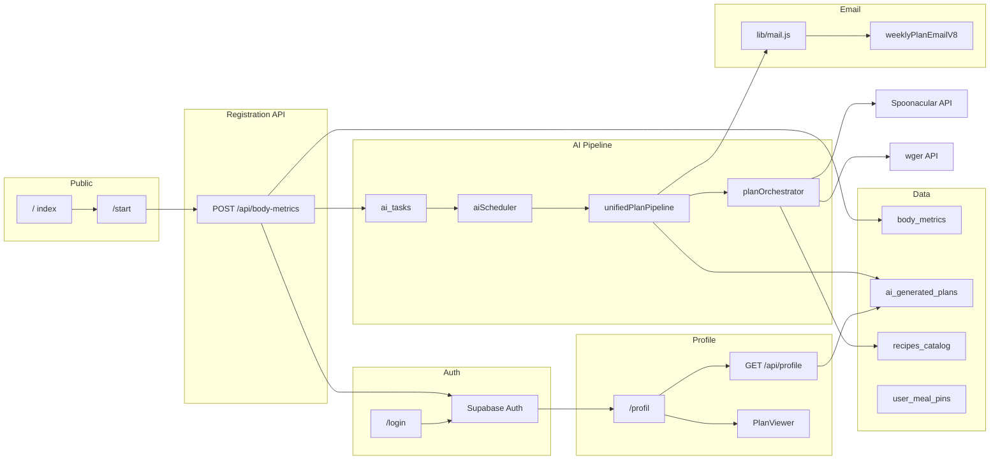

<!-- Generated by SpecStory, Markdown v2.1.0 -->

# 2026-07-07 17:28:23Z

<!-- Cursor IDE Session 01cae14b-8374-41a7-a81d-e930b232547f (2026-07-07 17:28:23Z) -->

_**User**_

Explore the body-mind-on repo at c:\Users\prikopa\Documents\GitHub\body-mind-on for a production system audit. Return a structured map of core modules with:
- module name
- purpose (1 line)
- key source files (top 3-8 paths)
- routes/API endpoints
- data source (Supabase tables, external APIs)
- criticality (P0/P1/P2/P3)
- suggested confidence level based on code structure and existing verify scripts

Focus on these modules:
landing/public, registration, login/auth, body metrics API, profile dashboard, structured plan source, meal rendering, recipe modal, meal swap, pin next week, workout rendering, exercise modal, email v8, legal pages, security headers, Withings, AI generation, agents/prompts, logs/monitoring/fallbacks

Also list all verify:* scripts in package.json and what each covers briefly.

Do NOT modify any files. Read-only exploration.

---

_**Agent (composer-2.5-fast)**_

Mapping the repo for a production audit: I'll scan structure, package.json verify scripts, and the core modules you listed.


_**Agent (composer-2.5-fast)**_

<tool-use data-tool-type="unknown" data-tool-name="update_current_step"><details>
<summary>Tool use: **update_current_step**</summary>
An unknown error occurred
</details></tool-use>

_**Agent (composer-2.5-fast)**_

<tool-use data-tool-type="read" data-tool-name="read_file_v2"><details>
<summary>Tool use: **read_file_v2** • Read file: c:\Users\prikopa\Documents\GitHub\body-mind-on\package.json</summary>

</details></tool-use>

_**Agent (composer-2.5-fast)**_

<tool-use data-tool-type="search" data-tool-name="glob_file_search"><details>
<summary>Tool use: **glob_file_search** • Searched codebase "" • **90** results in **1** directory</summary>

Directory: **`c:\Users\prikopa\Documents\GitHub\body-mind-on\pages`** (90 files)

| File |
|------|
| `../pages/api/admin/backfill-exercise-name-cs.js` |
| `../pages/index.js` |
| `../pages/api/ai/run-coach-scheduler.js` |
| `../pages/api/withings/callback.js` |
| `../pages/komunita.js` |
| `../pages/profil.js` |
| `../pages/club.js` |
| `../pages/api/profile.js` |
| `../pages/api/delete-account.js` |
| `../pages/api/recipe.js` |
| `../pages/api/run-migration.js` |
| `../pages/api/community/reply.js` |
| `../pages/api/onboarding/replace-workout.js` |
| `../pages/api/calendar/create.js` |
| `../pages/api/withings/status.js` |
| `../pages/api/trainer/clients.js` |
| `../pages/onboarding.js` |
| `../pages/withings-connect.js` |
| `../pages\api\body-metrics.js` |
| `../pages/_document.js` |
| `../pages/register.js` |
| `../pages/api/generate-plan-next-week.js` |
| `../pages/api/profile-body-data.js` |
| `../pages/api/meal-pins.js` |
| `../pages/api/retry-initial-plan.js` |
| `../pages/api/send-plan-again.js` |
| `../pages/api/community/categories.js` |
| `../pages/api/withings/connect.js` |
| `../pages/api/auth/google-calendar/callback.js` |
| `../pages\api\profile.js` |
| `../pages/api/habits.js` |
| `../pages/login.js` |
| `../pages/start.js` |
| `../pages/api/body-metrics.js` |
| `../pages/api/community/index.js` |
| `../pages/api/onboarding/generate-plan.js` |
| `../pages/api/profile-settings.js` |
| `../pages/api/onboarding/replace-meal.js` |
| `../pages/api/community/topic/[id].js` |
| `../pages/api/integrations-status.js` |
| `../pages/api/cron/withings-sync.js` |
| `../pages/api/withings/disconnect.js` |
| `../pages/api/admin/agents.js` |
| `../pages/api/admin/regenerate-user-plan.js` |
| `../pages/api/profile/preferences.js` |
| `../pages/api/exercise-media.js` |
| `../pages/api/plan-enrichment.js` |
| `../pages/api/verify-media-apis.js` |
| `../pages/api/withings/sync.js` |
| `../pages/api/spoonacular-recipe.js` |
| `../pages/komunita/tema/[id].js` |
| `../pages/api/withings/history.js` |
| `../pages/api/profile-preferences.js` |
| `../pages/obchodni-podminky.js` |
| `../pages/training.js` |
| `../pages/gdpr.js` |
| `../pages/api/admin/send-test-plan-email.js` |
| `../pages/api/cron/daily-digest.js` |
| `../pages/api/user-habits.js` |
| `../pages/vip.js` |
| `../pages/on-club.js` |
| `../pages/signup.js` |
| `../pages/api/generate-plan.js` |
| `../pages/api/plan-replace-meal.js` |
| `../pages/api/quick-weight.js` |
| `../pages/api/ai/route.js` |
| `../pages/api/withings/latest.js` |
| `../pages/api/webhooks/stripe.js` |
| `../pages/api/trainer-schedule.js` |
| `../pages/api/recipe-from-catalog.js` |
| `../pages/api/sessions.js` |
| `../pages/api/withings/auth.js` |
| `../pages/api/admin/backfill-plan-html-from-structured.js` |
| `../pages/api/my-metrics.js` |
| `../pages/chci-vip.js` |
| `../pages\profil.js` |
| `../pages/trener.js` |
| `../pages/api/verify-exercise-registry.js` |
| `../pages/pricing.js` |
| `../pages/api/debug/latest-plan-status.js` |
| `../pages/api/workouts.js` |
| `../pages/api/assistant-intake.js` |
| `../pages/plan/[id].js` |
| `../pages\api\quick-weight.js` |
| `../pages/api/send-shopping-list.js` |
| `../pages/api/auth/google-calendar/connect.js` |
| `../pages/_app.js` |
| `../pages/admin.js` |
| `../pages/api/ai/run-scheduler.js` |
| `../pages/dashboard.js` |
</details></tool-use>

_**Agent (composer-2.5-fast)**_

<tool-use data-tool-type="search" data-tool-name="glob_file_search"><details>
<summary>Tool use: **glob_file_search** • Searched codebase "" • **173** results in **1** directory</summary>

Directory: **`c:\Users\prikopa\Documents\GitHub\body-mind-on\lib`** (173 files)

| File |
|------|
| `../lib/reconcileUserDataByEmail.js` |
| `../lib/shoppingListBuilder.js` |
| `../lib/workoutPlanScaler.js` |
| `../lib/services/planOrchestrator.js` |
| `../lib/planGenerationGate.js` |
| `../lib/preferenceConstants.js` |
| `../lib/withings/normalizeWithingsMeasures.js` |
| `../lib/generatePlan.js` |
| `../lib/templates/bmon_weekly_plan_email_v7.html` |
| `../lib/planRenderer.js` |
| `../lib/siteUrls.js` |
| `../lib/coachFallbackMessage.js` |
| `../lib/mealNormalization.js` |
| `../lib/authHelpers.js` |
| `../lib/trainingEnvironment.js` |
| `../lib/czechCalendar.js` |
| `../lib/exerciseEnrichment.js` |
| `../lib/withingsServer.js` |
| `../lib/services/planMemoryCompact.js` |
| `../lib/services/planOrchestrator_newFormat.js` |
| `../lib/withings/withingsRecommendations.js` |
| `../lib/templates/v4_content/coach_voice_cs.json` |
| `../lib/aiScheduler.js` |
| `../lib/nutrition/portionScaling.js` |
| `../lib/plan/structuredWeekSource.js` |
| `../lib/createAITasksFromDecisions.js` |
| `../lib/validation/parseStructuredPlan.js` |
| `../lib/_archive/weeklyPlanEmailV6_pre_v7.js` |
| `../lib/pricing.ts` |
| `../lib/planDayHeadingFormat.js` |
| `../lib/rateLimit.js` |
| `../lib/safeLog.js` |
| `../lib/agentRouter.js` |
| `../lib/getAgentConfig.js` |
| `../lib/utils/czechDateWords.js` |
| `../lib/simpleStartMealReplacement.js` |
| `../lib/withingsProfileImport.js` |
| `../lib/loadAgentDocumentsContext.js` |
| `../lib/mealQueryShorten.js` |
| `../lib/spoonacularClient.js` |
| `../lib/weeklyPlanEmailV8.js` |
| `../lib/_archive/weeklyPlanEmailV5_pre_fixes.js` |
| `../lib/weeklyPlanEmailV4.js` |
| `../lib/planHtmlStructuredBackfill.js` |
| `../lib/mail.js` |
| `../lib/spoonacularShopping.js` |
| `../lib/aiTaskRegistry.js` |
| `../lib/dietaryExclusions.js` |
| `../lib/analyzeUserProgress.js` |
| `../lib/ingredientNamesCs.js` |
| `../lib/recipeSimplicityScore.js` |
| `../lib/weeklyPlanEmailV7.js` |
| `../lib/createInitialAITasks.js` |
| `../lib/aiRuntimeCapabilities.js` |
| `../lib/exerciseMediaHelpers.js` |
| `../lib/database.types.ts` |
| `../lib/withings/withingsPlanAdjustment.js` |
| `../lib/aiOps.js` |
| `../lib/bodyMetricsBirthDate.js` |
| `../lib/ensureInitialPlanTask.js` |
| `../lib/planSelection.js` |
| `../lib/aiSharedMemory.js` |
| `../lib/habits.js` |
| `../lib/recipeTitleTranslator.js` |
| `../lib/supabaseServer.js` |
| `../lib/mealOrder.js` |
| `../lib/unifiedPlanPipeline.js` |
| `../lib/bodyMetricsToPlanInput.js` |
| `../lib/templates/bmon_weekly_plan_email_v9.html` |
| `../lib/withings/withingsTrends.js` |
| `../lib/services/deterministicFallback.js` |
| `../lib/mealEnrichment.js` |
| `../lib/planGenerationUiCopy.js` |
| `../lib/progress.js` |
| `../lib/templates/_archive/bmon_weekly_plan_email_v6_pre_v7.html` |
| `../lib/weeklyPlanEmailV6.js` |
| `../lib/googleCalendar.js` |
| `../lib/mealStaticRecipeIds.js` |
| `../lib\bodyMetricsBirthDate.js` |
| `../lib/services/wgerService.js` |
| `../lib/enrichPlanContent.js` |
| `../lib/planLabels.js` |
| `../lib/macroKcalConsistency.js` |
| `../lib/exerciseRegistryMedia.js` |
| `../lib/templates/bmon_weekly_plan_email_v6.html` |
| `../lib/compactPlanPrompt.js` |
| `../lib/templates/bmon_weekly_plan_email_v2.html` |
| `../lib/parsePlanHtml.js` |
| `../lib/aiEvents.js` |
| `../lib/withings/aggregateWithingsMeasurements.js` |
| `../lib/progressModel.js` |
| `../lib/recipesCatalog.js` |
| `../lib/nutritionTargets.js` |
| `../lib/recipeLocalization.js` |
| `../lib/runAIDecisionEngine.js` |
| `../lib/validation/onboardingSchema.js` |
| `../lib/aiOrchestrator.js` |
| `../lib/spoonacularQuotaGate.js` |
| `../lib/templates/v5_content/coach_voice_v5_cs.json` |
| `../lib/planExerciseNameCsBackfill.js` |
| `../lib/withingsConnectHandler.js` |
| `../lib/openaiPlanConfig.js` |
| `../lib/services/planMemoryContext.js` |
| `../lib/mealRecipeLink.js` |
| `../lib/emailV8Palette.js` |
| `../lib/runAgent.js` |
| `../lib/supabaseUserClient.js` |
| `../lib/wgerApiConstants.js` |
| `../lib/czechShoppingIntro.js` |
| `../lib/generateAITasks.js` |
| `../lib/planMealReplace.js` |
| `../lib/recipeDetailFromCatalog.js` |
| `../lib/aiDecisionEngine.js` |
| `../lib/validatePlanHtml.js` |
| `../lib/wgerClient.js` |
| `../lib/weeklyPlanEmailV5.js` |
| `../lib/emailTemplates.js` |
| `../lib/services/planOrchestratorResolve.js` |
| `../lib/services/simpleMealPlannerAgent.js` |
| `../lib/mealDisplayModel.js` |
| `../lib/mealDisplayNameHelpers.js` |
| `../lib/membershipHelpers.js` |
| `../lib/planPdf.js` |
| `../lib/exerciseCanonicalMap.js` |
| `../lib/weeklyPlanEmailV2.js` |
| `../lib/buildAgentContext.js` |
| `../lib/mealNutritionDisplay.js` |
| `../lib/templates/bmon_weekly_plan_email_v5.html` |
| `../lib/aiTaskExecutors.js` |
| `../lib/dailyDigest.js` |
| `../lib/mealRecipeDisplay.js` |
| `../lib/planValidators.js` |
| `../lib/email/emailDesignTokens.js` |
| `../lib/templates/_archive/bmon_weekly_plan_email_v2_backup.html` |
| `../lib/templates/bmon_weekly_plan_email_v8.html` |
| `../lib/profileApi.js` |
| `../lib/registrationRules.js` |
| `../lib/withings/buildWithingsCoachContext.js` |
| `../lib/macroRatioDisplay.js` |
| `../lib/profileWeekRange.js` |
| `../lib/startSimpleMealFilter.js` |
| `../lib/supabaseClient.js` |
| `../lib/aiInstructionBlocks.js` |
| `../lib/planOutputMode.js` |
| `../lib/spoonacularHttp.js` |
| `../lib/_archive/weeklyPlanEmailV2_backup.js` |
| `../lib/taskExecutors.js` |
| `../lib/designTokens.js` |
| `../lib/_archive/weeklyPlanEmailV4_pre_v5.js` |
| `../lib/assistantInstructions.js` |
| `../lib/services/priorPlanWorkouts.js` |
| `../lib/agentPromptsForSync.js` |
| `../lib/macroBadgeStyles.js` |
| `../lib/services/exerciseProviderRegistry.js` |
| `../lib/spoonacularComplexSearch.js` |
| `../lib/templates/bmon_weekly_plan_email_v4.html` |
| `../lib/templates/_archive/bmon_weekly_plan_email_v5_pre_fixes.html` |
| `../lib/simpleStartRecipeLibrary.js` |
| `../lib/openai.js` |
| `../lib/validation/mealTrainingCoherence.js` |
| `../lib/recipeDetailUrl.js` |
| `../lib/validation/structuredPlanValidators.js` |
| `../lib/openaiModels.js` |
| `../lib/onboardingMetrics.js` |
| `../lib/recipeDetailHtml.js` |
| `../lib/exerciseInstructions.js` |
| `../lib/macroNutrition.js` |
| `../lib/planDataIntegrity.js` |
| `../lib/utils/czechVocative.js` |
| `../lib/templates/_archive/bmon_weekly_plan_email_v4_pre_v5.html` |
| `../lib/mealPortionIngredients.js` |
| `../lib/validatePlanTruth.js` |
| `../lib/services/planEnhancementAsync.js` |
</details></tool-use>

_**Agent (composer-2.5-fast)**_

<tool-use data-tool-type="unknown" data-tool-name="ripgrep_raw_search"><details>
<summary>Tool use: **ripgrep_raw_search**</summary>

Parameters:

```json
{
  "caseInsensitive": false,
  "path": "c:\\Users\\prikopa\\Documents\\GitHub\\body-mind-on",
  "pattern": "verify:"
}
```
Additional data:

```json
{
  "isPruned": true,
  "outputMode": "content",
  "path": "c:\\Users\\prikopa\\Documents\\GitHub\\body-mind-on",
  "pattern": "verify:",
  "topFiles": [
    {
      "matchCount": 2,
      "uri": "scripts/verify-profile-layout-focus.mjs"
    },
    {
      "matchCount": 1,
      "uri": "scripts\\verify-birthdate-persistence.mjs"
    },
    {
      "matchCount": 1,
      "uri": "scripts/verify-profile-macro-chart.mjs"
    },
    {
      "matchCount": 11,
      "uri": "scripts/e2e-profile-mobile.mjs"
    },
    {
      "matchCount": 1,
      "uri": "scripts/test-p0-preview-smoke.mjs"
    },
    {
      "matchCount": 1,
      "uri": "scripts/verify-footer-legal-links.mjs"
    },
    {
      "matchCount": 2,
      "uri": "scripts/verify-withings-widget-ux.mjs"
    },
    {
      "matchCount": 3,
      "uri": "scripts/verify-ui-visual-system.mjs"
    },
    {
      "matchCount": 1,
      "uri": "scripts\\verify-profile-weekly-days-modern-ui.mjs"
    },
    {
      "matchCount": 1,
      "uri": "scripts\\verify-profile-today-ux.mjs"
    },
    {
      "matchCount": 1,
      "uri": "scripts/verify-email-visual-consistency.mjs"
    },
    {
      "matchCount": 1,
      "uri": "scripts/verify-profile-real-user-bugfixes.mjs"
    },
    {
      "matchCount": 36,
      "uri": "package.json"
    },
    {
      "matchCount": 2,
      "uri": "scripts/verify-withings-integration.mjs"
    },
    {
      "matchCount": 1,
      "uri": "scripts\\verify-security-headers.mjs"
    },
    {
      "matchCount": 1,
      "uri": "scripts/verify-profile-today-ux.mjs"
    }
  ],
  "totalFiles": 16,
  "totalMatches": 66
}
```
Status: **completed**

</details></tool-use>

_**Agent (composer-2.5-fast)**_

<tool-use data-tool-type="search" data-tool-name="glob_file_search"><details>
<summary>Tool use: **glob_file_search** • Searched codebase "" • **43** results in **1** directory</summary>

Directory: **`c:\Users\prikopa\Documents\GitHub\body-mind-on`** (43 files)

| File |
|------|
| `../scripts/verify-simple-recipe-detail-hardening.mjs` |
| `../scripts/verify-simple-meals.mjs` |
| `../scripts/verify-profile-weight-consistency.mjs` |
| `../scripts/verify-simple-start-meals.mjs` |
| `../scripts/verify-workout-exercise-copy.mjs` |
| `../scripts\verify-birthdate-persistence.mjs` |
| `../scripts/verify-dietary-exclusions.mjs` |
| `../scripts/verify-profile-today-ux.mjs` |
| `../scripts/verify-start-meal-variability.mjs` |
| `../scripts/verify-program-variants-section.mjs` |
| `../scripts/verify-ai-instruction-standards.mjs` |
| `../scripts/verify-email-cta-profile-access.mjs` |
| `../scripts/verify-migration-v2.mjs` |
| `../scripts/verify-migration.mjs` |
| `../scripts/verify-run-coach-scheduler.mjs` |
| `../scripts/verify-email-and-recipe-content.mjs` |
| `../scripts/verify-withings-widget-ux.mjs` |
| `../scripts/verify-profile-real-user-bugfixes.mjs` |
| `../scripts\verify-profile-weekly-days-modern-ui.mjs` |
| `../scripts/verify-profile-layout-focus.mjs` |
| `../scripts/verify-ui-visual-system.mjs` |
| `../scripts/verify-exercise-registry.mjs` |
| `../scripts/verify-training-environment-strictness.mjs` |
| `../scripts/verify-coach-fallback.mjs` |
| `../scripts/verify-product-consistency.mjs` |
| `../scripts/verify-recipe-from-catalog.mjs` |
| `../scripts/verify-meal-replacement-actions.mjs` |
| `../scripts/verify-start-calorie-consistency.mjs` |
| `../scripts/verify-agent-simple-meal-planner.mjs` |
| `../scripts/verify-profile-no-sales-upsell.mjs` |
| `../scripts\verify-security-headers.mjs` |
| `../scripts/verify-start-meals-library-only.mjs` |
| `../scripts/verify-exercise-assets.mjs` |
| `../scripts/verify-registration-email-visual-consistency.mjs` |
| `../scripts/verify-profile-macro-chart.mjs` |
| `../scripts/verify-plan-meals-against-catalog.mjs` |
| `../scripts\verify-profile-today-ux.mjs` |
| `../scripts/verify-email-visual-consistency.mjs` |
| `../scripts/verify-weekly-structured-source.mjs` |
| `../scripts/verify-t8-t9-dev.mjs` |
| `../scripts/verify-footer-legal-links.mjs` |
| `../scripts/verify-macro-kcal-consistency.mjs` |
| `../scripts/verify-withings-integration.mjs` |
</details></tool-use>

_**Agent (composer-2.5-fast)**_

<tool-use data-tool-type="unknown" data-tool-name="ripgrep_raw_search"><details>
<summary>Tool use: **ripgrep_raw_search**</summary>

Parameters:

```json
{
  "caseInsensitive": false,
  "glob": "pages/api/**/*.js",
  "outputMode": "files_with_matches",
  "pattern": "^(export default|module\\.exports|function handler|async function handler)"
}
```
Additional data:

```json
{
  "isPruned": true,
  "outputMode": "files_with_matches",
  "pattern": "^(export default|module\\.exports|function handler|async function handler)",
  "topFiles": [
    {
      "matchCount": 1,
      "uri": "pages/api/trainer-schedule.js"
    },
    {
      "matchCount": 1,
      "uri": "pages/api/habits.js"
    },
    {
      "matchCount": 1,
      "uri": "pages/api/integrations-status.js"
    },
    {
      "matchCount": 1,
      "uri": "pages/api/admin/backfill-plan-html-from-structured.js"
    },
    {
      "matchCount": 1,
      "uri": "pages/api/spoonacular-recipe.js"
    },
    {
      "matchCount": 1,
      "uri": "pages/api/exercise-media.js"
    },
    {
      "matchCount": 1,
      "uri": "pages/api/workouts.js"
    },
    {
      "matchCount": 1,
      "uri": "pages/api/admin/regenerate-user-plan.js"
    },
    {
      "matchCount": 1,
      "uri": "pages/api/delete-account.js"
    },
    {
      "matchCount": 1,
      "uri": "pages/api/auth/google-calendar/connect.js"
    },
    {
      "matchCount": 1,
      "uri": "pages/api/meal-pins.js"
    },
    {
      "matchCount": 1,
      "uri": "pages/api/onboarding/generate-plan.js"
    },
    {
      "matchCount": 1,
      "uri": "pages/api/plan-enrichment.js"
    },
    {
      "matchCount": 1,
      "uri": "pages/api/cron/withings-sync.js"
    },
    {
      "matchCount": 1,
      "uri": "pages/api/quick-weight.js"
    },
    {
      "matchCount": 1,
      "uri": "pages/api/community/reply.js"
    },
    {
      "matchCount": 1,
      "uri": "pages/api/withings/callback.js"
    },
    {
      "matchCount": 1,
      "uri": "pages/api/calendar/create.js"
    },
    {
      "matchCount": 1,
      "uri": "pages/api/profile-preferences.js"
    },
    {
      "matchCount": 1,
      "uri": "pages/api/user-habits.js"
    }
  ],
  "totalFiles": 64,
  "totalMatches": 64
}
```
Status: **completed**

</details></tool-use>

_**Agent (composer-2.5-fast)**_

<tool-use data-tool-type="read" data-tool-name="read_file_v2"><details>
<summary>Tool use: **read_file_v2** • Read file: c:\Users\prikopa\Documents\GitHub\body-mind-on\next.config.js</summary>

</details></tool-use>

_**Agent (composer-2.5-fast)**_

<tool-use data-tool-type="unknown" data-tool-name="ripgrep_raw_search"><details>
<summary>Tool use: **ripgrep_raw_search**</summary>

Parameters:

```json
{
  "caseInsensitive": false,
  "glob": "lib/**/*.js",
  "pattern": "from\\(['\\\"]|\\.from\\(['\\\"]"
}
```
Additional data:

```json
{
  "isPruned": true,
  "outputMode": "content",
  "pattern": "from\\(['\\\"]|\\.from\\(['\\\"]",
  "topFiles": [
    {
      "matchCount": 1,
      "uri": "lib/loadAgentDocumentsContext.js"
    },
    {
      "matchCount": 6,
      "uri": "lib/aiOps.js"
    },
    {
      "matchCount": 1,
      "uri": "lib/runAIDecisionEngine.js"
    },
    {
      "matchCount": 2,
      "uri": "lib/services/priorPlanWorkouts.js"
    },
    {
      "matchCount": 2,
      "uri": "lib/exerciseEnrichment.js"
    },
    {
      "matchCount": 2,
      "uri": "lib/recipeDetailFromCatalog.js"
    },
    {
      "matchCount": 3,
      "uri": "lib/withingsProfileImport.js"
    },
    {
      "matchCount": 2,
      "uri": "lib/generateAITasks.js"
    },
    {
      "matchCount": 2,
      "uri": "lib/planHtmlStructuredBackfill.js"
    },
    {
      "matchCount": 1,
      "uri": "lib/aiTaskRegistry.js"
    },
    {
      "matchCount": 4,
      "uri": "lib/aiSharedMemory.js"
    },
    {
      "matchCount": 1,
      "uri": "lib/ensureInitialPlanTask.js"
    },
    {
      "matchCount": 2,
      "uri": "lib/planGenerationGate.js"
    },
    {
      "matchCount": 2,
      "uri": "lib/createInitialAITasks.js"
    },
    {
      "matchCount": 1,
      "uri": "lib/getAgentConfig.js"
    },
    {
      "matchCount": 1,
      "uri": "lib/services/planOrchestrator.js"
    },
    {
      "matchCount": 2,
      "uri": "lib/recipesCatalog.js"
    },
    {
      "matchCount": 1,
      "uri": "lib/services/planOrchestratorResolve.js"
    },
    {
      "matchCount": 17,
      "uri": "lib/aiScheduler.js"
    },
    {
      "matchCount": 7,
      "uri": "lib/planExerciseNameCsBackfill.js"
    }
  ],
  "totalFiles": 26,
  "totalMatches": 140
}
```
Status: **completed**

</details></tool-use>

_**Agent (composer-2.5-fast)**_

<tool-use data-tool-type="search" data-tool-name="glob_file_search"><details>
<summary>Tool use: **glob_file_search** • Searched codebase "" • **30** results in **1** directory</summary>

Directory: **`c:\Users\prikopa\Documents\GitHub\body-mind-on`** (30 files)

| File |
|------|
| `../components/ProgramVariantsSection.js` |
| `../components/profile/WorkoutDaySelector.jsx` |
| `../components/TrialExpiredPaywall.js` |
| `../components/profile/PreferencesOverlay.jsx` |
| `../components/ProfileContinuationUpsell.js` |
| `../components/Footer.js` |
| `../components/Header.js` |
| `../components/profile/WithingsBodyDevelopmentSection.js` |
| `../components/HabitEntryWizard.js` |
| `../components/PricingTable.js` |
| `../components/ProgramContinuationPanel.js` |
| `../components\profile\ProfileTodayPanels.js` |
| `../components/PlanWebView.js` |
| `../components/VipTour.js` |
| `../components/WelcomeTour.js` |
| `../components/profile/HabitChipGrid.jsx` |
| `../components/profile/WorkoutOverlay.jsx` |
| `../components/PlanViewer.js` |
| `../components/OnClubTour.js` |
| `../components/profile/WithingsProfileCard.js` |
| `../components/Toast.js` |
| `../components/MacroRatioChart.js` |
| `../components/profile/ProfileTodayPanels.js` |
| `../components/BodyFigure.js` |
| `../components\PlanViewer.js` |
| `../components/HabitTracker.js` |
| `../components/ProgramForm.js` |
| `../components/profile/FullscreenOverlay.jsx` |
| `../components/HabitSelection.js` |
| `../components\profile\ProfileDayMealsPanel.js` |
</details></tool-use>

_**Agent (composer-2.5-fast)**_

<tool-use data-tool-type="read" data-tool-name="read_file_v2"><details>
<summary>Tool use: **read_file_v2** • Read file: c:\Users\prikopa\Documents\GitHub\body-mind-on\pages\index.js</summary>

</details></tool-use>

_**Agent (composer-2.5-fast)**_

<tool-use data-tool-type="read" data-tool-name="read_file_v2"><details>
<summary>Tool use: **read_file_v2** • Read file: c:\Users\prikopa\Documents\GitHub\body-mind-on\pages\register.js</summary>

</details></tool-use>

_**Agent (composer-2.5-fast)**_

<tool-use data-tool-type="read" data-tool-name="read_file_v2"><details>
<summary>Tool use: **read_file_v2** • Read file: c:\Users\prikopa\Documents\GitHub\body-mind-on\pages\login.js</summary>

</details></tool-use>

_**Agent (composer-2.5-fast)**_

<tool-use data-tool-type="read" data-tool-name="read_file_v2"><details>
<summary>Tool use: **read_file_v2** • Read file: c:\Users\prikopa\Documents\GitHub\body-mind-on\lib\authHelpers.js</summary>

</details></tool-use>

_**Agent (composer-2.5-fast)**_

<tool-use data-tool-type="read" data-tool-name="read_file_v2"><details>
<summary>Tool use: **read_file_v2** • Read file: c:\Users\prikopa\Documents\GitHub\body-mind-on\pages\profil.js</summary>

</details></tool-use>

_**Agent (composer-2.5-fast)**_

<tool-use data-tool-type="read" data-tool-name="read_file_v2"><details>
<summary>Tool use: **read_file_v2** • Read file: c:\Users\prikopa\Documents\GitHub\body-mind-on\lib\plan\structuredWeekSource.js</summary>

</details></tool-use>

_**Agent (composer-2.5-fast)**_

<tool-use data-tool-type="read" data-tool-name="read_file_v2"><details>
<summary>Tool use: **read_file_v2** • Read file: c:\Users\prikopa\Documents\GitHub\body-mind-on\lib\weeklyPlanEmailV8.js</summary>

</details></tool-use>

_**Agent (composer-2.5-fast)**_

<tool-use data-tool-type="read" data-tool-name="read_file_v2"><details>
<summary>Tool use: **read_file_v2** • Read file: c:\Users\prikopa\Documents\GitHub\body-mind-on\scripts\smoke-test-critical-path.mjs</summary>

</details></tool-use>

_**Agent (composer-2.5-fast)**_

<tool-use data-tool-type="read" data-tool-name="read_file_v2"><details>
<summary>Tool use: **read_file_v2** • Read file: c:\Users\prikopa\Documents\GitHub\body-mind-on\pages\api\body-metrics.js</summary>

</details></tool-use>

_**Agent (composer-2.5-fast)**_

<tool-use data-tool-type="read" data-tool-name="read_file_v2"><details>
<summary>Tool use: **read_file_v2** • Read file: c:\Users\prikopa\Documents\GitHub\body-mind-on\pages\start.js</summary>

</details></tool-use>

_**Agent (composer-2.5-fast)**_

<tool-use data-tool-type="read" data-tool-name="read_file_v2"><details>
<summary>Tool use: **read_file_v2** • Read file: c:\Users\prikopa\Documents\GitHub\body-mind-on\pages\api\meal-pins.js</summary>

</details></tool-use>

_**Agent (composer-2.5-fast)**_

<tool-use data-tool-type="read" data-tool-name="read_file_v2"><details>
<summary>Tool use: **read_file_v2** • Read file: c:\Users\prikopa\Documents\GitHub\body-mind-on\pages\api\plan-replace-meal.js</summary>

</details></tool-use>

_**Agent (composer-2.5-fast)**_

<tool-use data-tool-type="read" data-tool-name="read_file_v2"><details>
<summary>Tool use: **read_file_v2** • Read file: c:\Users\prikopa\Documents\GitHub\body-mind-on\pages\api\generate-plan-next-week.js</summary>

</details></tool-use>

_**Agent (composer-2.5-fast)**_

<tool-use data-tool-type="read" data-tool-name="read_file_v2"><details>
<summary>Tool use: **read_file_v2** • Read file: c:\Users\prikopa\Documents\GitHub\body-mind-on\lib\services\planOrchestrator.js</summary>

</details></tool-use>

_**Agent (composer-2.5-fast)**_

<tool-use data-tool-type="read" data-tool-name="read_file_v2"><details>
<summary>Tool use: **read_file_v2** • Read file: c:\Users\prikopa\Documents\GitHub\body-mind-on\components\PlanViewer.js</summary>

</details></tool-use>

_**Agent (composer-2.5-fast)**_

<tool-use data-tool-type="unknown" data-tool-name="ripgrep_raw_search"><details>
<summary>Tool use: **ripgrep_raw_search**</summary>

Parameters:

```json
{
  "caseInsensitive": false,
  "glob": "**/*.{js,jsx}",
  "pattern": "RecipeModal|recipe.*modal|MealSwap|replaceMeal|pinNext"
}
```
Additional data:

```json
{
  "isPruned": true,
  "outputMode": "content",
  "pattern": "RecipeModal|recipe.*modal|MealSwap|replaceMeal|pinNext",
  "topFiles": [
    {
      "matchCount": 9,
      "uri": "lib/emailTemplates.js"
    },
    {
      "matchCount": 31,
      "uri": "components\\PlanViewer.js"
    }
  ],
  "totalFiles": 2,
  "totalMatches": 190
}
```
Status: **completed**

</details></tool-use>

_**Agent (composer-2.5-fast)**_

<tool-use data-tool-type="read" data-tool-name="read_file_v2"><details>
<summary>Tool use: **read_file_v2** • Read file: c:\Users\prikopa\Documents\GitHub\body-mind-on\pages\gdpr.js</summary>

</details></tool-use>

_**Agent (composer-2.5-fast)**_

<tool-use data-tool-type="read" data-tool-name="read_file_v2"><details>
<summary>Tool use: **read_file_v2** • Read file: c:\Users\prikopa\Documents\GitHub\body-mind-on\pages\obchodni-podminky.js</summary>

</details></tool-use>

_**Agent (composer-2.5-fast)**_

<tool-use data-tool-type="read" data-tool-name="read_file_v2"><details>
<summary>Tool use: **read_file_v2** • Read file: c:\Users\prikopa\Documents\GitHub\body-mind-on\lib\runAgent.js</summary>

</details></tool-use>

_**Agent (composer-2.5-fast)**_

<tool-use data-tool-type="read" data-tool-name="read_file_v2"><details>
<summary>Tool use: **read_file_v2** • Read file: c:\Users\prikopa\Documents\GitHub\body-mind-on\lib\getAgentConfig.js</summary>

</details></tool-use>

_**Agent (composer-2.5-fast)**_

<tool-use data-tool-type="read" data-tool-name="read_file_v2"><details>
<summary>Tool use: **read_file_v2** • Read file: c:\Users\prikopa\Documents\GitHub\body-mind-on\lib\safeLog.js</summary>

</details></tool-use>

_**Agent (composer-2.5-fast)**_

<tool-use data-tool-type="read" data-tool-name="read_file_v2"><details>
<summary>Tool use: **read_file_v2** • Read file: c:\Users\prikopa\Documents\GitHub\body-mind-on\lib\services\deterministicFallback.js</summary>

</details></tool-use>

_**Agent (composer-2.5-fast)**_

<tool-use data-tool-type="read" data-tool-name="read_file_v2"><details>
<summary>Tool use: **read_file_v2** • Read file: c:\Users\prikopa\Documents\GitHub\body-mind-on\pages\api\withings\connect.js</summary>

</details></tool-use>

_**Agent (composer-2.5-fast)**_

<tool-use data-tool-type="read" data-tool-name="read_file_v2"><details>
<summary>Tool use: **read_file_v2** • Read file: c:\Users\prikopa\Documents\GitHub\body-mind-on\pages\api\profile.js</summary>

</details></tool-use>

_**Agent (composer-2.5-fast)**_

<tool-use data-tool-type="unknown" data-tool-name="ripgrep_raw_search"><details>
<summary>Tool use: **ripgrep_raw_search**</summary>

Parameters:

```json
{
  "caseInsensitive": false,
  "glob": "scripts/verify-*.mjs",
  "path": "c:\\Users\\prikopa\\Documents\\GitHub\\body-mind-on",
  "pattern": "^/\\*\\*|^ \\* |^// "
}
```
Additional data:

```json
{
  "isPruned": true,
  "outputMode": "content",
  "path": "c:\\Users\\prikopa\\Documents\\GitHub\\body-mind-on",
  "pattern": "^/\\*\\*|^ \\* |^// ",
  "topFiles": [
    {
      "matchCount": 3,
      "uri": "scripts/verify-coach-fallback.mjs"
    },
    {
      "matchCount": 4,
      "uri": "scripts/verify-profile-today-ux.mjs"
    },
    {
      "matchCount": 3,
      "uri": "scripts/verify-agent-simple-meal-planner.mjs"
    },
    {
      "matchCount": 2,
      "uri": "scripts/verify-product-consistency.mjs"
    },
    {
      "matchCount": 4,
      "uri": "scripts\\verify-profile-today-ux.mjs"
    },
    {
      "matchCount": 4,
      "uri": "scripts/verify-recipe-from-catalog.mjs"
    },
    {
      "matchCount": 3,
      "uri": "scripts/verify-simple-meals.mjs"
    },
    {
      "matchCount": 2,
      "uri": "scripts/verify-start-meals-library-only.mjs"
    },
    {
      "matchCount": 3,
      "uri": "scripts/verify-ui-visual-system.mjs"
    },
    {
      "matchCount": 4,
      "uri": "scripts/verify-run-coach-scheduler.mjs"
    },
    {
      "matchCount": 3,
      "uri": "scripts/verify-email-and-recipe-content.mjs"
    },
    {
      "matchCount": 10,
      "uri": "scripts\\verify-security-headers.mjs"
    },
    {
      "matchCount": 4,
      "uri": "scripts/verify-withings-integration.mjs"
    },
    {
      "matchCount": 3,
      "uri": "scripts/verify-program-variants-section.mjs"
    },
    {
      "matchCount": 10,
      "uri": "scripts\\verify-birthdate-persistence.mjs"
    },
    {
      "matchCount": 3,
      "uri": "scripts/verify-simple-recipe-detail-hardening.mjs"
    },
    {
      "matchCount": 1,
      "uri": "scripts/verify-t8-t9-dev.mjs"
    },
    {
      "matchCount": 3,
      "uri": "scripts/verify-email-visual-consistency.mjs"
    },
    {
      "matchCount": 3,
      "uri": "scripts/verify-exercise-registry.mjs"
    },
    {
      "matchCount": 10,
      "uri": "scripts/verify-footer-legal-links.mjs"
    }
  ],
  "totalFiles": 31,
  "totalMatches": 121
}
```
Status: **completed**

</details></tool-use>

_**Agent (composer-2.5-fast)**_

<tool-use data-tool-type="read" data-tool-name="read_file_v2"><details>
<summary>Tool use: **read_file_v2** • Read file: c:\Users\prikopa\Documents\GitHub\body-mind-on\pages\api\recipe-from-catalog.js</summary>

</details></tool-use>

_**Agent (composer-2.5-fast)**_

<tool-use data-tool-type="read" data-tool-name="read_file_v2"><details>
<summary>Tool use: **read_file_v2** • Read file: c:\Users\prikopa\Documents\GitHub\body-mind-on\pages\api\exercise-media.js</summary>

</details></tool-use>

_**Agent (composer-2.5-fast)**_

<tool-use data-tool-type="read" data-tool-name="read_file_v2"><details>
<summary>Tool use: **read_file_v2** • Read file: c:\Users\prikopa\Documents\GitHub\body-mind-on\lib\mail.js</summary>

</details></tool-use>

_**Agent (composer-2.5-fast)**_

<tool-use data-tool-type="read" data-tool-name="read_file_v2"><details>
<summary>Tool use: **read_file_v2** • Read file: c:\Users\prikopa\Documents\GitHub\body-mind-on\lib\unifiedPlanPipeline.js</summary>

</details></tool-use>

_**Agent (composer-2.5-fast)**_

<tool-use data-tool-type="read" data-tool-name="read_file_v2"><details>
<summary>Tool use: **read_file_v2** • Read file: c:\Users\prikopa\Documents\GitHub\body-mind-on\lib\taskExecutors.js</summary>

</details></tool-use>

_**Agent (composer-2.5-fast)**_

<tool-use data-tool-type="read" data-tool-name="read_file_v2"><details>
<summary>Tool use: **read_file_v2** • Read file: c:\Users\prikopa\Documents\GitHub\body-mind-on\components\profile\WorkoutOverlay.jsx</summary>

</details></tool-use>

_**Agent (composer-2.5-fast)**_

<tool-use data-tool-type="read" data-tool-name="read_file_v2"><details>
<summary>Tool use: **read_file_v2** • Read file: c:\Users\prikopa\Documents\GitHub\body-mind-on\lib\mealRecipeDisplay.js</summary>

</details></tool-use>

_**Agent (composer-2.5-fast)**_

<tool-use data-tool-type="read" data-tool-name="read_file_v2"><details>
<summary>Tool use: **read_file_v2** • Read file: c:\Users\prikopa\Documents\GitHub\body-mind-on\scripts\verify-dietary-exclusions.mjs</summary>

</details></tool-use>

_**Agent (composer-2.5-fast)**_

<tool-use data-tool-type="read" data-tool-name="read_file_v2"><details>
<summary>Tool use: **read_file_v2** • Read file: c:\Users\prikopa\Documents\GitHub\body-mind-on\scripts\verify-start-calorie-consistency.mjs</summary>

</details></tool-use>

_**Agent (composer-2.5-fast)**_

<tool-use data-tool-type="read" data-tool-name="read_file_v2"><details>
<summary>Tool use: **read_file_v2** • Read file: c:\Users\prikopa\Documents\GitHub\body-mind-on\scripts\verify-profile-weight-consistency.mjs</summary>

</details></tool-use>

_**Agent (composer-2.5-fast)**_

<tool-use data-tool-type="read" data-tool-name="read_file_v2"><details>
<summary>Tool use: **read_file_v2** • Read file: c:\Users\prikopa\Documents\GitHub\body-mind-on\scripts\verify-exercise-assets.mjs</summary>

</details></tool-use>

_**Agent (composer-2.5-fast)**_

<tool-use data-tool-type="read" data-tool-name="read_file_v2"><details>
<summary>Tool use: **read_file_v2** • Read file: c:\Users\prikopa\Documents\GitHub\body-mind-on\scripts\verify-training-environment-strictness.mjs</summary>

</details></tool-use>

_**Agent (composer-2.5-fast)**_

<tool-use data-tool-type="read" data-tool-name="read_file_v2"><details>
<summary>Tool use: **read_file_v2** • Read file: c:\Users\prikopa\Documents\GitHub\body-mind-on\scripts\verify-start-meal-variability.mjs</summary>

</details></tool-use>

_**Agent (composer-2.5-fast)**_

<tool-use data-tool-type="read" data-tool-name="read_file_v2"><details>
<summary>Tool use: **read_file_v2** • Read file: c:\Users\prikopa\Documents\GitHub\body-mind-on\scripts\verify-meal-replacement-actions.mjs</summary>

</details></tool-use>

_**Agent (composer-2.5-fast)**_

<tool-use data-tool-type="read" data-tool-name="read_file_v2"><details>
<summary>Tool use: **read_file_v2** • Read file: c:\Users\prikopa\Documents\GitHub\body-mind-on\scripts\verify-macro-kcal-consistency.mjs</summary>

</details></tool-use>

_**Agent (composer-2.5-fast)**_

<tool-use data-tool-type="read" data-tool-name="read_file_v2"><details>
<summary>Tool use: **read_file_v2** • Read file: c:\Users\prikopa\Documents\GitHub\body-mind-on\scripts\verify-profile-no-sales-upsell.mjs</summary>

</details></tool-use>

_**Agent (composer-2.5-fast)**_

<tool-use data-tool-type="read" data-tool-name="read_file_v2"><details>
<summary>Tool use: **read_file_v2** • Read file: c:\Users\prikopa\Documents\GitHub\body-mind-on\scripts\verify-workout-exercise-copy.mjs</summary>

</details></tool-use>

_**Agent (composer-2.5-fast)**_

<tool-use data-tool-type="read" data-tool-name="read_file_v2"><details>
<summary>Tool use: **read_file_v2** • Read file: c:\Users\prikopa\Documents\GitHub\body-mind-on\scripts\verify-registration-email-visual-consistency.mjs</summary>

</details></tool-use>

_**Agent (composer-2.5-fast)**_

<tool-use data-tool-type="unknown" data-tool-name="ripgrep_raw_search"><details>
<summary>Tool use: **ripgrep_raw_search**</summary>

Parameters:

```json
{
  "caseInsensitive": false,
  "path": "c:\\Users\\prikopa\\Documents\\GitHub\\body-mind-on\\lib\\mail.js",
  "pattern": "buildWeeklyPlanEmailV8|emailVersion|v8"
}
```
Additional data:

```json
{
  "isPruned": true,
  "outputMode": "content",
  "path": "c:\\Users\\prikopa\\Documents\\GitHub\\body-mind-on\\lib\\mail.js",
  "pattern": "buildWeeklyPlanEmailV8|emailVersion|v8",
  "topFiles": [
    {
      "matchCount": 20,
      "uri": "lib\\mail.js"
    }
  ],
  "totalFiles": 1,
  "totalMatches": 20
}
```
Status: **completed**

</details></tool-use>

_**Agent (composer-2.5-fast)**_

<tool-use data-tool-type="read" data-tool-name="read_file_v2"><details>
<summary>Tool use: **read_file_v2** • Read file: c:\Users\prikopa\Documents\GitHub\body-mind-on\scripts\verify-profile-no-sales-upsell.mjs</summary>

</details></tool-use>

_**Agent (composer-2.5-fast)**_

<tool-use data-tool-type="read" data-tool-name="read_file_v2"><details>
<summary>Tool use: **read_file_v2** • Read file: c:\Users\prikopa\Documents\GitHub\body-mind-on\scripts\verify-dietary-exclusions.mjs</summary>

</details></tool-use>

_**Agent (composer-2.5-fast)**_

<tool-use data-tool-type="read" data-tool-name="read_file_v2"><details>
<summary>Tool use: **read_file_v2** • Read file: c:\Users\prikopa\Documents\GitHub\body-mind-on\scripts\verify-start-calorie-consistency.mjs</summary>

</details></tool-use>

_**Agent (composer-2.5-fast)**_

<tool-use data-tool-type="read" data-tool-name="read_file_v2"><details>
<summary>Tool use: **read_file_v2** • Read file: c:\Users\prikopa\Documents\GitHub\body-mind-on\scripts\verify-profile-weight-consistency.mjs</summary>

</details></tool-use>

_**Agent (composer-2.5-fast)**_

<tool-use data-tool-type="unknown" data-tool-name="ripgrep_raw_search"><details>
<summary>Tool use: **ripgrep_raw_search**</summary>

Parameters:

```json
{
  "caseInsensitive": false,
  "path": "c:\\Users\\prikopa\\Documents\\GitHub\\body-mind-on\\components\\PlanViewer.js",
  "pattern": "meal-pins|pinMeal|generate-plan-next-week|performMealSwap"
}
```
Additional data:

```json
{
  "isPruned": true,
  "outputMode": "content",
  "path": "c:\\Users\\prikopa\\Documents\\GitHub\\body-mind-on\\components\\PlanViewer.js",
  "pattern": "meal-pins|pinMeal|generate-plan-next-week|performMealSwap",
  "topFiles": [
    {
      "matchCount": 6,
      "uri": "components\\PlanViewer.js"
    }
  ],
  "totalFiles": 1,
  "totalMatches": 6
}
```
Status: **completed**

</details></tool-use>

_**Agent (composer-2.5-fast)**_

<tool-use data-tool-type="read" data-tool-name="read_file_v2"><details>
<summary>Tool use: **read_file_v2** • Read file: c:\Users\prikopa\Documents\GitHub\body-mind-on\pages\api\generate-plan.js</summary>

</details></tool-use>

_**Agent (composer-2.5-fast)**_

<tool-use data-tool-type="read" data-tool-name="read_file_v2"><details>
<summary>Tool use: **read_file_v2** • Read file: c:\Users\prikopa\Documents\GitHub\body-mind-on\lib\aiOps.js</summary>

</details></tool-use>

_**Agent (composer-2.5-fast)**_

<tool-use data-tool-type="unknown" data-tool-name="ripgrep_raw_search"><details>
<summary>Tool use: **ripgrep_raw_search**</summary>

Parameters:

```json
{
  "caseInsensitive": false,
  "path": "c:\\Users\\prikopa\\Documents\\GitHub\\body-mind-on\\lib\\database.types.ts",
  "pattern": "^\\s+[a-z_]+:\\s*\\{"
}
```
Additional data:

```json
{
  "isPruned": true,
  "outputMode": "content",
  "path": "c:\\Users\\prikopa\\Documents\\GitHub\\body-mind-on\\lib\\database.types.ts",
  "pattern": "^\\s+[a-z_]+:\\s*\\{",
  "topFiles": [
    {
      "matchCount": 7,
      "uri": "lib\\database.types.ts"
    }
  ],
  "totalFiles": 1,
  "totalMatches": 7
}
```
Status: **completed**

</details></tool-use>

_**Agent (composer-2.5-fast)**_

<tool-use data-tool-type="read" data-tool-name="read_file_v2"><details>
<summary>Tool use: **read_file_v2** • Read file: c:\Users\prikopa\Documents\GitHub\body-mind-on\lib\database.types.ts</summary>

</details></tool-use>

_**Agent (composer-2.5-fast)**_

<tool-use data-tool-type="unknown" data-tool-name="ripgrep_raw_search"><details>
<summary>Tool use: **ripgrep_raw_search**</summary>

Parameters:

```json
{
  "caseInsensitive": false,
  "glob": "**/*.{js,jsx}",
  "path": "c:\\Users\\prikopa\\Documents\\GitHub\\body-mind-on",
  "pattern": "generate-plan-next-week|pin.*week|nextWeek|next.?week"
}
```
Additional data:

```json
{
  "isPruned": true,
  "outputMode": "content",
  "path": "c:\\Users\\prikopa\\Documents\\GitHub\\body-mind-on",
  "pattern": "generate-plan-next-week|pin.*week|nextWeek|next.?week",
  "topFiles": [
    {
      "matchCount": 8,
      "uri": "components\\PlanViewer.js"
    },
    {
      "matchCount": 2,
      "uri": "lib/taskExecutors.js"
    },
    {
      "matchCount": 4,
      "uri": "pages/api/generate-plan-next-week.js"
    },
    {
      "matchCount": 8,
      "uri": "components/PlanViewer.js"
    },
    {
      "matchCount": 7,
      "uri": "pages/profil.js"
    },
    {
      "matchCount": 1,
      "uri": "lib/unifiedPlanPipeline.js"
    }
  ],
  "totalFiles": 6,
  "totalMatches": 41
}
```
Status: **completed**

</details></tool-use>

_**Agent (composer-2.5-fast)**_

<tool-use data-tool-type="read" data-tool-name="read_file_v2"><details>
<summary>Tool use: **read_file_v2** • Read file: c:\Users\prikopa\Documents\GitHub\body-mind-on\scripts\verify-exercise-assets.mjs</summary>

</details></tool-use>

_**Agent (composer-2.5-fast)**_

<tool-use data-tool-type="read" data-tool-name="read_file_v2"><details>
<summary>Tool use: **read_file_v2** • Read file: c:\Users\prikopa\Documents\GitHub\body-mind-on\scripts\verify-start-meal-variability.mjs</summary>

</details></tool-use>

_**Agent (composer-2.5-fast)**_

<tool-use data-tool-type="read" data-tool-name="read_file_v2"><details>
<summary>Tool use: **read_file_v2** • Read file: c:\Users\prikopa\Documents\GitHub\body-mind-on\components\Footer.js</summary>

</details></tool-use>

_**Agent (composer-2.5-fast)**_

<tool-use data-tool-type="unknown" data-tool-name="ripgrep_raw_search"><details>
<summary>Tool use: **ripgrep_raw_search**</summary>

Parameters:

```json
{
  "caseInsensitive": false,
  "path": "c:\\Users\\prikopa\\Documents\\GitHub\\body-mind-on\\pages\\profil.js",
  "pattern": "generate-plan-next-week|meal-pins|pin"
}
```
Additional data:

```json
{
  "isPruned": true,
  "outputMode": "content",
  "path": "c:\\Users\\prikopa\\Documents\\GitHub\\body-mind-on\\pages\\profil.js",
  "pattern": "generate-plan-next-week|meal-pins|pin",
  "topFiles": [
    {
      "matchCount": 13,
      "uri": "pages\\profil.js"
    }
  ],
  "totalFiles": 1,
  "totalMatches": 13
}
```
Status: **completed**

</details></tool-use>

_**Agent (composer-2.5-fast)**_

<tool-use data-tool-type="read" data-tool-name="read_file_v2"><details>
<summary>Tool use: **read_file_v2** • Read file: c:\Users\prikopa\Documents\GitHub\body-mind-on\pages\profil.js</summary>

</details></tool-use>

_**Agent (composer-2.5-fast)**_

<tool-use data-tool-type="read" data-tool-name="read_file_v2"><details>
<summary>Tool use: **read_file_v2** • Read file: c:\Users\prikopa\Documents\GitHub\body-mind-on\components\PlanViewer.js</summary>

</details></tool-use>

_**Agent (composer-2.5-fast)**_

<tool-use data-tool-type="read" data-tool-name="read_file_v2"><details>
<summary>Tool use: **read_file_v2** • Read file: c:\Users\prikopa\Documents\GitHub\body-mind-on\lib\agentPromptsForSync.js</summary>

</details></tool-use>

_**Agent (composer-2.5-fast)**_

<tool-use data-tool-type="read" data-tool-name="read_file_v2"><details>
<summary>Tool use: **read_file_v2** • Read file: c:\Users\prikopa\Documents\GitHub\body-mind-on\pages\api\ai\run-scheduler.js</summary>

</details></tool-use>

_**Agent (composer-2.5-fast)**_

<tool-use data-tool-type="read" data-tool-name="read_file_v2"><details>
<summary>Tool use: **read_file_v2** • Read file: c:\Users\prikopa\Documents\GitHub\body-mind-on\lib\withingsServer.js</summary>

</details></tool-use>

_**Agent (composer-2.5-fast)**_

<tool-use data-tool-type="unknown" data-tool-name="ripgrep_raw_search"><details>
<summary>Tool use: **ripgrep_raw_search**</summary>

Parameters:

```json
{
  "caseInsensitive": false,
  "glob": "hooks/**/*",
  "outputMode": "files_with_matches",
  "pattern": "."
}
```
Additional data:

```json
{
  "isPruned": true,
  "outputMode": "files_with_matches",
  "pattern": ".",
  "topFiles": [
    {
      "matchCount": 1,
      "uri": ".\\hooks\\usePlanStatus.js"
    },
    {
      "matchCount": 1,
      "uri": ".\\hooks\\useProfileData.js"
    }
  ],
  "totalFiles": 2,
  "totalMatches": 2
}
```
Status: **completed**

</details></tool-use>

_**Agent (composer-2.5-fast)**_

<think><details><summary>Thought Process</summary>
Enough information has been gathered to compile the full production system audit map.
</details></think>

_**Agent (composer-2.5-fast)**_

<tool-use data-tool-type="unknown" data-tool-name="ripgrep_raw_search"><details>
<summary>Tool use: **ripgrep_raw_search**</summary>

Parameters:

```json
{
  "caseInsensitive": false,
  "path": "c:\\Users\\prikopa\\Documents\\GitHub\\body-mind-on\\lib",
  "pattern": "user_meal_pins|meal_pins"
}
```
Additional data:

```json
{
  "isPruned": true,
  "outputMode": "content",
  "path": "c:\\Users\\prikopa\\Documents\\GitHub\\body-mind-on\\lib",
  "pattern": "user_meal_pins|meal_pins",
  "topFiles": [
    {
      "matchCount": 1,
      "uri": "lib/reconcileUserDataByEmail.js"
    },
    {
      "matchCount": 1,
      "uri": "lib/services/planOrchestrator.js"
    }
  ],
  "totalFiles": 2,
  "totalMatches": 2
}
```
Status: **completed**

</details></tool-use>

_**Agent (composer-2.5-fast)**_

<tool-use data-tool-type="read" data-tool-name="read_file_v2"><details>
<summary>Tool use: **read_file_v2** • Read file: c:\Users\prikopa\Documents\GitHub\body-mind-on\scripts\verify-profile-real-user-bugfixes.mjs</summary>

</details></tool-use>

_**Agent (composer-2.5-fast)**_

<tool-use data-tool-type="read" data-tool-name="read_file_v2"><details>
<summary>Tool use: **read_file_v2** • Read file: c:\Users\prikopa\Documents\GitHub\body-mind-on\scripts\verify-email-cta-profile-access.mjs</summary>

</details></tool-use>

_**Agent (composer-2.5-fast)**_

<tool-use data-tool-type="read" data-tool-name="read_file_v2"><details>
<summary>Tool use: **read_file_v2** • Read file: c:\Users\prikopa\Documents\GitHub\body-mind-on\scripts\verify-meal-replacement-actions.mjs</summary>

</details></tool-use>

_**Agent (composer-2.5-fast)**_

<tool-use data-tool-type="read" data-tool-name="read_file_v2"><details>
<summary>Tool use: **read_file_v2** • Read file: c:\Users\prikopa\Documents\GitHub\body-mind-on\lib\services\planOrchestrator.js</summary>

</details></tool-use>

_**Agent (composer-2.5-fast)**_

<tool-use data-tool-type="read" data-tool-name="read_file_v2"><details>
<summary>Tool use: **read_file_v2** • Read file: c:\Users\prikopa\Documents\GitHub\body-mind-on\hooks\useProfileData.js</summary>

</details></tool-use>

_**Agent (composer-2.5-fast)**_

<tool-use data-tool-type="read" data-tool-name="read_file_v2"><details>
<summary>Tool use: **read_file_v2** • Read file: c:\Users\prikopa\Documents\GitHub\body-mind-on\components\profile\ProfileDayMealsPanel.js</summary>

</details></tool-use>

_**Agent (composer-2.5-fast)**_

<think><details><summary>Thought Process</summary>
I have gathered enough information to compile the comprehensive audit.

Structuring the audit by module with routes and data sources. Defined a five-level confidence scale based on verify script coverage and test depth. Cataloging all 35 verify:* scripts from package.json to map their specific validation targets.

Continuing to catalog the remaining verify:* scripts. Identified checks covering simple meal filters, agent flows, AI instruction standards, program variants, email content, and library-only fallbacks.

Continuing to catalog the remaining verify:* scripts. Identified checks covering product consistency, dietary exclusions, calorie tolerance, profile weight logic, exercise assets, email CTAs, training environment filtering, and meal variability.
</details></think>

_**Agent (composer-2.5-fast)**_

<tool-use data-tool-type="unknown" data-tool-name="update_current_step"><details>
<summary>Tool use: **update_current_step**</summary>
An unknown error occurred
</details></tool-use>

_**Agent (composer-2.5-fast)**_

# Body & Mind ON — Production System Audit Map

Read-only exploration of `c:\Users\prikopa\Documents\GitHub\body-mind-on`. Architecture centers on **registration → `body_metrics` → unified plan pipeline → `ai_generated_plans` → profile + email v8**, with Supabase Auth, Spoonacular/wger enrichment, and layered fallbacks.

---

## Architecture (core flow)



---

## Core module map

| Module | Purpose | Key source files | Routes / API | Data sources | Criticality | Confidence |
|--------|---------|------------------|--------------|--------------|-------------|------------|
| **Landing / public** | Marketing homepage and CTA into START | `pages/index.js`, `components/Header.js`, `components/Footer.js`, `lib/siteUrls.js` | `/`, `/pricing`, `/club`, `/vip` | None (static) | **P2** | **Medium** — `verify:product-consistency`, `verify:footer-legal-links`; no dedicated landing E2E |
| **Registration** | Multi-step onboarding; POST body data + triggers plan | `pages/start.js`, `pages/on-club.js`, `pages/chci-vip.js`, `pages/register.js` (redirect), `lib/registrationRules.js`, `lib/authHelpers.js` | `/start`, `/register` → redirect, `POST /api/body-metrics` | Supabase Auth; `body_metrics`, `ai_tasks`, `memberships`, `user_habits` | **P0** | **High** — `smoke-test` hits `/api/body-metrics`; `verify:birthdate-persistence`, `verify:email-cta-profile-access` |
| **Login / auth** | Email/password login, session, password reset | `pages/login.js`, `lib/supabaseClient.js`, `lib/supabaseUserClient.js`, `lib/authHelpers.js` | `/login`, Supabase Auth client-side | Supabase Auth | **P0** | **Medium-High** — session checks in pages; `verify:email-cta-profile-access`; no dedicated login E2E |
| **Body metrics API** | Core registration endpoint: validate, create user, enqueue AI, poll plan, send email | `pages/api/body-metrics.js`, `lib/bodyMetricsBirthDate.js`, `lib/nutritionTargets.js`, `lib/createInitialAITasks.js`, `lib/onboardingMetrics.js` | `POST /api/body-metrics`, `POST /api/retry-initial-plan` | `body_metrics`, `ai_tasks`, `ai_generated_plans`, `memberships` | **P0** | **High** — documented CORE FLOW; `smoke-test` / `smoke-test:prod` |
| **Profile dashboard** | Main authenticated UX: plan, habits, settings, Withings, next-week preview | `pages/profil.js`, `hooks/useProfileData.js`, `hooks/usePlanStatus.js`, `lib/profileApi.js`, `components/profile/ProfileTodayPanels.js` | `/profil`, `GET /api/profile`, `GET/POST /api/profile-settings`, `GET/POST /api/profile-body-data`, `GET/POST /api/profile-preferences` | `body_metrics`, `ai_generated_plans`, `workouts`, `user_habits`, `memberships`, `coach_messages` | **P0** | **High** — many `verify:profile-*` scripts + `e2e:profile-mobile` |
| **Structured plan source** | Single source for weekly/today cards from `structured_plan_json` | `lib/plan/structuredWeekSource.js`, `lib/planRenderer.js`, `lib/validation/parseStructuredPlan.js`, `lib/validation/structuredPlanValidators.js` | Used by profile, PlanViewer, email v8 (no direct route) | `ai_generated_plans.structured_plan_json` | **P0** | **High** — `verify:weekly-structured-source` |
| **Meal rendering** | Shared meal display model, nutrition, titles | `lib/mealDisplayModel.js`, `lib/mealRecipeDisplay.js`, `lib/mealNutritionDisplay.js`, `components/profile/ProfileDayMealsPanel.js`, `components/profile/ProfileTodayPanels.js` | Client-side in `PlanViewer` / profile | `structured_plan_json`, `recipes_catalog` (via display model) | **P0** | **High** — `verify:profile-weekly-days-modern-ui`, `verify:macro-kcal-consistency` |
| **Recipe modal** | In-profile recipe detail (local catalog + API fallback) | `components/PlanViewer.js`, `lib/mealRecipeDisplay.js`, `lib/recipeDetailFromCatalog.js`, `pages/api/recipe-from-catalog.js` | `GET /api/recipe-from-catalog`, `GET /api/recipe` | `recipes_catalog`; optional Spoonacular via `pages/api/spoonacular-recipe.js` | **P1** | **Medium-High** — `verify:recipe-from-catalog`, `verify:simple-recipe-details`, `verify:email-and-recipe-content` |
| **Meal swap** | Replace meal in active structured plan from START library | `components/PlanViewer.js` (`performMealSwap`), `pages/api/plan-replace-meal.js`, `lib/planMealReplace.js`, `lib/simpleStartMealReplacement.js` | `POST /api/plan-replace-meal`, `POST /api/onboarding/replace-meal` | `ai_generated_plans`, `body_metrics`, `recipes_catalog` | **P1** | **Medium-High** — `verify:meal-replacement-actions` (static + unit logic) |
| **Pin next week** | Pin meals for next plan; pins feed orchestrator skeleton | `components/PlanViewer.js` (pin UI), `pages/api/meal-pins.js`, `lib/services/planOrchestrator.js` (loads pins), `pages/profil.js` (`handleGenerateNextWeek`) | `GET/POST /api/meal-pins`, `POST /api/generate-plan-next-week` | `user_meal_pins`, `ai_generated_plans` | **P1** | **Medium** — pin wiring in orchestrator; no dedicated pin E2E; next-week via membership-gated API |
| **Workout rendering** | Workout cards, sets/reps, environment filtering | `components/PlanViewer.js`, `components/profile/WorkoutOverlay.jsx`, `components/profile/ProfileDayMealsPanel.js`, `lib/trainingEnvironment.js`, `lib/workoutPlanScaler.js` | Client + `GET /api/workouts`, `POST /api/onboarding/replace-workout` | `structured_plan_json`, `workouts`, wger / `exercise_asset_registry` | **P0** | **Medium-High** — `verify:training-environment-strictness`, `verify:workout-exercise-copy`, `verify:exercise-assets` |
| **Exercise modal** | Exercise media + instruction overlay | `components/PlanViewer.js` (`exerciseHintModal`), `pages/api/exercise-media.js`, `lib/exerciseEnrichment.js`, `lib/exerciseInstructions.js`, `lib/exerciseMediaHelpers.js` | `GET /api/exercise-media`, `POST /api/plan-enrichment` | `exercise_asset_registry`, wger API, `exercise_metadata_cache` | **P1** | **Medium-High** — `verify:exercise-assets`; runtime media via enrichment API |
| **Email v8** | Default weekly plan email template (dark, day-1 full + compact days 2–7) | `lib/weeklyPlanEmailV8.js`, `lib/mail.js`, `lib/templates/bmon_weekly_plan_email_v8.html`, `lib/emailV8Palette.js`, `lib/email/emailDesignTokens.js` | Sent via `lib/mail.js` from registration/tasks; `POST /api/admin/send-test-plan-email`, `POST /api/send-plan-again` | `ai_generated_plans` (structured + HTML); Resend/SMTP | **P0** | **High** — v8 default in `mail.js` with v7→legacy fallback chain; `verify:email-visual-consistency`, `verify:registration-email-visual-consistency`, `verify:email-and-recipe-content` |
| **Legal pages** | GDPR + terms static pages linked from footer | `pages/gdpr.js`, `pages/obchodni-podminky.js`, `components/Footer.js` | `/gdpr`, `/obchodni-podminky` | None | **P3** | **High** — `verify:footer-legal-links` (static + optional `--runtime`) |
| **Security headers** | Global response hardening in Next config | `next.config.js`, `scripts/verify-security-headers.mjs` | All routes via `headers()` | None | **P3** | **High** — `verify:security-headers`; partial CSP (`frame-ancestors` only) |
| **Withings** | OAuth connect, sync, trends, plan adjustment | `lib/withingsServer.js`, `lib/withingsConnectHandler.js`, `lib/withingsProfileImport.js`, `components/profile/WithingsProfileCard.js`, `components/profile/WithingsBodyDevelopmentSection.js` | `/withings-connect`, `/api/withings/auth`, `/api/withings/callback`, `/api/withings/connect`, `/api/withings/status`, `/api/withings/sync`, `/api/withings/latest`, `/api/withings/history`, `/api/withings/disconnect`, cron `GET /api/cron/withings-sync` | `withings_connections`, `withings_measurements`; feeds `body_metrics` / plan adjustment | **P2** | **Medium** — `verify:withings-integration`, `verify:withings-widget-ux`; OAuth needs live env |
| **AI generation** | Unified plan pipeline: OpenAI → Spoonacular → wger → persist | `lib/unifiedPlanPipeline.js`, `lib/services/planOrchestrator.js`, `lib/services/planOrchestratorResolve.js`, `lib/services/deterministicFallback.js`, `lib/generatePlan.js`, `pages/api/generate-plan.js` | `POST /api/generate-plan`, `POST /api/onboarding/generate-plan`, `POST /api/generate-plan-next-week`, `POST /api/assistant-intake` | `body_metrics`, `recipes_catalog`, `ai_generated_plans`, `user_meal_pins`; **OpenAI**, **Spoonacular**, **wger** | **P0** | **High** — extensive meal/plan verify suite; orchestrator is well-layered with fallbacks |
| **Agents / prompts** | Agent configs, prompts, task dispatch (coach/marketing/validators) | `lib/agentPromptsForSync.js`, `lib/getAgentConfig.js`, `lib/runAgent.js`, `lib/buildAgentContext.js`, `lib/aiInstructionBlocks.js`, `lib/taskExecutors.js`, `lib/aiTaskRegistry.js` | `GET/POST /api/ai/route`, `GET/POST /api/ai/run-scheduler`, `GET/POST /api/ai/run-coach-scheduler`, `pages/api/admin/agents.js` | `ai_agents` (enabled flag), `ai_tasks`, `ai_supporting_documents`, `user_ai_memory`, `ai_trigger_rules` | **P0** (plan path) / **P2** (coach/marketing) | **Medium-High** — prompts in code (`prompt_source: 'code'`); `verify:ai-instructions`, `verify:agent-simple-meals`, `verify:run-coach-scheduler`; production plan uses `runUnifiedPlanPipeline`, not legacy `runAgent(trainer)` |
| **Logs / monitoring / fallbacks** | Safe logging, AI budget/cache, deterministic last-resort, email template fallback | `lib/safeLog.js`, `lib/aiOps.js`, `lib/aiScheduler.js`, `lib/coachFallbackMessage.js`, `lib/taskExecutors.js`, `lib/services/deterministicFallback.js` | Cron: `/api/ai/run-scheduler`, `/api/cron/daily-digest`; debug: `/api/debug/latest-plan-status` | `ai_logs`, `openai_response_cache`, `openai_daily_usage`, `ai_events` | **P0** (fallbacks) / **P2** (observability) | **Medium** — fallbacks documented in code; `verify:run-coach-scheduler`; no centralized APM; coach fallback script exists but not in `package.json` |

---

## Module details (requested focus areas)

### Landing / public — P2, confidence Medium
- Marketing at `pages/index.js`; app entry via `/start`.
- Shared chrome: `components/Header.js`, `components/Footer.js`.
- Related program pages: `pages/pricing.js`, `pages/club.js`, `pages/vip.js`.

### Registration — P0, confidence High
- Primary UI: `pages/start.js` (also `on-club.js`, `chci-vip.js`).
- `pages/register.js` redirects logged-in users to `/profil` or plan-specific flows.
- Single write path: `POST /api/body-metrics` creates auth user, saves metrics, creates `ai_tasks`, runs scheduler slice, polls plan, sends email within Vercel timeout.

### Login / auth — P0, confidence Medium-High
- `pages/login.js` — Supabase email/password, Czech error mapping, redirect to `/profil`.
- Server-side user creation: `lib/authHelpers.js` (admin API, no password reset for existing accounts from public form).

### Body metrics API — P0, confidence High
- Central orchestration in `pages/api/body-metrics.js`.
- Validates birth date (`lib/bodyMetricsBirthDate.js`), nutrition targets (`lib/nutritionTargets.js`), training environment.
- Documented as CORE FLOW in file header.

### Profile dashboard — P0, confidence High
- Large surface: `pages/profil.js` (~5.5k lines) + hooks `hooks/useProfileData.js`, `hooks/usePlanStatus.js`.
- Data aggregation: `pages/api/profile.js` (metrics, plans, workouts, habits, membership, coach messages).
- Plan UI delegated to dynamic `components/PlanViewer.js`.

### Structured plan source — P0, confidence High
- `lib/plan/structuredWeekSource.js` — **prefers `structured_plan_json`** for all day cards; HTML parse fallback.
- Consumed by profile, PlanViewer, `lib/weeklyPlanEmailV8.js`.

### Meal rendering — P0, confidence High
- `components/profile/ProfileDayMealsPanel.js` — shared modern renderer for today + weekly days.
- Nutrition/titles: `lib/mealDisplayModel.js`, `lib/mealNutritionDisplay.js`, `lib/mealDisplayNameHelpers.js`.

### Recipe modal — P1, confidence Medium-High
- State in `PlanViewer.js` (`recipeModal`); builds HTML via `buildMealRecipeModalHtml`.
- Fetches `GET /api/recipe-from-catalog?id=` when local detail insufficient.
- Rate-limit fallback: `buildMealRecipeRateLimitFallbackHtml`.

### Meal swap — P1, confidence Medium-High
- UI: swap modal + `performMealSwap` in `PlanViewer.js`.
- API: `POST /api/plan-replace-meal` → `lib/planMealReplace.js` / `lib/simpleStartMealReplacement.js`.
- Persists updated `structured_plan_json` + `plan_html` to `ai_generated_plans`.

### Pin next week — P1, confidence Medium
- **Pins**: `GET/POST /api/meal-pins` → table `user_meal_pins`; UI in `PlanViewer.js`.
- **Next week generation**: `pages/profil.js` → `POST /api/generate-plan-next-week` (membership + rate limit) → `lib/generatePlan.js` → unified pipeline with `mealsOnly`, `skipEmail`, Withings adjustment.
- Pins loaded in `planOrchestrator.js` when `simpleStartMode` for skeleton building.

### Workout rendering — P0, confidence Medium-High
- In-plan: `PlanViewer.js`, `ProfileDayMealsPanel.js` (optional workout block).
- Manual logging: `components/profile/WorkoutOverlay.jsx` + `pages/api/workouts.js`.
- Environment filter: `lib/trainingEnvironment.js`.

### Exercise modal — P1, confidence Medium-High
- Reuses recipe modal styling (`plan-recipe-modal-*`) for exercise hints.
- Media: `GET /api/exercise-media`; batch enrichment: `POST /api/plan-enrichment`.
- Registry-first: `exercise_asset_registry`, then wger.

### Email v8 — P0, confidence High
- Default template in `lib/mail.js`: `requestedVersion` defaults to **`v8`**.
- Fallback chain: v8 → v7 → v6 → v5 → v4 → v2 → legacy `plan_html`.
- Builder: `lib/weeklyPlanEmailV8.js` + `lib/templates/bmon_weekly_plan_email_v8.html`.

### Legal pages — P3, confidence High
- `pages/obchodni-podminky.js`, `pages/gdpr.js` (noindex).
- Footer links in `components/Footer.js`.

### Security headers — P3, confidence High
- `next.config.js`: `X-Content-Type-Options`, `Referrer-Policy`, `X-Frame-Options`, `Permissions-Policy`, CSP `frame-ancestors 'self'`.
- No full script/style CSP (documented trade-off for Next.js pages router).

### Withings — P2, confidence Medium
- OAuth: `pages/withings-connect.js`, `pages/api/withings/*`.
- Server logic: `lib/withingsServer.js`, import to profile: `lib/withingsProfileImport.js`.
- Plan influence: `lib/withings/withingsPlanAdjustment.js` in unified pipeline.
- Cron sync: `pages/api/cron/withings-sync.js`.

### AI generation — P0, confidence High
- **Single orchestrator**: `lib/unifiedPlanPipeline.js`.
- **Generation core**: `lib/services/planOrchestrator.js` (OpenAI structured JSON → `resolveMeals` / `resolveWorkouts` → no `fastMode` per project rules).
- **Last resort**: `lib/services/deterministicFallback.js` (catalog lookup only).
- **Task execution**: `lib/taskExecutors.js` → `executeAITask`.

### Agents / prompts — P0/P2, confidence Medium-High
- Prompts live in code: `lib/agentPromptsForSync.js`, `lib/aiInstructionBlocks.js`, `lib/assistantInstructions.js`.
- `lib/getAgentConfig.js` — DB only for `ai_agents.enabled`.
- Scheduler: `lib/aiScheduler.js`, cron `pages/api/ai/run-scheduler.js` (300s maxDuration).
- Coach path: `pages/api/ai/run-coach-scheduler.js`.

### Logs / monitoring / fallbacks — P0/P2, confidence Medium
- **Safe logs**: `lib/safeLog.js` (strips email, tokens, plan_html).
- **AI ops**: `lib/aiOps.js` — daily budget, response cache, `ai_logs`.
- **Plan delivery guarantees**: `persistPublishableFallbackPlanForUser`, deterministic fallback, email template fallback chain.
- **Smoke**: `scripts/smoke-test-critical-path.mjs` (not `verify:*` but production-critical).

---

## Supabase tables (by module touch)

| Table | Used by |
|-------|---------|
| `body_metrics` | Registration, profile, plan input, Withings import |
| `ai_generated_plans` | Plans, profile, email, meal swap |
| `ai_tasks` | Registration, scheduler, plan generation |
| `recipes_catalog` | START meals, recipe modal, orchestrator resolve |
| `user_meal_pins` | Pin UI, next-week skeleton |
| `exercise_asset_registry` | Exercise media, wger backfill |
| `withings_connections`, `withings_measurements` | Withings |
| `memberships` | Next-week gen, trial gating |
| `workouts`, `user_habits`, `habit_logs` | Profile |
| `ai_logs`, `openai_daily_usage`, `openai_response_cache` | AI ops |
| `ai_agents`, `ai_supporting_documents`, `user_ai_memory`, `ai_events`, `ai_trigger_rules` | Agents / scheduler |

## External APIs

| API | Role |
|-----|------|
| **OpenAI** | Structured plan JSON, coach/marketing agents |
| **Spoonacular** | Meal resolve (full verify path, no cache in plan flow) |
| **wger** | Exercise resolve + media fallback |
| **Withings OAuth/API** | Body composition sync |
| **Supabase Auth** | Login, registration, bearer tokens for API |
| **Resend / SMTP** | Plan emails |
| **Stripe** | `pages/api/webhooks/stripe.js` (membership) |

---

## All `verify:*` scripts in `package.json` (36)

| Script | What it covers |
|--------|----------------|
| `verify:plan-meals` | Active user plan meals vs `recipes_catalog` (title, kcal, macros); needs email arg |
| `verify:recipe-from-catalog` | Live `GET /api/recipe-from-catalog` returns Czech instructions HTML |
| `verify:simple-start-meals` | Hard START simple-meal filter rules |
| `verify:simple-recipe-details` | START simple names must not expose complex catalog recipes |
| `verify:agent-simple-meals` | `SimpleMealPlannerAgent` + agent-first START meal skeleton flow |
| `verify:ai-instructions` | Shared AI instruction blocks / standards in code |
| `verify:program-variants-section` | Static check for program variants section on profile |
| `verify:email-and-recipe-content` | Weekly email practicality + extended START recipe steps |
| `verify:start-meals-library-only` | START plans restricted to `simple_start_library` / fallback |
| `verify:product-consistency` | VIP pricing, CTAs, START local-meals guard |
| `verify:dietary-exclusions` | Unit tests: parse exclusions + filter meals (e.g. cheese) |
| `verify:start-calorie-consistency` | START daily kcal sums within ±15% of target |
| `verify:profile-weight-consistency` | Profile weight display: registration vs manual update logic |
| `verify:exercise-assets` | Canonical keys, instruction guides, home-bodyweight adaptation |
| `verify:email-cta-profile-access` | Email CTA URLs + login/start/profile access flow |
| `verify:training-environment-strictness` | Gym vs home equipment workout filtering rules |
| `verify:start-meal-variability` | START meals differ across days (not identical week) |
| `verify:meal-replacement-actions` | Swap button wiring, API, DB persistence, alternative picker |
| `verify:macro-kcal-consistency` | Macro ↔ kcal math across meal libs |
| `verify:profile-today-ux` | Today-first layout: no duplicate full meal cards in week view |
| `verify:profile-weekly-days-modern-ui` | Weekly accordion uses shared `ProfileDayMealsPanel` |
| `verify:birthdate-persistence` | `birth_date` end-to-end: registration → API → profile (no fake fallback) |
| `verify:profile-layout-focus` | Above-the-fold profile without large program upsell cards |
| `verify:profile-no-sales-upsell` | Banned sales copy / upsell components absent from profile |
| `verify:workout-exercise-copy` | Sets/reps display formatting + exercise copy helpers |
| `verify:weekly-structured-source` | `buildStructuredWeekSource` consistency unit checks |
| `verify:ui-visual-system` | Unified visual tokens across profile, mobile, modals |
| `verify:email-visual-consistency` | Email v8 visual alignment with profile design |
| `verify:registration-email-visual-consistency` | Registration email HTML artifacts + v8 structure |
| `verify:withings-widget-ux` | Static Withings widget UX in profile components |
| `verify:withings-integration` | Withings env vars, API endpoints, connect flow checks |
| `verify:profile-macro-chart` | Macro ratio chart presence/wiring in profile |
| `verify:profile-real-user-bugfixes` | P1 bugfix pack: birthdate, swap, preferences, exercise guides |
| `verify:footer-legal-links` | Footer → `/obchodni-podminky`, `/gdpr`; optional runtime 200 |
| `verify:security-headers` | `next.config.js` headers; optional runtime prod check |
| `verify:run-coach-scheduler` | `POST /api/ai/run-coach-scheduler` read-only tick |

### Related non-`verify:*` production checks
- `smoke-test` / `smoke-test:prod` — POST `/api/body-metrics` critical path
- `e2e:profile-mobile` — runs many verify scripts + Playwright profile mobile
- `check` — `lint:ci` + `next build`

---

## Audit observations (production readiness)

**Strengths**
- Clear **single pipeline** (`unifiedPlanPipeline`) with documented fallbacks.
- Heavy **static verification** for START meals, profile UX, email v8, structured source.
- **P0 path** (`body-metrics` → plan → email) has smoke test support.

**Gaps / lower confidence**
- **Login/session E2E** — limited automated coverage vs registration/plan path.
- **Withings OAuth** — verify scripts check config/wiring; full OAuth needs live credentials.
- **Meal pin + next-week** — logic present but no dedicated end-to-end verify script.
- **`database.types.ts`** — only partial schema (`ai_agents`, `exercise_metadata_cache`); most tables inferred from code.
- **Observability** — console/`safeLog`/`ai_logs`; no unified tracing dashboard in repo.

**Suggested confidence scale used**
- **High**: ≥2 targeted verify scripts and/or smoke/E2E on critical path
- **Medium-High**: static verify + clear architecture, limited runtime proof
- **Medium**: partial verify or env-dependent (Withings, OAuth)
- **Low**: would apply to modules with no verify and no smoke (none of the requested P0 modules qualify)
