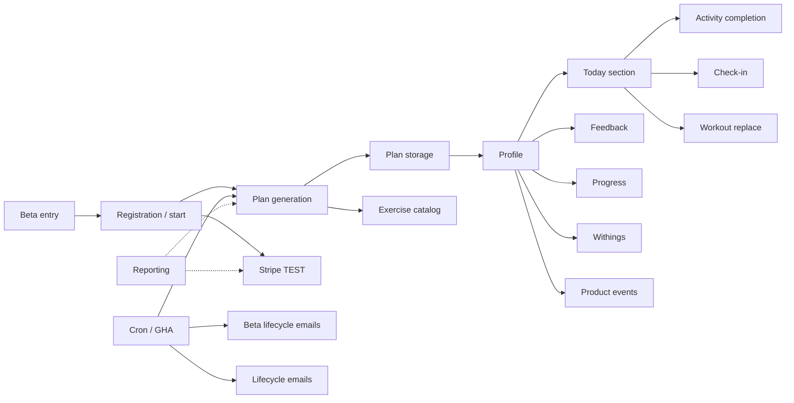

<!-- Generated by SpecStory, Markdown v2.1.0 -->

# 2026-07-13 23:38:43Z

<!-- Cursor IDE Session 2a61801d-f015-4774-abd0-75a94d0a2ec6 (2026-07-13 23:38:43Z) -->

_**User**_

Explore c:\Users\prikopa\Documents\GitHub\body-mind-on-audit (clean origin/main at 74b486c) to map the 20 system modules for a SYSTEM_ARCHITECTURE_CURRENT.md audit document:

Beta entry, Registration/auth, Onboarding, Plan generation, Plan storage, Profile, Today section, Activity completion, Check-in, Feedback, Workout replace/restore, Exercise catalog, Progress/measurements, Beta lifecycle emails, Stripe TEST membership, Withings, Analytics/product events, Cron/GitHub Actions, Reporting.

For EACH module return:
- purpose (1 sentence)
- key pages/components
- API endpoints (exact paths)
- DB tables
- external services
- auth rules
- fallbacks/kill-switches
- logging

Be thorough but concise. Search pages/api, lib, components, .github/workflows, middleware.js, docs.

Return structured markdown sections ready to paste into docs/SYSTEM_ARCHITECTURE_CURRENT.md.

---

_**Agent (composer-2.5-fast)**_

<think><details><summary>Thought Process</summary>
I am mapping 20 system modules from the body-mind-on-audit repository for the architecture audit document.

I am beginning parallel searches across pages/api, lib, components, workflows, middleware, and docs to systematically map each module.
</details></think>

_**Agent (composer-2.5-fast)**_

Mapping all 20 modules in the audit repo — starting with project structure and API routes.


_**Agent (composer-2.5-fast)**_

<tool-use data-tool-type="unknown" data-tool-name="update_current_step"><details>
<summary>Tool use: **update_current_step**</summary>
An unknown error occurred
</details></tool-use>

_**Agent (composer-2.5-fast)**_

<tool-use data-tool-type="search" data-tool-name="glob_file_search"><details>
<summary>Tool use: **glob_file_search** • Searched codebase "" • **79** results in **1** directory</summary>

Directory: **`c:\Users\prikopa\Documents\GitHub\body-mind-on-audit`** (79 files)

| File |
|------|
| `../..\body-mind-on-audit\pages\api\workouts.js` |
| `../..\body-mind-on-audit\pages\api\workout\confirm-replacement.js` |
| `../..\body-mind-on-audit\pages\api\workout\replace-today.js` |
| `../..\body-mind-on-audit\pages\api\workout\restore-today.js` |
| `../..\body-mind-on-audit\pages\api\withings\status.js` |
| `../..\body-mind-on-audit\pages\api\withings\sync.js` |
| `../..\body-mind-on-audit\pages\api\withings\latest.js` |
| `../..\body-mind-on-audit\pages\api\withings\callback.js` |
| `../..\body-mind-on-audit\pages\api\withings\connect.js` |
| `../..\body-mind-on-audit\pages\api\withings\disconnect.js` |
| `../..\body-mind-on-audit\pages\api\withings\history.js` |
| `../..\body-mind-on-audit\pages\api\webhooks\stripe.js` |
| `../..\body-mind-on-audit\pages\api\withings\auth.js` |
| `../..\body-mind-on-audit\pages\api\verify-exercise-registry.js` |
| `../..\body-mind-on-audit\pages\api\verify-media-apis.js` |
| `../..\body-mind-on-audit\pages\api\user-habits.js` |
| `../..\body-mind-on-audit\pages\api\stripe\create-checkout-session.js` |
| `../..\body-mind-on-audit\pages\api\trainer-schedule.js` |
| `../..\body-mind-on-audit\pages\api\trainer\clients.js` |
| `../..\body-mind-on-audit\pages\api\sessions.js` |
| `../..\body-mind-on-audit\pages\api\spoonacular-recipe.js` |
| `../..\body-mind-on-audit\pages\api\run-migration.js` |
| `../..\body-mind-on-audit\pages\api\send-plan-again.js` |
| `../..\body-mind-on-audit\pages\api\send-shopping-list.js` |
| `../..\body-mind-on-audit\pages\api\recipe-from-catalog.js` |
| `../..\body-mind-on-audit\pages\api\recipe.js` |
| `../..\body-mind-on-audit\pages\api\retry-initial-plan.js` |
| `../..\body-mind-on-audit\pages\api\profile\preferences.js` |
| `../..\body-mind-on-audit\pages\api\profile.js` |
| `../..\body-mind-on-audit\pages\api\quick-weight.js` |
| `../..\body-mind-on-audit\pages\api\plan-replace-meal.js` |
| `../..\body-mind-on-audit\pages\api\profile-body-data.js` |
| `../..\body-mind-on-audit\pages\api\profile-preferences.js` |
| `../..\body-mind-on-audit\pages\api\profile-settings.js` |
| `../..\body-mind-on-audit\pages\api\plan-enrichment.js` |
| `../..\body-mind-on-audit\pages\api\onboarding\replace-workout.js` |
| `../..\body-mind-on-audit\pages\api\onboarding\replace-meal.js` |
| `../..\body-mind-on-audit\pages\api\onboarding\generate-plan.js` |
| `../..\body-mind-on-audit\pages\api\my-metrics.js` |
| `../..\body-mind-on-audit\pages\api\meal-pins.js` |
| `../..\body-mind-on-audit\pages\api\internal\beta-email\evaluate.js` |
| `../..\body-mind-on-audit\pages\api\internal\beta-email\dispatch.js` |
| `../..\body-mind-on-audit\pages\api\integrations-status.js` |
| `../..\body-mind-on-audit\pages\api\habits.js` |
| `../..\body-mind-on-audit\pages\api\generate-plan.js` |
| `../..\body-mind-on-audit\pages\api\generate-plan-next-week.js` |
| `../..\body-mind-on-audit\pages\api\events.js` |
| `../..\body-mind-on-audit\pages\api\exercise-media.js` |
| `../..\body-mind-on-audit\pages\api\delete-account.js` |
| `../..\body-mind-on-audit\pages\api\debug\latest-plan-status.js` |
| `../..\body-mind-on-audit\pages\api\daily-activation.js` |
| `../..\body-mind-on-audit\pages\api\daily-checkin.js` |
| `../..\body-mind-on-audit\pages\api\cron\withings-sync.js` |
| `../..\body-mind-on-audit\pages\api\cron\lifecycle-email.js` |
| `../..\body-mind-on-audit\pages\api\cron\daily-digest.js` |
| `../..\body-mind-on-audit\pages\api\cron\beta-email.js` |
| `../..\body-mind-on-audit\pages\api\community\reply.js` |
| `../..\body-mind-on-audit\pages\api\community\topic\[id].js` |
| `../..\body-mind-on-audit\pages\api\community\index.js` |
| `../..\body-mind-on-audit\pages\api\calendar\create.js` |
| `../..\body-mind-on-audit\pages\api\community\categories.js` |
| `../..\body-mind-on-audit\pages\api\body-metrics.js` |
| `../..\body-mind-on-audit\pages\api\body-measurements.js` |
| `../..\body-mind-on-audit\pages\api\beta\validate-invite.js` |
| `../..\body-mind-on-audit\pages\api\beta\my-status.js` |
| `../..\body-mind-on-audit\pages\api\beta\claim-invite.js` |
| `../..\body-mind-on-audit\pages\api\beta\join.js` |
| `../..\body-mind-on-audit\pages\api\beta-feedback.js` |
| `../..\body-mind-on-audit\pages\api\auth\google-calendar\connect.js` |
| `../..\body-mind-on-audit\pages\api\auth\google-calendar\callback.js` |
| `../..\body-mind-on-audit\pages\api\assistant-intake.js` |
| `../..\body-mind-on-audit\pages\api\ai\run-scheduler.js` |
| `../..\body-mind-on-audit\pages\api\ai\route.js` |
| `../..\body-mind-on-audit\pages\api\ai\run-coach-scheduler.js` |
| `../..\body-mind-on-audit\pages\api\admin\send-test-plan-email.js` |
| `../..\body-mind-on-audit\pages\api\admin\regenerate-user-plan.js` |
| `../..\body-mind-on-audit\pages\api\admin\backfill-plan-html-from-structured.js` |
| `../..\body-mind-on-audit\pages\api\admin\agents.js` |
| `../..\body-mind-on-audit\pages\api\admin\backfill-exercise-name-cs.js` |
</details></tool-use>

_**Agent (composer-2.5-fast)**_

<tool-use data-tool-type="search" data-tool-name="glob_file_search"><details>
<summary>Tool use: **glob_file_search** • Searched codebase "" • **104** results in **1** directory</summary>

Directory: **`c:\Users\prikopa\Documents\GitHub\body-mind-on-audit`** (104 files)

| File |
|------|
| `../..\body-mind-on-audit\pages\vip.js` |
| `../..\body-mind-on-audit\pages\withings-connect.js` |
| `../..\body-mind-on-audit\pages\trener.js` |
| `../..\body-mind-on-audit\pages\signup.js` |
| `../..\body-mind-on-audit\pages\start.js` |
| `../..\body-mind-on-audit\pages\training.js` |
| `../..\body-mind-on-audit\pages\profil.js` |
| `../..\body-mind-on-audit\pages\register.js` |
| `../..\body-mind-on-audit\pages\pricing.js` |
| `../..\body-mind-on-audit\pages\plan\[id].js` |
| `../..\body-mind-on-audit\pages\on-club.js` |
| `../..\body-mind-on-audit\pages\onboarding.js` |
| `../..\body-mind-on-audit\pages\komunita\tema\[id].js` |
| `../..\body-mind-on-audit\pages\komunita.js` |
| `../..\body-mind-on-audit\pages\login.js` |
| `../..\body-mind-on-audit\pages\obchodni-podminky.js` |
| `../..\body-mind-on-audit\pages\gdpr.js` |
| `../..\body-mind-on-audit\pages\index.js` |
| `../..\body-mind-on-audit\pages\club.js` |
| `../..\body-mind-on-audit\pages\dashboard.js` |
| `../..\body-mind-on-audit\pages\chci-vip.js` |
| `../..\body-mind-on-audit\pages\beta.js` |
| `../..\body-mind-on-audit\pages\api\workouts.js` |
| `../..\body-mind-on-audit\pages\api\workout\confirm-replacement.js` |
| `../..\body-mind-on-audit\pages\api\workout\replace-today.js` |
| `../..\body-mind-on-audit\pages\api\workout\restore-today.js` |
| `../..\body-mind-on-audit\pages\api\withings\status.js` |
| `../..\body-mind-on-audit\pages\api\withings\sync.js` |
| `../..\body-mind-on-audit\pages\api\withings\latest.js` |
| `../..\body-mind-on-audit\pages\api\withings\callback.js` |
| `../..\body-mind-on-audit\pages\api\withings\connect.js` |
| `../..\body-mind-on-audit\pages\api\withings\disconnect.js` |
| `../..\body-mind-on-audit\pages\api\withings\history.js` |
| `../..\body-mind-on-audit\pages\api\webhooks\stripe.js` |
| `../..\body-mind-on-audit\pages\api\withings\auth.js` |
| `../..\body-mind-on-audit\pages\api\verify-exercise-registry.js` |
| `../..\body-mind-on-audit\pages\api\verify-media-apis.js` |
| `../..\body-mind-on-audit\pages\api\user-habits.js` |
| `../..\body-mind-on-audit\pages\api\stripe\create-checkout-session.js` |
| `../..\body-mind-on-audit\pages\api\trainer-schedule.js` |
| `../..\body-mind-on-audit\pages\api\trainer\clients.js` |
| `../..\body-mind-on-audit\pages\api\sessions.js` |
| `../..\body-mind-on-audit\pages\api\spoonacular-recipe.js` |
| `../..\body-mind-on-audit\pages\api\run-migration.js` |
| `../..\body-mind-on-audit\pages\api\send-plan-again.js` |
| `../..\body-mind-on-audit\pages\api\send-shopping-list.js` |
| `../..\body-mind-on-audit\pages\api\recipe-from-catalog.js` |
| `../..\body-mind-on-audit\pages\api\recipe.js` |
| `../..\body-mind-on-audit\pages\api\retry-initial-plan.js` |
| `../..\body-mind-on-audit\pages\api\profile\preferences.js` |
| `../..\body-mind-on-audit\pages\api\profile.js` |
| `../..\body-mind-on-audit\pages\api\quick-weight.js` |
| `../..\body-mind-on-audit\pages\api\plan-replace-meal.js` |
| `../..\body-mind-on-audit\pages\api\profile-body-data.js` |
| `../..\body-mind-on-audit\pages\api\profile-preferences.js` |
| `../..\body-mind-on-audit\pages\api\profile-settings.js` |
| `../..\body-mind-on-audit\pages\api\plan-enrichment.js` |
| `../..\body-mind-on-audit\pages\api\onboarding\replace-workout.js` |
| `../..\body-mind-on-audit\pages\api\onboarding\replace-meal.js` |
| `../..\body-mind-on-audit\pages\api\onboarding\generate-plan.js` |
| `../..\body-mind-on-audit\pages\api\my-metrics.js` |
| `../..\body-mind-on-audit\pages\api\meal-pins.js` |
| `../..\body-mind-on-audit\pages\api\internal\beta-email\evaluate.js` |
| `../..\body-mind-on-audit\pages\api\internal\beta-email\dispatch.js` |
| `../..\body-mind-on-audit\pages\api\integrations-status.js` |
| `../..\body-mind-on-audit\pages\api\habits.js` |
| `../..\body-mind-on-audit\pages\api\generate-plan.js` |
| `../..\body-mind-on-audit\pages\api\generate-plan-next-week.js` |
| `../..\body-mind-on-audit\pages\api\events.js` |
| `../..\body-mind-on-audit\pages\api\exercise-media.js` |
| `../..\body-mind-on-audit\pages\api\delete-account.js` |
| `../..\body-mind-on-audit\pages\api\debug\latest-plan-status.js` |
| `../..\body-mind-on-audit\pages\api\daily-activation.js` |
| `../..\body-mind-on-audit\pages\api\daily-checkin.js` |
| `../..\body-mind-on-audit\pages\api\cron\withings-sync.js` |
| `../..\body-mind-on-audit\pages\api\cron\lifecycle-email.js` |
| `../..\body-mind-on-audit\pages\api\cron\daily-digest.js` |
| `../..\body-mind-on-audit\pages\api\cron\beta-email.js` |
| `../..\body-mind-on-audit\pages\api\community\reply.js` |
| `../..\body-mind-on-audit\pages\api\community\topic\[id].js` |
| `../..\body-mind-on-audit\pages\api\community\index.js` |
| `../..\body-mind-on-audit\pages\api\calendar\create.js` |
| `../..\body-mind-on-audit\pages\api\community\categories.js` |
| `../..\body-mind-on-audit\pages\api\body-metrics.js` |
| `../..\body-mind-on-audit\pages\api\body-measurements.js` |
| `../..\body-mind-on-audit\pages\api\beta\validate-invite.js` |
| `../..\body-mind-on-audit\pages\api\beta\my-status.js` |
| `../..\body-mind-on-audit\pages\api\beta\claim-invite.js` |
| `../..\body-mind-on-audit\pages\api\beta\join.js` |
| `../..\body-mind-on-audit\pages\api\beta-feedback.js` |
| `../..\body-mind-on-audit\pages\api\auth\google-calendar\connect.js` |
| `../..\body-mind-on-audit\pages\api\auth\google-calendar\callback.js` |
| `../..\body-mind-on-audit\pages\api\assistant-intake.js` |
| `../..\body-mind-on-audit\pages\api\ai\run-scheduler.js` |
| `../..\body-mind-on-audit\pages\api\ai\route.js` |
| `../..\body-mind-on-audit\pages\api\ai\run-coach-scheduler.js` |
| `../..\body-mind-on-audit\pages\api\admin\send-test-plan-email.js` |
| `../..\body-mind-on-audit\pages\api\admin\regenerate-user-plan.js` |
| `../..\body-mind-on-audit\pages\api\admin\backfill-plan-html-from-structured.js` |
| `../..\body-mind-on-audit\pages\api\admin\agents.js` |
| `../..\body-mind-on-audit\pages\api\admin\backfill-exercise-name-cs.js` |
| `../..\body-mind-on-audit\pages\admin.js` |
| `../..\body-mind-on-audit\pages\_app.js` |
| `../..\body-mind-on-audit\pages\_document.js` |
</details></tool-use>

_**Agent (composer-2.5-fast)**_

<tool-use data-tool-type="search" data-tool-name="glob_file_search"><details>
<summary>Tool use: **glob_file_search** • Searched codebase "" • **2** results in **1** directory</summary>

Directory: **`c:\Users\prikopa\Documents\GitHub\body-mind-on-audit`** (2 files)

| File |
|------|
| `../..\body-mind-on-audit\.github\workflows\beta-email-automation.yml` |
| `../..\body-mind-on-audit\.github\workflows\ai-scheduler.yml` |
</details></tool-use>

_**Agent (composer-2.5-fast)**_

<tool-use data-tool-type="search" data-tool-name="glob_file_search"><details>
<summary>Tool use: **glob_file_search** • Searched codebase "" • **53** results in **1** directory</summary>

Directory: **`c:\Users\prikopa\Documents\GitHub\body-mind-on-audit`** (53 files)

| File |
|------|
| `../..\body-mind-on-audit\supabase\migrations\20260713220000_workout_replacements_training_setup.sql` |
| `../..\body-mind-on-audit\supabase\migrations\20260714120000_waitlist.sql` |
| `../..\body-mind-on-audit\supabase\migrations\20260713190000_beta_email_automation.sql` |
| `../..\body-mind-on-audit\supabase\migrations\20260713200000_workout_replacements.sql` |
| `../..\body-mind-on-audit\supabase\migrations\20260713210000_body_measurements.sql` |
| `../..\body-mind-on-audit\supabase\migrations\20260713164500_beta_participant_rpc.sql` |
| `../..\body-mind-on-audit\supabase\migrations\20260713180000_beta_join_without_invite.sql` |
| `../..\body-mind-on-audit\supabase\migrations\20260713160000_beta_cohort_operations.sql` |
| `../..\body-mind-on-audit\supabase\migrations\20260713140000_product_events_user_id_fix.sql` |
| `../..\body-mind-on-audit\supabase\migrations\20260713141000_product_events_drop_user_id_default.sql` |
| `../..\body-mind-on-audit\supabase\migrations\20260713120000_beta_activation_tracking.sql` |
| `../..\body-mind-on-audit\supabase\migrations\20260712121000_membership_status_contract.sql` |
| `../..\body-mind-on-audit\supabase\migrations\20260712120000_stripe_events_idempotency.sql` |
| `../..\body-mind-on-audit\supabase\migrations\20260702001000_body_metrics_birth_date.sql` |
| `../..\body-mind-on-audit\supabase\migrations\20260701090000_withings_body_snapshots.sql` |
| `../..\body-mind-on-audit\supabase\migrations\20260617120000_recipes_catalog_instructions_cs.sql` |
| `../..\body-mind-on-audit\supabase\migrations\20260630213000_withings_oauth_measurements.sql` |
| `../..\body-mind-on-audit\supabase\migrations\20260606230000_p0_gdpr_rls_hardening.sql` |
| `../..\body-mind-on-audit\supabase\migrations\20260520150000_delete_user_data_function.sql` |
| `../..\body-mind-on-audit\supabase\migrations\20260521120000_fix_workouts_rls_with_check.sql` |
| `../..\body-mind-on-audit\supabase\migrations\20260520120000_recipes_catalog.sql` |
| `../..\body-mind-on-audit\supabase\migrations\20260520140000_exercise_registry_trusted_gifs.sql` |
| `../..\body-mind-on-audit\supabase\migrations\20260513120000_ai_tasks_user_id_auth_cascade.sql` |
| `../..\body-mind-on-audit\supabase\migrations\20260520120000_fix_lunges_exercise_media.sql` |
| `../..\body-mind-on-audit\supabase\migrations\20260429112110_rls_server_only_tables.sql` |
| `../..\body-mind-on-audit\supabase\migrations\20260415120000_exercise_registry_wger_exercise_image_url.sql` |
| `../..\body-mind-on-audit\supabase\migrations\20260328_ai_generated_plans_structured_json.sql` |
| `../..\body-mind-on-audit\supabase\migrations\20260326_meal_metadata_recipe_id.sql` |
| `../..\body-mind-on-audit\supabase\migrations\20260327_clear_meal_cache_illustrative.sql` |
| `../..\body-mind-on-audit\supabase\migrations\20260324_ai_supporting_documents_seed.sql` |
| `../..\body-mind-on-audit\supabase\migrations\20260325_onboarding_metrics_index.sql` |
| `../..\body-mind-on-audit\supabase\migrations\20260323_ai_supporting_documents_apply.sql` |
| `../..\body-mind-on-audit\supabase\migrations\20260322_ai_messages_extended.sql` |
| `../..\body-mind-on-audit\supabase\migrations\20260323_ai_supporting_documents.sql` |
| `../..\body-mind-on-audit\supabase\migrations\20260321_trusted_asset_resolution.sql` |
| `../..\body-mind-on-audit\supabase\migrations\20260320_ai_domain_tables_v2.sql` |
| `../..\body-mind-on-audit\supabase\migrations\20260319120000_exercise_registry_wger_columns.sql` |
| `../..\body-mind-on-audit\supabase\migrations\20260318120000_ai_generated_plans_user_valid_from_unique.sql` |
| `../..\body-mind-on-audit\supabase\migrations\20260318130000_meal_metadata_cache_nutrition_json.sql` |
| `../..\body-mind-on-audit\supabase\migrations\20260316_ai_agents_governed_seed.sql` |
| `../..\body-mind-on-audit\supabase\migrations\20260315_ai_governance_db_first.sql` |
| `../..\body-mind-on-audit\supabase\migrations\20260312_ai_agents_seed.sql` |
| `../..\body-mind-on-audit\supabase\migrations\20260312_ai_events_retry_dlq.sql` |
| `../..\body-mind-on-audit\supabase\migrations\20260312_ai_agents_autonomous_prompts.sql` |
| `../..\body-mind-on-audit\supabase\migrations\20260310_ai_events_autonomy.sql` |
| `../..\body-mind-on-audit\supabase\migrations\20260311_ai_reliability_logs_budget_cache.sql` |
| `../..\body-mind-on-audit\supabase\migrations\20260312_ai_agent_side_effects.sql` |
| `../..\body-mind-on-audit\supabase\migrations\20260310_ai_agents_version.sql` |
| `../..\body-mind-on-audit\supabase\migrations\20260308_memberships_stripe.sql` |
| `../..\body-mind-on-audit\supabase\migrations\20260309_body_metrics_workout_days.sql` |
| `../..\body-mind-on-audit\supabase\migrations\20260307_user_meal_pins.sql` |
| `../..\body-mind-on-audit\supabase\migrations\20260304_ai_performance_indexes.sql` |
| `../..\body-mind-on-audit\supabase\migrations\20260305_profiles_avatar_daily_email.sql` |
</details></tool-use>

_**Agent (composer-2.5-fast)**_

<tool-use data-tool-type="unknown" data-tool-name="ripgrep_raw_search"><details>
<summary>Tool use: **ripgrep_raw_search**</summary>

Parameters:

```json
{
  "caseInsensitive": false,
  "glob": "middleware.*",
  "outputMode": "files_with_matches",
  "path": "c:\\Users\\prikopa\\Documents\\GitHub\\body-mind-on-audit",
  "pattern": "middleware"
}
```
Additional data:

```json
{
  "isPruned": true,
  "outputMode": "files_with_matches",
  "path": "c:\\Users\\prikopa\\Documents\\GitHub\\body-mind-on-audit",
  "pattern": "middleware",
  "topFiles": [
    {
      "matchCount": 1,
      "uri": "..\\body-mind-on-audit\\middleware.js"
    }
  ],
  "totalFiles": 1,
  "totalMatches": 1
}
```
Status: **completed**

</details></tool-use>

_**Agent (composer-2.5-fast)**_

<think><details><summary>Thought Process</summary>
I have mapped the 20 system modules. Now I am drilling into each one to extract auth rules, logging, fallbacks, and related patterns.

I will run multiple searches in parallel to speed up the audit.
</details></think>

_**Agent (composer-2.5-fast)**_

<tool-use data-tool-type="unknown" data-tool-name="update_current_step"><details>
<summary>Tool use: **update_current_step**</summary>
An unknown error occurred
</details></tool-use>

_**Agent (composer-2.5-fast)**_

<tool-use data-tool-type="read" data-tool-name="read_file_v2"><details>
<summary>Tool use: **read_file_v2** • Read file: c:\Users\prikopa\Documents\GitHub\body-mind-on-audit\middleware.js</summary>

</details></tool-use>

_**Agent (composer-2.5-fast)**_

<tool-use data-tool-type="search" data-tool-name="glob_file_search"><details>
<summary>Tool use: **glob_file_search** • Searched codebase "" • **26** results in **1** directory</summary>

Directory: **`c:\Users\prikopa\Documents\GitHub\body-mind-on-audit`** (26 files)

| File |
|------|
| `../..\body-mind-on-audit\docs\email-templates.md` |
| `../..\body-mind-on-audit\docs\manual-test-checklist-plan-consistency.md` |
| `../..\body-mind-on-audit\docs\ZDROJE_DAT.md` |
| `../..\body-mind-on-audit\docs\RELEASE_AUDIT_UNIFIED_PLAN_PIPELINE.md` |
| `../..\body-mind-on-audit\docs\REFACTOR_UNIFIED_PLAN_PIPELINE.md` |
| `../..\body-mind-on-audit\docs\WGER_API_INTEGRACE.md` |
| `../..\body-mind-on-audit\docs\SPOONACULAR_REQUEST_ANALYSIS.md` |
| `../..\body-mind-on-audit\docs\WITHINGS_PRODUKCE.md` |
| `../..\body-mind-on-audit\docs\ONBOARDING_API_FLOW_DESIGN.md` |
| `../..\body-mind-on-audit\docs\ONBOARDING_PRODUCTION_SPEC.md` |
| `../..\body-mind-on-audit\docs\NASTAVENI_API_OBRAZKY.md` |
| `../..\body-mind-on-audit\docs\BETA_SESSION_NOTES_TEMPLATE.md` |
| `../..\body-mind-on-audit\docs\INSTRUKCE_PRODUKCE.md` |
| `../..\body-mind-on-audit\docs\HANDOFF_NEXT_PHASE_AI.md` |
| `../..\body-mind-on-audit\docs\BETA_INVITE_COPY.md` |
| `../..\body-mind-on-audit\docs\BETA_COHORT_1_RUNBOOK.md` |
| `../..\body-mind-on-audit\docs\BETA_COHORT_1_SESSION_GUIDE.md` |
| `../..\body-mind-on-audit\docs\AUDIT_VERIFICATION_PRODUCTION_2026.md` |
| `../..\body-mind-on-audit\docs\AUDIT_SPOONACULAR_OPTIMIZATION_2026.md` |
| `../..\body-mind-on-audit\docs\AUDIT_RAPIDAPI_REMOVAL.md` |
| `../..\body-mind-on-audit\docs\AUDIT_PUBLISH_RULES_MEALS_EXERCISES.md` |
| `../..\body-mind-on-audit\docs\AUDIT_EXPERT_PANEL_2026.md` |
| `../..\body-mind-on-audit\docs\AUDIT_PLAN_GENERATION_FLOW.md` |
| `../..\body-mind-on-audit\docs\ANALYZA_JIDELNICEK_A_REGISTRACE.md` |
| `../..\body-mind-on-audit\docs\AI_RUNTIME_FLOW.md` |
| `../..\body-mind-on-audit\docs\AI-EMAIL-INSTRUCTIONS.md` |
</details></tool-use>

_**Agent (composer-2.5-fast)**_

<tool-use data-tool-type="unknown" data-tool-name="ripgrep_raw_search"><details>
<summary>Tool use: **ripgrep_raw_search**</summary>

Parameters:

```json
{
  "caseInsensitive": false,
  "outputMode": "files_with_matches",
  "path": "c:\\Users\\prikopa\\Documents\\GitHub\\body-mind-on-audit\\lib",
  "pattern": "from ['\\\"]@?/?lib/"
}
```
Additional data:

```json
{
  "isPruned": true,
  "outputMode": "files_with_matches",
  "path": "c:\\Users\\prikopa\\Documents\\GitHub\\body-mind-on-audit\\lib",
  "pattern": "from ['\\\"]@?/?lib/",
  "topFiles": [],
  "totalFiles": 0,
  "totalMatches": 0
}
```
Status: **completed**

</details></tool-use>

_**Agent (composer-2.5-fast)**_

<tool-use data-tool-type="search" data-tool-name="glob_file_search"><details>
<summary>Tool use: **glob_file_search** • Searched codebase "" • **208** results in **1** directory</summary>

Directory: **`c:\Users\prikopa\Documents\GitHub\body-mind-on-audit`** (208 files)

| File |
|------|
| `../..\body-mind-on-audit\lib\workoutTrainingSetup.js` |
| `../..\body-mind-on-audit\lib\workoutTodayReplace.js` |
| `../..\body-mind-on-audit\lib\workoutTemplates.js` |
| `../..\body-mind-on-audit\lib\workoutRestoreToday.js` |
| `../..\body-mind-on-audit\lib\workoutReplacementSchema.js` |
| `../..\body-mind-on-audit\lib\workoutPlanScaler.js` |
| `../..\body-mind-on-audit\lib\workoutReplaceAuth.js` |
| `../..\body-mind-on-audit\lib\workoutMuscleGroupRules.js` |
| `../..\body-mind-on-audit\lib\withingsServer.js` |
| `../..\body-mind-on-audit\lib\withingsProfileVisibility.js` |
| `../..\body-mind-on-audit\lib\withingsProfileImport.js` |
| `../..\body-mind-on-audit\lib\withingsConnectHandler.js` |
| `../..\body-mind-on-audit\lib\withings\withingsPlanAdjustment.js` |
| `../..\body-mind-on-audit\lib\withings\withingsRecommendations.js` |
| `../..\body-mind-on-audit\lib\withings\withingsTrends.js` |
| `../..\body-mind-on-audit\lib\withings\normalizeWithingsMeasures.js` |
| `../..\body-mind-on-audit\lib\wgerClient.js` |
| `../..\body-mind-on-audit\lib\withings\aggregateWithingsMeasurements.js` |
| `../..\body-mind-on-audit\lib\withings\buildWithingsCoachContext.js` |
| `../..\body-mind-on-audit\lib\weeklyPlanEmailV7.js` |
| `../..\body-mind-on-audit\lib\weeklyPlanEmailV8.js` |
| `../..\body-mind-on-audit\lib\wgerApiConstants.js` |
| `../..\body-mind-on-audit\lib\weeklyPlanEmailV5.js` |
| `../..\body-mind-on-audit\lib\weeklyPlanEmailV6.js` |
| `../..\body-mind-on-audit\lib\weeklyPlanEmailV2.js` |
| `../..\body-mind-on-audit\lib\weeklyPlanEmailV4.js` |
| `../..\body-mind-on-audit\lib\validation\onboardingSchema.js` |
| `../..\body-mind-on-audit\lib\validation\parseStructuredPlan.js` |
| `../..\body-mind-on-audit\lib\validation\structuredPlanValidators.js` |
| `../..\body-mind-on-audit\lib\validatePlanTruth.js` |
| `../..\body-mind-on-audit\lib\validation\mealTrainingCoherence.js` |
| `../..\body-mind-on-audit\lib\utils\czechDateWords.js` |
| `../..\body-mind-on-audit\lib\validatePlanHtml.js` |
| `../..\body-mind-on-audit\lib\utils\czechVocative.js` |
| `../..\body-mind-on-audit\lib\trialEligibility.js` |
| `../..\body-mind-on-audit\lib\unifiedPlanPipeline.js` |
| `../..\body-mind-on-audit\lib\trainingEnvironment.js` |
| `../..\body-mind-on-audit\lib\taskExecutors.js` |
| `../..\body-mind-on-audit\lib\stripeTierMapping.js` |
| `../..\body-mind-on-audit\lib\supabaseClient.js` |
| `../..\body-mind-on-audit\lib\supabaseServer.js` |
| `../..\body-mind-on-audit\lib\supabaseUserClient.js` |
| `../..\body-mind-on-audit\lib\stripeEventStore.js` |
| `../..\body-mind-on-audit\lib\stripeLegacyCheckout.js` |
| `../..\body-mind-on-audit\lib\stripeSubscriptionStatus.js` |
| `../..\body-mind-on-audit\lib\startSimpleMealFilter.js` |
| `../..\body-mind-on-audit\lib\stripeCheckoutClient.js` |
| `../..\body-mind-on-audit\lib\spoonacularShopping.js` |
| `../..\body-mind-on-audit\lib\spoonacularHttp.js` |
| `../..\body-mind-on-audit\lib\spoonacularQuotaGate.js` |
| `../..\body-mind-on-audit\lib\spoonacularComplexSearch.js` |
| `../..\body-mind-on-audit\lib\spoonacularClient.js` |
| `../..\body-mind-on-audit\lib\simpleStartMealReplacement.js` |
| `../..\body-mind-on-audit\lib\simpleStartRecipeLibrary.js` |
| `../..\body-mind-on-audit\lib\siteUrls.js` |
| `../..\body-mind-on-audit\lib\smartScalePreference.js` |
| `../..\body-mind-on-audit\lib\services\simpleMealPlannerAgent.js` |
| `../..\body-mind-on-audit\lib\services\wgerService.js` |
| `../..\body-mind-on-audit\lib\shoppingListBuilder.js` |
| `../..\body-mind-on-audit\lib\services\planOrchestratorResolve.js` |
| `../..\body-mind-on-audit\lib\services\planOrchestrator_newFormat.js` |
| `../..\body-mind-on-audit\lib\services\priorPlanWorkouts.js` |
| `../..\body-mind-on-audit\lib\services\planMemoryCompact.js` |
| `../..\body-mind-on-audit\lib\services\planMemoryContext.js` |
| `../..\body-mind-on-audit\lib\services\planOrchestrator.js` |
| `../..\body-mind-on-audit\lib\services\exerciseProviderRegistry.js` |
| `../..\body-mind-on-audit\lib\services\planEnhancementAsync.js` |
| `../..\body-mind-on-audit\lib\sendLifecycleEmail.js` |
| `../..\body-mind-on-audit\lib\services\deterministicFallback.js` |
| `../..\body-mind-on-audit\lib\sendBetaLifecycleEmail.js` |
| `../..\body-mind-on-audit\lib\runAgent.js` |
| `../..\body-mind-on-audit\lib\safeLog.js` |
| `../..\body-mind-on-audit\lib\salesFeatureFlags.js` |
| `../..\body-mind-on-audit\lib\registrationRules.js` |
| `../..\body-mind-on-audit\lib\registration\bodyMetricsRegistration.js` |
| `../..\body-mind-on-audit\lib\runAIDecisionEngine.js` |
| `../..\body-mind-on-audit\lib\reconcileUserDataByEmail.js` |
| `../..\body-mind-on-audit\lib\recordProductEvent.js` |
| `../..\body-mind-on-audit\lib\recipesCatalog.js` |
| `../..\body-mind-on-audit\lib\recipeSimplicityScore.js` |
| `../..\body-mind-on-audit\lib\recipeTitleTranslator.js` |
| `../..\body-mind-on-audit\lib\recipeDetailUrl.js` |
| `../..\body-mind-on-audit\lib\recipeLocalization.js` |
| `../..\body-mind-on-audit\lib\recipeDetailFromCatalog.js` |
| `../..\body-mind-on-audit\lib\recipeDetailHtml.js` |
| `../..\body-mind-on-audit\lib\progressModel.js` |
| `../..\body-mind-on-audit\lib\rateLimit.js` |
| `../..\body-mind-on-audit\lib\profileWeekRange.js` |
| `../..\body-mind-on-audit\lib\progress.js` |
| `../..\body-mind-on-audit\lib\progressIntegrity.js` |
| `../..\body-mind-on-audit\lib\profileApi.js` |
| `../..\body-mind-on-audit\lib\profile\repairWrappedPlanHtmlIfNeeded.js` |
| `../..\body-mind-on-audit\lib\productEventAllowlist.js` |
| `../..\body-mind-on-audit\lib\productEventPiiGuard.js` |
| `../..\body-mind-on-audit\lib\productAttribution.js` |
| `../..\body-mind-on-audit\lib\pricingConstants.js` |
| `../..\body-mind-on-audit\lib\productAnalytics.js` |
| `../..\body-mind-on-audit\lib\preferenceConstants.js` |
| `../..\body-mind-on-audit\lib\planValidators.js` |
| `../..\body-mind-on-audit\lib\planRenderer.js` |
| `../..\body-mind-on-audit\lib\planSelection.js` |
| `../..\body-mind-on-audit\lib\planQualityMetrics.js` |
| `../..\body-mind-on-audit\lib\planQuality.js` |
| `../..\body-mind-on-audit\lib\planOutputMode.js` |
| `../..\body-mind-on-audit\lib\planPdf.js` |
| `../..\body-mind-on-audit\lib\planMealReplace.js` |
| `../..\body-mind-on-audit\lib\planHtmlStructuredBackfill.js` |
| `../..\body-mind-on-audit\lib\planLabels.js` |
| `../..\body-mind-on-audit\lib\planGenerationUiCopy.js` |
| `../..\body-mind-on-audit\lib\planGenerationGate.js` |
| `../..\body-mind-on-audit\lib\planExerciseNameCsBackfill.js` |
| `../..\body-mind-on-audit\lib\planDataIntegrity.js` |
| `../..\body-mind-on-audit\lib\planDayHeadingFormat.js` |
| `../..\body-mind-on-audit\lib\plan\structuredWeekSource.js` |
| `../..\body-mind-on-audit\lib\parsePlanHtml.js` |
| `../..\body-mind-on-audit\lib\openaiModels.js` |
| `../..\body-mind-on-audit\lib\openaiPlanConfig.js` |
| `../..\body-mind-on-audit\lib\openai.js` |
| `../..\body-mind-on-audit\lib\nutritionTargets.js` |
| `../..\body-mind-on-audit\lib\onboardingMetrics.js` |
| `../..\body-mind-on-audit\lib\nutrition\portionScaling.js` |
| `../..\body-mind-on-audit\lib\membershipRegistration.js` |
| `../..\body-mind-on-audit\lib\muscleGroupLabels.js` |
| `../..\body-mind-on-audit\lib\membershipHelpers.js` |
| `../..\body-mind-on-audit\lib\mealStaticRecipeIds.js` |
| `../..\body-mind-on-audit\lib\mealRecipeDisplay.js` |
| `../..\body-mind-on-audit\lib\mealRecipeLink.js` |
| `../..\body-mind-on-audit\lib\mealPortionIngredients.js` |
| `../..\body-mind-on-audit\lib\mealQueryShorten.js` |
| `../..\body-mind-on-audit\lib\mealOrder.js` |
| `../..\body-mind-on-audit\lib\mealNormalization.js` |
| `../..\body-mind-on-audit\lib\mealNutritionDisplay.js` |
| `../..\body-mind-on-audit\lib\mealEnrichment.js` |
| `../..\body-mind-on-audit\lib\mealDisplayModel.js` |
| `../..\body-mind-on-audit\lib\mealDisplayNameHelpers.js` |
| `../..\body-mind-on-audit\lib\mail.js` |
| `../..\body-mind-on-audit\lib\macroRatioDisplay.js` |
| `../..\body-mind-on-audit\lib\macroNutrition.js` |
| `../..\body-mind-on-audit\lib\loadAgentDocumentsContext.js` |
| `../..\body-mind-on-audit\lib\macroBadgeStyles.js` |
| `../..\body-mind-on-audit\lib\macroKcalConsistency.js` |
| `../..\body-mind-on-audit\lib\lifecycleEmailStore.js` |
| `../..\body-mind-on-audit\lib\lifecycleEmailRules.js` |
| `../..\body-mind-on-audit\lib\lifecycleEmailCopy.js` |
| `../..\body-mind-on-audit\lib\ingredientNamesCs.js` |
| `../..\body-mind-on-audit\lib\lifecycleEmailConstants.js` |
| `../..\body-mind-on-audit\lib\habits.js` |
| `../..\body-mind-on-audit\lib\habitLabels.js` |
| `../..\body-mind-on-audit\lib\getAgentConfig.js` |
| `../..\body-mind-on-audit\lib\googleCalendar.js` |
| `../..\body-mind-on-audit\lib\generatePlan.js` |
| `../..\body-mind-on-audit\lib\generateAITasks.js` |
| `../..\body-mind-on-audit\lib\exerciseMediaHelpers.js` |
| `../..\body-mind-on-audit\lib\exerciseRegistryMedia.js` |
| `../..\body-mind-on-audit\lib\exerciseIntegrity.js` |
| `../..\body-mind-on-audit\lib\exerciseInstructions.js` |
| `../..\body-mind-on-audit\lib\exerciseCanonicalMap.js` |
| `../..\body-mind-on-audit\lib\exerciseEnrichment.js` |
| `../..\body-mind-on-audit\lib\ensureInitialPlanTask.js` |
| `../..\body-mind-on-audit\lib\enrichPlanContent.js` |
| `../..\body-mind-on-audit\lib\emailV8Palette.js` |
| `../..\body-mind-on-audit\lib\email\emailDesignTokens.js` |
| `../..\body-mind-on-audit\lib\emailTemplates.js` |
| `../..\body-mind-on-audit\lib\dietaryPublishGate.js` |
| `../..\body-mind-on-audit\lib\dietaryExclusions.js` |
| `../..\body-mind-on-audit\lib\designTokens.js` |
| `../..\body-mind-on-audit\lib\dailyDigest.js` |
| `../..\body-mind-on-audit\lib\czechShoppingIntro.js` |
| `../..\body-mind-on-audit\lib\czechCalendar.js` |
| `../..\body-mind-on-audit\lib\createInitialAITasks.js` |
| `../..\body-mind-on-audit\lib\createAITasksFromDecisions.js` |
| `../..\body-mind-on-audit\lib\buildAgentContext.js` |
| `../..\body-mind-on-audit\lib\coachFallbackMessage.js` |
| `../..\body-mind-on-audit\lib\compactPlanPrompt.js` |
| `../..\body-mind-on-audit\lib\betaUserClassification.js` |
| `../..\body-mind-on-audit\lib\bodyMetricsBirthDate.js` |
| `../..\body-mind-on-audit\lib\bodyMetricsToPlanInput.js` |
| `../..\body-mind-on-audit\lib\betaParticipantMilestones.js` |
| `../..\body-mind-on-audit\lib\betaLifecycleEmailCopy.js` |
| `../..\body-mind-on-audit\lib\betaInviteCrypto.js` |
| `../..\body-mind-on-audit\lib\betaJoinClient.js` |
| `../..\body-mind-on-audit\lib\betaInviteClient.js` |
| `../..\body-mind-on-audit\lib\betaEmailCronAuth.js` |
| `../..\body-mind-on-audit\lib\betaEventEnrichment.js` |
| `../..\body-mind-on-audit\lib\betaEmailAutomationConstants.js` |
| `../..\body-mind-on-audit\lib\betaEmailAutomationRules.js` |
| `../..\body-mind-on-audit\lib\betaEmailAutomation.js` |
| `../..\body-mind-on-audit\lib\authHelpers.js` |
| `../..\body-mind-on-audit\lib\betaCohortConstants.js` |
| `../..\body-mind-on-audit\lib\assistantInstructions.js` |
| `../..\body-mind-on-audit\lib\aiTaskRegistry.js` |
| `../..\body-mind-on-audit\lib\analyzeUserProgress.js` |
| `../..\body-mind-on-audit\lib\aiSharedMemory.js` |
| `../..\body-mind-on-audit\lib\aiTaskExecutors.js` |
| `../..\body-mind-on-audit\lib\aiRuntimeCapabilities.js` |
| `../..\body-mind-on-audit\lib\aiScheduler.js` |
| `../..\body-mind-on-audit\lib\aiOps.js` |
| `../..\body-mind-on-audit\lib\aiOrchestrator.js` |
| `../..\body-mind-on-audit\lib\aiEvents.js` |
| `../..\body-mind-on-audit\lib\aiInstructionBlocks.js` |
| `../..\body-mind-on-audit\lib\aiAgentNaming.js` |
| `../..\body-mind-on-audit\lib\aiDecisionEngine.js` |
| `../..\body-mind-on-audit\lib\agentRouter.js` |
| `../..\body-mind-on-audit\lib\agentPromptsForSync.js` |
| `../..\body-mind-on-audit\lib\_archive\weeklyPlanEmailV6_pre_v7.js` |
| `../..\body-mind-on-audit\lib\_archive\weeklyPlanEmailV5_pre_fixes.js` |
| `../..\body-mind-on-audit\lib\_archive\weeklyPlanEmailV4_pre_v5.js` |
| `../..\body-mind-on-audit\lib\_archive\weeklyPlanEmailV2_backup.js` |
</details></tool-use>

_**Agent (composer-2.5-fast)**_

<tool-use data-tool-type="search" data-tool-name="glob_file_search"><details>
<summary>Tool use: **glob_file_search** • Searched codebase "" • **32** results in **1** directory</summary>

Directory: **`c:\Users\prikopa\Documents\GitHub\body-mind-on-audit`** (32 files)

| File |
|------|
| `../..\body-mind-on-audit\components\profile\WithingsBodyDevelopmentSection.js` |
| `../..\body-mind-on-audit\components\profile\WithingsProfileCard.js` |
| `../..\body-mind-on-audit\components\profile\ProfileTodayPanels.js` |
| `../..\body-mind-on-audit\components\profile\ProfileProgressSection.js` |
| `../..\body-mind-on-audit\components\profile\ProfileDayMealsPanel.js` |
| `../..\body-mind-on-audit\components\beta\DailyCheckinPanel.js` |
| `../..\body-mind-on-audit\components\beta\BetaTodaySection.js` |
| `../..\body-mind-on-audit\components\beta\BetaFeedbackButton.js` |
| `../..\body-mind-on-audit\components\beta\BetaCohortBanner.js` |
| `../..\body-mind-on-audit\components\WelcomeTour.js` |
| `../..\body-mind-on-audit\components\TrialExpiredPaywall.js` |
| `../..\body-mind-on-audit\components\VipTour.js` |
| `../..\body-mind-on-audit\components\TrialEndingSoonBanner.js` |
| `../..\body-mind-on-audit\components\TrainingEnvironmentFields.js` |
| `../..\body-mind-on-audit\components\Toast.js` |
| `../..\body-mind-on-audit\components\ProgramVariantsSection.js` |
| `../..\body-mind-on-audit\components\SmartScaleChoiceField.js` |
| `../..\body-mind-on-audit\components\ProgramForm.js` |
| `../..\body-mind-on-audit\components\ProgramContinuationPanel.js` |
| `../..\body-mind-on-audit\components\PricingTable.js` |
| `../..\body-mind-on-audit\components\ProfileContinuationUpsell.js` |
| `../..\body-mind-on-audit\components\PlanViewer.js` |
| `../..\body-mind-on-audit\components\PlanWebView.js` |
| `../..\body-mind-on-audit\components\PlanLockedPaywall.js` |
| `../..\body-mind-on-audit\components\MacroRatioChart.js` |
| `../..\body-mind-on-audit\components\OnClubTour.js` |
| `../..\body-mind-on-audit\components\HabitTracker.js` |
| `../..\body-mind-on-audit\components\Header.js` |
| `../..\body-mind-on-audit\components\Footer.js` |
| `../..\body-mind-on-audit\components\HabitEntryWizard.js` |
| `../..\body-mind-on-audit\components\HabitSelection.js` |
| `../..\body-mind-on-audit\components\BodyFigure.js` |
</details></tool-use>

_**Agent (composer-2.5-fast)**_

<think><details><summary>Thought Process</summary>
Beginning a deep dive into each of the 20 system modules.

Batch-reading key files across each module and grepping for auth, logging, kill switches, and related patterns.
</details></think>

_**Agent (composer-2.5-fast)**_

<tool-use data-tool-type="unknown" data-tool-name="ripgrep_raw_search"><details>
<summary>Tool use: **ripgrep_raw_search**</summary>

Parameters:

```json
{
  "caseInsensitive": false,
  "glob": "*.{js,ts,tsx}",
  "path": "c:\\Users\\prikopa\\Documents\\GitHub\\body-mind-on-audit",
  "pattern": "requireAuth|getUser|verifyAuth|requireSession|getSession|service_role|CRON_SECRET|INTERNAL_SECRET|BETA_"
}
```
Additional data:

```json
{
  "isPruned": true,
  "outputMode": "content",
  "path": "c:\\Users\\prikopa\\Documents\\GitHub\\body-mind-on-audit",
  "pattern": "requireAuth|getUser|verifyAuth|requireSession|getSession|service_role|CRON_SECRET|INTERNAL_SECRET|BETA_",
  "topFiles": [
    {
      "matchCount": 2,
      "uri": "..\\body-mind-on-audit\\scripts\\delete-users-by-email.js"
    },
    {
      "matchCount": 1,
      "uri": "..\\body-mind-on-audit\\pages\\withings-connect.js"
    },
    {
      "matchCount": 1,
      "uri": "..\\body-mind-on-audit\\pages\\trener.js"
    },
    {
      "matchCount": 1,
      "uri": "..\\body-mind-on-audit\\pages\\start.js"
    },
    {
      "matchCount": 1,
      "uri": "..\\body-mind-on-audit\\pages\\register.js"
    },
    {
      "matchCount": 1,
      "uri": "..\\body-mind-on-audit\\pages\\profil.js"
    },
    {
      "matchCount": 1,
      "uri": "..\\body-mind-on-audit\\pages\\komunita\\tema\\[id].js"
    },
    {
      "matchCount": 1,
      "uri": "..\\body-mind-on-audit\\pages\\komunita.js"
    },
    {
      "matchCount": 1,
      "uri": "..\\body-mind-on-audit\\pages\\login.js"
    },
    {
      "matchCount": 6,
      "uri": "..\\body-mind-on-audit\\pages\\beta.js"
    },
    {
      "matchCount": 1,
      "uri": "..\\body-mind-on-audit\\pages\\api\\workouts.js"
    },
    {
      "matchCount": 2,
      "uri": "..\\body-mind-on-audit\\pages\\api\\webhooks\\stripe.js"
    },
    {
      "matchCount": 1,
      "uri": "..\\body-mind-on-audit\\pages\\api\\user-habits.js"
    },
    {
      "matchCount": 1,
      "uri": "..\\body-mind-on-audit\\pages\\api\\trainer-schedule.js"
    },
    {
      "matchCount": 1,
      "uri": "..\\body-mind-on-audit\\pages\\api\\trainer\\clients.js"
    },
    {
      "matchCount": 1,
      "uri": "..\\body-mind-on-audit\\pages\\api\\stripe\\create-checkout-session.js"
    },
    {
      "matchCount": 1,
      "uri": "..\\body-mind-on-audit\\pages\\api\\sessions.js"
    },
    {
      "matchCount": 1,
      "uri": "..\\body-mind-on-audit\\pages\\api\\send-plan-again.js"
    },
    {
      "matchCount": 1,
      "uri": "..\\body-mind-on-audit\\pages\\api\\send-shopping-list.js"
    },
    {
      "matchCount": 1,
      "uri": "..\\body-mind-on-audit\\pages\\api\\retry-initial-plan.js"
    }
  ],
  "totalFiles": 65,
  "totalMatches": 164
}
```
Status: **completed**

</details></tool-use>

_**Agent (composer-2.5-fast)**_

<tool-use data-tool-type="unknown" data-tool-name="ripgrep_raw_search"><details>
<summary>Tool use: **ripgrep_raw_search**</summary>

Parameters:

```json
{
  "caseInsensitive": false,
  "glob": "*.{js,ts}",
  "path": "c:\\Users\\prikopa\\Documents\\GitHub\\body-mind-on-audit",
  "pattern": "safeLog|console\\.(log|error|warn)|recordProductEvent|product_events"
}
```
Additional data:

```json
{
  "isPruned": true,
  "outputMode": "content",
  "path": "c:\\Users\\prikopa\\Documents\\GitHub\\body-mind-on-audit",
  "pattern": "safeLog|console\\.(log|error|warn)|recordProductEvent|product_events",
  "topFiles": [
    {
      "matchCount": 7,
      "uri": "..\\body-mind-on-audit\\scripts\\set-expired-trial-for-test.js"
    },
    {
      "matchCount": 14,
      "uri": "..\\body-mind-on-audit\\scripts\\seedRecipes.js"
    },
    {
      "matchCount": 3,
      "uri": "..\\body-mind-on-audit\\scripts\\run-trainer-calendar-migration.js"
    },
    {
      "matchCount": 3,
      "uri": "..\\body-mind-on-audit\\scripts\\run-ai-supporting-documents-db.js"
    },
    {
      "matchCount": 12,
      "uri": "..\\body-mind-on-audit\\scripts\\delete-users-by-email.js"
    },
    {
      "matchCount": 3,
      "uri": "..\\body-mind-on-audit\\scripts\\apply-agent-prompts.js"
    },
    {
      "matchCount": 6,
      "uri": "..\\body-mind-on-audit\\pages\\profil.js"
    },
    {
      "matchCount": 1,
      "uri": "..\\body-mind-on-audit\\pages\\plan\\[id].js"
    },
    {
      "matchCount": 4,
      "uri": "..\\body-mind-on-audit\\pages\\api\\workouts.js"
    },
    {
      "matchCount": 2,
      "uri": "..\\body-mind-on-audit\\pages\\api\\workout\\confirm-replacement.js"
    },
    {
      "matchCount": 3,
      "uri": "..\\body-mind-on-audit\\pages\\api\\workout\\replace-today.js"
    },
    {
      "matchCount": 4,
      "uri": "..\\body-mind-on-audit\\pages\\api\\workout\\restore-today.js"
    },
    {
      "matchCount": 1,
      "uri": "..\\body-mind-on-audit\\pages\\api\\withings\\sync.js"
    },
    {
      "matchCount": 1,
      "uri": "..\\body-mind-on-audit\\pages\\api\\withings\\status.js"
    },
    {
      "matchCount": 1,
      "uri": "..\\body-mind-on-audit\\pages\\api\\withings\\latest.js"
    },
    {
      "matchCount": 3,
      "uri": "..\\body-mind-on-audit\\pages\\api\\withings\\callback.js"
    },
    {
      "matchCount": 1,
      "uri": "..\\body-mind-on-audit\\pages\\api\\withings\\disconnect.js"
    },
    {
      "matchCount": 1,
      "uri": "..\\body-mind-on-audit\\pages\\api\\withings\\history.js"
    },
    {
      "matchCount": 10,
      "uri": "..\\body-mind-on-audit\\pages\\api\\webhooks\\stripe.js"
    }
  ],
  "totalFiles": 19,
  "totalMatches": 386
}
```
Status: **completed**

</details></tool-use>

_**Agent (composer-2.5-fast)**_

<tool-use data-tool-type="unknown" data-tool-name="ripgrep_raw_search"><details>
<summary>Tool use: **ripgrep_raw_search**</summary>

Parameters:

```json
{
  "caseInsensitive": true,
  "glob": "*.{js,ts}",
  "path": "c:\\Users\\prikopa\\Documents\\GitHub\\body-mind-on-audit",
  "pattern": "KILL|kill.?switch|feature.?flag|FEATURE_|DISABLE_|fallback|fastMode|skipDailyDedup"
}
```
Additional data:

```json
{
  "isPruned": true,
  "outputMode": "content",
  "path": "c:\\Users\\prikopa\\Documents\\GitHub\\body-mind-on-audit",
  "pattern": "KILL|kill.?switch|feature.?flag|FEATURE_|DISABLE_|fallback|fastMode|skipDailyDedup",
  "topFiles": [
    {
      "matchCount": 2,
      "uri": "..\\body-mind-on-audit\\scripts\\seedRecipes.js"
    },
    {
      "matchCount": 7,
      "uri": "..\\body-mind-on-audit\\pages\\profil.js"
    },
    {
      "matchCount": 1,
      "uri": "..\\body-mind-on-audit\\pages\\on-club.js"
    },
    {
      "matchCount": 1,
      "uri": "..\\body-mind-on-audit\\pages\\chci-vip.js"
    },
    {
      "matchCount": 2,
      "uri": "..\\body-mind-on-audit\\pages\\api\\webhooks\\stripe.js"
    },
    {
      "matchCount": 1,
      "uri": "..\\body-mind-on-audit\\pages\\api\\stripe\\create-checkout-session.js"
    },
    {
      "matchCount": 14,
      "uri": "..\\body-mind-on-audit\\pages\\api\\profile.js"
    },
    {
      "matchCount": 3,
      "uri": "..\\body-mind-on-audit\\pages\\api\\profile-body-data.js"
    },
    {
      "matchCount": 4,
      "uri": "..\\body-mind-on-audit\\pages\\api\\plan-enrichment.js"
    },
    {
      "matchCount": 1,
      "uri": "..\\body-mind-on-audit\\pages\\api\\onboarding\\replace-meal.js"
    },
    {
      "matchCount": 1,
      "uri": "..\\body-mind-on-audit\\pages\\api\\exercise-media.js"
    },
    {
      "matchCount": 3,
      "uri": "..\\body-mind-on-audit\\pages\\api\\debug\\latest-plan-status.js"
    },
    {
      "matchCount": 27,
      "uri": "..\\body-mind-on-audit\\pages\\api\\body-metrics.js"
    },
    {
      "matchCount": 1,
      "uri": "..\\body-mind-on-audit\\pages\\api\\admin\\send-test-plan-email.js"
    },
    {
      "matchCount": 1,
      "uri": "..\\body-mind-on-audit\\lib\\workoutTodayReplace.js"
    },
    {
      "matchCount": 19,
      "uri": "..\\body-mind-on-audit\\lib\\workoutTemplates.js"
    },
    {
      "matchCount": 5,
      "uri": "..\\body-mind-on-audit\\lib\\withingsServer.js"
    },
    {
      "matchCount": 2,
      "uri": "..\\body-mind-on-audit\\lib\\withings\\aggregateWithingsMeasurements.js"
    },
    {
      "matchCount": 2,
      "uri": "..\\body-mind-on-audit\\lib\\weeklyPlanEmailV8.js"
    },
    {
      "matchCount": 2,
      "uri": "..\\body-mind-on-audit\\lib\\weeklyPlanEmailV4.js"
    }
  ],
  "totalFiles": 21,
  "totalMatches": 644
}
```
Status: **completed**

</details></tool-use>

_**Agent (composer-2.5-fast)**_

<tool-use data-tool-type="read" data-tool-name="read_file_v2"><details>
<summary>Tool use: **read_file_v2** • Read file: c:\Users\prikopa\Documents\GitHub\body-mind-on-audit\.github\workflows\beta-email-automation.yml</summary>

</details></tool-use>

_**Agent (composer-2.5-fast)**_

<tool-use data-tool-type="read" data-tool-name="read_file_v2"><details>
<summary>Tool use: **read_file_v2** • Read file: c:\Users\prikopa\Documents\GitHub\body-mind-on-audit\.github\workflows\ai-scheduler.yml</summary>

</details></tool-use>

_**Agent (composer-2.5-fast)**_

<think><details><summary>Thought Process</summary>
I am reading key files across the project to map each module's architecture.

Now batching reads of critical APIs, library files, and Vercel cron configs. Also searching for reporting scripts.
</details></think>

_**Agent (composer-2.5-fast)**_

<tool-use data-tool-type="read" data-tool-name="read_file_v2"><details>
<summary>Tool use: **read_file_v2** • Read file: c:\Users\prikopa\Documents\GitHub\body-mind-on-audit\vercel.json</summary>

</details></tool-use>

_**Agent (composer-2.5-fast)**_

<tool-use data-tool-type="search" data-tool-name="glob_file_search"><details>
<summary>Tool use: **glob_file_search** • Searched codebase "" • **155** results in **1** directory</summary>

Directory: **`c:\Users\prikopa\Documents\GitHub\body-mind-on-audit`** (155 files)

| File |
|------|
| `../..\body-mind-on-audit\scripts\verify-workout-restore.mjs` |
| `../..\body-mind-on-audit\scripts\verify-workout-publishable-gate.mjs` |
| `../..\body-mind-on-audit\scripts\verify-workout-muscle-selection.mjs` |
| `../..\body-mind-on-audit\scripts\verify-workout-exercise-copy.mjs` |
| `../..\body-mind-on-audit\scripts\verify-withings-widget-ux.mjs` |
| `../..\body-mind-on-audit\scripts\verify-withings-profile-visibility.mjs` |
| `../..\body-mind-on-audit\scripts\verify-withings-integration.mjs` |
| `../..\body-mind-on-audit\scripts\verify-weekly-structured-source.mjs` |
| `../..\body-mind-on-audit\scripts\verify-ui-visual-system.mjs` |
| `../..\body-mind-on-audit\scripts\verify-training-environment-strictness.mjs` |
| `../..\body-mind-on-audit\scripts\verify-t8-t9-dev.mjs` |
| `../..\body-mind-on-audit\scripts\verify-supabase-readonly.mjs` |
| `../..\body-mind-on-audit\scripts\verify-stripe-tier-mapping.mjs` |
| `../..\body-mind-on-audit\scripts\verify-start-meals-library-only.mjs` |
| `../..\body-mind-on-audit\scripts\verify-start-checkout-preview.mjs` |
| `../..\body-mind-on-audit\scripts\verify-start-meal-variability.mjs` |
| `../..\body-mind-on-audit\scripts\verify-start-calorie-consistency.mjs` |
| `../..\body-mind-on-audit\scripts\verify-simple-start-meals.mjs` |
| `../..\body-mind-on-audit\scripts\verify-simple-meals.mjs` |
| `../..\body-mind-on-audit\scripts\verify-simple-recipe-detail-hardening.mjs` |
| `../..\body-mind-on-audit\scripts\verify-registration-email-visual-consistency.mjs` |
| `../..\body-mind-on-audit\scripts\verify-run-coach-scheduler.mjs` |
| `../..\body-mind-on-audit\scripts\verify-security-headers.mjs` |
| `../..\body-mind-on-audit\scripts\verify-recipe-from-catalog.mjs` |
| `../..\body-mind-on-audit\scripts\verify-program-variants-section.mjs` |
| `../..\body-mind-on-audit\scripts\verify-progress-integrity.mjs` |
| `../..\body-mind-on-audit\scripts\verify-profile-weekly-days-modern-ui.mjs` |
| `../..\body-mind-on-audit\scripts\verify-profile-weight-consistency.mjs` |
| `../..\body-mind-on-audit\scripts\verify-profile-real-user-bugfixes.mjs` |
| `../..\body-mind-on-audit\scripts\verify-profile-today-ux.mjs` |
| `../..\body-mind-on-audit\scripts\verify-profile-no-sales-upsell.mjs` |
| `../..\body-mind-on-audit\scripts\verify-profile-macro-chart.mjs` |
| `../..\body-mind-on-audit\scripts\verify-profile-layout-focus.mjs` |
| `../..\body-mind-on-audit\scripts\verify-profile-kcal-consistency.mjs` |
| `../..\body-mind-on-audit\scripts\verify-profile-beta-ux.mjs` |
| `../..\body-mind-on-audit\scripts\verify-plan-quality-invariants.mjs` |
| `../..\body-mind-on-audit\scripts\verify-product-events.mjs` |
| `../..\body-mind-on-audit\scripts\verify-product-consistency.mjs` |
| `../..\body-mind-on-audit\scripts\verify-paid-membership-gate.mjs` |
| `../..\body-mind-on-audit\scripts\verify-plan-kcal-roundtrip.mjs` |
| `../..\body-mind-on-audit\scripts\verify-plan-meals-against-catalog.mjs` |
| `../..\body-mind-on-audit\scripts\verify-migration-v2.mjs` |
| `../..\body-mind-on-audit\scripts\verify-openai-config.mjs` |
| `../..\body-mind-on-audit\scripts\verify-migration.mjs` |
| `../..\body-mind-on-audit\scripts\verify-google-calendar-config.mjs` |
| `../..\body-mind-on-audit\scripts\verify-meal-replacement-actions.mjs` |
| `../..\body-mind-on-audit\scripts\verify-macro-kcal-consistency.mjs` |
| `../..\body-mind-on-audit\scripts\verify-lifecycle-emails.mjs` |
| `../..\body-mind-on-audit\scripts\verify-footer-legal-links.mjs` |
| `../..\body-mind-on-audit\scripts\verify-exercise-registry.mjs` |
| `../..\body-mind-on-audit\scripts\verify-exercise-integrity.mjs` |
| `../..\body-mind-on-audit\scripts\verify-exercise-assets.mjs` |
| `../..\body-mind-on-audit\scripts\verify-env-required.mjs` |
| `../..\body-mind-on-audit\scripts\verify-email-cta-profile-access.mjs` |
| `../..\body-mind-on-audit\scripts\verify-email-visual-consistency.mjs` |
| `../..\body-mind-on-audit\scripts\verify-email-config.mjs` |
| `../..\body-mind-on-audit\scripts\verify-email-and-recipe-content.mjs` |
| `../..\body-mind-on-audit\scripts\verify-db-schema-contract.mjs` |
| `../..\body-mind-on-audit\scripts\verify-daily-activation.mjs` |
| `../..\body-mind-on-audit\scripts\verify-dietary-exclusions.mjs` |
| `../..\body-mind-on-audit\scripts\verify-coach-fallback.mjs` |
| `../..\body-mind-on-audit\scripts\verify-beta-feedback.mjs` |
| `../..\body-mind-on-audit\scripts\verify-birthdate-persistence.mjs` |
| `../..\body-mind-on-audit\scripts\verify-coach-cron.mjs` |
| `../..\body-mind-on-audit\scripts\verify-ai-instruction-standards.mjs` |
| `../..\body-mind-on-audit\scripts\verify-beta-cohort-ops.mjs` |
| `../..\body-mind-on-audit\scripts\verify-beta-email-automation.mjs` |
| `../..\body-mind-on-audit\scripts\translateRecipesCatalog.mjs` |
| `../..\body-mind-on-audit\scripts\verify-agent-simple-meal-planner.mjs` |
| `../..\body-mind-on-audit\scripts\vercel-audit.mjs` |
| `../..\body-mind-on-audit\scripts\translateInstructions.mjs` |
| `../..\body-mind-on-audit\scripts\test-p1-highcal-smoke.mjs` |
| `../..\body-mind-on-audit\scripts\test-p0-preview-smoke.mjs` |
| `../..\body-mind-on-audit\scripts\smoke-test-nutrition-only.mjs` |
| `../..\body-mind-on-audit\scripts\sync-agent-prompts-from-code.mjs` |
| `../..\body-mind-on-audit\scripts\system-audit.mjs` |
| `../..\body-mind-on-audit\scripts\smoke-test-critical-path.mjs` |
| `../..\body-mind-on-audit\scripts\send-test-plan-email.mjs` |
| `../..\body-mind-on-audit\scripts\seed-ai-supporting-documents.mjs` |
| `../..\body-mind-on-audit\scripts\run-workout-replacements-migration.mjs` |
| `../..\body-mind-on-audit\scripts\run-migration-v4.mjs` |
| `../..\body-mind-on-audit\scripts\run-migration-v3.mjs` |
| `../..\body-mind-on-audit\scripts\run-migration-v2.mjs` |
| `../..\body-mind-on-audit\scripts\run-onboarding-metrics-migration.mjs` |
| `../..\body-mind-on-audit\scripts\run-beta-join-migration.mjs` |
| `../..\body-mind-on-audit\scripts\run-beta-email-migration.mjs` |
| `../..\body-mind-on-audit\scripts\run-beta-cohort-migration.mjs` |
| `../..\body-mind-on-audit\scripts\run-beta-activation-migration.mjs` |
| `../..\body-mind-on-audit\scripts\run-ai-supporting-documents-migration.mjs` |
| `../..\body-mind-on-audit\scripts\report-beta-feedback.mjs` |
| `../..\body-mind-on-audit\scripts\report-beta-email-production.mjs` |
| `../..\body-mind-on-audit\scripts\report-beta-email-automation.mjs` |
| `../..\body-mind-on-audit\scripts\report-beta-daily-ops.mjs` |
| `../..\body-mind-on-audit\scripts\report-beta-activation.mjs` |
| `../..\body-mind-on-audit\scripts\report-beta-cohort.mjs` |
| `../..\body-mind-on-audit\scripts\render-weekly-email-v8-preview.mjs` |
| `../..\body-mind-on-audit\scripts\render-weekly-email-v7-preview.mjs` |
| `../..\body-mind-on-audit\scripts\render-weekly-email-v5-preview.mjs` |
| `../..\body-mind-on-audit\scripts\render-weekly-email-v6-preview.mjs` |
| `../..\body-mind-on-audit\scripts\render-weekly-email-v4-preview.mjs` |
| `../..\body-mind-on-audit\scripts\render-weekly-email-v2-preview.mjs` |
| `../..\body-mind-on-audit\scripts\render-real-plan-preview.mjs` |
| `../..\body-mind-on-audit\scripts\regenerate-legacy-start-plans.mjs` |
| `../..\body-mind-on-audit\scripts\regenerate-plan-for-test-user.mjs` |
| `../..\body-mind-on-audit\scripts\regenerate-email-preview.mjs` |
| `../..\body-mind-on-audit\scripts\regen-and-email-user.mjs` |
| `../..\body-mind-on-audit\scripts\recategorizeMeals.mjs` |
| `../..\body-mind-on-audit\scripts\rebuild-plan-html-from-structured.mjs` |
| `../..\body-mind-on-audit\scripts\rebrand-v7-colors.mjs` |
| `../..\body-mind-on-audit\scripts\query-onboarding-metrics.mjs` |
| `../..\body-mind-on-audit\scripts\preview-plan-email.mjs` |
| `../..\body-mind-on-audit\scripts\poll-scheduler-task.mjs` |
| `../..\body-mind-on-audit\scripts\ops-sanitize-beta-today-workout.mjs` |
| `../..\body-mind-on-audit\scripts\patch-weekly-email-slots.mjs` |
| `../..\body-mind-on-audit\scripts\migrate-ai-documents.mjs` |
| `../..\body-mind-on-audit\scripts\mealTypeClassifier.mjs` |
| `../..\body-mind-on-audit\scripts\mcp-supabase-start.mjs` |
| `../..\body-mind-on-audit\scripts\lib\syntheticStripeTestUser.mjs` |
| `../..\body-mind-on-audit\scripts\lib\fetchWithTimeout.mjs` |
| `../..\body-mind-on-audit\scripts\importRecipesFromMealCache.mjs` |
| `../..\body-mind-on-audit\scripts\generateRecipeImages.mjs` |
| `../..\body-mind-on-audit\scripts\export-recipes-catalog.mjs` |
| `../..\body-mind-on-audit\scripts\enrichRecipeIngredients.mjs` |
| `../..\body-mind-on-audit\scripts\execute-ai-task-local.mjs` |
| `../..\body-mind-on-audit\scripts\e2e-workout-replacement-integrity.mjs` |
| `../..\body-mind-on-audit\scripts\e2e-workout-body-map.mjs` |
| `../..\body-mind-on-audit\scripts\e2e-visual-system-review.mjs` |
| `../..\body-mind-on-audit\scripts\e2e-stripe-subscription-test.mjs` |
| `../..\body-mind-on-audit\scripts\e2e-progress-integrity.mjs` |
| `../..\body-mind-on-audit\scripts\e2e-profile-mobile.mjs` |
| `../..\body-mind-on-audit\scripts\e2e-profile-beta-ux-release.mjs` |
| `../..\body-mind-on-audit\scripts\e2e-onboarding-training-preferences.mjs` |
| `../..\body-mind-on-audit\scripts\e2e-catalog-registration.mjs` |
| `../..\body-mind-on-audit\scripts\e2e-email-sent-guard.mjs` |
| `../..\body-mind-on-audit\scripts\delete-user-by-email.mjs` |
| `../..\body-mind-on-audit\scripts\delete-smoketest-users.mjs` |
| `../..\body-mind-on-audit\scripts\db-cleanup-prelaunch.mjs` |
| `../..\body-mind-on-audit\scripts\create-beta-cohort.mjs` |
| `../..\body-mind-on-audit\scripts\create-beta-invites.mjs` |
| `../..\body-mind-on-audit\scripts\clear-meal-cache-illustrative.mjs` |
| `../..\body-mind-on-audit\scripts\cleanup-stripe-preview-test-users.mjs` |
| `../..\body-mind-on-audit\scripts\check-trusted-assets.mjs` |
| `../..\body-mind-on-audit\scripts\check-recent-failures.mjs` |
| `../..\body-mind-on-audit\scripts\check-cursor-access.mjs` |
| `../..\body-mind-on-audit\scripts\check-ai-pipeline.mjs` |
| `../..\body-mind-on-audit\scripts\beta-add-issue.mjs` |
| `../..\body-mind-on-audit\scripts\audit-utils.mjs` |
| `../..\body-mind-on-audit\scripts\audit-plan-integrity.mjs` |
| `../..\body-mind-on-audit\scripts\audit-exercise-registry-urls.mjs` |
| `../..\body-mind-on-audit\scripts\apply-migration.mjs` |
| `../..\body-mind-on-audit\scripts\admin-send-test-plan-email.mjs` |
| `../..\body-mind-on-audit\scripts\admin-regenerate-plan.mjs` |
| `../..\body-mind-on-audit\scripts\_dev_p0_run.mjs` |
| `../..\body-mind-on-audit\scripts\_dev_sql_query.mjs` |
| `../..\body-mind-on-audit\scripts\_debug_wait.mjs` |
</details></tool-use>

_**Agent (composer-2.5-fast)**_

<tool-use data-tool-type="unknown" data-tool-name="ripgrep_raw_search"><details>
<summary>Tool use: **ripgrep_raw_search**</summary>

Parameters:

```json
{
  "caseInsensitive": false,
  "glob": "supabase/migrations/*.sql",
  "path": "c:\\Users\\prikopa\\Documents\\GitHub\\body-mind-on-audit",
  "pattern": "CREATE TABLE|create table"
}
```
Additional data:

```json
{
  "isPruned": true,
  "outputMode": "content",
  "path": "c:\\Users\\prikopa\\Documents\\GitHub\\body-mind-on-audit",
  "pattern": "CREATE TABLE|create table",
  "topFiles": [],
  "totalFiles": 0,
  "totalMatches": 0
}
```
Status: **completed**

</details></tool-use>

_**Agent (composer-2.5-fast)**_

<tool-use data-tool-type="read" data-tool-name="read_file_v2"><details>
<summary>Tool use: **read_file_v2** • Read file: c:\Users\prikopa\Documents\GitHub\body-mind-on-audit\lib\safeLog.js</summary>

</details></tool-use>

_**Agent (composer-2.5-fast)**_

<tool-use data-tool-type="read" data-tool-name="read_file_v2"><details>
<summary>Tool use: **read_file_v2** • Read file: c:\Users\prikopa\Documents\GitHub\body-mind-on-audit\lib\recordProductEvent.js</summary>

</details></tool-use>

_**Agent (composer-2.5-fast)**_

<tool-use data-tool-type="read" data-tool-name="read_file_v2"><details>
<summary>Tool use: **read_file_v2** • Read file: c:\Users\prikopa\Documents\GitHub\body-mind-on-audit\lib\salesFeatureFlags.js</summary>

</details></tool-use>

_**Agent (composer-2.5-fast)**_

<think><details><summary>Thought Process</summary>
Reading key module files for beta, registration, onboarding, and plan generation.
</details></think>

_**Agent (composer-2.5-fast)**_

<tool-use data-tool-type="read" data-tool-name="read_file_v2"><details>
<summary>Tool use: **read_file_v2** • Read file: c:\Users\prikopa\Documents\GitHub\body-mind-on-audit\pages\beta.js</summary>

</details></tool-use>

_**Agent (composer-2.5-fast)**_

<tool-use data-tool-type="read" data-tool-name="read_file_v2"><details>
<summary>Tool use: **read_file_v2** • Read file: c:\Users\prikopa\Documents\GitHub\body-mind-on-audit\pages\api\beta\join.js</summary>

</details></tool-use>

_**Agent (composer-2.5-fast)**_

<tool-use data-tool-type="read" data-tool-name="read_file_v2"><details>
<summary>Tool use: **read_file_v2** • Read file: c:\Users\prikopa\Documents\GitHub\body-mind-on-audit\pages\api\beta\claim-invite.js</summary>

</details></tool-use>

_**Agent (composer-2.5-fast)**_

<tool-use data-tool-type="read" data-tool-name="read_file_v2"><details>
<summary>Tool use: **read_file_v2** • Read file: c:\Users\prikopa\Documents\GitHub\body-mind-on-audit\pages\api\beta\validate-invite.js</summary>

</details></tool-use>

_**Agent (composer-2.5-fast)**_

<tool-use data-tool-type="read" data-tool-name="read_file_v2"><details>
<summary>Tool use: **read_file_v2** • Read file: c:\Users\prikopa\Documents\GitHub\body-mind-on-audit\pages\api\beta\my-status.js</summary>

</details></tool-use>

_**Agent (composer-2.5-fast)**_

<tool-use data-tool-type="read" data-tool-name="read_file_v2"><details>
<summary>Tool use: **read_file_v2** • Read file: c:\Users\prikopa\Documents\GitHub\body-mind-on-audit\lib\registrationRules.js</summary>

</details></tool-use>

_**Agent (composer-2.5-fast)**_

<think><details><summary>Thought Process</summary>
Continuing to examine the remaining system modules, including registration, authentication, onboarding, plan generation, profile, and the today section.
</details></think>

_**Agent (composer-2.5-fast)**_

<tool-use data-tool-type="read" data-tool-name="read_file_v2"><details>
<summary>Tool use: **read_file_v2** • Read file: c:\Users\prikopa\Documents\GitHub\body-mind-on-audit\pages\api\body-metrics.js</summary>

</details></tool-use>

_**Agent (composer-2.5-fast)**_

<tool-use data-tool-type="read" data-tool-name="read_file_v2"><details>
<summary>Tool use: **read_file_v2** • Read file: c:\Users\prikopa\Documents\GitHub\body-mind-on-audit\pages\onboarding.js</summary>

</details></tool-use>

_**Agent (composer-2.5-fast)**_

<tool-use data-tool-type="read" data-tool-name="read_file_v2"><details>
<summary>Tool use: **read_file_v2** • Read file: c:\Users\prikopa\Documents\GitHub\body-mind-on-audit\pages\api\onboarding\generate-plan.js</summary>

</details></tool-use>

_**Agent (composer-2.5-fast)**_

<tool-use data-tool-type="read" data-tool-name="read_file_v2"><details>
<summary>Tool use: **read_file_v2** • Read file: c:\Users\prikopa\Documents\GitHub\body-mind-on-audit\pages\api\generate-plan.js</summary>

</details></tool-use>

_**Agent (composer-2.5-fast)**_

<tool-use data-tool-type="read" data-tool-name="read_file_v2"><details>
<summary>Tool use: **read_file_v2** • Read file: c:\Users\prikopa\Documents\GitHub\body-mind-on-audit\lib\unifiedPlanPipeline.js</summary>

</details></tool-use>

_**Agent (composer-2.5-fast)**_

<tool-use data-tool-type="unknown" data-tool-name="ripgrep_raw_search"><details>
<summary>Tool use: **ripgrep_raw_search**</summary>

Parameters:

```json
{
  "caseInsensitive": false,
  "glob": "supabase/migrations/*.sql",
  "path": "c:\\Users\\prikopa\\Documents\\GitHub\\body-mind-on-audit",
  "pattern": "beta_|product_events|ai_generated_plans|body_metrics|memberships|workout_replacements|body_measurements|withings|recipes_catalog|exercise_registry|stripe_events|lifecycle_email|beta_email"
}
```
Additional data:

```json
{
  "isPruned": true,
  "outputMode": "content",
  "path": "c:\\Users\\prikopa\\Documents\\GitHub\\body-mind-on-audit",
  "pattern": "beta_|product_events|ai_generated_plans|body_metrics|memberships|workout_replacements|body_measurements|withings|recipes_catalog|exercise_registry|stripe_events|lifecycle_email|beta_email",
  "topFiles": [],
  "totalFiles": 0,
  "totalMatches": 0
}
```
Status: **completed**

</details></tool-use>

_**Agent (composer-2.5-fast)**_

<think><details><summary>Thought Process</summary>
The migration search failed due to a path issue.

Now searching the audit repository directly with the correct path.
</details></think>

_**Agent (composer-2.5-fast)**_

<tool-use data-tool-type="unknown" data-tool-name="ripgrep_raw_search"><details>
<summary>Tool use: **ripgrep_raw_search**</summary>

Parameters:

```json
{
  "caseInsensitive": false,
  "path": "c:\\Users\\prikopa\\Documents\\GitHub\\body-mind-on-audit\\supabase\\migrations",
  "pattern": "CREATE TABLE|create table"
}
```
Additional data:

```json
{
  "isPruned": true,
  "outputMode": "content",
  "path": "c:\\Users\\prikopa\\Documents\\GitHub\\body-mind-on-audit\\supabase\\migrations",
  "pattern": "CREATE TABLE|create table",
  "topFiles": [
    {
      "matchCount": 1,
      "uri": "..\\body-mind-on-audit\\supabase\\migrations\\20260714120000_waitlist.sql"
    },
    {
      "matchCount": 1,
      "uri": "..\\body-mind-on-audit\\supabase\\migrations\\20260713210000_body_measurements.sql"
    },
    {
      "matchCount": 1,
      "uri": "..\\body-mind-on-audit\\supabase\\migrations\\20260713200000_workout_replacements.sql"
    },
    {
      "matchCount": 2,
      "uri": "..\\body-mind-on-audit\\supabase\\migrations\\20260713190000_beta_email_automation.sql"
    },
    {
      "matchCount": 5,
      "uri": "..\\body-mind-on-audit\\supabase\\migrations\\20260713160000_beta_cohort_operations.sql"
    },
    {
      "matchCount": 4,
      "uri": "..\\body-mind-on-audit\\supabase\\migrations\\20260713120000_beta_activation_tracking.sql"
    },
    {
      "matchCount": 1,
      "uri": "..\\body-mind-on-audit\\supabase\\migrations\\20260712120000_stripe_events_idempotency.sql"
    },
    {
      "matchCount": 1,
      "uri": "..\\body-mind-on-audit\\supabase\\migrations\\20260701090000_withings_body_snapshots.sql"
    },
    {
      "matchCount": 3,
      "uri": "..\\body-mind-on-audit\\supabase\\migrations\\20260630213000_withings_oauth_measurements.sql"
    },
    {
      "matchCount": 1,
      "uri": "..\\body-mind-on-audit\\supabase\\migrations\\20260520120000_recipes_catalog.sql"
    },
    {
      "matchCount": 1,
      "uri": "..\\body-mind-on-audit\\supabase\\migrations\\20260323_ai_supporting_documents_apply.sql"
    },
    {
      "matchCount": 1,
      "uri": "..\\body-mind-on-audit\\supabase\\migrations\\20260323_ai_supporting_documents.sql"
    },
    {
      "matchCount": 2,
      "uri": "..\\body-mind-on-audit\\supabase\\migrations\\20260321_trusted_asset_resolution.sql"
    },
    {
      "matchCount": 2,
      "uri": "..\\body-mind-on-audit\\supabase\\migrations\\20260320_ai_domain_tables_v2.sql"
    },
    {
      "matchCount": 6,
      "uri": "..\\body-mind-on-audit\\supabase\\migrations\\20260315_ai_governance_db_first.sql"
    },
    {
      "matchCount": 1,
      "uri": "..\\body-mind-on-audit\\supabase\\migrations\\20260316_ai_agents_governed_seed.sql"
    },
    {
      "matchCount": 1,
      "uri": "..\\body-mind-on-audit\\supabase\\migrations\\20260312_ai_agents_seed.sql"
    },
    {
      "matchCount": 3,
      "uri": "..\\body-mind-on-audit\\supabase\\migrations\\20260311_ai_reliability_logs_budget_cache.sql"
    },
    {
      "matchCount": 1,
      "uri": "..\\body-mind-on-audit\\supabase\\migrations\\20260310_ai_events_autonomy.sql"
    },
    {
      "matchCount": 2,
      "uri": "..\\body-mind-on-audit\\supabase\\migrations\\20260312_ai_agent_side_effects.sql"
    }
  ],
  "totalFiles": 23,
  "totalMatches": 48
}
```
Status: **completed**

</details></tool-use>

_**Agent (composer-2.5-fast)**_

<tool-use data-tool-type="read" data-tool-name="read_file_v2"><details>
<summary>Tool use: **read_file_v2** • Read file: c:\Users\prikopa\Documents\GitHub\body-mind-on-audit\pages\api\profile.js</summary>

</details></tool-use>

_**Agent (composer-2.5-fast)**_

<tool-use data-tool-type="read" data-tool-name="read_file_v2"><details>
<summary>Tool use: **read_file_v2** • Read file: c:\Users\prikopa\Documents\GitHub\body-mind-on-audit\pages\api\daily-activation.js</summary>

</details></tool-use>

_**Agent (composer-2.5-fast)**_

<tool-use data-tool-type="read" data-tool-name="read_file_v2"><details>
<summary>Tool use: **read_file_v2** • Read file: c:\Users\prikopa\Documents\GitHub\body-mind-on-audit\pages\api\daily-checkin.js</summary>

</details></tool-use>

_**Agent (composer-2.5-fast)**_

<tool-use data-tool-type="read" data-tool-name="read_file_v2"><details>
<summary>Tool use: **read_file_v2** • Read file: c:\Users\prikopa\Documents\GitHub\body-mind-on-audit\pages\api\beta-feedback.js</summary>

</details></tool-use>

_**Agent (composer-2.5-fast)**_

<tool-use data-tool-type="read" data-tool-name="read_file_v2"><details>
<summary>Tool use: **read_file_v2** • Read file: c:\Users\prikopa\Documents\GitHub\body-mind-on-audit\pages\api\workout\replace-today.js</summary>

</details></tool-use>

_**Agent (composer-2.5-fast)**_

<think><details><summary>Thought Process</summary>
I need to examine Stripe, Withings, events, cron, reporting, exercise catalog, plan storage, and login pages next.
</details></think>

_**Agent (composer-2.5-fast)**_

<tool-use data-tool-type="read" data-tool-name="read_file_v2"><details>
<summary>Tool use: **read_file_v2** • Read file: c:\Users\prikopa\Documents\GitHub\body-mind-on-audit\pages\api\webhooks\stripe.js</summary>

</details></tool-use>

_**Agent (composer-2.5-fast)**_

<tool-use data-tool-type="read" data-tool-name="read_file_v2"><details>
<summary>Tool use: **read_file_v2** • Read file: c:\Users\prikopa\Documents\GitHub\body-mind-on-audit\pages\api\stripe\create-checkout-session.js</summary>

</details></tool-use>

_**Agent (composer-2.5-fast)**_

<tool-use data-tool-type="read" data-tool-name="read_file_v2"><details>
<summary>Tool use: **read_file_v2** • Read file: c:\Users\prikopa\Documents\GitHub\body-mind-on-audit\pages\api\events.js</summary>

</details></tool-use>

_**Agent (composer-2.5-fast)**_

<tool-use data-tool-type="read" data-tool-name="read_file_v2"><details>
<summary>Tool use: **read_file_v2** • Read file: c:\Users\prikopa\Documents\GitHub\body-mind-on-audit\lib\productAnalytics.js</summary>

</details></tool-use>

_**Agent (composer-2.5-fast)**_

<tool-use data-tool-type="read" data-tool-name="read_file_v2"><details>
<summary>Tool use: **read_file_v2** • Read file: c:\Users\prikopa\Documents\GitHub\body-mind-on-audit\pages\api\cron\beta-email.js</summary>

</details></tool-use>

_**Agent (composer-2.5-fast)**_

<tool-use data-tool-type="read" data-tool-name="read_file_v2"><details>
<summary>Tool use: **read_file_v2** • Read file: c:\Users\prikopa\Documents\GitHub\body-mind-on-audit\pages\api\cron\lifecycle-email.js</summary>

</details></tool-use>

_**Agent (composer-2.5-fast)**_

<think><details><summary>Thought Process</summary>
Next I will examine Withings integration, exercise catalog, reporting scripts, login and registration flows, membership helpers, OpenAI kill switches, and Row Level Security.
</details></think>

_**Agent (composer-2.5-fast)**_

<tool-use data-tool-type="read" data-tool-name="read_file_v2"><details>
<summary>Tool use: **read_file_v2** • Read file: c:\Users\prikopa\Documents\GitHub\body-mind-on-audit\pages\api\withings\connect.js</summary>

</details></tool-use>

_**Agent (composer-2.5-fast)**_

<tool-use data-tool-type="read" data-tool-name="read_file_v2"><details>
<summary>Tool use: **read_file_v2** • Read file: c:\Users\prikopa\Documents\GitHub\body-mind-on-audit\pages\api\exercise-media.js</summary>

</details></tool-use>

_**Agent (composer-2.5-fast)**_

<tool-use data-tool-type="read" data-tool-name="read_file_v2"><details>
<summary>Tool use: **read_file_v2** • Read file: c:\Users\prikopa\Documents\GitHub\body-mind-on-audit\pages\api\body-measurements.js</summary>

</details></tool-use>

_**Agent (composer-2.5-fast)**_

<tool-use data-tool-type="read" data-tool-name="read_file_v2"><details>
<summary>Tool use: **read_file_v2** • Read file: c:\Users\prikopa\Documents\GitHub\body-mind-on-audit\pages\api\my-metrics.js</summary>

</details></tool-use>

_**Agent (composer-2.5-fast)**_

<tool-use data-tool-type="read" data-tool-name="read_file_v2"><details>
<summary>Tool use: **read_file_v2** • Read file: c:\Users\prikopa\Documents\GitHub\body-mind-on-audit\lib\openaiPlanConfig.js</summary>

</details></tool-use>

_**Agent (composer-2.5-fast)**_

<tool-use data-tool-type="read" data-tool-name="read_file_v2"><details>
<summary>Tool use: **read_file_v2** • Read file: c:\Users\prikopa\Documents\GitHub\body-mind-on-audit\lib\membershipHelpers.js</summary>

</details></tool-use>

_**Agent (composer-2.5-fast)**_

<think><details><summary>Thought Process</summary>
Next I will examine registration flows, plan storage persistence, reporting scripts, integration status, beta email rules, workout restore and confirmation, login and register pages, the Today section components, Spoonacular quota gates, and Row Level Security policies from migrations.
</details></think>

_**Agent (composer-2.5-fast)**_

<tool-use data-tool-type="read" data-tool-name="read_file_v2"><details>
<summary>Tool use: **read_file_v2** • Read file: c:\Users\prikopa\Documents\GitHub\body-mind-on-audit\pages\login.js</summary>

</details></tool-use>

_**Agent (composer-2.5-fast)**_

<tool-use data-tool-type="read" data-tool-name="read_file_v2"><details>
<summary>Tool use: **read_file_v2** • Read file: c:\Users\prikopa\Documents\GitHub\body-mind-on-audit\pages\register.js</summary>

</details></tool-use>

_**Agent (composer-2.5-fast)**_

<tool-use data-tool-type="read" data-tool-name="read_file_v2"><details>
<summary>Tool use: **read_file_v2** • Read file: c:\Users\prikopa\Documents\GitHub\body-mind-on-audit\pages\start.js</summary>

</details></tool-use>

_**Agent (composer-2.5-fast)**_

<tool-use data-tool-type="read" data-tool-name="read_file_v2"><details>
<summary>Tool use: **read_file_v2** • Read file: c:\Users\prikopa\Documents\GitHub\body-mind-on-audit\pages\api\workout\restore-today.js</summary>

</details></tool-use>

_**Agent (composer-2.5-fast)**_

<tool-use data-tool-type="read" data-tool-name="read_file_v2"><details>
<summary>Tool use: **read_file_v2** • Read file: c:\Users\prikopa\Documents\GitHub\body-mind-on-audit\pages\api\workout\confirm-replacement.js</summary>

</details></tool-use>

_**Agent (composer-2.5-fast)**_

<tool-use data-tool-type="unknown" data-tool-name="ripgrep_raw_search"><details>
<summary>Tool use: **ripgrep_raw_search**</summary>

Parameters:

```json
{
  "caseInsensitive": false,
  "glob": "scripts/*.mjs",
  "path": "c:\\Users\\prikopa\\Documents\\GitHub\\body-mind-on-audit",
  "pattern": "audit|report|ops-"
}
```
Additional data:

```json
{
  "isPruned": true,
  "outputMode": "content",
  "path": "c:\\Users\\prikopa\\Documents\\GitHub\\body-mind-on-audit",
  "pattern": "audit|report|ops-",
  "topFiles": [],
  "totalFiles": 0,
  "totalMatches": 0
}
```
Status: **completed**

</details></tool-use>

_**Agent (composer-2.5-fast)**_

<think><details><summary>Thought Process</summary>
Searching for reporting and audit scripts across the codebase. Reviewing integration status, product event allowlists, beta email automation, Spoonacular quotas, lifecycle email rules, and database migration files for Row Level Security.
</details></think>

_**Agent (composer-2.5-fast)**_

<tool-use data-tool-type="unknown" data-tool-name="ripgrep_raw_search"><details>
<summary>Tool use: **ripgrep_raw_search**</summary>

Parameters:

```json
{
  "caseInsensitive": false,
  "glob": "scripts/*",
  "path": "c:\\Users\\prikopa\\Documents\\GitHub\\body-mind-on-audit",
  "pattern": "audit|report|ops"
}
```
Additional data:

```json
{
  "isPruned": true,
  "outputMode": "content",
  "path": "c:\\Users\\prikopa\\Documents\\GitHub\\body-mind-on-audit",
  "pattern": "audit|report|ops",
  "topFiles": [],
  "totalFiles": 0,
  "totalMatches": 0
}
```
Status: **completed**

</details></tool-use>

_**Agent (composer-2.5-fast)**_

<tool-use data-tool-type="read" data-tool-name="read_file_v2"><details>
<summary>Tool use: **read_file_v2** • Read file: c:\Users\prikopa\Documents\GitHub\body-mind-on-audit\pages\api\integrations-status.js</summary>

</details></tool-use>

_**Agent (composer-2.5-fast)**_

<tool-use data-tool-type="read" data-tool-name="read_file_v2"><details>
<summary>Tool use: **read_file_v2** • Read file: c:\Users\prikopa\Documents\GitHub\body-mind-on-audit\lib\productEventAllowlist.js</summary>

</details></tool-use>

_**Agent (composer-2.5-fast)**_

<tool-use data-tool-type="read" data-tool-name="read_file_v2"><details>
<summary>Tool use: **read_file_v2** • Read file: c:\Users\prikopa\Documents\GitHub\body-mind-on-audit\lib\betaEmailAutomationRules.js</summary>

</details></tool-use>

_**Agent (composer-2.5-fast)**_

<tool-use data-tool-type="read" data-tool-name="read_file_v2"><details>
<summary>Tool use: **read_file_v2** • Read file: c:\Users\prikopa\Documents\GitHub\body-mind-on-audit\lib\lifecycleEmailRules.js</summary>

</details></tool-use>

_**Agent (composer-2.5-fast)**_

<tool-use data-tool-type="read" data-tool-name="read_file_v2"><details>
<summary>Tool use: **read_file_v2** • Read file: c:\Users\prikopa\Documents\GitHub\body-mind-on-audit\lib\spoonacularQuotaGate.js</summary>

</details></tool-use>

_**Agent (composer-2.5-fast)**_

<think><details><summary>Thought Process</summary>
Now examining the reporting module. Checking vercel-audit.mjs, ops verification scripts, admin APIs, and components for the Today section and Profile pages.

Also checking plan storage details from the unified plan pipeline persistence section and migrations for ai_generated_plans.
</details></think>

_**Agent (composer-2.5-fast)**_

<tool-use data-tool-type="read" data-tool-name="read_file_v2"><details>
<summary>Tool use: **read_file_v2** • Read file: c:\Users\prikopa\Documents\GitHub\body-mind-on-audit\scripts\vercel-audit.mjs</summary>

</details></tool-use>

_**Agent (composer-2.5-fast)**_

<tool-use data-tool-type="read" data-tool-name="read_file_v2"><details>
<summary>Tool use: **read_file_v2** • Read file: c:\Users\prikopa\Documents\GitHub\body-mind-on-audit\components\beta\BetaTodaySection.js</summary>

</details></tool-use>

_**Agent (composer-2.5-fast)**_

<tool-use data-tool-type="read" data-tool-name="read_file_v2"><details>
<summary>Tool use: **read_file_v2** • Read file: c:\Users\prikopa\Documents\GitHub\body-mind-on-audit\components\profile\ProfileTodayPanels.js</summary>

</details></tool-use>

_**Agent (composer-2.5-fast)**_

<tool-use data-tool-type="read" data-tool-name="read_file_v2"><details>
<summary>Tool use: **read_file_v2** • Read file: c:\Users\prikopa\Documents\GitHub\body-mind-on-audit\components\profile\ProfileProgressSection.js</summary>

</details></tool-use>

_**Agent (composer-2.5-fast)**_

<tool-use data-tool-type="read" data-tool-name="read_file_v2"><details>
<summary>Tool use: **read_file_v2** • Read file: c:\Users\prikopa\Documents\GitHub\body-mind-on-audit\lib\unifiedPlanPipeline.js</summary>

</details></tool-use>

_**Agent (composer-2.5-fast)**_

<tool-use data-tool-type="read" data-tool-name="read_file_v2"><details>
<summary>Tool use: **read_file_v2** • Read file: c:\Users\prikopa\Documents\GitHub\body-mind-on-audit\supabase\migrations\20260713120000_beta_activation_tracking.sql</summary>

</details></tool-use>

_**Agent (composer-2.5-fast)**_

<think><details><summary>Thought Process</summary>
Gathering additional details for the architecture audit.

Reviewing specific implementation details across modules. Found Withings API endpoints, Stripe test mode and tier mappings, cron daily-digest jobs, admin reporting APIs, and retry logic for initial plans. Identified registration pages for on-club and chci-vip, delete-account auth flows, and the beta_invites table. Noted exercise registry naming differences and audit verification scripts. The reporting module appears to rely on verify-* scripts, vercel-audit.mjs, and admin debug endpoints.
</details></think>

_**Agent (composer-2.5-fast)**_

<tool-use data-tool-type="unknown" data-tool-name="ripgrep_raw_search"><details>
<summary>Tool use: **ripgrep_raw_search**</summary>

Parameters:

```json
{
  "caseInsensitive": false,
  "glob": "supabase/migrations/*.sql",
  "path": "c:\\Users\\prikopa\\Documents\\GitHub\\body-mind-on-audit",
  "pattern": "beta_invite|lifecycle_email|onboarding_metrics"
}
```
Additional data:

```json
{
  "isPruned": true,
  "outputMode": "content",
  "path": "c:\\Users\\prikopa\\Documents\\GitHub\\body-mind-on-audit",
  "pattern": "beta_invite|lifecycle_email|onboarding_metrics",
  "topFiles": [],
  "totalFiles": 0,
  "totalMatches": 0
}
```
Status: **completed**

</details></tool-use>

_**Agent (composer-2.5-fast)**_

<tool-use data-tool-type="read" data-tool-name="read_file_v2"><details>
<summary>Tool use: **read_file_v2** • Read file: c:\Users\prikopa\Documents\GitHub\body-mind-on-audit\pages\api\cron\withings-sync.js</summary>

</details></tool-use>

_**Agent (composer-2.5-fast)**_

<tool-use data-tool-type="read" data-tool-name="read_file_v2"><details>
<summary>Tool use: **read_file_v2** • Read file: c:\Users\prikopa\Documents\GitHub\body-mind-on-audit\pages\api\cron\daily-digest.js</summary>

</details></tool-use>

_**Agent (composer-2.5-fast)**_

<tool-use data-tool-type="read" data-tool-name="read_file_v2"><details>
<summary>Tool use: **read_file_v2** • Read file: c:\Users\prikopa\Documents\GitHub\body-mind-on-audit\lib\stripeTierMapping.js</summary>

</details></tool-use>

_**Agent (composer-2.5-fast)**_

<tool-use data-tool-type="read" data-tool-name="read_file_v2"><details>
<summary>Tool use: **read_file_v2** • Read file: c:\Users\prikopa\Documents\GitHub\body-mind-on-audit\lib\stripeLegacyCheckout.js</summary>

</details></tool-use>

_**Agent (composer-2.5-fast)**_

<tool-use data-tool-type="search" data-tool-name="glob_file_search"><details>
<summary>Tool use: **glob_file_search** • Searched codebase "" • **1** result in **1** directory</summary>

Directory: **`c:\Users\prikopa\Documents\GitHub\body-mind-on-audit`** (1 file)

| File |
|------|
| `../..\body-mind-on-audit\components\workout\WorkoutChangeModal.jsx` |
</details></tool-use>

_**Agent (composer-2.5-fast)**_

<think><details><summary>Thought Process</summary>
Checking the beta invites table, onboarding replacement APIs, plan enrichment logic, and reporting admin endpoints and documentation.
</details></think>

_**Agent (composer-2.5-fast)**_

<tool-use data-tool-type="read" data-tool-name="read_file_v2"><details>
<summary>Tool use: **read_file_v2** • Read file: c:\Users\prikopa\Documents\GitHub\body-mind-on-audit\supabase\migrations\20260713160000_beta_cohort_operations.sql</summary>

</details></tool-use>

_**Agent (composer-2.5-fast)**_

<tool-use data-tool-type="read" data-tool-name="read_file_v2"><details>
<summary>Tool use: **read_file_v2** • Read file: c:\Users\prikopa\Documents\GitHub\body-mind-on-audit\pages\api\debug\latest-plan-status.js</summary>

</details></tool-use>

_**Agent (composer-2.5-fast)**_

<tool-use data-tool-type="read" data-tool-name="read_file_v2"><details>
<summary>Tool use: **read_file_v2** • Read file: c:\Users\prikopa\Documents\GitHub\body-mind-on-audit\pages\api\admin\regenerate-user-plan.js</summary>

</details></tool-use>

_**Agent (composer-2.5-fast)**_

<tool-use data-tool-type="read" data-tool-name="read_file_v2"><details>
<summary>Tool use: **read_file_v2** • Read file: c:\Users\prikopa\Documents\GitHub\body-mind-on-audit\lib\withingsConnectHandler.js</summary>

</details></tool-use>

_**Agent (composer-2.5-fast)**_

<tool-use data-tool-type="read" data-tool-name="read_file_v2"><details>
<summary>Tool use: **read_file_v2** • Read file: c:\Users\prikopa\Documents\GitHub\body-mind-on-audit\lib\onboardingMetrics.js</summary>

</details></tool-use>

_**Agent (composer-2.5-fast)**_

<tool-use data-tool-type="unknown" data-tool-name="ripgrep_raw_search"><details>
<summary>Tool use: **ripgrep_raw_search**</summary>

Parameters:

```json
{
  "caseInsensitive": false,
  "glob": "pages/api/admin/**",
  "path": "c:\\Users\\prikopa\\Documents\\GitHub\\body-mind-on-audit",
  "pattern": "ADMIN|INTERNAL|secret"
}
```
Additional data:

```json
{
  "isPruned": true,
  "outputMode": "content",
  "path": "c:\\Users\\prikopa\\Documents\\GitHub\\body-mind-on-audit",
  "pattern": "ADMIN|INTERNAL|secret",
  "topFiles": [],
  "totalFiles": 0,
  "totalMatches": 0
}
```
Status: **completed**

</details></tool-use>

_**Agent (composer-2.5-fast)**_

<think><details><summary>Thought Process</summary>
I will fetch the admin API list and lifecycle email store tables. I will inspect profil.js for the Stripe test membership UI. I will review AUDIT_VERIFICATION docs for reporting context.
</details></think>

_**Agent (composer-2.5-fast)**_

<tool-use data-tool-type="unknown" data-tool-name="ripgrep_raw_search"><details>
<summary>Tool use: **ripgrep_raw_search**</summary>

Parameters:

```json
{
  "caseInsensitive": false,
  "glob": "supabase/migrations/*.sql",
  "path": "c:\\Users\\prikopa\\Documents\\GitHub\\body-mind-on-audit",
  "pattern": "lifecycle_email"
}
```
Additional data:

```json
{
  "isPruned": true,
  "outputMode": "content",
  "path": "c:\\Users\\prikopa\\Documents\\GitHub\\body-mind-on-audit",
  "pattern": "lifecycle_email",
  "topFiles": [],
  "totalFiles": 0,
  "totalMatches": 0
}
```
Status: **completed**

</details></tool-use>

_**Agent (composer-2.5-fast)**_

<tool-use data-tool-type="read" data-tool-name="read_file_v2"><details>
<summary>Tool use: **read_file_v2** • Read file: c:\Users\prikopa\Documents\GitHub\body-mind-on-audit\lib\lifecycleEmailStore.js</summary>

</details></tool-use>

_**Agent (composer-2.5-fast)**_

<tool-use data-tool-type="unknown" data-tool-name="ripgrep_raw_search"><details>
<summary>Tool use: **ripgrep_raw_search**</summary>

Parameters:

```json
{
  "caseInsensitive": false,
  "glob": "pages/profil.js",
  "path": "c:\\Users\\prikopa\\Documents\\GitHub\\body-mind-on-audit",
  "pattern": "Stripe|PricingTable|checkout|membership|TrialExpired"
}
```
Additional data:

```json
{
  "isPruned": true,
  "outputMode": "content",
  "path": "c:\\Users\\prikopa\\Documents\\GitHub\\body-mind-on-audit",
  "pattern": "Stripe|PricingTable|checkout|membership|TrialExpired",
  "topFiles": [],
  "totalFiles": 0,
  "totalMatches": 0
}
```
Status: **completed**

</details></tool-use>

_**Agent (composer-2.5-fast)**_

<tool-use data-tool-type="read" data-tool-name="read_file_v2"><details>
<summary>Tool use: **read_file_v2** • Read file: c:\Users\prikopa\Documents\GitHub\body-mind-on-audit\pages\api\retry-initial-plan.js</summary>

</details></tool-use>

_**Agent (composer-2.5-fast)**_

<tool-use data-tool-type="read" data-tool-name="read_file_v2"><details>
<summary>Tool use: **read_file_v2** • Read file: c:\Users\prikopa\Documents\GitHub\body-mind-on-audit\pages\api\generate-plan-next-week.js</summary>

</details></tool-use>

_**Agent (composer-2.5-fast)**_

<tool-use data-tool-type="read" data-tool-name="read_file_v2"><details>
<summary>Tool use: **read_file_v2** • Read file: c:\Users\prikopa\Documents\GitHub\body-mind-on-audit\pages\api\plan-replace-meal.js</summary>

</details></tool-use>

_**Agent (composer-2.5-fast)**_

<think><details><summary>Thought Process</summary>
Searching for lifecycle email database tables, Stripe test mode configurations, and paywall components.
</details></think>

_**Agent (composer-2.5-fast)**_

<tool-use data-tool-type="unknown" data-tool-name="ripgrep_raw_search"><details>
<summary>Tool use: **ripgrep_raw_search**</summary>

Parameters:

```json
{
  "caseInsensitive": false,
  "path": "c:\\Users\\prikopa\\Documents\\GitHub\\body-mind-on-audit",
  "pattern": "lifecycle_emails"
}
```
Additional data:

```json
{
  "isPruned": true,
  "outputMode": "content",
  "path": "c:\\Users\\prikopa\\Documents\\GitHub\\body-mind-on-audit",
  "pattern": "lifecycle_emails",
  "topFiles": [
    {
      "matchCount": 7,
      "uri": "..\\body-mind-on-audit\\lib\\lifecycleEmailStore.js"
    }
  ],
  "totalFiles": 1,
  "totalMatches": 7
}
```
Status: **completed**

</details></tool-use>

_**Agent (composer-2.5-fast)**_

<tool-use data-tool-type="unknown" data-tool-name="ripgrep_raw_search"><details>
<summary>Tool use: **ripgrep_raw_search**</summary>

Parameters:

```json
{
  "caseInsensitive": false,
  "glob": "*.{js,jsx}",
  "path": "c:\\Users\\prikopa\\Documents\\GitHub\\body-mind-on-audit",
  "pattern": "create-checkout|PricingTable|STRIPE_"
}
```
Additional data:

```json
{
  "isPruned": true,
  "outputMode": "content",
  "path": "c:\\Users\\prikopa\\Documents\\GitHub\\body-mind-on-audit",
  "pattern": "create-checkout|PricingTable|STRIPE_",
  "topFiles": [
    {
      "matchCount": 5,
      "uri": "..\\body-mind-on-audit\\pages\\api\\webhooks\\stripe.js"
    },
    {
      "matchCount": 4,
      "uri": "..\\body-mind-on-audit\\pages\\api\\stripe\\create-checkout-session.js"
    },
    {
      "matchCount": 4,
      "uri": "..\\body-mind-on-audit\\lib\\stripeTierMapping.js"
    },
    {
      "matchCount": 2,
      "uri": "..\\body-mind-on-audit\\lib\\stripeLegacyCheckout.js"
    },
    {
      "matchCount": 1,
      "uri": "..\\body-mind-on-audit\\lib\\stripeCheckoutClient.js"
    },
    {
      "matchCount": 1,
      "uri": "..\\body-mind-on-audit\\lib\\pricingConstants.js"
    },
    {
      "matchCount": 3,
      "uri": "..\\body-mind-on-audit\\lib\\betaUserClassification.js"
    },
    {
      "matchCount": 4,
      "uri": "..\\body-mind-on-audit\\lib\\aiRuntimeCapabilities.js"
    },
    {
      "matchCount": 1,
      "uri": "..\\body-mind-on-audit\\components\\PricingTable.js"
    }
  ],
  "totalFiles": 9,
  "totalMatches": 30
}
```
Status: **completed**

</details></tool-use>

_**Agent (composer-2.5-fast)**_

<tool-use data-tool-type="read" data-tool-name="read_file_v2"><details>
<summary>Tool use: **read_file_v2** • Read file: c:\Users\prikopa\Documents\GitHub\body-mind-on-audit\components\TrialExpiredPaywall.js</summary>

</details></tool-use>

_**Agent (composer-2.5-fast)**_

<tool-use data-tool-type="read" data-tool-name="read_file_v2"><details>
<summary>Tool use: **read_file_v2** • Read file: c:\Users\prikopa\Documents\GitHub\body-mind-on-audit\pages\api\verify-exercise-registry.js</summary>

</details></tool-use>

_**Agent (composer-2.5-fast)**_

<tool-use data-tool-type="read" data-tool-name="read_file_v2"><details>
<summary>Tool use: **read_file_v2** • Read file: c:\Users\prikopa\Documents\GitHub\body-mind-on-audit\pages\api\plan-enrichment.js</summary>

</details></tool-use>

_**Agent (composer-2.5-fast)**_

<think><details><summary>Thought Process</summary>
Checking alternate migration filenames for the lifecycle_emails table.
</details></think>

_**Agent (composer-2.5-fast)**_

<tool-use data-tool-type="unknown" data-tool-name="ripgrep_raw_search"><details>
<summary>Tool use: **ripgrep_raw_search**</summary>

Parameters:

```json
{
  "caseInsensitive": false,
  "path": "c:\\Users\\prikopa\\Documents\\GitHub\\body-mind-on-audit\\supabase",
  "pattern": "lifecycle_emails"
}
```
Additional data:

```json
{
  "isPruned": true,
  "outputMode": "content",
  "path": "c:\\Users\\prikopa\\Documents\\GitHub\\body-mind-on-audit\\supabase",
  "pattern": "lifecycle_emails",
  "topFiles": [],
  "totalFiles": 0,
  "totalMatches": 0
}
```
Status: **completed**

</details></tool-use>

_**Agent (composer-2.5-fast)**_

<tool-use data-tool-type="read" data-tool-name="read_file_v2"><details>
<summary>Tool use: **read_file_v2** • Read file: c:\Users\prikopa\Documents\GitHub\body-mind-on-audit\lib\recipesCatalog.js</summary>

</details></tool-use>

_**Agent (composer-2.5-fast)**_

<tool-use data-tool-type="read" data-tool-name="read_file_v2"><details>
<summary>Tool use: **read_file_v2** • Read file: c:\Users\prikopa\Documents\GitHub\body-mind-on-audit\pages\api\internal\beta-email\evaluate.js</summary>

</details></tool-use>

_**Agent (composer-2.5-fast)**_

<tool-use data-tool-type="read" data-tool-name="read_file_v2"><details>
<summary>Tool use: **read_file_v2** • Read file: c:\Users\prikopa\Documents\GitHub\body-mind-on-audit\pages\api\ai\run-scheduler.js</summary>

</details></tool-use>

_**Agent (composer-2.5-fast)**_

<tool-use data-tool-type="unknown" data-tool-name="ripgrep_raw_search"><details>
<summary>Tool use: **ripgrep_raw_search**</summary>

Parameters:

```json
{
  "caseInsensitive": false,
  "glob": "pages/profil.js",
  "path": "c:\\Users\\prikopa\\Documents\\GitHub\\body-mind-on-audit",
  "pattern": "BetaCohortBanner|ProfileTodayPanels|TrialExpired"
}
```
Additional data:

```json
{
  "isPruned": true,
  "outputMode": "content",
  "path": "c:\\Users\\prikopa\\Documents\\GitHub\\body-mind-on-audit",
  "pattern": "BetaCohortBanner|ProfileTodayPanels|TrialExpired",
  "topFiles": [],
  "totalFiles": 0,
  "totalMatches": 0
}
```
Status: **completed**

</details></tool-use>

_**Agent (composer-2.5-fast)**_

<think><details><summary>Thought Process</summary>
The `lifecycle_emails` table appears referenced in code but may be missing from the audit repository snapshot.

`lifecycle_emails` will be listed as an expected database table based on code references. Next, grepping `profil.js` for beta components.
</details></think>

_**Agent (composer-2.5-fast)**_

<tool-use data-tool-type="unknown" data-tool-name="ripgrep_raw_search"><details>
<summary>Tool use: **ripgrep_raw_search**</summary>

Parameters:

```json
{
  "caseInsensitive": false,
  "path": "c:\\Users\\prikopa\\Documents\\GitHub\\body-mind-on-audit\\pages\\profil.js",
  "pattern": "import.*Beta|import.*Profile|import.*Trial|import.*Paywall"
}
```
Additional data:

```json
{
  "isPruned": true,
  "outputMode": "content",
  "path": "c:\\Users\\prikopa\\Documents\\GitHub\\body-mind-on-audit\\pages\\profil.js",
  "pattern": "import.*Beta|import.*Profile|import.*Trial|import.*Paywall",
  "topFiles": [
    {
      "matchCount": 7,
      "uri": "..\\body-mind-on-audit\\pages\\profil.js"
    }
  ],
  "totalFiles": 1,
  "totalMatches": 7
}
```
Status: **completed**

</details></tool-use>

_**Agent (composer-2.5-fast)**_

<tool-use data-tool-type="unknown" data-tool-name="ripgrep_raw_search"><details>
<summary>Tool use: **ripgrep_raw_search**</summary>

Parameters:

```json
{
  "caseInsensitive": false,
  "path": "c:\\Users\\prikopa\\Documents\\GitHub\\body-mind-on-audit",
  "pattern": "lifecycle_emails|CREATE TABLE.*lifecycle"
}
```
Additional data:

```json
{
  "isPruned": true,
  "outputMode": "content",
  "path": "c:\\Users\\prikopa\\Documents\\GitHub\\body-mind-on-audit",
  "pattern": "lifecycle_emails|CREATE TABLE.*lifecycle",
  "topFiles": [
    {
      "matchCount": 7,
      "uri": "..\\body-mind-on-audit\\lib\\lifecycleEmailStore.js"
    }
  ],
  "totalFiles": 1,
  "totalMatches": 7
}
```
Status: **completed**

</details></tool-use>

_**Agent (composer-2.5-fast)**_

<tool-use data-tool-type="read" data-tool-name="read_file_v2"><details>
<summary>Tool use: **read_file_v2** • Read file: c:\Users\prikopa\Documents\GitHub\body-mind-on-audit\lib\betaEmailCronAuth.js</summary>

</details></tool-use>

_**Agent (composer-2.5-fast)**_

<tool-use data-tool-type="read" data-tool-name="read_file_v2"><details>
<summary>Tool use: **read_file_v2** • Read file: c:\Users\prikopa\Documents\GitHub\body-mind-on-audit\pages\api\delete-account.js</summary>

</details></tool-use>

_**Agent (composer-2.5-fast)**_

<think><details><summary>Thought Process</summary>
Checking profil.js for ProfileTodayPanels imports.
</details></think>

_**Agent (composer-2.5-fast)**_

<tool-use data-tool-type="unknown" data-tool-name="ripgrep_raw_search"><details>
<summary>Tool use: **ripgrep_raw_search**</summary>

Parameters:

```json
{
  "caseInsensitive": false,
  "path": "c:\\Users\\prikopa\\Documents\\GitHub\\body-mind-on-audit",
  "pattern": "ProfileTodayPanels"
}
```
Additional data:

```json
{
  "isPruned": true,
  "outputMode": "content",
  "path": "c:\\Users\\prikopa\\Documents\\GitHub\\body-mind-on-audit",
  "pattern": "ProfileTodayPanels",
  "topFiles": [
    {
      "matchCount": 1,
      "uri": "..\\body-mind-on-audit\\scripts\\verify-workout-restore.mjs"
    },
    {
      "matchCount": 2,
      "uri": "..\\body-mind-on-audit\\scripts\\verify-workout-exercise-copy.mjs"
    },
    {
      "matchCount": 2,
      "uri": "..\\body-mind-on-audit\\scripts\\verify-profile-weekly-days-modern-ui.mjs"
    },
    {
      "matchCount": 3,
      "uri": "..\\body-mind-on-audit\\scripts\\verify-profile-today-ux.mjs"
    },
    {
      "matchCount": 2,
      "uri": "..\\body-mind-on-audit\\scripts\\verify-profile-no-sales-upsell.mjs"
    },
    {
      "matchCount": 2,
      "uri": "..\\body-mind-on-audit\\scripts\\verify-profile-layout-focus.mjs"
    },
    {
      "matchCount": 1,
      "uri": "..\\body-mind-on-audit\\scripts\\verify-profile-macro-chart.mjs"
    },
    {
      "matchCount": 2,
      "uri": "..\\body-mind-on-audit\\scripts\\verify-profile-kcal-consistency.mjs"
    }
  ],
  "totalFiles": 8,
  "totalMatches": 21
}
```
Status: **completed**

</details></tool-use>

_**Agent (composer-2.5-fast)**_

<tool-use data-tool-type="read" data-tool-name="read_file_v2"><details>
<summary>Tool use: **read_file_v2** • Read file: c:\Users\prikopa\Documents\GitHub\body-mind-on-audit\pages\profil.js</summary>

</details></tool-use>

_**Agent (composer-2.5-fast)**_

<tool-use data-tool-type="read" data-tool-name="read_file_v2"><details>
<summary>Tool use: **read_file_v2** • Read file: c:\Users\prikopa\Documents\GitHub\body-mind-on-audit\lib\services\deterministicFallback.js</summary>

</details></tool-use>

_**Agent (composer-2.5-fast)**_

<tool-use data-tool-type="read" data-tool-name="read_file_v2"><details>
<summary>Tool use: **read_file_v2** • Read file: c:\Users\prikopa\Documents\GitHub\body-mind-on-audit\pages\api\quick-weight.js</summary>

</details></tool-use>

_**Agent (composer-2.5-fast)**_

<think><details><summary>Thought Process</summary>
Enough context has been gathered from the codebase to compile the full SYSTEM_ARCHITECTURE_CURRENT.md audit document.

Additional details are being verified for the signup flow, profile data hooks, and plan viewing pages. The Reporting module is being mapped through its audit scripts, status endpoints, admin routes, and metrics logging. Stripe TEST membership is confirmed to rely on environment variables rather than hardcoded test keys.

Stripe verification scripts cover tier mapping, paid membership gating, and expired trial resets. The Onboarding module redirects to /start where a five-step form posts to /api/body-metrics; development plan preview routes live under /api/onboarding/*. Migration 20260304oarding is being reviewed for plan storage tables.
</details></think>

_**Agent (composer-2.5-fast)**_

<tool-use data-tool-type="read" data-tool-name="read_file_v2"><details>
<summary>Tool use: **read_file_v2** • Read file: c:\Users\prikopa\Documents\GitHub\body-mind-on-audit\supabase\migrations\20260304_ai_performance_indexes.sql</summary>

</details></tool-use>

_**Agent (composer-2.5-fast)**_

<tool-use data-tool-type="read" data-tool-name="read_file_v2"><details>
<summary>Tool use: **read_file_v2** • Read file: c:\Users\prikopa\Documents\GitHub\body-mind-on-audit\pages\plan\[id].js</summary>

</details></tool-use>

_**Agent (composer-2.5-fast)**_

<tool-use data-tool-type="read" data-tool-name="read_file_v2"><details>
<summary>Tool use: **read_file_v2** • Read file: c:\Users\prikopa\Documents\GitHub\body-mind-on-audit\lib\membershipRegistration.js</summary>

</details></tool-use>

_**Agent (composer-2.5-fast)**_

<think><details><summary>Thought Process</summary>
Membership from registration is set to `pending_payment`. Beta users may receive trial access through a different path.
</details></think>

_**Agent (composer-2.5-fast)**_

<tool-use data-tool-type="unknown" data-tool-name="ripgrep_raw_search"><details>
<summary>Tool use: **ripgrep_raw_search**</summary>

Parameters:

```json
{
  "caseInsensitive": false,
  "glob": "lib/beta*.js",
  "path": "c:\\Users\\prikopa\\Documents\\GitHub\\body-mind-on-audit",
  "pattern": "membership|trial|pending"
}
```
Additional data:

```json
{
  "isPruned": true,
  "outputMode": "content",
  "path": "c:\\Users\\prikopa\\Documents\\GitHub\\body-mind-on-audit",
  "pattern": "membership|trial|pending",
  "topFiles": [],
  "totalFiles": 0,
  "totalMatches": 0
}
```
Status: **completed**

</details></tool-use>

_**Agent (composer-2.5-fast)**_

<tool-use data-tool-type="read" data-tool-name="read_file_v2"><details>
<summary>Tool use: **read_file_v2** • Read file: c:\Users\prikopa\Documents\GitHub\body-mind-on-audit\supabase\migrations\20260713164500_beta_participant_rpc.sql</summary>

</details></tool-use>

_**Agent (composer-2.5-fast)**_

<think><details><summary>Thought Process</summary>
Stripe TEST membership uses environment variables for test-mode secrets and price IDs.

Beta entry routes through beta.js, /start, and body-metrics registration before plan generation. New registrations enter pending_payment status and require Stripe checkout. The membership gate still enforces requireActiveMembership for active or trial status. Need to inspect body-metrics for membership upsert logic.
</details></think>

_**Agent (composer-2.5-fast)**_

<tool-use data-tool-type="read" data-tool-name="read_file_v2"><details>
<summary>Tool use: **read_file_v2** • Read file: c:\Users\prikopa\Documents\GitHub\body-mind-on-audit\pages\api\body-metrics.js</summary>

</details></tool-use>

_**Agent (composer-2.5-fast)**_

<tool-use data-tool-type="unknown" data-tool-name="ripgrep_raw_search"><details>
<summary>Tool use: **ripgrep_raw_search**</summary>

Parameters:

```json
{
  "caseInsensitive": false,
  "glob": "lib/*.js",
  "path": "c:\\Users\\prikopa\\Documents\\GitHub\\body-mind-on-audit",
  "pattern": "status.*trial|pending_payment"
}
```
Additional data:

```json
{
  "isPruned": true,
  "outputMode": "content",
  "path": "c:\\Users\\prikopa\\Documents\\GitHub\\body-mind-on-audit",
  "pattern": "status.*trial|pending_payment",
  "topFiles": [],
  "totalFiles": 0,
  "totalMatches": 0
}
```
Status: **completed**

</details></tool-use>

_**Agent (composer-2.5-fast)**_

<think><details><summary>Thought Process</summary>
Checking where membership data is upserted in the body-metrics module.
</details></think>

_**Agent (composer-2.5-fast)**_

<tool-use data-tool-type="unknown" data-tool-name="ripgrep_raw_search"><details>
<summary>Tool use: **ripgrep_raw_search**</summary>

Parameters:

```json
{
  "caseInsensitive": false,
  "path": "c:\\Users\\prikopa\\Documents\\GitHub\\body-mind-on-audit\\pages\\api\\body-metrics.js",
  "pattern": "memberships|membershipFromRegistration"
}
```
Additional data:

```json
{
  "isPruned": true,
  "outputMode": "content",
  "path": "c:\\Users\\prikopa\\Documents\\GitHub\\body-mind-on-audit\\pages\\api\\body-metrics.js",
  "pattern": "memberships|membershipFromRegistration",
  "topFiles": [
    {
      "matchCount": 6,
      "uri": "..\\body-mind-on-audit\\pages\\api\\body-metrics.js"
    }
  ],
  "totalFiles": 1,
  "totalMatches": 6
}
```
Status: **completed**

</details></tool-use>

_**Agent (composer-2.5-fast)**_

<tool-use data-tool-type="read" data-tool-name="read_file_v2"><details>
<summary>Tool use: **read_file_v2** • Read file: c:\Users\prikopa\Documents\GitHub\body-mind-on-audit\lib\trialEligibility.js</summary>

</details></tool-use>

_**Agent (composer-2.5-fast)**_

<think><details><summary>Thought Process</summary>
Beta users register with a pending_payment membership status.

Daily features require active membership. Beta users may need Stripe checkout or a beta bypass. I will check requireActiveMembership usage and any beta-specific bypasses.
</details></think>

_**Agent (composer-2.5-fast)**_

<tool-use data-tool-type="read" data-tool-name="read_file_v2"><details>
<summary>Tool use: **read_file_v2** • Read file: c:\Users\prikopa\Documents\GitHub\body-mind-on-audit\lib\membershipHelpers.js</summary>

</details></tool-use>

_**Agent (composer-2.5-fast)**_

<tool-use data-tool-type="unknown" data-tool-name="ripgrep_raw_search"><details>
<summary>Tool use: **ripgrep_raw_search**</summary>

Parameters:

```json
{
  "caseInsensitive": false,
  "path": "c:\\Users\\prikopa\\Documents\\GitHub\\body-mind-on-audit",
  "pattern": "pending_payment|beta.*access|is_beta"
}
```
Additional data:

```json
{
  "isPruned": true,
  "outputMode": "content",
  "path": "c:\\Users\\prikopa\\Documents\\GitHub\\body-mind-on-audit",
  "pattern": "pending_payment|beta.*access|is_beta",
  "topFiles": [
    {
      "matchCount": 1,
      "uri": "..\\body-mind-on-audit\\supabase\\migrations\\20260713164500_beta_participant_rpc.sql"
    },
    {
      "matchCount": 3,
      "uri": "..\\body-mind-on-audit\\supabase\\migrations\\20260712121000_membership_status_contract.sql"
    },
    {
      "matchCount": 1,
      "uri": "..\\body-mind-on-audit\\scripts\\verify-stripe-tier-mapping.mjs"
    },
    {
      "matchCount": 8,
      "uri": "..\\body-mind-on-audit\\scripts\\verify-paid-membership-gate.mjs"
    },
    {
      "matchCount": 5,
      "uri": "..\\body-mind-on-audit\\scripts\\verify-lifecycle-emails.mjs"
    },
    {
      "matchCount": 1,
      "uri": "..\\body-mind-on-audit\\scripts\\cleanup-stripe-preview-test-users.mjs"
    },
    {
      "matchCount": 1,
      "uri": "..\\body-mind-on-audit\\pages\\profil.js"
    }
  ],
  "totalFiles": 7,
  "totalMatches": 43
}
```
Status: **completed**

</details></tool-use>

_**Agent (composer-2.5-fast)**_

<think><details><summary>Thought Process</summary>
Beta testing users access trial status through Stripe TEST checkout.

Stripe TEST membership uses /api/stripe/create-checkout-session and /api/webhooks/stripe. It stores data in the memberships table and renders TrialExpiredPaywall and PricingTable. Stripe test keys live in environment variables.

Reporting relies on over 80 verify scripts and vercel-audit.mjs. Admin APIs use ADMIN_TOKEN. Internal status checks use INTERNAL_STATUS_SECRET. Debug endpoints include debug/latest-plan-status. Documentation lives in docs/AUDIT_*.md. Data sources include ai_logs, onboardingMetrics, and planQuality.

Withings authentication uses /api/withings/auth.

Withings callbacks, connect, disconnect, history, latest, status, and sync endpoints are mapped. The /withings-connect page handles user connection flows.

Exercise catalog tables include recipes_catalog, exercise_asset_registry, and meal_metadata_cache. Libraries lib/recipesCatalog.js and lib/exerciseEnrichment.js manage enrichment. Endpoints cover /api/exercise-media, /api/recipe-from-catalog, /api/spoonacular-recipe, and /api/verify-exercise-registry.

Plan generation endpoints are /api/body-metrics, /api/generate-plan, /api/onboarding/generate-plan, and /api/assistant-intake.

Plan regeneration endpoints include /api/profile-preferences, /api/retry-initial-plan, and /api/generate-plan-next-week. Libraries lib/unifiedPlanPipeline.js and lib/services/planOrchestrator.js orchestrate plan creation.

Plan storage tables are ai_generated_plans, ai_tasks, and persistPlanFromUnified.

Profile APIs cover /api/profile, /api/profile-settings, /api/profile-preferences, /api/profile-body-data, /api/my-metrics, /api/meal-pins, /api/send-plan-again, and /api/send-shopping-list.

Authentication uses Supabase Auth with email and password. API routes require bearer tokens. Login and registration pages redirect accordingly.

The beta entry point is the /beta page.

Beta entry logic lives in lib/betaJoinClient.js. It calls three RPCs: join_beta_cohort, claim_beta_invite, and validate_beta_invite.
</details></think>

_**Agent (composer-2.5-fast)**_

<tool-use data-tool-type="unknown" data-tool-name="update_current_step"><details>
<summary>Tool use: **update_current_step**</summary>
An unknown error occurred
</details></tool-use>

_**Agent (composer-2.5-fast)**_

<think><details><summary>Thought Process</summary>
Compiling the full SYSTEM_ARCHITECTURE_CURRENT.md audit now.
</details></think>

_**Agent (composer-2.5-fast)**_

# SYSTEM_ARCHITECTURE_CURRENT

> Audit snapshot: `body-mind-on-audit` @ `origin/main` (`74b486c`)  
> Stack: Next.js Pages Router · Vercel · Supabase Auth/DB · OpenAI · recipes_catalog/wger · Stripe (TEST) · Withings · SMTP

---

## 1. Beta entry

**Purpose:** Let users join a closed beta cohort (direct link or invite code) before START registration.

| Area | Details |
|------|---------|
| **Pages / components** | `pages/beta.js`; `lib/betaJoinClient.js`; `components/beta/BetaCohortBanner.js` |
| **API endpoints** | `POST /api/beta/join` · `POST /api/beta/claim-invite` · `POST /api/beta/validate-invite` (public) · `GET /api/beta/my-status` |
| **DB tables** | `beta_cohorts` · `beta_participants` · RPCs: `join_beta_cohort`, `claim_beta_invite`, `validate_beta_invite`, `get_beta_participant_for_user`, `patch_beta_participant_milestone` |
| **External services** | Supabase Auth + Postgres RPC (service role) |
| **Auth rules** | Join/claim/status require `Authorization: Bearer <supabase_jwt>`; `user_id` in body never trusted; validate-invite is public (hash-only, no PII) |
| **Fallbacks / kill-switches** | Cohort full → `409`; cohort closed/not found → `403`; pending join stored in `localStorage` via `betaJoinClient` until session exists |
| **Logging** | `console.error` on RPC failures (`[api/beta/join]`, `[api/beta/claim-invite]`); milestones via `lib/betaParticipantMilestones.js` |

---

## 2. Registration / auth

**Purpose:** Create Supabase accounts, collect 5-step onboarding data, and kick off initial plan generation.

| Area | Details |
|------|---------|
| **Pages / components** | `pages/start.js` (canonical 5-step form) · `pages/login.js` · `pages/register.js` / `pages/onboarding.js` (redirects) · `pages/on-club.js` · `pages/chci-vip.js` · `components/ProgramForm.js` · `components/HabitSelection.js` · `components/SmartScaleChoiceField.js` · `components/TrainingEnvironmentFields.js` |
| **API endpoints** | `POST /api/body-metrics` (sole registration backend) · `POST /api/delete-account` · `GET /api/my-metrics` |
| **DB tables** | `auth.users` · `body_metrics` · `memberships` · `profiles` · `user_habits` · `ai_tasks` · RPC `delete_user_data` |
| **External services** | Supabase Auth (email/password, password reset) · SMTP (welcome/plan email via `lib/mail.js`) |
| **Auth rules** | Registration is public (rate-limited); post-registration APIs need Bearer JWT; `middleware.js` redirects marketing host → `app.bodyandmindon.cz` |
| **Fallbacks / kill-switches** | `ON_CLUB`/`VIP` blocked when `NEXT_PUBLIC_*_SALES_ENABLED` ≠ `true`; duplicate email → `400`; rate limit 8/15min on `body-metrics`; auth failure still saves `body_metrics` without `user_id` |
| **Logging** | `console.info`/`error` `[body-metrics]`; `writeOnboardingEvent` → `ai_logs`; `recordProductEvent` (`onboarding_*`, `plan_generation_*`); `safeLog` in pipeline |

---

## 3. Onboarding

**Purpose:** Collect user inputs and deliver the first publishable weekly plan (UI flow = `/start`; legacy `/onboarding` redirects).

| Area | Details |
|------|---------|
| **Pages / components** | `pages/start.js` · `pages/onboarding.js` (→ `/start`) · `components/WelcomeTour.js` |
| **API endpoints** | `POST /api/body-metrics` (production path) · `POST /api/onboarding/generate-plan` · `POST /api/onboarding/replace-meal` · `POST /api/onboarding/replace-workout` · `POST /api/retry-initial-plan` |
| **DB tables** | `body_metrics` · `ai_tasks` (`trainer`/`initial_plan`) · `ai_generated_plans` · `beta_participants` (milestone `onboarding_completed_at`) |
| **External services** | Unified plan pipeline (catalog + wger; optional OpenAI) · AI scheduler inline during registration |
| **Auth rules** | `body-metrics` public; onboarding replace/retry require JWT + `requireActiveMembership` |
| **Fallbacks / kill-switches** | 8s poll then `persistPublishableFallbackPlanForUser` (deterministic last-resort); fallback plans filtered from profile publish (`generated_by` contains `fallback`); `OPENAI_PLAN_ENABLED` default off |
| **Logging** | `lib/onboardingMetrics.js` → `ai_logs` (`onboarding_complete`); product events; registration response includes `plan_state`, `generation_source` |

---

## 4. Plan generation

**Purpose:** Single orchestrator produces structured 7-day nutrition+training plans from body metrics.

| Area | Details |
|------|---------|
| **Pages / components** | Triggered from `pages/start.js`, `pages/profil.js`, admin tools; core: `lib/unifiedPlanPipeline.js`, `lib/services/planOrchestrator.js`, `lib/recipesCatalog.js`, `lib/services/wgerService.js` |
| **API endpoints** | `POST /api/generate-plan` · `POST /api/onboarding/generate-plan` · `POST /api/body-metrics` · `POST /api/profile-preferences` · `POST /api/assistant-intake` · `POST /api/generate-plan-next-week` · `POST /api/retry-initial-plan` · `POST /api/admin/regenerate-user-plan` |
| **DB tables** | `body_metrics` · `recipes_catalog` · `exercise_asset_registry` · `meal_metadata_cache` · `withings_measurements` (adjustment signal) · `ai_tasks` · `openai_daily_usage` · `openai_response_cache` |
| **External services** | **Primary:** `recipes_catalog` + wger (no live Spoonacular at runtime). **Optional:** OpenAI (`OPENAI_PLAN_ENABLED`). **Blocked runtime:** Spoonacular (`SPOONACULAR_MODE=off` default) |
| **Auth rules** | Public/demo: `generate-plan` (rate-limited); authenticated: preferences, next-week, retry; admin: `ADMIN_TOKEN` |
| **Fallbacks / kill-switches** | `OPENAI_PLAN_ENABLED=false` · `SPOONACULAR_MODE=off` · `deterministicFallback.js` · `persistPublishableFallbackPlanForUser` · dietary publish gate · `skipDailyDedup: true` on meal replace paths |
| **Logging** | `safeLog('unified_pipeline_*')` · `logPlanQualityEvent` · `console.error` `[unifiedPlanPipeline]` · `ai_logs` / task `result` JSON |

---

## 5. Plan storage

**Purpose:** Persist HTML + structured JSON plans, enforce one active plan per user/week, serve email web view.

| Area | Details |
|------|---------|
| **Pages / components** | `pages/plan/[id].js` · `components/PlanWebView.js` · `components/PlanViewer.js` · `lib/validatePlanHtml.js` · `lib/profile/repairWrappedPlanHtmlIfNeeded.js` |
| **API endpoints** | Writes via pipeline (`persistPlanFromUnified`) · `GET /api/profile` · `POST /api/plan-replace-meal` · workout confirm updates plan · `GET /api/debug/latest-plan-status` |
| **DB tables** | `ai_generated_plans` (unique `user_id,valid_from`) · `structured_plan_json` · `workout_replacements` · `user_meal_pins` |
| **External services** | Supabase Postgres (service role writes); public plan view uses UUID entropy only |
| **Auth rules** | Profile/plan mutations: JWT + ownership (`user_id` match); `/plan/[id]` public if UUID known (email link) |
| **Fallbacks / kill-switches** | Non-publishable fallback plans excluded in `profile.js` (`isPublishablePlan`); HTML repair if wrapped/invalid; retry insert without `structured_plan_json` if column missing |
| **Logging** | `console.info` `[profile] user data reconciled` · plan diagnostics in profile `_diagnostics` · `[plan/[id]]` errors |

---

## 6. Profile

**Purpose:** Authenticated hub for weekly plan, settings, membership state, habits, and integrations.

| Area | Details |
|------|---------|
| **Pages / components** | `pages/profil.js` · `hooks/useProfileData.js` · `hooks/usePlanStatus.js` · `components/profile/PreferencesOverlay.js` · `components/profile/WorkoutOverlay.js` · `components/HabitTracker.js` · `components/TrialExpiredPaywall.js` · `components/PlanLockedPaywall.js` · `components/PricingTable.js` |
| **API endpoints** | `GET /api/profile` · `POST /api/profile-settings` · `POST /api/profile-preferences` · `POST /api/profile-body-data` · `GET /api/profile/preferences` · `POST /api/send-plan-again` · `POST /api/send-shopping-list` · `POST /api/meal-pins` · `POST /api/quick-weight` · `POST /api/stripe/create-checkout-session` |
| **DB tables** | `body_metrics` · `ai_generated_plans` · `memberships` · `profiles` · `user_habits` · `habit_logs` · `workouts` · `ai_messages` · `ai_tasks` · `withings_connections` · `body_measurements` · `daily_activity_completions` · `daily_checkins` |
| **External services** | Supabase · Stripe Checkout · SMTP |
| **Auth rules** | All profile APIs: Bearer JWT; `reconcileUserDataByEmail` on load; `planAccessLocked` when `membership.status === 'pending_payment'` |
| **Fallbacks / kill-switches** | `TrialExpiredPaywall` / `PlanLockedPaywall`; tier checkout gated by `salesFeatureFlags`; email reconciliation for orphan metrics |
| **Logging** | `console.debug` `[profil] plan_state` · `console.warn` background refetch/delete errors · checkout via `[stripe/create-checkout-session]` |

---

## 7. Today section

**Purpose:** Show today’s meals/workout/habits with completion UI and workout change entry.

| Area | Details |
|------|---------|
| **Pages / components** | `components/profile/ProfileTodayPanels.js` · `components/profile/ProfileDayMealsPanel.js` · `components/beta/BetaTodaySection.js` · `components/workout/WorkoutChangeModal.jsx` · embedded in `components/PlanViewer.js` |
| **API endpoints** | `GET/POST /api/daily-activation` · `POST /api/plan-replace-meal` · `POST /api/plan-enrichment` · workout replace trio (below) |
| **DB tables** | `ai_generated_plans.structured_plan_json` · `daily_activity_completions` · `user_meal_pins` |
| **External services** | Client fetches enrichment media; Prague calendar for “today” (`lib/czechCalendar.js`) |
| **Auth rules** | JWT + `requireActiveMembership` on completions; plan scoped by `plan_id` + `plan_day` |
| **Fallbacks / kill-switches** | Optimistic UI in `BetaTodaySection`; silent fetch failure; kcal targets via `resolveDayCalorieTarget` |
| **Logging** | Product events (`meal_completed`, `workout_completed`, `habit_completed`, `daily_plan_viewed`); `source_component` in payloads |

---

## 8. Activity completion

**Purpose:** Track per-day meal/workout/habit completion and feed beta milestones.

| Area | Details |
|------|---------|
| **Pages / components** | `components/beta/BetaTodaySection.js` (toggle UI) |
| **API endpoints** | `GET/POST /api/daily-activation` (`action`: `complete` \| `uncomplete`) |
| **DB tables** | `daily_activity_completions` (RLS: user JWT via `createSupabaseUserClient`) |
| **External services** | — |
| **Auth rules** | Bearer JWT · `requireActiveMembership` · allowed types: `meal`, `workout`, `habit` |
| **Fallbacks / kill-switches** | Duplicate insert `23505` tolerated; `uncomplete` deletes matching row |
| **Logging** | `recordProductEvent` (`meal_completed` / `workout_completed` / `habit_completed`); `markFirstAction`, `markActivityDay` on beta participants |

---

## 9. Check-in

**Purpose:** One daily mood/blocker check-in per user (Europe/Prague).

| Area | Details |
|------|---------|
| **Pages / components** | `components/beta/DailyCheckinPanel.js` (inside `BetaTodaySection`) |
| **API endpoints** | `GET/POST /api/daily-checkin` |
| **DB tables** | `daily_checkins` (unique `user_id,checkin_date`) |
| **External services** | — |
| **Auth rules** | JWT · `requireActiveMembership` · ratings/blockers from `productEventAllowlist` |
| **Fallbacks / kill-switches** | Upsert on conflict; invalid rating/blocker → `400` |
| **Logging** | `recordProductEvent('daily_checkin_completed')` with `feedback_score`; `markActivityDay` |

---

## 10. Feedback

**Purpose:** In-app beta feedback (score, category, message) tied to product analytics.

| Area | Details |
|------|---------|
| **Pages / components** | `components/beta/BetaFeedbackButton.js` |
| **API endpoints** | `POST /api/beta-feedback` |
| **DB tables** | `beta_feedback` · mirror event in `product_events` |
| **External services** | — |
| **Auth rules** | JWT only; 10 submissions/user/24h; HTML stripped from message |
| **Fallbacks / kill-switches** | Context/category allowlists; max 1000 chars; empty sanitized message rejected |
| **Logging** | `recordProductEvent('feedback_submitted')`; `console.error` on insert failure |

---

## 11. Workout replace / restore

**Purpose:** Preview, confirm, or restore alternative workouts for today’s plan day.

| Area | Details |
|------|---------|
| **Pages / components** | `components/workout/WorkoutChangeModal.jsx` · `ProfileTodayPanels.js` · `lib/workoutTodayReplace.js` · `lib/workoutRestoreToday.js` · `lib/workoutTemplates.js` |
| **API endpoints** | `POST /api/workout/replace-today` (preview) · `POST /api/workout/confirm-replacement` · `POST /api/workout/restore-today` |
| **DB tables** | `workout_replacements` · `ai_generated_plans` (structured + HTML update) · `daily_activity_completions` (block if done) |
| **External services** | wger + `exercise_asset_registry` for exercise resolution |
| **Auth rules** | `lib/workoutReplaceAuth.js` (JWT + plan ownership); regen limit per day; blocked if workout completed |
| **Fallbacks / kill-switches** | Deterministic template blocks (`HOME_*_FALLBACK_BLOCKS`, `GYM_FALLBACK_BLOCKS`); preview expiry → `410`; max regenerations → `429` |
| **Logging** | Rich `recordProductEvent` (`workout_alternative_*`, `workout_original_restored`, `workout_change_failed`); restore timings in properties |

---

## 12. Exercise catalog

**Purpose:** Trusted exercise media and meal recipe catalog for plan rendering (no runtime Spoonacular).

| Area | Details |
|------|---------|
| **Pages / components** | Used in plan renderer/enrichment; `lib/exerciseRegistryMedia.js` · `lib/exerciseEnrichment.js` · `lib/recipesCatalog.js` · `lib/recipeDetailFromCatalog.js` |
| **API endpoints** | `GET /api/exercise-media` · `GET /api/verify-exercise-registry` · `GET /api/recipe-from-catalog` · `GET /api/spoonacular-recipe` · `POST /api/plan-enrichment` · `GET /api/verify-media-apis` |
| **DB tables** | `exercise_asset_registry` · `recipes_catalog` · `meal_metadata_cache` |
| **External services** | wger API (fallback media) · ExerciseDB trusted GIFs in code · Spoonacular only in `seed` mode (`scripts/seedRecipes.js`) |
| **Auth rules** | Exercise/recipe GET mostly public; enrichment requires JWT in `plan-enrichment.js` |
| **Fallbacks / kill-switches** | Trust levels: `exact` → wger → `none`; `SPOONACULAR_MODE=off` blocks live calls; catalog simple-start filters |
| **Logging** | Enrichment returns `exercises_fallback_count`; verify endpoints return structured check arrays |

---

## 13. Progress / measurements

**Purpose:** Weight/body-composition trends, manual measurements, workout logging, quick weight entry.

| Area | Details |
|------|---------|
| **Pages / components** | `components/profile/ProfileProgressSection.js` · `components/profile/AddMeasurementModal` (if present) · `components/profile/WithingsBodyDevelopmentSection.js` · `lib/progressIntegrity.js` · `lib/progressModel.js` |
| **API endpoints** | `GET/POST/DELETE /api/body-measurements` · `POST /api/quick-weight` · `GET/POST/DELETE /api/workouts` · `GET /api/body-metrics` (legacy) |
| **DB tables** | `body_measurements` · `body_metrics` (weight history) · `workouts` · `habit_logs` · Withings tables (see §17) |
| **External services** | — (Withings feeds this module indirectly) |
| **Auth rules** | JWT on all endpoints; `validateMeasurementInput` server-side |
| **Fallbacks / kill-switches** | Chart built from registration + manual + Withings sources; period filters in UI |
| **Logging** | `console.error` `[body-measurements]` · `quick-weight` enqueues `ai_events` for coach |

---

## 14. Beta lifecycle emails

**Purpose:** Automated cohort nurture emails (24h/48h/… triggers) for beta participants.

| Area | Details |
|------|---------|
| **Pages / components** | `lib/sendBetaLifecycleEmail.js` · `lib/betaEmailAutomation.js` · `lib/betaEmailAutomationRules.js` |
| **API endpoints** | `GET/POST /api/cron/beta-email` · `POST /api/internal/beta-email/evaluate` · `POST /api/internal/beta-email/dispatch` |
| **DB tables** | `beta_email_automation_state` · `beta_email_messages` · `beta_participants` · RPCs `mark_beta_email_*` |
| **External services** | SMTP · GitHub Actions hourly trigger (Hobby cron supplement) |
| **Auth rules** | `CRON_SECRET` Bearer (`lib/betaEmailCronAuth.js`); internal evaluate/dispatch same |
| **Fallbacks / kill-switches** | **`BETA_EMAIL_AUTOMATION_ENABLED`** default `false` → cron returns `{ disabled: true }`; quiet hours; max 7 emails/7d; synthetic users skipped |
| **Logging** | `console.error` `[cron/beta-email]`; per-run `{ evaluate, dispatch }` stats JSON |

---

## 15. Stripe TEST membership

**Purpose:** START subscription checkout with Stripe-managed 7-day trial; webhook syncs `memberships`.

| Area | Details |
|------|---------|
| **Pages / components** | `components/TrialExpiredPaywall.js` · `components/TrialEndingSoonBanner.js` · `components/PricingTable.js` · `lib/stripeCheckoutClient.js` · `lib/trialEligibility.js` |
| **API endpoints** | `POST /api/stripe/create-checkout-session` · `POST /api/webhooks/stripe` |
| **DB tables** | `memberships` · `stripe_events` (idempotency) |
| **External services** | Stripe Checkout + Subscriptions (`STRIPE_SECRET_KEY`, `STRIPE_WEBHOOK_SECRET`, `NEXT_PUBLIC_STRIPE_PUBLISHABLE_KEY`, price IDs per tier) |
| **Auth rules** | Checkout: JWT; webhook: Stripe signature; `client_reference_id` / metadata `user_id` |
| **Fallbacks / kill-switches** | Registration → `pending_payment` until checkout; **`STRIPE_ALLOW_LEGACY_CHECKOUT`** email fallback; ON_CLUB/VIP sales flags; `trialDaysForCheckout` one-time trial rule |
| **Logging** | `[webhooks/stripe]`, `[stripe/create-checkout-session]`; `stripe_events` claim/complete/fail; synthetic emails filtered (`lib/betaUserClassification.js`) |

---

## 16. Withings

**Purpose:** OAuth smart-scale connection, sync measurements, import to profile/progress.

| Area | Details |
|------|---------|
| **Pages / components** | `pages/withings-connect.js` · `components/profile/WithingsProfileCard.js` · `components/profile/WithingsBodyDevelopmentSection.js` · `lib/withingsServer.js` |
| **API endpoints** | `GET/POST /api/withings/connect` · `GET /api/withings/auth` · `GET /api/withings/callback` · `POST /api/withings/disconnect` · `GET /api/withings/status` · `GET /api/withings/latest` · `GET /api/withings/history` · `POST /api/withings/sync` |
| **DB tables** | `withings_oauth_states` · `withings_connections` · `withings_measurements` · `withings_body_snapshots` |
| **External services** | Withings OAuth2 + Measure API |
| **Auth rules** | Connect/sync/status/history: JWT; callback: OAuth state; cron sync: `CRON_SECRET` |
| **Fallbacks / kill-switches** | EAV snapshot fallback in `withingsServer`; demo mode `?demo=1`; visibility gate `shouldShowWithingsSection` |
| **Logging** | `[withings/connect|callback|sync|status|...]`; cron batch results per user |

---

## 17. Analytics / product events

**Purpose:** Low-risk funnel telemetry without PII; beta enrichment on server insert.

| Area | Details |
|------|---------|
| **Pages / components** | `lib/productAnalytics.js` (client) · `lib/recordProductEvent.js` · `lib/productEventAllowlist.js` · `lib/productEventPiiGuard.js` · `lib/betaEventEnrichment.js` |
| **API endpoints** | `POST /api/events` |
| **DB tables** | `product_events` · RPC `insert_product_event_server` |
| **External services** | — |
| **Auth rules** | Anonymous allowed only for `onboarding_started`, `paywall_viewed` (rate-limited 30/15min/IP); authenticated events prefer server RPC |
| **Fallbacks / kill-switches** | Unknown event → `400`; properties >5KB rejected; PII guard; `recordProductEvent` never throws |
| **Logging** | No raw PII; milestones: `markFirstPlanViewed`, `markOnboardingCompleted` on beta participants |

---

## 18. Cron / GitHub Actions

**Purpose:** Background jobs: AI task queue, coach scheduler, email automation, Withings sync, daily digest.

| Area | Details |
|------|---------|
| **Pages / components** | `vercel.json` crons · `.github/workflows/ai-scheduler.yml` (*/5 min) · `.github/workflows/beta-email-automation.yml` (hourly) |
| **API endpoints** | `GET/POST /api/ai/run-scheduler` · `GET /api/ai/run-coach-scheduler` · `GET/POST /api/cron/lifecycle-email` · `GET/POST /api/cron/beta-email` · `GET/POST /api/cron/withings-sync` · `GET/POST /api/cron/daily-digest` |
| **DB tables** | `ai_tasks` · `ai_events` · `lifecycle_emails` (code ref; migration not in repo snapshot) · `beta_email_messages` · `withings_connections` · `trainer_alert_state` |
| **External services** | Vercel Cron · GitHub Actions `curl` → `APP_URL` · OpenAI/Spoonacular/wger inside scheduler |
| **Auth rules** | All crons: `Authorization: Bearer CRON_SECRET` (or `AI_SCHEDULER_SECRET` for AI scheduler); missing secret → `500` |
| **Fallbacks / kill-switches** | `LIFECYCLE_EMAIL_ENABLED` · `BETA_EMAIL_AUTOMATION_ENABLED` · delete GH workflow to disable supplemental schedules · `maxDuration` per route in `vercel.json` |
| **Logging** | `[run-scheduler] completed` JSON; lifecycle/beta cron evaluate+dispatch stats; `safeLog` in AI pipeline |

**Vercel cron schedule (`vercel.json`):**
- `/api/ai/run-coach-scheduler` — `0 6 * * *`
- `/api/cron/withings-sync` — `0 5 * * *`
- `/api/cron/lifecycle-email` — `0 * * * *`

---

## 19. Reporting

**Purpose:** Ops visibility, release verification, and admin repair — not a user-facing product module.

| Area | Details |
|------|---------|
| **Pages / components** | `docs/AUDIT_*.md` · `docs/BETA_COHORT_1_RUNBOOK.md` · `scripts/vercel-audit.mjs` · 80+ `scripts/verify-*.mjs` |
| **API endpoints** | `GET /api/integrations-status` (public minimal; full with `INTERNAL_STATUS_SECRET`) · `GET /api/debug/latest-plan-status` (`ADMIN_TOKEN`) · `POST /api/admin/regenerate-user-plan` · `POST /api/admin/send-test-plan-email` · `POST /api/admin/backfill-plan-html-from-structured` · `GET /api/verify-exercise-registry` · `GET /api/verify-media-apis` |
| **DB tables** | Read-only across `ai_generated_plans`, `ai_tasks`, `body_metrics`, `memberships`, `product_events`, `ai_logs` |
| **External services** | Vercel REST API (`vercel-audit.mjs`) · optional HEAD checks to media URLs |
| **Auth rules** | `INTERNAL_STATUS_SECRET` (header `x-internal-secret` or Bearer) · `ADMIN_TOKEN` for debug/admin routes |
| **Fallbacks / kill-switches** | Verify scripts exit non-zero on failure (CI/local); `integrations-status` hides details without secret |
| **Logging** | Script stdout; `writeOnboardingEvent` / `ai_logs` for registration KPIs; `planQuality.js` events |

---

## Cross-cutting

| Concern | Implementation |
|---------|----------------|
| **Middleware** | `middleware.js` — marketing vs app host split; `/` on app → `/login?redirect=/profil` |
| **Server DB client** | `lib/supabaseServer.js` (service role, RLS bypass) · `lib/supabaseUserClient.js` (user JWT) |
| **Safe logging** | `lib/safeLog.js` — redacts email, tokens, `plan_html`, prompts |
| **Rate limiting** | `lib/rateLimit.js` — IP/email scopes on public endpoints |
| **Env killswitches** | `OPENAI_PLAN_ENABLED` · `SPOONACULAR_MODE` · `BETA_EMAIL_AUTOMATION_ENABLED` · `LIFECYCLE_EMAIL_ENABLED` · `NEXT_PUBLIC_ON_CLUB_SALES_ENABLED` · `NEXT_PUBLIC_VIP_SALES_ENABLED` · `STRIPE_ALLOW_LEGACY_CHECKOUT` |
| **Plan output mode** | `vercel.json`: `PLAN_OUTPUT_MODE=nutrition_training` |

---

## Module dependency (high level)



---

*Generated from read-only exploration of `c:\Users\prikopa\Documents\GitHub\body-mind-on-audit` at commit `74b486c`.*
