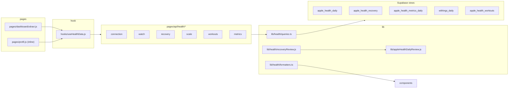

<!-- Generated by SpecStory, Markdown v2.1.0 -->

# 2026-07-15 00:12:10Z

<!-- Cursor IDE Session 2c59d34b-c790-4048-a938-b80097d3cc64 (2026-07-15 00:12:10Z) -->

_**User**_

Explore the Body & Mind ON health dashboard thoroughly. Focus on:
- components/health/* 
- lib/health/*
- pages/dashboard/zdravi.js
- pages/api/health/*

Find: what metrics/data exist, what interpretation/recommendations already exist (status lines, recovery, formatters), and gaps where raw data is shown without meaning.

Return: file paths, key functions/components, current UX copy patterns, and concrete suggestions for where to add evaluation/recommendations based on data.

---

_**Agent (composer-2.5-fast)**_

<think><details><summary>Thought Process</summary>
I am beginning a thorough exploration of the Body & Mind ON health dashboard. I will examine the components, libraries, and API routes to identify existing metrics, interpretation logic, and gaps where raw data lacks meaning.
</details></think>

_**Agent (composer-2.5-fast)**_

I'll map the health dashboard by scanning `components/health`, `lib/health`, the dashboard page, and health API routes.


_**Agent (composer-2.5-fast)**_

<tool-use data-tool-type="unknown" data-tool-name="update_current_step"><details>
<summary>Tool use: **update_current_step**</summary>
An unknown error occurred
</details></tool-use>

_**Agent (composer-2.5-fast)**_

<tool-use data-tool-type="search" data-tool-name="glob_file_search"><details>
<summary>Tool use: **glob_file_search** • Searched codebase "" • **10** results in **1** directory</summary>

Directory: **``** (10 files)

| File |
|------|
| `components\health\HealthProfileEntry.js` |
| `components\health\WorkoutsTable.js` |
| `components\health\HealthConnectionBanner.js` |
| `components\health\RecoveryCard.js` |
| `components\health\WithingsScaleSection.js` |
| `components\health\HealthMetricsGrid.js` |
| `components\health\RecoveryVitalsTiles.js` |
| `components\health\HealthLineChart.js` |
| `components\health\AppleWatchSection.js` |
| `components\health\MetricTile.js` |
</details></tool-use>

_**Agent (composer-2.5-fast)**_

<tool-use data-tool-type="search" data-tool-name="glob_file_search"><details>
<summary>Tool use: **glob_file_search** • Searched codebase "" • **8** results in **1** directory</summary>

Directory: **``** (8 files)

| File |
|------|
| `lib\health\guards.ts` |
| `lib\health\__tests__\formatters.test.ts` |
| `lib\health\__tests__\appleHealthDailyReview.test.ts` |
| `lib\health\formatters.ts` |
| `lib\health\recoveryReview.js` |
| `lib\health\queries.ts` |
| `lib\health\apiAuth.js` |
| `lib\health\types.ts` |
</details></tool-use>

_**Agent (composer-2.5-fast)**_

<tool-use data-tool-type="search" data-tool-name="glob_file_search"><details>
<summary>Tool use: **glob_file_search** • Searched codebase "" • **8** results in **1** directory</summary>

Directory: **``** (8 files)

| File |
|------|
| `pages\api\health\workouts.js` |
| `pages\api\health\recovery.js` |
| `pages\api\health\scale.js` |
| `pages\api\health\connections\revoke.js` |
| `pages\api\health\metrics.js` |
| `pages\api\health\watch.js` |
| `pages\api\health\connection.js` |
| `pages\api\health\connections\rotate.js` |
</details></tool-use>

_**Agent (composer-2.5-fast)**_

<tool-use data-tool-type="read" data-tool-name="read_file_v2"><details>
<summary>Tool use: **read_file_v2** • Read file: c:\Users\prikopa\Documents\GitHub\body-mind-on\pages\dashboard\zdravi.js</summary>

</details></tool-use>

_**Agent (composer-2.5-fast)**_

<think><details><summary>Thought Process</summary>
Starting a thorough review of the health dashboard components, library files, API routes, and data hooks to map out existing metrics, status logic, and raw data gaps.
</details></think>

_**Agent (composer-2.5-fast)**_

<tool-use data-tool-type="read" data-tool-name="read_file_v2"><details>
<summary>Tool use: **read_file_v2** • Read file: c:\Users\prikopa\Documents\GitHub\body-mind-on\lib\health\formatters.ts</summary>

</details></tool-use>

_**Agent (composer-2.5-fast)**_

<tool-use data-tool-type="read" data-tool-name="read_file_v2"><details>
<summary>Tool use: **read_file_v2** • Read file: c:\Users\prikopa\Documents\GitHub\body-mind-on\lib\health\recoveryReview.js</summary>

</details></tool-use>

_**Agent (composer-2.5-fast)**_

<tool-use data-tool-type="read" data-tool-name="read_file_v2"><details>
<summary>Tool use: **read_file_v2** • Read file: c:\Users\prikopa\Documents\GitHub\body-mind-on\lib\health\types.ts</summary>

</details></tool-use>

_**Agent (composer-2.5-fast)**_

<tool-use data-tool-type="read" data-tool-name="read_file_v2"><details>
<summary>Tool use: **read_file_v2** • Read file: c:\Users\prikopa\Documents\GitHub\body-mind-on\lib\health\queries.ts</summary>

</details></tool-use>

_**Agent (composer-2.5-fast)**_

<tool-use data-tool-type="read" data-tool-name="read_file_v2"><details>
<summary>Tool use: **read_file_v2** • Read file: c:\Users\prikopa\Documents\GitHub\body-mind-on\components\health\AppleWatchSection.js</summary>

</details></tool-use>

_**Agent (composer-2.5-fast)**_

<tool-use data-tool-type="read" data-tool-name="read_file_v2"><details>
<summary>Tool use: **read_file_v2** • Read file: c:\Users\prikopa\Documents\GitHub\body-mind-on\components\health\WithingsScaleSection.js</summary>

</details></tool-use>

_**Agent (composer-2.5-fast)**_

<tool-use data-tool-type="read" data-tool-name="read_file_v2"><details>
<summary>Tool use: **read_file_v2** • Read file: c:\Users\prikopa\Documents\GitHub\body-mind-on\components\health\RecoveryCard.js</summary>

</details></tool-use>

_**Agent (composer-2.5-fast)**_

<tool-use data-tool-type="read" data-tool-name="read_file_v2"><details>
<summary>Tool use: **read_file_v2** • Read file: c:\Users\prikopa\Documents\GitHub\body-mind-on\components\health\RecoveryVitalsTiles.js</summary>

</details></tool-use>

_**Agent (composer-2.5-fast)**_

<think><details><summary>Thought Process</summary>
Continuing to read the remaining components and API routes. Searching for the appleHealthDailyReview component and the useHealthData hook.
</details></think>

_**Agent (composer-2.5-fast)**_

<tool-use data-tool-type="read" data-tool-name="read_file_v2"><details>
<summary>Tool use: **read_file_v2** • Read file: c:\Users\prikopa\Documents\GitHub\body-mind-on\components\health\HealthMetricsGrid.js</summary>

</details></tool-use>

_**Agent (composer-2.5-fast)**_

<tool-use data-tool-type="read" data-tool-name="read_file_v2"><details>
<summary>Tool use: **read_file_v2** • Read file: c:\Users\prikopa\Documents\GitHub\body-mind-on\components\health\MetricTile.js</summary>

</details></tool-use>

_**Agent (composer-2.5-fast)**_

<tool-use data-tool-type="read" data-tool-name="read_file_v2"><details>
<summary>Tool use: **read_file_v2** • Read file: c:\Users\prikopa\Documents\GitHub\body-mind-on\components\health\WorkoutsTable.js</summary>

</details></tool-use>

_**Agent (composer-2.5-fast)**_

<tool-use data-tool-type="read" data-tool-name="read_file_v2"><details>
<summary>Tool use: **read_file_v2** • Read file: c:\Users\prikopa\Documents\GitHub\body-mind-on\components\health\HealthConnectionBanner.js</summary>

</details></tool-use>

_**Agent (composer-2.5-fast)**_

<tool-use data-tool-type="read" data-tool-name="read_file_v2"><details>
<summary>Tool use: **read_file_v2** • Read file: c:\Users\prikopa\Documents\GitHub\body-mind-on\components\health\HealthLineChart.js</summary>

</details></tool-use>

_**Agent (composer-2.5-fast)**_

<tool-use data-tool-type="read" data-tool-name="read_file_v2"><details>
<summary>Tool use: **read_file_v2** • Read file: c:\Users\prikopa\Documents\GitHub\body-mind-on\components\health\HealthProfileEntry.js</summary>

</details></tool-use>

_**Agent (composer-2.5-fast)**_

<tool-use data-tool-type="unknown" data-tool-name="ripgrep_raw_search"><details>
<summary>Tool use: **ripgrep_raw_search**</summary>
Glob pattern "**/*" matches every file and is not allowed. Use a more specific glob or no glob.
</details></tool-use>

_**Agent (composer-2.5-fast)**_

<think><details><summary>Thought Process</summary>
Searching for `useHealthData` and `appleHealthDailyReview` separately. Reading all API routes next.
</details></think>

_**Agent (composer-2.5-fast)**_

<tool-use data-tool-type="unknown" data-tool-name="ripgrep_raw_search"><details>
<summary>Tool use: **ripgrep_raw_search**</summary>

Parameters:

```json
{
  "caseInsensitive": false,
  "outputMode": "content",
  "path": "c:\\Users\\prikopa\\Documents\\GitHub\\body-mind-on",
  "pattern": "useHealthData|appleHealthDailyReview|buildAggregatedRecoverySummary|consecutive_low_recovery"
}
```
Additional data:

```json
{
  "isPruned": true,
  "outputMode": "content",
  "path": "c:\\Users\\prikopa\\Documents\\GitHub\\body-mind-on",
  "pattern": "useHealthData|appleHealthDailyReview|buildAggregatedRecoverySummary|consecutive_low_recovery",
  "topFiles": [
    {
      "matchCount": 1,
      "uri": "hooks\\useHealthData.js"
    },
    {
      "matchCount": 2,
      "uri": "lib\\health\\recoveryReview.js"
    },
    {
      "matchCount": 1,
      "uri": "pages\\api\\cron\\apple-health-daily-review.js"
    },
    {
      "matchCount": 3,
      "uri": "lib\\appleHealthDailyReview.js"
    },
    {
      "matchCount": 2,
      "uri": "pages\\profil.js"
    },
    {
      "matchCount": 1,
      "uri": "package.json"
    },
    {
      "matchCount": 2,
      "uri": "pages\\dashboard\\zdravi.js"
    }
  ],
  "totalFiles": 7,
  "totalMatches": 12
}
```
Status: **completed**

</details></tool-use>

_**Agent (composer-2.5-fast)**_

<tool-use data-tool-type="read" data-tool-name="read_file_v2"><details>
<summary>Tool use: **read_file_v2** • Read file: c:\Users\prikopa\Documents\GitHub\body-mind-on\pages\api\health\recovery.js</summary>

</details></tool-use>

_**Agent (composer-2.5-fast)**_

<tool-use data-tool-type="read" data-tool-name="read_file_v2"><details>
<summary>Tool use: **read_file_v2** • Read file: c:\Users\prikopa\Documents\GitHub\body-mind-on\pages\api\health\metrics.js</summary>

</details></tool-use>

_**Agent (composer-2.5-fast)**_

<tool-use data-tool-type="read" data-tool-name="read_file_v2"><details>
<summary>Tool use: **read_file_v2** • Read file: c:\Users\prikopa\Documents\GitHub\body-mind-on\pages\api\health\watch.js</summary>

</details></tool-use>

_**Agent (composer-2.5-fast)**_

<tool-use data-tool-type="read" data-tool-name="read_file_v2"><details>
<summary>Tool use: **read_file_v2** • Read file: c:\Users\prikopa\Documents\GitHub\body-mind-on\pages\api\health\scale.js</summary>

</details></tool-use>

_**Agent (composer-2.5-fast)**_

<tool-use data-tool-type="read" data-tool-name="read_file_v2"><details>
<summary>Tool use: **read_file_v2** • Read file: c:\Users\prikopa\Documents\GitHub\body-mind-on\pages\api\health\workouts.js</summary>

</details></tool-use>

_**Agent (composer-2.5-fast)**_

<tool-use data-tool-type="read" data-tool-name="read_file_v2"><details>
<summary>Tool use: **read_file_v2** • Read file: c:\Users\prikopa\Documents\GitHub\body-mind-on\pages\api\health\connection.js</summary>

</details></tool-use>

_**Agent (composer-2.5-fast)**_

<think><details><summary>Thought Process</summary>
The next step is to examine the useHealthData hook, appleHealthDailyReview, related tests, database migrations, and the profil module.

Checking JS health usage and whether RecoveryCard displays all metrics shown in CSS.
</details></think>

_**Agent (composer-2.5-fast)**_

<tool-use data-tool-type="read" data-tool-name="read_file_v2"><details>
<summary>Tool use: **read_file_v2** • Read file: c:\Users\prikopa\Documents\GitHub\body-mind-on\hooks\useHealthData.js</summary>

</details></tool-use>

_**Agent (composer-2.5-fast)**_

<tool-use data-tool-type="read" data-tool-name="read_file_v2"><details>
<summary>Tool use: **read_file_v2** • Read file: c:\Users\prikopa\Documents\GitHub\body-mind-on\lib\appleHealthDailyReview.js</summary>

</details></tool-use>

_**Agent (composer-2.5-fast)**_

<tool-use data-tool-type="read" data-tool-name="read_file_v2"><details>
<summary>Tool use: **read_file_v2** • Read file: c:\Users\prikopa\Documents\GitHub\body-mind-on\lib\health\__tests__\formatters.test.ts</summary>

</details></tool-use>

_**Agent (composer-2.5-fast)**_

<tool-use data-tool-type="unknown" data-tool-name="ripgrep_raw_search"><details>
<summary>Tool use: **ripgrep_raw_search**</summary>

Parameters:

```json
{
  "caseInsensitive": false,
  "outputMode": "files_with_matches",
  "path": "c:\\Users\\prikopa\\Documents\\GitHub\\body-mind-on\\supabase\\migrations",
  "pattern": "apple_health_|withings_daily"
}
```
Additional data:

```json
{
  "isPruned": true,
  "outputMode": "files_with_matches",
  "path": "c:\\Users\\prikopa\\Documents\\GitHub\\body-mind-on\\supabase\\migrations",
  "pattern": "apple_health_|withings_daily",
  "topFiles": [
    {
      "matchCount": 1,
      "uri": "supabase\\migrations\\20260714222608_recovery_score_without_sleep.sql"
    },
    {
      "matchCount": 1,
      "uri": "supabase\\migrations\\20260714180000_baseline_schema.sql"
    },
    {
      "matchCount": 1,
      "uri": "supabase\\migrations\\20260714231414_metrics_daily_add_last_measured_at.sql"
    }
  ],
  "totalFiles": 3,
  "totalMatches": 3
}
```
Status: **completed**

</details></tool-use>

_**Agent (composer-2.5-fast)**_

<tool-use data-tool-type="unknown" data-tool-name="ripgrep_raw_search"><details>
<summary>Tool use: **ripgrep_raw_search**</summary>

Parameters:

```json
{
  "caseInsensitive": false,
  "context": 3,
  "path": "c:\\Users\\prikopa\\Documents\\GitHub\\body-mind-on\\pages\\profil.js",
  "pattern": "health|recovery|zdravi"
}
```
Additional data:

```json
{
  "isPruned": true,
  "outputMode": "content",
  "path": "c:\\Users\\prikopa\\Documents\\GitHub\\body-mind-on\\pages\\profil.js",
  "pattern": "health|recovery|zdravi",
  "topFiles": [
    {
      "matchCount": 344,
      "uri": "pages\\profil.js"
    }
  ],
  "totalFiles": 1,
  "totalMatches": 91
}
```
Status: **completed**

</details></tool-use>

_**Agent (composer-2.5-fast)**_

<think><details><summary>Thought Process</summary>
I am examining the database schemas for apple_health_daily, apple_health_recovery, withings_daily, apple_health_metrics_daily, and workout tables to identify all available fields.

Also checking whether the recovery card previously included metrics download functionality that was later removed.
</details></think>

_**Agent (composer-2.5-fast)**_

<tool-use data-tool-type="unknown" data-tool-name="ripgrep_raw_search"><details>
<summary>Tool use: **ripgrep_raw_search**</summary>

Parameters:

```json
{
  "caseInsensitive": false,
  "contextAfter": 15,
  "outputMode": "content",
  "path": "c:\\Users\\prikopa\\Documents\\GitHub\\body-mind-on\\supabase\\migrations",
  "pattern": "apple_health_daily|apple_health_recovery|withings_daily|apple_health_metrics_daily|apple_health_workouts"
}
```
Additional data:

```json
{
  "isPruned": true,
  "outputMode": "content",
  "path": "c:\\Users\\prikopa\\Documents\\GitHub\\body-mind-on\\supabase\\migrations",
  "pattern": "apple_health_daily|apple_health_recovery|withings_daily|apple_health_metrics_daily|apple_health_workouts",
  "topFiles": [
    {
      "matchCount": 391,
      "uri": "supabase\\migrations\\20260714180000_baseline_schema.sql"
    },
    {
      "matchCount": 33,
      "uri": "supabase\\migrations\\20260714222608_recovery_score_without_sleep.sql"
    },
    {
      "matchCount": 19,
      "uri": "supabase\\migrations\\20260714231414_metrics_daily_add_last_measured_at.sql"
    }
  ],
  "totalFiles": 3,
  "totalMatches": 59
}
```
Status: **completed**

</details></tool-use>

_**Agent (composer-2.5-fast)**_

<tool-use data-tool-type="read" data-tool-name="read_file_v2"><details>
<summary>Tool use: **read_file_v2** • Read file: c:\Users\prikopa\Documents\GitHub\body-mind-on\lib\health\guards.ts</summary>

</details></tool-use>

_**Agent (composer-2.5-fast)**_

<tool-use data-tool-type="read" data-tool-name="read_file_v2"><details>
<summary>Tool use: **read_file_v2** • Read file: c:\Users\prikopa\Documents\GitHub\body-mind-on\lib\health\apiAuth.js</summary>

</details></tool-use>

_**Agent (composer-2.5-fast)**_

<tool-use data-tool-type="unknown" data-tool-name="ripgrep_raw_search"><details>
<summary>Tool use: **ripgrep_raw_search**</summary>

Parameters:

```json
{
  "caseInsensitive": false,
  "glob": "**/*.{js,ts,sql}",
  "path": "c:\\Users\\prikopa\\Documents\\GitHub\\body-mind-on",
  "pattern": "recovery_score|hrv_delta|sleep_asleep|body_fat|vo2_max|blood_oxygen"
}
```
Additional data:

```json
{
  "isPruned": true,
  "outputMode": "content",
  "path": "c:\\Users\\prikopa\\Documents\\GitHub\\body-mind-on",
  "pattern": "recovery_score|hrv_delta|sleep_asleep|body_fat|vo2_max|blood_oxygen",
  "topFiles": [
    {
      "matchCount": 9,
      "uri": "supabase\\migrations\\20260714222608_recovery_score_without_sleep.sql"
    },
    {
      "matchCount": 21,
      "uri": "supabase\\migrations\\20260714180000_baseline_schema.sql"
    },
    {
      "matchCount": 6,
      "uri": "lib\\health\\recoveryReview.js"
    },
    {
      "matchCount": 7,
      "uri": "lib\\health\\__tests__\\appleHealthDailyReview.test.ts"
    },
    {
      "matchCount": 2,
      "uri": "components\\health\\HealthMetricsGrid.js"
    },
    {
      "matchCount": 2,
      "uri": "components\\health\\WithingsScaleSection.js"
    },
    {
      "matchCount": 4,
      "uri": "components\\health\\RecoveryCard.js"
    },
    {
      "matchCount": 12,
      "uri": "lib\\database.types.ts"
    },
    {
      "matchCount": 4,
      "uri": "pages/admin.js"
    }
  ],
  "totalFiles": 9,
  "totalMatches": 67
}
```
Status: **completed**

</details></tool-use>

_**Agent (composer-2.5-fast)**_

<think><details><summary>Thought Process</summary>
Checking the schema for `apple_health_daily` and `apple_health_recovery` views to identify available metrics and data structures.

Comparing `WithingsBodyDevelopmentSection` against Apple Health data to check for sleep metrics and UX patterns.
</details></think>

_**Agent (composer-2.5-fast)**_

<tool-use data-tool-type="read" data-tool-name="read_file_v2"><details>
<summary>Tool use: **read_file_v2** • Read file: c:\Users\prikopa\Documents\GitHub\body-mind-on\supabase\migrations\20260714180000_baseline_schema.sql</summary>

</details></tool-use>

_**Agent (composer-2.5-fast)**_

<tool-use data-tool-type="unknown" data-tool-name="ripgrep_raw_search"><details>
<summary>Tool use: **ripgrep_raw_search**</summary>

Parameters:

```json
{
  "caseInsensitive": false,
  "path": "c:\\Users\\prikopa\\Documents\\GitHub\\body-mind-on\\components",
  "pattern": "sleep_|vo2|spo2|hrv_delta|workout_avg|exercise_min"
}
```
Additional data:

```json
{
  "isPruned": true,
  "outputMode": "content",
  "path": "c:\\Users\\prikopa\\Documents\\GitHub\\body-mind-on\\components",
  "pattern": "sleep_|vo2|spo2|hrv_delta|workout_avg|exercise_min",
  "topFiles": [
    {
      "matchCount": 1,
      "uri": "components\\health\\HealthMetricsGrid.js"
    }
  ],
  "totalFiles": 1,
  "totalMatches": 1
}
```
Status: **completed**

</details></tool-use>

_**Agent (composer-2.5-fast)**_

<tool-use data-tool-type="unknown" data-tool-name="ripgrep_raw_search"><details>
<summary>Tool use: **ripgrep_raw_search**</summary>

Parameters:

```json
{
  "caseInsensitive": false,
  "contextAfter": 30,
  "path": "c:\\Users\\prikopa\\Documents\\GitHub\\body-mind-on\\lib\\database.types.ts",
  "pattern": "apple_health_daily|withings_daily"
}
```
Additional data:

```json
{
  "isPruned": true,
  "outputMode": "content",
  "path": "c:\\Users\\prikopa\\Documents\\GitHub\\body-mind-on\\lib\\database.types.ts",
  "pattern": "apple_health_daily|withings_daily",
  "topFiles": [
    {
      "matchCount": 62,
      "uri": "lib\\database.types.ts"
    }
  ],
  "totalFiles": 1,
  "totalMatches": 2
}
```
Status: **completed**

</details></tool-use>

_**Agent (composer-2.5-fast)**_

<think><details><summary>Thought Process</summary>
Checking WithingsBodyDevelopmentSection for additional interpretation logic. Reviewing the recovery score migration without sleep to assess its current state.

Also checking apple_health_metric_defs for the key metrics list.
</details></think>

_**Agent (composer-2.5-fast)**_

<tool-use data-tool-type="read" data-tool-name="read_file_v2"><details>
<summary>Tool use: **read_file_v2** • Read file: c:\Users\prikopa\Documents\GitHub\body-mind-on\supabase\migrations\20260714222608_recovery_score_without_sleep.sql</summary>

</details></tool-use>

_**Agent (composer-2.5-fast)**_

<tool-use data-tool-type="unknown" data-tool-name="ripgrep_raw_search"><details>
<summary>Tool use: **ripgrep_raw_search**</summary>

Parameters:

```json
{
  "caseInsensitive": false,
  "path": "c:\\Users\\prikopa\\Documents\\GitHub\\body-mind-on\\components\\profile",
  "pattern": "WithingsBodyDevelopment|interpret|doporuč|status|trend"
}
```
Additional data:

```json
{
  "isPruned": true,
  "outputMode": "content",
  "path": "c:\\Users\\prikopa\\Documents\\GitHub\\body-mind-on\\components\\profile",
  "pattern": "WithingsBodyDevelopment|interpret|doporuč|status|trend",
  "topFiles": [
    {
      "matchCount": 6,
      "uri": "components/profile/PreferencesOverlay.jsx"
    },
    {
      "matchCount": 2,
      "uri": "components/profile/WithingsProfileCard.js"
    },
    {
      "matchCount": 4,
      "uri": "components/profile/WorkoutOverlay.jsx"
    },
    {
      "matchCount": 5,
      "uri": "components\\profile\\ProfileProgressSection.js"
    },
    {
      "matchCount": 1,
      "uri": "components\\profile\\ProfileTodayPanels.js"
    },
    {
      "matchCount": 26,
      "uri": "components/profile/WithingsBodyDevelopmentSection.js"
    },
    {
      "matchCount": 2,
      "uri": "components/profile/HabitChipGrid.jsx"
    }
  ],
  "totalFiles": 7,
  "totalMatches": 46
}
```
Status: **completed**

</details></tool-use>

_**Agent (composer-2.5-fast)**_

<tool-use data-tool-type="unknown" data-tool-name="ripgrep_raw_search"><details>
<summary>Tool use: **ripgrep_raw_search**</summary>

Parameters:

```json
{
  "caseInsensitive": false,
  "path": "c:\\Users\\prikopa\\Documents\\GitHub\\body-mind-on\\supabase\\migrations\\20260714180000_baseline_schema.sql",
  "pattern": "is_key.*true|apple_health_metric_defs"
}
```
Additional data:

```json
{
  "isPruned": true,
  "outputMode": "content",
  "path": "c:\\Users\\prikopa\\Documents\\GitHub\\body-mind-on\\supabase\\migrations\\20260714180000_baseline_schema.sql",
  "pattern": "is_key.*true|apple_health_metric_defs",
  "topFiles": [
    {
      "matchCount": 17,
      "uri": "supabase\\migrations\\20260714180000_baseline_schema.sql"
    }
  ],
  "totalFiles": 1,
  "totalMatches": 17
}
```
Status: **completed**

</details></tool-use>

_**Agent (composer-2.5-fast)**_

<think><details><summary>Thought Process</summary>
Comparing metric definitions and the WithingsBodyDevelopmentSection component to identify existing interpretation patterns.

RecoveryCard renders no content despite global CSS targeting `.hea-recovery-metrics`. This is a UI gap.
</details></think>

_**Agent (composer-2.5-fast)**_

<tool-use data-tool-type="read" data-tool-name="read_file_v2"><details>
<summary>Tool use: **read_file_v2** • Read file: c:\Users\prikopa\Documents\GitHub\body-mind-on\supabase\migrations\20260714180000_baseline_schema.sql</summary>

</details></tool-use>

_**Agent (composer-2.5-fast)**_

<tool-use data-tool-type="read" data-tool-name="read_file_v2"><details>
<summary>Tool use: **read_file_v2** • Read file: c:\Users\prikopa\Documents\GitHub\body-mind-on\components\profile\WithingsBodyDevelopmentSection.js</summary>

</details></tool-use>

_**Agent (composer-2.5-fast)**_

<tool-use data-tool-type="unknown" data-tool-name="ripgrep_raw_search"><details>
<summary>Tool use: **ripgrep_raw_search**</summary>

Parameters:

```json
{
  "caseInsensitive": false,
  "path": "c:\\Users\\prikopa\\Documents\\GitHub\\body-mind-on",
  "pattern": "HealthProfileEntry|dashboard/zdravi"
}
```
Additional data:

```json
{
  "isPruned": true,
  "outputMode": "content",
  "path": "c:\\Users\\prikopa\\Documents\\GitHub\\body-mind-on",
  "pattern": "HealthProfileEntry|dashboard/zdravi",
  "topFiles": [
    {
      "matchCount": 1,
      "uri": "pages\\dashboard\\zdravi.js"
    },
    {
      "matchCount": 2,
      "uri": "components\\health\\HealthProfileEntry.js"
    }
  ],
  "totalFiles": 2,
  "totalMatches": 3
}
```
Status: **completed**

</details></tool-use>

_**Agent (composer-2.5-fast)**_

<think><details><summary>Thought Process</summary>
RecoveryCard likely never rendered its metrics DL. CSS exists in zdravi.js and profil.js, but the component does not display those elements.

Checking whether coach AI recommendations appear anywhere in the UI.
</details></think>

_**Agent (composer-2.5-fast)**_

<tool-use data-tool-type="unknown" data-tool-name="ripgrep_raw_search"><details>
<summary>Tool use: **ripgrep_raw_search**</summary>

Parameters:

```json
{
  "caseInsensitive": false,
  "path": "c:\\Users\\prikopa\\Documents\\GitHub\\body-mind-on",
  "pattern": "apple_health_daily_review|coach.*health|health-recovery-metrics"
}
```
Additional data:

```json
{
  "isPruned": true,
  "outputMode": "content",
  "path": "c:\\Users\\prikopa\\Documents\\GitHub\\body-mind-on",
  "pattern": "apple_health_daily_review|coach.*health|health-recovery-metrics",
  "topFiles": [
    {
      "matchCount": 2,
      "uri": "lib\\appleHealthDailyReview.js"
    },
    {
      "matchCount": 1,
      "uri": "lib\\aiScheduler.js"
    },
    {
      "matchCount": 1,
      "uri": "lib\\coachFallbackMessage.js"
    },
    {
      "matchCount": 3,
      "uri": "pages\\dashboard\\zdravi.js"
    },
    {
      "matchCount": 2,
      "uri": "lib\\taskExecutors.js"
    },
    {
      "matchCount": 3,
      "uri": "pages\\profil.js"
    },
    {
      "matchCount": 2,
      "uri": "lib\\agentPromptsForSync.js"
    },
    {
      "matchCount": 1,
      "uri": "lib\\aiTaskRegistry.js"
    }
  ],
  "totalFiles": 8,
  "totalMatches": 15
}
```
Status: **completed**

</details></tool-use>

_**Agent (composer-2.5-fast)**_

<tool-use data-tool-type="unknown" data-tool-name="ripgrep_raw_search"><details>
<summary>Tool use: **ripgrep_raw_search**</summary>

Parameters:

```json
{
  "caseInsensitive": false,
  "path": "c:\\Users\\prikopa\\Documents\\GitHub\\body-mind-on\\components\\profile\\ProfileProgressSection.js",
  "pattern": "getWeightTrend|getRecommendedNextStep"
}
```
Additional data:

```json
{
  "isPruned": true,
  "outputMode": "content",
  "path": "c:\\Users\\prikopa\\Documents\\GitHub\\body-mind-on\\components\\profile\\ProfileProgressSection.js",
  "pattern": "getWeightTrend|getRecommendedNextStep",
  "topFiles": [
    {
      "matchCount": 4,
      "uri": "components\\profile\\ProfileProgressSection.js"
    }
  ],
  "totalFiles": 1,
  "totalMatches": 4
}
```
Status: **completed**

</details></tool-use>

_**Agent (composer-2.5-fast)**_

<tool-use data-tool-type="read" data-tool-name="read_file_v2"><details>
<summary>Tool use: **read_file_v2** • Read file: c:\Users\prikopa\Documents\GitHub\body-mind-on\pages\api\health\connections\revoke.js</summary>

</details></tool-use>

_**Agent (composer-2.5-fast)**_

<think><details><summary>Thought Process</summary>
Checking taskExecutors for apple_health_daily_review to see what AI output exists and whether it appears in the UI.
</details></think>

_**Agent (composer-2.5-fast)**_

<tool-use data-tool-type="read" data-tool-name="read_file_v2"><details>
<summary>Tool use: **read_file_v2** • Read file: c:\Users\prikopa\Documents\GitHub\body-mind-on\lib\taskExecutors.js</summary>

</details></tool-use>

_**Agent (composer-2.5-fast)**_

<tool-use data-tool-type="unknown" data-tool-name="ripgrep_raw_search"><details>
<summary>Tool use: **ripgrep_raw_search**</summary>

Parameters:

```json
{
  "caseInsensitive": false,
  "glob": "**/*.{js,jsx,ts,tsx}",
  "path": "c:\\Users\\prikopa\\Documents\\GitHub\\body-mind-on",
  "pattern": "recovery_message|apple_health|health.*coach"
}
```
Additional data:

```json
{
  "isPruned": true,
  "outputMode": "content",
  "path": "c:\\Users\\prikopa\\Documents\\GitHub\\body-mind-on",
  "pattern": "recovery_message|apple_health|health.*coach",
  "topFiles": [
    {
      "matchCount": 1,
      "uri": "lib/aiSharedMemory.js"
    },
    {
      "matchCount": 1,
      "uri": "pages\\api\\health\\connections\\revoke.js"
    },
    {
      "matchCount": 2,
      "uri": "lib/aiScheduler.js"
    },
    {
      "matchCount": 2,
      "uri": "lib/coachFallbackMessage.js"
    },
    {
      "matchCount": 2,
      "uri": "lib\\coachFallbackMessage.js"
    },
    {
      "matchCount": 1,
      "uri": "scripts/apply-agent-prompts.js"
    },
    {
      "matchCount": 2,
      "uri": "lib/agentPromptsForSync.js"
    },
    {
      "matchCount": 5,
      "uri": "lib/taskExecutors.js"
    },
    {
      "matchCount": 5,
      "uri": "lib\\health\\queries.ts"
    },
    {
      "matchCount": 2,
      "uri": "lib\\aiTaskRegistry.js"
    },
    {
      "matchCount": 2,
      "uri": "lib\\agentPromptsForSync.js"
    },
    {
      "matchCount": 3,
      "uri": "pages\\api\\health\\connections\\rotate.js"
    },
    {
      "matchCount": 12,
      "uri": "lib\\appleHealthDailyReview.js"
    }
  ],
  "totalFiles": 13,
  "totalMatches": 71
}
```
Status: **completed**

</details></tool-use>

_**Agent (composer-2.5-fast)**_

<think><details><summary>Thought Process</summary>
The full scope of the health dashboard is now clear.

The dashboard page `pages/dashboard/zdravi.js` uses `useHealthData` to fetch six APIs in parallel. It renders `AppleWatchSection` and `WithingsScaleSection`. The profile page `pages/profil.js` also embeds `AppleWatchSection` inline. `WithingsBodyDevelopmentSection` there is richer than the scale section on the dashboard. `HealthProfileEntry` and `ProfileProgressSection` may hold reusable weight trend patterns.

APIs are thin pass-throughs to `lib/health/queries.ts`. Underlying database views include `apple_health_daily`, `apple_health_recovery`, `apple_health_metrics_daily`, `withings_daily`, and `apple_health_workouts`.

Interpretation layers already exist:
- `buildConnectionBanner` provides sync status messages.
- Recovery scores use high/medium/low bands with labels, tips, status reasons, and explain text.
- Charts for HRV, RHR, Steps, and Active Energy carry status lines via formatters.
- `RecoveryVitalsTiles` and `RecoveryCard` offer band-specific tips.

An AI backend module, `lib/appleHealthDailyReview.js`, generates coach reviews and triggers low-recovery alerts for trainers.

Three main gaps leave raw data uninterpreted:

- `HealthMetricsGrid` shows primary metrics as bare values and dates. Only HRV and RHR carry status hints; steps, VO2, SpO2, exercise time, and distance lack any interpretation.
- Expanded metrics pages list labels and values but provide no context or guidance.
- `WithingsScaleSection` displays raw latest stats and charts without trend deltas or recommendations. The profile’s `WithingsBodyDevelopmentSection` already offers 7-day and 30-day trend comparisons.

Additional gaps remain:

- `WorkoutsTable` lists raw logs without volume summaries, intensity levels, or correlations to recovery.
- `RecoveryCard` hides underlying metrics such as sleep, `hrv_delta`, and `rhr_delta` even though the CSS class and data rows exist.
- Sleep data is stored in the database but never rendered in the UI.
- `RecoveryVitalsTiles` shows values without comparing them to baselines.
- The active energy chart reports a calorie count without interpretation thresholds.

More data sits unused or hidden. `consecutive_low_recovery` is computed in `recoveryReview` but only drives the AI cron; it never reaches the user. Coach recommendations live in shared memory and are not surfaced on the health dashboard. Workout detail fields like average heart rate, maximum heart rate, and elevation exist in the database but are missing from the workout table.
</details></think>

_**Agent (composer-2.5-fast)**_

<tool-use data-tool-type="unknown" data-tool-name="ripgrep_raw_search"><details>
<summary>Tool use: **ripgrep_raw_search**</summary>

Parameters:

```json
{
  "caseInsensitive": false,
  "path": "c:\\Users\\prikopa\\Documents\\GitHub\\body-mind-on\\components",
  "pattern": "sleep_asleep|sleep_deep|Spánek|spánek"
}
```
Additional data:

```json
{
  "isPruned": true,
  "outputMode": "content",
  "path": "c:\\Users\\prikopa\\Documents\\GitHub\\body-mind-on\\components",
  "pattern": "sleep_asleep|sleep_deep|Spánek|spánek",
  "topFiles": [
    {
      "matchCount": 1,
      "uri": "components/VipTour.js"
    },
    {
      "matchCount": 1,
      "uri": "components\\health\\AppleWatchSection.js"
    },
    {
      "matchCount": 1,
      "uri": "components/OnClubTour.js"
    }
  ],
  "totalFiles": 3,
  "totalMatches": 3
}
```
Status: **completed**

</details></tool-use>

_**Agent (composer-2.5-fast)**_

<tool-use data-tool-type="unknown" data-tool-name="ripgrep_raw_search"><details>
<summary>Tool use: **ripgrep_raw_search**</summary>

Parameters:

```json
{
  "caseInsensitive": false,
  "path": "c:\\Users\\prikopa\\Documents\\GitHub\\body-mind-on",
  "pattern": "shared_apple_health_review"
}
```
Additional data:

```json
{
  "isPruned": true,
  "outputMode": "content",
  "path": "c:\\Users\\prikopa\\Documents\\GitHub\\body-mind-on",
  "pattern": "shared_apple_health_review",
  "topFiles": [
    {
      "matchCount": 1,
      "uri": "lib\\taskExecutors.js"
    }
  ],
  "totalFiles": 1,
  "totalMatches": 1
}
```
Status: **completed**

</details></tool-use>

_**Agent (composer-2.5-fast)**_

<tool-use data-tool-type="read" data-tool-name="read_file_v2"><details>
<summary>Tool use: **read_file_v2** • Read file: c:\Users\prikopa\Documents\GitHub\body-mind-on\lib\coachFallbackMessage.js</summary>

</details></tool-use>

_**Agent (composer-2.5-fast)**_

<think><details><summary>Thought Process</summary>
A duplication exists between profil.js and zdravi.js. The former renders AppleWatchSection inline, while the latter displays the full page containing both sections.

Withings data rendering differs by page: profil.js uses WithingsBodyDevelopmentSection, while zdravi.js uses the simpler WithingsScaleSection. The recovery card contains unused CSS for a metrics grid, but the component never renders it. The formatRecoveryStatusLabel function still references 'chybi_spanek', though the database migration removed sleep as a required recovery status field. These findings will now be compiled into a full report with absolute paths, key functions, UX copy patterns, and concrete recommendations.
</details></think>

_**Agent (composer-2.5-fast)**_

<tool-use data-tool-type="unknown" data-tool-name="update_current_step"><details>
<summary>Tool use: **update_current_step**</summary>
An unknown error occurred
</details></tool-use>

_**Agent (composer-2.5-fast)**_

<think><details><summary>Thought Process</summary>
Compiling a detailed report on the Body & Mind ON health dashboard. The analysis covers component and library files, API endpoints, existing metrics and status logic, UX copy patterns, and concrete recommendations for adding data interpretation and recovery guidance.
</details></think>

_**Agent (composer-2.5-fast)**_

# Health Dashboard Audit — Body & Mind ON

## Architecture overview



**Entry points**
- `c:\Users\prikopa\Documents\GitHub\body-mind-on\pages\dashboard\zdravi.js` — dedicated page “Zdraví a regenerace”
- `c:\Users\prikopa\Documents\GitHub\body-mind-on\pages\profil.js` — embeds `AppleWatchSection` inline (trainers excluded); Withings uses the richer `WithingsBodyDevelopmentSection`, not `WithingsScaleSection`
- `c:\Users\prikopa\Documents\GitHub\body-mind-on\components\health\HealthProfileEntry.js` — link card to `/dashboard/zdravi` (not wired into profil from grep)

**Data loading**: `c:\Users\prikopa\Documents\GitHub\body-mind-on\hooks\useHealthData.js` — parallel fetch of 6 endpoints (30 days, 20 workouts).

---

## Data sources & metrics

### Apple Watch — `apple_health_daily` view
`lib/health/queries.ts` → `getWatchDaily()` → `/api/health/watch`

| Field group | Fields |
|---|---|
| Activity | `steps`, `active_kcal`, `basal_kcal`, `exercise_min`, `stand_hours`, `flights`, `daylight_min` |
| Movement | `distance_km`, `cycling_km`, `swimming_m` |
| Heart | `resting_hr`, `avg_hr`, `max_hr`, `min_hr`, `hrv_ms`, `walking_hr`, `cardio_recovery`, `vo2max`, `respiratory_rate`, `spo2` |
| Sleep | `sleep_asleep_min`, `sleep_deep_min`, `sleep_rem_min`, `sleep_core_min`, `sleep_efficiency_pct` |
| Workouts (aggregated) | `workout_count`, `workout_min`, `workout_kcal`, `workout_avg_hr`, `workout_max_hr`, `workout_km`, `workout_types`, `workout_labels`, `workout_categories` |

### Recovery — `apple_health_recovery` view
`getRecovery()` → `/api/health/recovery`

Computed fields: `hrv_baseline7`, `rhr_baseline7`, `hrv_delta_pct`, `rhr_delta_bpm`, `recovery_score` (0–100), `recovery_status`, `has_sleep`.

Score formula (post-migration `20260714222608_recovery_score_without_sleep.sql`): HRV 40% + RHR 30% + sleep 30% when sleep present; otherwise HRV+RHR scaled to 100. Status `ok` no longer requires sleep.

### Metrics grid — `apple_health_metrics_daily` view
`getAllMetrics()` → `/api/health/metrics`

All Apple Health metrics with `label_cs`, `category`, `unit`, `is_key`, `value`, `last_measured_at`. Registry in `apple_health_metric_defs` (~40 named metrics across categories aktivita/srdce/pohyb/dychani/telo/prostredi).

### Workouts — `apple_health_workouts` table
`getWorkouts()` → `/api/health/workouts`

Per session: `workout_type` (mapped to `label_cs`, `category`), `duration_s`, `distance_m`, `active_kcal`, `avg_hr`, `max_hr`, `elevation_m`.

### Withings — `withings_daily` view
`getScaleDaily()` → `/api/health/scale`

`weight_kg`, `body_fat_pct`, `muscle_mass_kg`, plus unused in UI: `fat_mass_kg`, `bone_mass_kg`, `hydration_percent`, `bmi`, `bmr_kcal`, `visceral_fat`, `pulse`.

### Connection — `apple_health_connections`
`getConnectionStatus()` → `/api/health/connection` — device label, sync timestamps, errors, banner level.

---

## Components map

| File | Role |
|---|---|
| `components/health/AppleWatchSection.js` | Orchestrates Watch UI: banner → recovery → vitals → 4 charts → metrics grid → workouts |
| `components/health/RecoveryCard.js` | Recovery score, band label, explain, tip |
| `components/health/RecoveryVitalsTiles.js` | HRV + RHR tiles with educational captions |
| `components/health/HealthConnectionBanner.js` | Sync status banner |
| `components/health/HealthLineChart.js` | 30-day line charts + status line + baseline delta |
| `components/health/HealthMetricsGrid.js` | “Dnešní přehled” + expandable all metrics |
| `components/health/MetricTile.js` | Generic value/unit/date tile; optional `caption`/`hint` |
| `components/health/WorkoutsTable.js` | Raw workout log table |
| `components/health/WithingsScaleSection.js` | Latest 3 stats + 3 charts (no trends) |

---

## Existing interpretation & recommendations

### 1. Connection / sync (`lib/health/formatters.ts`)
- `buildConnectionBanner()` — levels `ok` / `warning` / `none`
- Copy: “Apple Watch synchronizace v pořádku”, stale >24h, sync error, revoked, not connected
- `formatRelativeSyncCs()` — “před X min/h/dny”

### 2. Recovery score (`formatters.ts` + `RecoveryCard.js`)
- `getRecoveryBand()` / `getRecoveryBandInfo()` — bands ≥75 / ≥50 / <50
- Labels: **„Jeď naplno“** / **„Ubrat intenzitu“** / **„Spíš regenerace“**
- `getRecoveryBandTip()` — actionable one-liners per band
- `formatRecoveryStatusLabel()` — incomplete data reasons
- Disclaimer pattern: *„Orientační ukazatel tréninkové zátěže — není zdravotní diagnostika.“*
- Explain block: score derived from HRV + RHR vs 7d baseline

### 3. Chart status lines (`formatters.ts` → `AppleWatchSection.js`)
| Chart | Function | Example copy |
|---|---|---|
| HRV | `getHrvChartStatus()` | “Dnes pod tvým 7denním průměrem — tělo je zatížené.” / “Nad průměrem — dobrá regenerace.” |
| Klidový tep | `getRhrChartStatus()` | “Zvýšený oproti průměru — možná únava nebo stres.” / “V normě, tělo je v pohodě.” |
| Kroky | `getStepsChartStatus()` | Thresholds 5k / 10k: “Málo pohybu.” / “Skvělý den.” |
| Aktivní energie | `getActiveEnergyChartStatus()` | Factual only: “Dnes X kcal spáleno pohybem.” |

`HealthLineChart` also shows delta vs 7d baseline with ↑/↓ arrows.

### 4. Vitals captions (`RecoveryVitalsTiles.js`)
Static education (not personalized):
- HRV: *„Vyšší bývá spojené s lepší regenerací. Sleduje se trend, ne jedno číslo.“*
- RHR: *„Když vyskočí nad tvůj průměr, tělo často zvládá únavu, stres nebo nemoc.“*

### 5. Backend AI (not shown in dashboard)
`lib/appleHealthDailyReview.js` + `lib/health/recoveryReview.js`:
- Daily coach task `apple_health_daily_review` with aggregated 14-day summary
- Trainer trigger on 2 consecutive days `recovery_score < 50` (`hasConsecutiveLowRecovery`)
- Output goes to `ai_tasks` / `shared_apple_health_review` memory — **never rendered in health UI**
- Fallback coach copy in `lib/coachFallbackMessage.js`: generic “střední intenzita, regenerace, spánek”

### 6. Withings on profile (reference pattern, not on `/dashboard/zdravi`)
`components/profile/WithingsBodyDevelopmentSection.js` has trend deltas (od minula / 7d / 30d), `trend_quality`, impact text — **much richer than** `WithingsScaleSection.js`.

---

## UX copy patterns (consistent voice)

1. **Section framing**: emoji + title + muted subtitle (“odděleně od…”, “ze zápěstí”)
2. **Status-first**: banner/chart status line before raw number
3. **Personal baseline**: “tvůj 7denní průměr”, “oproti průměru”
4. **Action bands**: short imperative labels (Jeď naplno / Ubrat / Regenerace)
5. **Medical disclaimer**: always “orientační”, “ne diagnóza”
6. **Empty states**: “Zatím nemáme…” + what to do (propoj zařízení)
7. **Czech numbers**: `formatMetricValue` with comma decimals, `cs-CZ` locale
8. **Progressive disclosure**: “Zobrazit všechny metriky”, workout table expand

---

## Gaps: raw data without meaning

### High impact

| Location | What’s shown | What’s missing |
|---|---|---|
| `HealthMetricsGrid.js` | Value + date for steps, VO2, SpO2, exercise time, distance, etc. | No status, hints, or thresholds (unlike charts). `MetricTile` supports `hint`/`caption` but grid never passes them. |
| `WithingsScaleSection.js` | Latest weight/fat/muscle + 3 charts | No 7d/30d deltas, trend quality, or “what this means” (profile’s `WithingsBodyDevelopmentSection` already has this logic via `/api/withings/latest`) |
| Sleep data | In DB (`sleep_*` on daily/recovery) | **Not displayed anywhere** despite subtitle “spánek” and sleep being 30% of recovery score |
| `RecoveryCard.js` | Score + band only | Underlying drivers (`hrv_delta_pct`, `rhr_delta_bpm`, `sleep_asleep_min`, `has_sleep`) exist in API but unused. CSS for `.health-recovery-metrics` exists in `zdravi.js`/`profil.js` but **no markup renders it** — likely abandoned UI. |
| `RecoveryVitalsTiles.js` | Raw HRV/RHR number | No vs-baseline comparison (charts have this; tiles don’t) |
| AI coach output | Cron generates daily review | No surface in dashboard; user never sees personalized “dnes…” recommendation |

### Medium impact

| Location | Gap |
|---|---|
| `WorkoutsTable.js` | Log only; `avg_hr`, `max_hr`, `elevation_m` in DB unused; no weekly volume, intensity vs recovery link |
| `getActiveEnergyChartStatus()` | Reports kcal, no “low/normal/high” interpretation |
| Expanded metrics (`HealthMetricsGrid`) | ~30+ metrics as raw tiles — `cardio_recovery`, `respiratory_rate`, `walking_speed`, etc. with zero context |
| `consecutive_low_recovery` | Computed in `recoveryReview.js`, triggers trainer AI, **never shown to user** (“2 dny po sobě nízká regenerace”) |
| `formatRecoveryStatusLabel('chybi_spanek')` | Stale — post-migration sleep is optional; status no longer emits `chybi_spanek` |

### Low impact / structural

- `/dashboard/zdravi` Withings section is a **downgrade** vs profil’s Withings section (duplicate data, less insight)
- `HealthProfileEntry` exists but profil uses inline sections instead of linking to dedicated page
- APIs return raw rows only — no server-side `summary` or `recommendations` object for the client

---

## Concrete suggestions (where to add evaluation)

### A. `RecoveryCard.js` — show score drivers
Use `latest` recovery row fields already fetched:
- `hrv_delta_pct`, `rhr_delta_bpm`, `sleep_asleep_min`, `has_sleep`
- Render the prepared `.health-recovery-metrics` grid (CSS already exists)
- Add one synthesized line: e.g. “HRV −12 % pod průměrem, klidový tep +4 bpm — proto nižší skóre.”

**Lib**: add `formatRecoveryDrivers(latest)` in `formatters.ts`.

### B. `RecoveryVitalsTiles.js` — baseline-aware tiles
Pass `latestRecovery.hrv_baseline7` / `rhr_baseline7` and reuse `getHrvChartStatus` / `getRhrChartStatus` as tile captions (personalized, not static).

### C. `HealthMetricsGrid.js` — per-metric evaluators
Extend `formatters.ts` with status helpers mirroring charts:

| Metric | Suggested evaluator |
|---|---|
| `vo2_max` | vs age/gender norms or personal 30d trend |
| `blood_oxygen_saturation` | <95 % warning |
| `apple_exercise_time` | vs Apple 30 min ring goal |
| `walking_running_distance` | daily target context |
| `cardio_recovery` | post-workout recovery quality bands |

Wire via `PRIMARY_METRIC_NAMES` → `getMetricStatus(name, value, baseline?)` → `MetricTile caption`.

### D. New sleep block in `AppleWatchSection.js`
Chart + tile from `watchRows` or `recoveryRows`: `sleep_asleep_min`, `sleep_deep_min`, `sleep_efficiency_pct`.
- Status: `<6h` “Krátký spánek”, `7–9h` “V normě”, explain link to recovery score component.

### E. `WithingsScaleSection.js` — reuse profile trends
Either embed `WithingsBodyDevelopmentSection` on `/dashboard/zdravi`, or port `formatTrendDelta` + 7d/30d logic from `lib/withings/withingsTrends.js`.
- Add status lines on charts: “Váha −0,8 kg za 7 dní — dobrý trend.”
- Surface `visceral_fat`, `hydration_percent` if present.

### F. `WorkoutsTable.js` — summary row + context
Above table: “Tento týden: 4 tréninky, 180 min, 1 200 kcal” from `watchRows` workout aggregates.
- Optional: flag “Včera silový trénink + dnes regenerace 42” using `recoveryRows[0]` + `workout_labels`.

### G. Surface AI recommendations in UI
New panel in `AppleWatchSection.js`: fetch latest coach message for `apple_health_daily_review` (or expose via `/api/health/summary`).
- Reuse copy tone from `coachFallbackMessage.js` as fallback.
- Show `consecutive_low_recovery` warning banner when true.

### H. API enrichment (optional)
`/api/health/recovery` could return `buildAggregatedRecoverySummary()` output (already in `recoveryReview.js`) so client gets `consecutive_low_recovery` without recomputing.

### I. Stale copy cleanup
Update `formatRecoveryStatusLabel` — remove or repurpose `chybi_spanek`; add `has_sleep: false` informational note when score computed without sleep.

---

## Key functions reference

| Path | Functions |
|---|---|
| `lib/health/formatters.ts` | `buildConnectionBanner`, `getRecoveryBandInfo`, `formatRecoveryStatusLabel`, `getHrv/Rhr/Steps/ActiveEnergyChartStatus`, `groupLatestMetrics`, `formatMetricValue` |
| `lib/health/recoveryReview.js` | `buildAggregatedRecoverySummary`, `hasConsecutiveLowRecovery`, `buildAggregatedRecoveryDay` |
| `lib/health/queries.ts` | `getWatchDaily`, `getRecovery`, `getAllMetrics`, `getWorkouts`, `getScaleDaily`, `getConnectionStatus` |
| `lib/appleHealthDailyReview.js` | `processAppleHealthDailyReviewForUser`, `maybeTriggerTrainerLowRecovery` |
| `components/health/HealthLineChart.js` | `toChartPoints`, `sortRowsByDateAsc` |
| `hooks/useHealthData.js` | `fetchHealthJson`, `useHealthData` |

---

## Summary

The dashboard has **strong interpretation for recovery score and four main charts** (HRV, RHR, steps, active energy), plus connection health and educational HRV/RHR captions. Everything else is largely **raw numbers**: the metrics grid, Withings section on `/dashboard/zdravi`, workouts table, and all sleep data. The backend already computes richer signals (`consecutive_low_recovery`, daily coach review, trainer load reduction) but they live only in AI/cron pipelines — the biggest UX win would be surfacing those in `RecoveryCard` + a “Dnes doporučujeme” panel, and bringing Withings trend interpretation from the profile section into the health dashboard.
