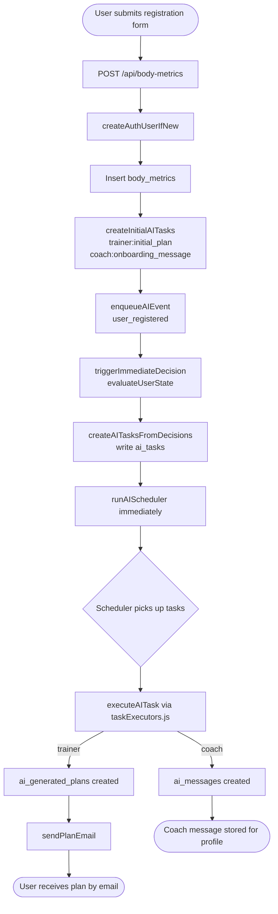
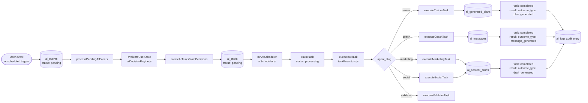
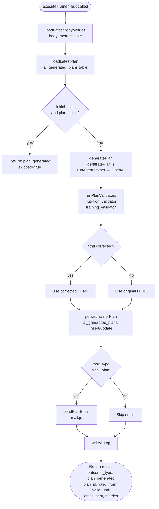
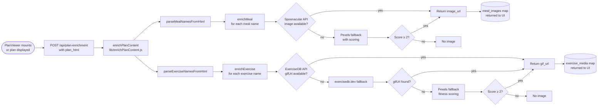
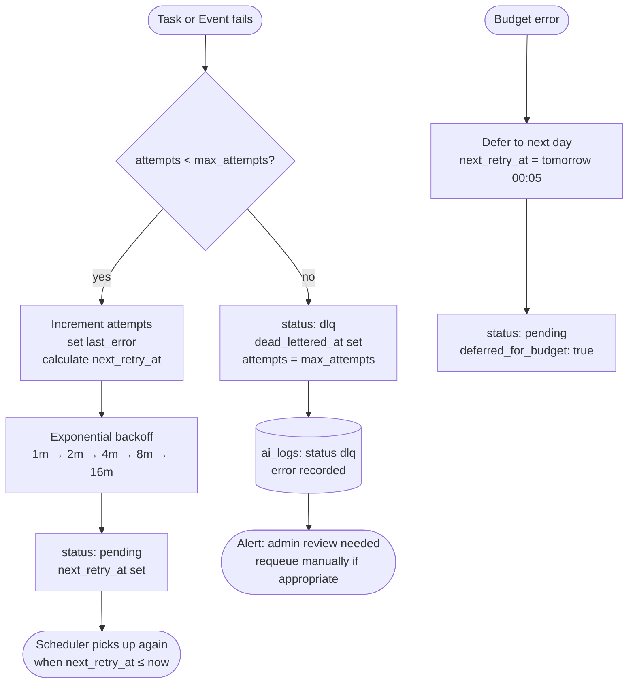

# AI System Architecture – Body & Mind ON

> Authoritative architecture reference. Keep this document in sync with code changes.

---

## 1. Registration Flow

---

## 2. Event → Decision → Task → Domain Executor Flow

---

## 3. Trainer Plan Generation Flow

---

## 4. Enrichment Flow

---

## 5. Retry / Dead Letter Queue Flow

---

## 6. AI Agents and Their Domain Roles

| Agent | Slug | Domain Output | Storage |
|---|---|---|---|
| AI Trainer | `trainer` | Weekly personalized plan (HTML) | `ai_generated_plans` |
| AI Coach | `coach` | Motivational / onboarding messages | `ai_messages` |
| Marketing | `marketing` | Campaign drafts | `ai_content_drafts` |
| Social | `social` | Social media content drafts | `ai_content_drafts` |
| Nutrition Validator | `nutrition_validator` | Validates meal plan nutrition | Internal (trainer uses result) |
| Training Validator | `training_validator` | Validates training plan safety | Internal (trainer uses result) |

---

## 7. Database Tables Overview

| Table | Purpose |
|---|---|
| `body_metrics` | User profile and physical metrics |
| `ai_tasks` | Task queue (pending → processing → completed/failed/dlq) |
| `ai_events` | Event queue (user_registered, preferences_changed, etc.) |
| `ai_generated_plans` | Trainer output: full weekly HTML plans |
| `ai_messages` | Coach output: in-app messages with delivery tracking |
| `ai_content_drafts` | Marketing/Social output: structured content drafts |
| `ai_agents` | Agent configuration (prompt, model, temperature) |
| `ai_logs` | Audit trail for all AI actions |
| `ai_task_types` | Task type definitions and side-effect mappings |
| `ai_executor_bindings` | DB-driven binding: side_effect_type → executor_slug |
| `user_ai_memory` | Agent memory for context persistence |
| `openai_daily_usage` | Cost tracking per day |
| `openai_response_cache` | LLM response cache (24h TTL) |
| `memberships` | User membership tier and status |
| `user_habits` | Selected habits per user |
