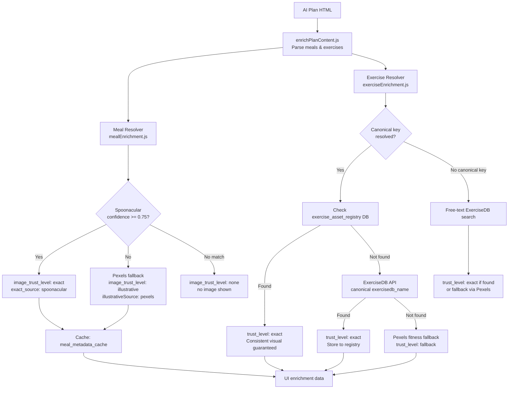

# Trusted Asset Resolution

> Technical documentation for the trustworthiness model of meal and exercise visuals in Body & Mind ON.

---

## Why this matters

When a user sees their personalized meal plan or training plan, the accompanying visuals must:
- Correspond to the actual food/exercise shown
- Be consistent across multiple views (the same exercise must always show the same image)
- Never mislead the user with an irrelevant or incorrect image

A system that silently shows a photo of a cliff for "Kuřecí prsa na grilu" or a yoga pose for "Dřepy" damages trust and credibility.

---

## Trust Model Overview



---

## Meal Trust Rules

### Why Spoonacular can be exact — but only with confidence threshold

Spoonacular returns recipe search results based on text matching. The first result is not always the correct match for a given meal name, especially for:
- Czech meal names (translated or adapted)
- Generic descriptions with multiple ingredients
- AI-generated meal names that don't match Spoonacular titles well

**Rule:** Spoonacular result is accepted as `exact` only if `scoreMealMatch()` returns score ≥ 0.75.

### Confidence scoring (`scoreMealMatch`)

The score (0..1) considers:
1. **Word overlap ratio**: how many words from the input appear in the recipe title
2. **Main ingredient match**: first significant word matches the recipe title
3. **Nutrition data bonus**: recipe includes detailed nutrition (+0.10)
4. **Image bonus**: recipe includes an image (+0.05)
5. **Zero-overlap penalty**: if no words match, score is capped at 0.05

### Dual-candidate scoring

When searching via English translation candidates, the Spoonacular result may be
correct but the score against the original Czech name is near-zero (no word overlap).

The score is computed against **both** the original Czech meal name and the search candidate
that found the recipe. The maximum is taken:

```
final_score = max(scoreMealMatch(originalMealName, recipe), scoreMealMatch(searchCandidate, recipe))
```

This prevents penalising a correct English match just because the original query was Czech.
The threshold (0.75) is unchanged.

### Shortlist evaluation (top 3 per candidate)

Spoonacular is queried with `number=3` — returning up to 3 results per search candidate.
All results across all candidates are scored. The best recipe is selected by
`chooseBestMealRecipe()` using the following priority:

1. Highest `scoreFinal`
2. Tie-break: recipe has image
3. Tie-break: recipe has nutrition data
4. Tie-break: shorter/more specific title

This prevents the resolver from being stuck on a weak first result when a better
match is available in the same Spoonacular response. Same number of API calls,
significantly more evaluated candidates per call.

### Why Pexels is always illustrative

Pexels is a stock photo library. It returns photos based on keyword search. There is no guarantee that:
- "kuřecí prsa" returns a photo of grilled chicken breast
- The first result isn't a beach, a portrait, or an unrelated food

**Rule:** Pexels images always have `image_trust_level: "illustrative"`. They must never be treated as exact truth.

### Fallback rules for low confidence

| Situation | Result |
|-----------|--------|
| Spoonacular score ≥ 0.75 + has image | `exact` — Spoonacular image used |
| Spoonacular score < 0.75 | No exact image; Pexels tried as `illustrative` |
| Pexels score < 2 (photo scoring) | `none` — no image shown |
| No Spoonacular key available | Skip to Pexels illustrative |

### Meal normalization (`lib/mealNormalization.js`)

Before querying Spoonacular or Pexels, meal names are normalized:
- Remove parenthetical ingredient lists: `"Kuřecí prsa (prsa, rýže)"` → `"Kuřecí prsa"`
- Remove meal-type prefixes: `"Snídaně: Ovesná kaše"` → `"Ovesná kaše"`
- Remove quantity text: `"200g kuřecí prsa"` → `"kuřecí prsa"`
- Build fallback search chain: full name → simplified → first word

---

## Exercise Canonical Rules

### Why exercises use canonical mapping

Free-text API matching for exercises is unreliable:
- Czech names like "Dřepy s vlastní vahou" may not be found in ExerciseDB (English-only)
- Different plan renderings may use slightly different wording → inconsistent visuals
- ExerciseDB free-text search returns the first match, which may be wrong

**Rule:** Every supported exercise maps to one `canonical_key` in `lib/exerciseCanonicalMap.js`. The canonical key is the primary lookup identifier.

### Canonical key map

Each canonical key has:
- `display_name_cs`: Czech display name
- `exercisedb_name`: exact English name used for ExerciseDB lookup
- Metadata defaults: `body_part`, `target`, `equipment`

Examples:
| Czech input | canonical_key | exercisedb_name |
|-------------|---------------|-----------------|
| Dřepy | `squat` | `squat` |
| Kliky | `pushup` | `push-up` |
| Přítahy v předklonu | `bent_over_row` | `barbell bent over row` |
| Mrtvý tah | `deadlift` | `deadlift` |
| Prkno | `plank` | `plank` |
| Výpady | `lunges` | `lunge` |

### exercise_asset_registry (DB)

The `exercise_asset_registry` table guarantees visual consistency:
- First successful trusted resolution (ExerciseDB or Pexels) is stored by `canonical_key`
- Future lookups always check the registry first
- The same exercise always shows the same visual, regardless of plan rendering

### Trust levels for exercises

| Source | trust_level | Meaning |
|--------|-------------|---------|
| exercise_asset_registry | `exact` | Previously verified and stored |
| ExerciseDB (canonical name) | `exact` | Direct API match on known canonical name |
| exercisedb.dev fallback | `exact` | Verified GIF from free ExerciseDB mirror |
| Pexels | `fallback` | Fitness photo, not guaranteed exercise-specific |
| Nothing found | `none` | No visual shown |

---

## Trust Labels for UI

The backend exposes trust metadata for frontend labels (available in plan-enrichment API response):

### Meals (`meal_trust` map)
```json
{
  "image_trust_level": "exact",
  "exact_source": "spoonacular",
  "illustrative_source": null,
  "confidence_score": 0.87,
  "calories": 520,
  "protein_g": 42
}
```

### Exercises (`exercise_media` map)
```json
{
  "gif_url": "https://...",
  "canonical_key": "squat",
  "trust_level": "exact",
  "source": "exercisedb"
}
```

### Suggested UI labels
- `image_trust_level: "exact"` → badge: **Přesný zdroj**
- `image_trust_level: "illustrative"` → badge: **Ilustrační foto**
- `trust_level: "exact"` (exercise) → badge: **Ověřený cvik**
- `trust_level: "fallback"` (exercise) → badge: **Ilustrační foto**

---

## Database Tables

### `meal_metadata_cache`

| Column | Type | Purpose |
|--------|------|---------|
| `name_key` | text UNIQUE | Normalized meal name used as cache key |
| `image_url` | text | Final image URL (may be Spoonacular or Pexels) |
| `image_trust_level` | text | `exact` / `illustrative` / `none` |
| `exact_source` | text | `spoonacular` or null |
| `illustrative_source` | text | `pexels` or null |
| `confidence_score` | numeric | Spoonacular match confidence (0..1) |
| `calories` | numeric | Per-serving calories (when available) |

### `exercise_asset_registry`

| Column | Type | Purpose |
|--------|------|---------|
| `canonical_key` | text UNIQUE | Canonical exercise identifier |
| `exercisedb_name` | text | English name for ExerciseDB lookup |
| `gif_url` | text | Exercise GIF (from ExerciseDB) |
| `image_url` | text | Fallback image (from Pexels if no GIF) |
| `trust_level` | text | `exact` / `fallback` / `none` |
| `source` | text | `exercisedb` / `pexels` / `none` |

---

## Fallback Behavior Summary

The system is designed to be honest when uncertain:

| Situation | Behavior |
|-----------|----------|
| Spoonacular finds exact match | Show image with trust = exact |
| Spoonacular finds uncertain match | Use nutrition data; don't use image |
| Pexels returns good fitness photo | Show image with trust = illustrative |
| Pexels returns irrelevant photo (score < 2) | Show no image (trust = none) |
| ExerciseDB canonical match | Show GIF with trust = exact |
| ExerciseDB misses | Try exercisedb.dev |
| All exercise APIs fail | Pexels fitness fallback (trust = fallback) |
| All sources fail | No visual (trust = none) |

**The system never pretends certainty it doesn't have.**

---

## Trust Safety Principles (Updated)

### Why Pexels fallback must NOT be persisted to exercise_asset_registry

The `exercise_asset_registry` table is the canonical truth store for exercise visuals. Once an asset is stored by `canonical_key`, it becomes the permanent visual for that exercise across all plan renderings.

**The problem:** If a Pexels fallback image (trust_level = "fallback") is stored in the registry, it becomes permanent. The next time the same exercise is requested, the system reads the registry and returns the Pexels image — indefinitely. If that image was a yoga pose instead of a squat, or a generic gym photo instead of a specific exercise, every future user sees the wrong image forever.

**The fix (implemented):**
- `setRegistryEntry()` has a hard guard: it returns immediately if `entry.trust_level !== 'exact'`
- `getRegistryEntry()` filters to `trust_level = 'exact'` only
- Pexels results are returned for the current request only and never written to the registry
- When ExerciseDB later finds the correct GIF, it writes it to the registry as `exact` and all future requests get the right visual

This means canonical exercises that currently only have a Pexels fallback will re-try ExerciseDB on the next request, improving over time rather than being frozen at a bad state.

---

### Why exact and illustrative meal cache entries must have different lifetimes

The `meal_metadata_cache` stores the result of the full enrichment pipeline so the same lookup is not repeated on every plan view. However, not all cached results are equally trustworthy or stable.

**Cache TTL policy (implemented):**

| `image_trust_level` | TTL | Reasoning |
|---------------------|-----|-----------|
| `exact` | Never expires | Spoonacular confirmed with score ≥ 0.75. Stable, reliable truth. |
| `illustrative` | 7 days | Pexels fallback. May improve later as Czech query translation gets a better match. |
| `none` | 3 days | No result found. Re-try periodically — Spoonacular coverage improves, queries improve. |

The system checks `updated_at` in the cache against the TTL for the stored `image_trust_level`. If the entry is stale for its trust level, the resolver re-runs the full pipeline instead of returning the cached result.

This guarantees that a bad first result — a Pexels photo for a Czech meal that Spoonacular might match correctly later — does not stay cached forever.

---

### How the Czech → English meal query layer works

Spoonacular has significantly better English coverage than Czech. A query like "Kuřecí prsa na grilu s rýží a zeleninou" is unlikely to produce a high-confidence Spoonacular match. The same meal queried as "grilled chicken breast rice" has a much higher probability.

**Query candidate generation (implemented in `buildMealSearchCandidates`):**

For every meal name, the resolver now builds an ordered list of search candidates:

1. Original normalized Czech: `"Kuřecí prsa na grilu s rýží a zeleninou"`
2. Czech before connector (`" s "`): `"Kuřecí prsa na grilu"`
3. Full English translation: `"chicken breast grilled rice vegetables"`
4. Simplified English: `"chicken breast grilled"`
5. First 3 Czech words: `"Kuřecí prsa na"`
6. First word Czech + English: `"Kuřecí"` / `"chicken"`

Spoonacular is queried with each candidate in order. The query that produces the highest `scoreMealMatch()` result wins. If any candidate produces a score ≥ 0.75, the search stops early.

**Translation coverage:** The dictionary covers the most common AI-generated Czech meal terms — proteins (kuřecí, hovězí, losos...), carbs (rýže, brambory, těstoviny...), vegetables (brokolice, špenát, zelenina...), cooking methods (na grilu, pečené...), and dairy/other (jogurt, tvaroh, vejce...).

The translation is practical, not complete. If a Czech term is not in the dictionary, the Czech query is still tried and may still match.

**Scoring still decides:** The English translation is only a search input. The `scoreMealMatch()` function compares the Spoonacular result against the original Czech meal name. A translation that produces a better match than the Czech query wins by score, not by assumption.
